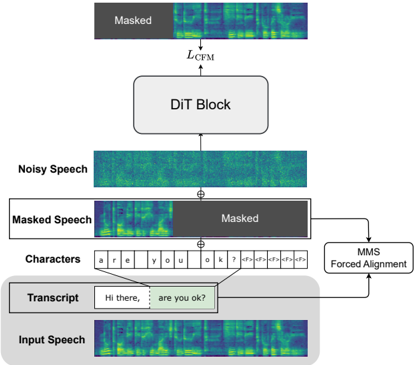

> [!abstract] arXiv · 2025 · Preprint
> **Liu et al.** (Shanghai Jiao Tong University) · [→ Paper](https://arxiv.org/abs/2509.14579) · Demo: ? · Code: ?
>
> Cross-Lingual F5-TTS extends the F5-TTS flow-matching synthesis framework to enable transcript-free cross-lingual voice cloning by introducing MMS-based word boundary partitioning for training data and a multi-granularity speaking rate predictor for duration estimation at inference.

## Problem

Flow-matching TTS systems such as F5-TTS and E2 TTS use a text-guided speech-infilling approach that requires a transcript of the audio prompt at inference time. The duration of the generated speech is estimated as a simple ratio of target text length to reference transcript length, which presupposes that both target and reference are in the same language. This dependency has two practical consequences: the system cannot serve speakers whose reference audio lacks an accurate transcript, and it cannot perform cross-lingual voice cloning where the audio prompt and synthesis target are in different languages. Word-level duration ratios between typologically distinct languages (e.g., Chinese and English) do not transfer reliably, so even a correct transcript would yield poor duration estimates in cross-lingual settings.

## Method

Cross-Lingual F5-TTS uses the F5-TTS diffusion transformer (DiT) backbone trained with the OT-CFM objective on mel-spectrograms, but modifies both the training data pipeline and the duration estimation mechanism to eliminate the dependency on audio prompt transcripts.

During training, the Massively Multilingual Speech (MMS) forced alignment tool (a multilingual Wav2Vec2-based CTC model) is applied to the Emilia dataset to extract word boundaries for each training sample. At each training step, a word boundary is chosen at random to partition the audio: the left segment serves as the audio prompt (transcript discarded), while the right segment is masked for the model to predict. This boundary-based partitioning teaches the model to synthesise conditioned on an acoustic prompt alone, without any corresponding text.

Duration estimation at inference is handled by a dedicated speaking rate predictor. Three separate transformer-encoder models are trained for different linguistic granularities: phonemes per second, syllables per second, and words per second. Each model takes mel-spectrogram input and predicts a discrete speaking rate category from a uniform grid (step 0.25). The training loss is a Gaussian Cross-Entropy (GCE) that converts one-hot targets into soft Gaussian labels centred on the ground-truth rate bin, giving ordinal tolerance to nearby predictions. During inference, the predictor estimates the speaker's characteristic pace from the audio prompt, and the target duration is computed as the ratio of the linguistic unit count of the target text to the predicted rate. Vocos is used as the vocoder, and inference follows the standard F5-TTS settings (Euler ODE, NFE=32, CFG 2.0). The speaking rate predictor uses 6 transformer layers, 8 attention heads, and 512-dimensional embeddings; the backbone architecture is unchanged from F5-TTS-Base (22 layers, 16 attention heads, 1024 dimensions).

## Key Results

On the intra-lingual benchmarks, CL-F5 with the phoneme-level predictor (M1) achieves WER 2.079% on LibriSpeech-PC test-clean (vs. 2.205% for the F5-TTS baseline) and UTMOS 3.884 (vs. 3.797), while paying a small cost in speaker similarity (SIM-o 0.663 vs. 0.668). On SeedTTS test-en, WER falls from 1.545% to 1.513%. On SeedTTS test-zh, the syllable-level predictor (M2) matches the baseline most closely (WER 1.481% vs. 1.475%, SIM-o 0.764 vs. 0.762). These results confirm that removing audio prompt transcripts does not degrade intelligibility or naturalness relative to the transcript-conditioned baseline.

For cross-lingual voice cloning (audio prompts from German, French, Hindi, Korean speakers synthesising English and Chinese), CL-F5 M1 achieves WER 2.496% on English targets and CL-F5 M2 achieves WER 1.801% on Chinese targets, with SIM-o values of 0.543 and 0.565 respectively. The word-level predictor (M3) collapses on cross-lingual English targets (WER 16.494%), confirming that coarse-grained duration estimation is insufficient across typologically different languages. The speaking rate predictors generalise to unseen languages despite being trained only on English and Chinese, suggesting that acoustic pace estimation is language-agnostic to a useful degree.

## Novelty Assessment

The core novelty lies in two components. First, the training data partitioning strategy using MMS forced alignment is a clean and practical mechanism for teaching flow-matching models to synthesise from transcript-free audio prompts. Second, the multi-granularity speaking rate predictor with GCE loss is a new module that resolves the duration estimation problem that arises from removing transcripts, with the language-dependent granularity finding (phonemes for English, syllables for Chinese) being a notable empirical contribution. Both components are new in the context of flow-matching TTS.

The overall system is nonetheless incremental: it extends F5-TTS rather than proposing a new generative backbone, and the training data preprocessing strategy has antecedents in forced-alignment-based work in other TTS paradigms. The cross-lingual evaluation, while demonstrating capability, is relatively narrow (four European and Asian languages, no low-resource languages). The admitted limitation on accent and emotion transfer is a meaningful scope constraint for voice cloning applications.

## Field Significance

Moderate -- Cross-Lingual F5-TTS addresses a real and previously unresolved limitation of flow-matching TTS: the transcript dependency that blocks cross-lingual deployment. The speaking rate predictor and forced-alignment training scheme provide a reusable blueprint that future flow-matching systems can adopt to remove this constraint. The contribution is primarily one of enabling capability rather than improving quality, and the evaluation is confined to a specific pair of languages for training, limiting claims about truly language-agnostic generalisation.

## Claims

- **supports:** Cross-lingual zero-shot voice cloning in flow-matching TTS can be achieved without audio prompt transcripts by using forced alignment to partition training data at word boundaries.
  > *Evidence:* CL-F5 achieves WER 2.496% on a cross-lingual English test set drawn from four unseen languages (German, French, Hindi, Korean), while the F5-TTS baseline cannot perform cross-lingual cloning at all due to its transcript dependency. *(§4.3, Table 3)*

- **supports:** Multi-granularity speaking rate predictors trained with ordinal-aware Gaussian loss provide reliable duration estimation for transcript-free flow-matching TTS.
  > *Evidence:* The phoneme-level predictor (M1) achieves MAE=0.759s on LibriSpeech-PC and enables WER 2.079%, improving over the length-ratio baseline (2.205%); the syllable-level predictor (M2) is preferred for Chinese synthesis on SeedTTS test-zh. *(§4.1, §4.2, Table 1, Table 2)*

- **complicates:** Removing audio prompt transcripts from flow-matching TTS incurs a small but consistent cost in speaker similarity.
  > *Evidence:* CL-F5 M1 achieves SIM-o 0.663 vs. 0.668 for the transcript-conditioned baseline on LibriSpeech-PC; the authors also report reduced capacity for transferring accent and emotion relative to the original F5-TTS. *(§4.2, Table 2, §5)*

- **refines:** The optimal linguistic granularity for acoustic speaking rate prediction is language-dependent rather than universal.
  > *Evidence:* Phoneme-level (M1) outperforms syllable-level (M2) for English duration prediction, while M2 outperforms M1 for Chinese on SeedTTS test-zh; word-level (M3) is consistently the weakest across all languages and test sets. *(§4.1, Table 1)*

## Limitations and Open Questions

> [!warning]
> The speaking rate predictors are trained exclusively on English and Chinese data. While cross-lingual generalisation to German, French, Hindi, and Korean is demonstrated empirically, the scope of generalisation to genuinely low-resource or typologically distant languages remains untested.

Speaker characteristic transfer is degraded compared to the transcript-conditioned baseline: the authors note reduced accuracy in preserving accents and emotional cues. This points to an open question about how much speaker-identity information is carried by the reference transcript versus the audio signal alone. Future work suggested by the paper includes compensating for missing linguistic information from transcripts to recover expressiveness.

## Wiki Connections

- [[flow-matching|Flow Matching]] -- this paper applies the OT-CFM flow-matching objective from F5-TTS to enable transcript-free cross-lingual synthesis.
- [[zero-shot-tts|Zero-Shot TTS]] -- the paper extends zero-shot voice cloning to cross-lingual settings by removing the audio prompt transcript requirement.
- [[multilingual-tts|Multilingual TTS]] -- the central contribution is enabling cross-lingual voice cloning across typologically diverse languages without per-language transcripts.
- [[voice-conversion|Voice Conversion]] -- cross-lingual voice cloning (preserving speaker identity while synthesising in a different language) is the primary VC-adjacent task evaluated.
- [[2025.acl-long.313|F5-TTS]] -- this paper directly extends F5-TTS as its baseline architecture and training framework, retaining the DiT backbone and OT-CFM objective while adding word boundary partitioning and a speaking rate predictor.
- [[2406.18009|E2 TTS]] -- closely related flow-matching TTS system that also eliminates phoneme duration predictors, providing the broader alignment-free context for this work.
- [[2303.03926|VALL-E X]] -- the most directly comparable prior work on cross-lingual voice cloning, which relies on a cross-lingual neural codec language model and full transcript availability rather than transcript-free flow matching.
- [[2407.05361|Emilia]] -- the training dataset (95K hours of English and Chinese) used for both the backbone model and the speaking rate predictors.
- [[2406.02430|Seed-TTS]] -- provides the Seed-TTS-eval benchmark used to evaluate both intra-lingual and cross-lingual synthesis quality.
- [[2306.00814|Vocos]] -- the vocoder used in the Cross-Lingual F5-TTS inference pipeline, converting predicted mel-spectrograms to waveforms.
- [[2301.02111|VALL-E]] -- the foundational AR zero-shot TTS model cited as the representive baseline that Voicebox and subsequent flow-matching systems improved upon.
- [[2412.10117|CosyVoice 2]] -- mentioned as a related multilingual streaming TTS system among the broader class of cross-lingual synthesis approaches.
