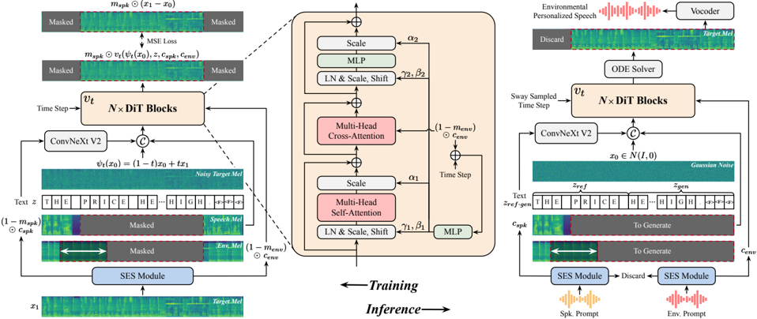
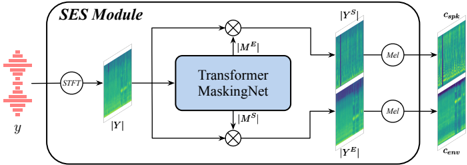

> [!abstract] arXiv · 2025 · Preprint
> **Lu et al.** · [→ Paper](https://arxiv.org/abs/2509.14684) · Demo: ✓ · Code: ?
>
> DAIEN-TTS extends F5-TTS with a pretrained speech-environment separation module and cross-attention-based environment conditioning to enable independent zero-shot control of speaker timbre and time-varying acoustic background from a single environmental speech prompt.

## Problem

Zero-shot TTS systems built on in-context learning tend to reproduce the acoustic environment of the speaker prompt, making it difficult to separate speaker identity from background environment. Prior environment-aware TTS methods relied on global environment encoders that capture only time-invariant acoustics (such as reverberation) and cannot handle time-varying background noise. The most capable prior system, UmbraTTS, required access to separate, equal-length clean speech and pure environment audio clips as prompts, an assumption that is impractical in real deployment scenarios. No system had achieved zero-shot, time-varying environment control alongside speaker disentanglement from a single mixed environmental speech input.

## Method

DAIEN-TTS is built on top of F5-TTS, which formulates zero-shot TTS as a text-guided mel-spectrogram infilling task under a conditional flow-matching (CFM) framework. The central addition is a pretrained Transformer-based speech-environment separation (SES) module that decomposes a single environmental speech signal into separate clean speech and background environment mel-spectrograms at the magnitude spectrogram level. The SES module applies a learned masking network (an input convolutional layer, 8 Transformer blocks with 16 attention heads and a 1024-dimensional embedding, and dual output convolutional layers) to predict speech and environment masks over the input STFT magnitude, producing two disentangled magnitude spectrograms that are then projected to mel scale.

During training, random span masks of varying lengths are applied independently to the disentangled speech and environment mel-spectrograms to simulate diverse prompt durations at inference. The unmasked speech component is concatenated with the full text embedding and presented to the Diffusion Transformer (DiT) backbone, while the unmasked environment component is injected via a multi-head cross-attention layer inserted into each DiT block. The model is trained with the CFM objective to reconstruct the masked portion of the target environmental mel-spectrogram. A 50% probabilistic augmentation strategy during TTS training mixes each speech sample with environmental audio or silence, encouraging the model to learn strong text-to-speech alignment in addition to environmental reconstruction.

At inference, the SES module extracts the speaker condition from a speaker prompt and the environment condition from a separate environment prompt (which can themselves be environmental speech recordings). Dual classifier-free guidance (DCFG) is applied with independent guidance strengths for the speech-and-text condition and the environment condition, enabling fine-grained controllability over both attributes simultaneously. An SNR adaptation strategy rescales the separated environment magnitude spectrogram so that the signal-to-noise ratio of the synthesized output matches the SNR of the environment prompt, ensuring perceptual consistency. Both the SES module and the TTS module were trained for 600k steps on LibriTTS mixed with DNS-Challenge environmental clips on 24 NVIDIA V100 GPUs. Model size is not reported.

## Key Results

The evaluation uses the SeedTTS test-en set with synthetic environment overlays from SoundBible. With silence as the environment prompt (clean speech condition), DAIEN-TTS achieves WER 1.93%, SPK-SIM 0.60, MOS 3.84 ± 0.09, and SSMOS 3.64 ± 0.09 (Table 1). This surpasses F5-TTS given environmental speaker prompts (WER 2.87%, MOS 3.09) by a wide margin, and also slightly outperforms F5-TTS given clean speaker prompts (MOS 3.80, WER 2.30), suggesting that training on paired clean-environmental data has a beneficial regularisation effect.

With background environment prompts, DAIEN-TTS achieves MOS 3.78 ± 0.08, SSMOS 3.73 ± 0.08, and ESMOS 3.65 ± 0.08, compared to the ablated variant without cross-attention (DAIEN-TTS w/o CA) which achieves MOS 3.68, SSMOS 3.70, ESMOS 3.49. The cross-attention conditioning scheme provides the largest gain in environment fidelity (ESMOS +0.16) and also improves naturalness. No existing baseline systems addressed the time-varying environment-aware TTS task, so the comparison space is limited to the ablated variant and F5-TTS.

## Novelty Assessment

The paper introduces a coherent combination of techniques applied to a genuinely underserved task. The SES module for source separation is a standard Transformer-based masking approach adapted from audio separation research. The cross-attention injection of environment features into DiT blocks follows the established pattern of conditional feature injection but is applied here for the first time to a time-varying acoustic background in a flow-matching TTS context. DCFG is adapted from prior text-to-audio work. The SNR adaptation strategy is a simple but practically important inference-time heuristic. The genuine novelty lies in the integrated framing: taking a single environmental speech clip as input, extracting both speaker and environment conditions from it via the SES module, and controlling them independently through separate guidance streams. The comparison baseline pool is thin because the exact task is new, which makes it difficult to assess the absolute value of the contributions relative to the broader field.

## Field Significance

Moderate — DAIEN-TTS opens a tractable approach to time-varying environment-aware zero-shot TTS using a single mixed audio prompt, a capability that prior systems (VoiceLDM, VoiceDiT, UmbraTTS) each failed to achieve in different ways. Its contribution is primarily architectural in scope, relevant to applications such as audiobook production and virtual reality, where synthesising speech that sounds embedded in a specific acoustic scene is practically important. The evaluation is limited to a single test set with no external baselines, which limits the strength of the empirical claims.

## Claims

- **supports:** Injecting time-varying environment conditioning via cross-attention into flow-matching TTS backbones produces higher environment fidelity than direct concatenation of environment features.
  > *Evidence:* DAIEN-TTS with cross-attention achieves ESMOS 3.65 versus 3.49 for the concatenation-based ablated variant (DAIEN-TTS w/o CA), with naturalness MOS also improving from 3.68 to 3.78. *(§4.2, Table 1)*

- **supports:** A pretrained source separation module can enable zero-shot TTS to use environmental speech as a speaker prompt without degradation from background noise.
  > *Evidence:* DAIEN-TTS achieves WER 1.93% and MOS 3.84 under environmental speaker prompts, slightly outperforming F5-TTS with clean prompts (WER 2.30%, MOS 3.80) and substantially outperforming F5-TTS under the same environmental conditions (WER 2.87%, MOS 3.09). *(§4.1, Table 1)*

- **supports:** Dual classifier-free guidance enables independent control of speaker and environment attributes in a jointly trained flow-matching TTS model.
  > *Evidence:* DCFG with separate guidance strengths for the speech-text condition and the environment condition is the inference-time mechanism through which DAIEN-TTS independently controls timbre and acoustic background; ablating the cross-attention (which effectively collapses environment guidance) degrades environment fidelity without recovering speaker similarity. *(§2.3.1, §4.2)*

- **complicates:** The absence of established baseline systems for time-varying environment-aware TTS makes it difficult to assess absolute performance gains beyond ablation comparisons.
  > *Evidence:* For the background environment synthesis condition, no existing systems match the task definition; all comparisons are between DAIEN-TTS and its own ablated variant DAIEN-TTS (w/o CA), with no external reference point for environmental fidelity (ESMOS). *(§3.2)*

- **complicates:** Flow-matching TTS systems trained on clean speech are sensitive to acoustic environment in the speaker prompt, with degradation visible in both speaker similarity and naturalness.
  > *Evidence:* F5-TTS (trained on clean LibriTTS data) shows SIM-o dropping from 0.58 to 0.49 and MOS dropping from 3.80 to 3.09 when the speaker prompt contains background noise rather than clean speech. *(§4.1, Table 1)*

## Limitations and Open Questions

> [!warning]
> The evaluation compares DAIEN-TTS only against its own ablation; no external environment-aware TTS baseline exists in the paper, limiting the strength of absolute performance claims.

Model size is not reported, making efficiency comparisons impossible. The SES module introduces a separate pretrained component that must be trained and aligned with the TTS module, adding complexity to the training pipeline. The SNR adaptation strategy assumes that target SNR should match the environment prompt, which may not always align with creative intent. The paper acknowledges mutual influence between speech content and background environment as an open question for future work.

## Wiki Connections

- [[flow-matching|Flow Matching]] — DAIEN-TTS is built directly on the F5-TTS flow-matching infilling framework and inherits its CFM training objective and DiT backbone.
- [[zero-shot-tts|Zero-Shot TTS]] — the system synthesises speech for unseen speakers from short audio prompts without speaker-specific fine-tuning or training.
- [[disentanglement|Disentanglement]] — the SES module explicitly separates speaker and environmental audio into distinct mel-spectrogram spaces, enabling independent conditioning of both attributes.
- [[subjective-evaluation|Subjective Evaluation]] — the paper conducts three MOS studies (naturalness MOS, speaker similarity MOS, environment similarity MOS) with over 30 crowd-sourced raters on Amazon Mechanical Turk.
- [[evaluation-metrics|Evaluation Metrics]] — the paper introduces ESMOS (environment similarity MOS) as a subjective metric for assessing background environment reconstruction fidelity in synthesised speech.
