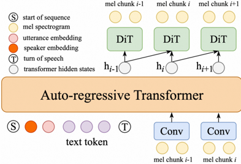

> [!abstract] arXiv · 2025 · Preprint
> **An et al.** (Alibaba Group) · [→ Paper](https://arxiv.org/abs/2509.14784) · Demo: ? · Code: ?
>
> MELA-TTS introduces a joint transformer-diffusion architecture for end-to-end TTS that autoregressively generates continuous mel-spectrogram frames without speech tokenization, and proposes a representation alignment module that aligns transformer decoder outputs with ASR encoder semantics to improve content consistency and accelerate training convergence by over 3x.

## Problem

Discrete-token autoregressive TTS systems depend on a pre-trained tokenizer to discretize speech into token sequences, followed by a separate decoder to reconstruct waveforms. This two-stage design incurs information loss through quantization and accumulates errors across stages. End-to-end continuous-feature approaches sidestep tokenization but have historically lagged discrete-token systems on content accuracy, particularly on challenging inputs such as repeated words and tongue twisters, and require substantially more training iterations to converge due to the difficulty of modeling high-dimensional continuous features autoregressively.

## Method

MELA-TTS pairs an autoregressive transformer decoder with a diffusion transformer (DiT) for chunk-by-chunk mel-spectrogram generation. The transformer decoder operates at 6.25 Hz, generating one latent vector h per 8-frame mel chunk (160 ms), far slower than the 25 Hz of CosyVoice or 75 Hz of VALL-E. Its architecture and weights are initialized from Qwen2-0.5B, and it is conditioned on BPE-tokenized text (using Qwen2's tokenizer and embeddings), a speaker embedding extracted by a pre-trained speaker encoder from the prompt speech, and a learned utterance embedding pooled by a jointly-trained transformer encoder over a random crop of the target speech. A binary cross-entropy stop-prediction module on h determines when generation terminates, replacing the EOS token mechanism used in discrete-token systems.

The DiT (22 layers, 1024-dimensional hidden states, 16 attention heads) denoises each mel chunk conditioned on the previous and current h vectors, speaker embeddings, utterance embeddings, and the previously generated mel chunk. It uses a variance-preserving forward process with DDIM sampling at 10 function evaluations and classifier-free guidance at scale 0.7. A HiFTNet vocoder converts the generated mel-spectrograms to waveforms.

The representation alignment (RA) module is the core training-time contribution. A frozen SenseVoice-Large ASR encoder extracts semantic representations h\_asr at 25 Hz from the target speech. The autoregressive decoder's outputs h are upsampled by a learned time alignment module (TAM, a linear layer followed by reshape) and aligned to h\_asr via a cosine similarity loss L\_align. The total training loss combines the diffusion L2 reconstruction loss, the BCE stop loss, and L\_align. This guides the transformer to encode semantic content in h, freeing the diffusion stage to focus on acoustic details. Crucially, using the mel-spectrogram itself as the alignment target fails: it degrades both content consistency and speaker similarity, confirming that semantic, not acoustic, representations are the right alignment target. *(§2.3, §3.2)*

For streaming synthesis, text tokens and conv-downsampled mel chunks are interleaved at a 4:3 ratio, enabling three mel chunks to be generated per four text tokens received. A single model is trained jointly on interleaved and non-interleaved sequences, so offline and streaming modes share the same parameters. *(§2.4)*

## Key Results

On seed-tts-eval at 170K-hour training scale, MELA-TTS (with RA) achieves CER 0.9 on test-zh, WER 2.4 on test-en, and CER 7.6 on test-hard. Among models trained on the same data, this is the best CER on test-zh (vs. CosyVoice 2.0 at 1.5 and CosyVoice 3.0-0.5B at 1.3). On test-en, the result (WER 2.4) is comparable to CosyVoice 2.0 (2.6) and CosyVoice 3.0 (2.5). Non-autoregressive F5-TTS and DiTAR achieve lower English WER (1.8 and 1.7 respectively), though DiTAR is not evaluated on test-hard, leaving its robustness on challenging inputs unclear. *(§3.3, Table 2)*

Speaker similarity scores remain below discrete-token competitors. On test-en, MELA-TTS records SS1 0.59 / SS2 0.68 versus F5-TTS's SS1 0.65 / SS2 0.74. The paper attributes this to the diffusion module's local context window (only adjacent mel chunks), preventing it from attending to the full prompt speech as discrete-token systems can. *(§3.3)*

In subjective A/B preference tests (15 raters, 15 comparisons each), MELA-TTS is preferred over CosyVoice 2.0 in 66.7% of trials and over CosyVoice 3.0 in 57.3%, suggesting perceptual naturalness advantages that are not fully captured by speaker similarity metrics. *(§3.3)*

Ablation on LibriTTS confirms that representation alignment alone reduces WER 6.3 to 5.3 and accelerates training convergence by over 3.3x (reaching the 100-epoch baseline performance in fewer than 30 epochs). Utterance embedding independently improves speaker similarity (SS2: 0.55 to 0.57). Combined, offline WER reaches 5.2 and streaming WER 5.0, with SS1/SS2 parity between modes. *(§3.2, Table 1)*

## Novelty Assessment

The joint transformer-diffusion architecture for continuous mel-spectrogram generation follows the broad pattern of DiTAR, but MELA-TTS introduces a distinct conditioning pathway: the AR transformer outputs dense latent vectors that condition a separate DiT stage, rather than directly tokenizing and quantizing speech. The representation alignment module is the paper's most original contribution. Using ASR encoder semantics as an auxiliary training signal for continuous AR TTS is a transferable idea: it enforces cross-modal semantic coherence without requiring discrete intermediate representations, and it avoids the pitfall of mel-spectrogram alignment, which the ablation shows to be harmful. The unified streaming/offline training through sequence interleaving is engineered cleanly, though the interleaving pattern has precedents in other streaming TTS systems. Qwen2 initialization is a practical engineering choice (leveraging a widely available open LLM) rather than an architectural novelty. The main gap versus discrete-token systems on speaker similarity is left as future work, which limits the system to partial parity with the field's best models on voice cloning benchmarks.

## Field Significance

Moderate — MELA-TTS provides concrete evidence that continuous mel-frame AR TTS can close the content accuracy gap with discrete-token systems when combined with ASR-guided representation alignment, and demonstrates effective scaling to 170K hours of multilingual data. The representation alignment mechanism is a transferable solution to the semantic coherence problem inherent in continuous-feature AR TTS, and the unified offline/streaming model design demonstrates that both synthesis modes can coexist without separate architectures. Speaker similarity limitations signal a remaining design challenge for the continuous AR TTS paradigm.

## Claims

- **supports:** Aligning autoregressive decoder representations with pre-trained ASR encoder semantics improves content consistency in continuous-feature TTS.
  > *Evidence:* Representation alignment reduces WER 6.3 to 5.3 on LibriTTS ablation and produces 25%, 40%, and 30% relative CER/WER reductions on seed-tts-eval test-zh, test-en, and test-hard at 170K-hour scale. Training convergence accelerates by over 3.3x. *(§2.3, §3.2, Table 1, Table 2)*

- **contradicts:** Using the target acoustic domain (mel-spectrogram) as an intermediate alignment target helps continuous AR TTS systems.
  > *Evidence:* Aligning transformer decoder outputs to mel-spectrograms (Exp 2, Table 1) raises WER from 6.3 to 6.7 and degrades SS1/SS2, while alignment to SenseVoice-Large ASR representations (Exp 1) reduces WER to 5.3. *(§3.2, Table 1)*

- **complicates:** Continuous-feature AR TTS achieves competitive content accuracy but lags behind discrete-token systems on speaker similarity in zero-shot voice cloning.
  > *Evidence:* MELA-TTS achieves best CER on seed-tts-eval test-zh but lower SS1 (0.59 vs. F5-TTS 0.65) and SS2 (0.68 vs. F5-TTS 0.74) on test-en; attributed to the diffusion module's local context constraint versus discrete-token systems that condition on all prior tokens and the full prompt. *(§3.3, Table 2)*

- **supports:** Unified interleaved training on streaming and offline sequences enables continuous AR TTS to operate in both modes at comparable quality without separate model variants.
  > *Evidence:* Streaming mode achieves WER 5.0 versus offline 5.2, and SS1/SS2 parity, on LibriTTS. At 170K-hour scale, streaming WER is 2.5 versus offline 2.4 on test-en. *(§2.4, §3.2, §3.3, Table 1, Table 2)*

- **supports:** Continuous-feature TTS without speech tokenization scales effectively with training data, reducing content error rates and approaching discrete-token system performance.
  > *Evidence:* Scaling from LibriTTS (585h) to 170K-hour in-house data reduces English WER from 5.2 to 2.4 and improves SS1 from 0.48 to 0.59, bringing MELA-TTS close to CosyVoice 2.0 (2.6 WER) and CosyVoice 3.0 (2.5 WER). *(§3.3, Table 2)*

## Limitations and Open Questions

> [!warning]
> The diffusion module operates on local context only (the immediately adjacent latent vector and the previous mel chunk), preventing it from attending to the full prompt speech. This is identified as the likely structural cause of the consistent speaker similarity gap versus discrete-token systems across test-en and test-hard. The limitation is left as future work with no proposed fix.

Main comparison results rely on a proprietary 170K-hour multilingual dataset that is not publicly available, limiting reproducibility of the top-line numbers. Ablations are conducted on LibriTTS only (585 hours), which may not reflect behavior at full scale. No comparison to DiTAR on test-hard is available, making it unclear whether MELA-TTS's robustness advantage on challenging inputs holds relative to the closest continuous AR baseline. Code and demo are not released with the preprint.

## Wiki Connections

- [[diffusion-tts|Diffusion TTS]] — MELA-TTS uses a diffusion transformer as the acoustic generation stage, conditioned on latent vectors from an AR transformer decoder rather than on text or codec tokens directly.
- [[zero-shot-tts|Zero-Shot TTS]] — the system supports zero-shot voice cloning by deriving speaker and utterance embeddings from prompt speech at inference time, evaluated on seed-tts-eval across Chinese, English, and hard test sets.
- [[streaming-tts|Streaming TTS]] — a unified interleaved training scheme enables streaming and offline synthesis in a single model, with streaming mode matching offline WER and speaker similarity.
- [[autoregressive-codec-tts|Autoregressive Codec TTS]] — MELA-TTS is explicitly designed as an alternative to discrete-token AR TTS, avoiding speech tokenization while demonstrating competitive content consistency on the same evaluation benchmark.
- [[multilingual-tts|Multilingual TTS]] — the full-scale model is trained on 130K hours of Chinese, 30K hours of English, and 10K hours of other languages, with cross-lingual evaluation on seed-tts-eval test-zh and test-en.
- [[2412.16846|KALL-E]] (Autoregressive speech synthesis with next-distribution prediction) — cited as a related continuous-feature AR TTS approach that MELA-TTS builds context around; both papers address the challenge of autoregressive modeling without speech tokenization.
- [[2508.19098|CLEAR]] (Continuous latent autoregressive modeling) — cited as a parallel system in continuous-representation TTS, with similar speaker similarity gaps observed versus discrete-token baselines.
