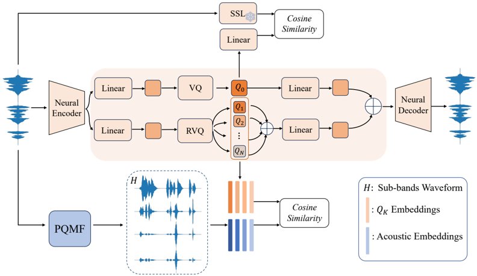

> [!abstract] arXiv · 2025 · Preprint
> **Zhang et al.** (Tsinghua University / AMAP Speech) · [→ Paper](https://arxiv.org/abs/2509.17006) · Demo: ? · Code: ?
>
> MBCodec introduces a multi-codebook RVQ audio codec that separates semantic and acoustic information into functionally distinct codebook spaces — one supervised by HuBERT representations, the other by PQMF subband decomposition — enabling 170x compression of 24kHz audio at 2.2kbps.

## Problem

Prior multi-codebook neural codecs such as SoundStream and EnCodec treat the residual quantization process without explicit functional assignment: all codebooks learn through global reconstruction objectives, leaving semantic content (phonetic identity, linguistic structure) and acoustic details (timbral texture, high-frequency harmonics) entangled across quantization layers. This entanglement limits compression efficiency and reconstruction fidelity, and the lack of interpretability at the individual codebook level complicates model iteration and downstream integration.

## Method

MBCodec uses a neural encoder to compress 24kHz audio into a latent embedding, which is then processed by two parallel quantizers: a single Vector Quantizer (VQ) for semantic information and a multi-layer Residual Vector Quantizer (RVQ) for acoustic information. The semantic VQ is trained via cosine similarity to HuBERT representations, explicitly aligning its output with self-supervised linguistic features. The RVQ codebooks are each supervised by individual frequency subbands from a Pseudo-Quadrature Mirror Filter (PQMF) bank: each codebook learns from the STFT of its corresponding subband, preventing inter-band interference and assigning each codebook a distinct acoustic frequency responsibility. A GAN-based decoder reconstructs the waveform from the combined quantized representations.

Training unfolds in three stages under an adaptive dropout strategy. The strategy begins with uniform dropout across all RVQ layers, transitions to a Half-Gaussian non-uniform distribution that concentrates sampling on earlier codebooks where residual information is densest, and finally focuses on the leading four supervised layers to refine audio fidelity. MBCodec is evaluated with 8 and 16 codebook variants at 25Hz and 50Hz frame rates, yielding bitrates of 2.2kbps to 8.8kbps. The encoder uses 64 dimensions and the decoder 1536 dimensions; training runs on approximately 95k hours from the Emilia multilingual speech dataset on a single NVIDIA H20 GPU.

## Key Results

On the AudioSet test set, MBCodec in its 16-codebook, 50Hz configuration achieves PESQ 3.83, MUSHRA 85.9, WER 3.24%, and speaker similarity 0.97, outperforming EnCodec at the same 8.8kbps bitrate (PESQ 2.78, MUSHRA 85.3) and SpeechTokenizer at 4.4kbps (PESQ 1.26, MUSHRA 79.0). At its most compressed setting (8 codebooks, 25Hz, 2.2kbps), MBCodec achieves a 170x compression ratio with PESQ 2.98 and MUSHRA 82.8, still exceeding SpeechTokenizer across all metrics despite the lower bitrate.

Ablation confirms both core components are indispensable: removing PQMF supervision degrades PESQ from 3.83 to 2.34 and raises Mel distance from 2.34 to 3.45; removing adaptive dropout reduces SI-SDR from 7.94 to 7.32 and STFT distance rises from 0.08 to 0.22 (Table 3). Among the three candidate dropout distributions, Half-Gaussian achieves the best PESQ (3.28) and lowest Mel distance (3.32), outperforming exponential decay and chi-squared alternatives (Table 2).

## Novelty Assessment

The assignment of distinct physical functions to individual RVQ codebooks via PQMF subband supervision is not standard in prior codec work, making this a genuine architectural novelty. SpeechTokenizer previously separated semantic and acoustic information through residual distillation, so the general idea of semantic-acoustic disentanglement is not new; MBCodec's contribution lies in the operationalisation through PQMF subband targeting, which directly assigns each codebook a frequency band responsibility rather than relying on residual decomposition alone. The adaptive non-uniform dropout is also a meaningful training contribution, though the improvement over uniform dropout is quantitatively modest. The evaluation uses established metrics (PESQ, MUSHRA, WER, speaker similarity) with comparisons against reasonable baselines, though it is a preprint with no independent reproduction and no dedicated TTS downstream evaluation.

## Field Significance

Moderate — MBCodec demonstrates that functional codebook assignment through frequency-band supervision and SSL semantic distillation can achieve high reconstruction fidelity at ultra-low bitrates (2.2kbps at 170x compression), advancing the neural codec disentanglement literature beyond residual-only approaches. The codec architecture provides a foundation for downstream speech LM and TTS applications that require both compact discrete token representations and explicit semantic-acoustic separation.

## Claims

- **supports:** Explicit semantic-acoustic disentanglement in neural codecs improves reconstruction quality at comparable bitrates relative to conventional residual quantization approaches.
  > *Evidence:* MBCodec (16 codebooks, 50Hz, 8.8kbps) achieves PESQ 3.83 and MUSHRA 85.9, versus EnCodec at the same bitrate scoring PESQ 2.78 and MUSHRA 85.3; at 4.4kbps, MBCodec (16 codebooks, 25Hz) scores PESQ 3.64 versus SpeechTokenizer at PESQ 1.26 and MUSHRA 79.0. *(§3.2, Table 1)*

- **supports:** PQMF-based frequency subband supervision substantially improves spectral reconstruction fidelity in multi-codebook codec training.
  > *Evidence:* Ablation shows removing PQMF supervision degrades PESQ from 3.83 to 2.34 (a 39% drop) and increases Mel-spectrogram distance from 2.34 to 3.45 in the best MBCodec configuration. *(§3.4, Table 3)*

- **supports:** Non-uniform codebook dropout distributions that concentrate sampling on early RVQ layers outperform uniform dropout, better matching the hierarchical information density of residual quantization.
  > *Evidence:* Half-Gaussian adaptive dropout achieves PESQ 3.28 versus exponential decay at 3.02 and chi-squared at 2.75; removing adaptive dropout entirely drops SI-SDR from 7.94 to 7.32 and increases STFT distance from 0.08 to 0.22. *(§2.2, §3.4, Table 2, Table 3)*

- **complicates:** Ultra-low bitrate neural audio compression imposes a persistent quality gap relative to ground truth, even with strong disentanglement strategies.
  > *Evidence:* MBCodec at 2.2kbps achieves MUSHRA 82.8 versus ground truth MUSHRA 90.7 (a gap of 7.9 points) and PESQ 2.98 versus 4.64, despite the 170x compression ratio and explicit semantic-acoustic disentanglement. *(§3.2, Table 1)*

## Limitations and Open Questions

The paper does not evaluate MBCodec as a token representation for downstream TTS or speech LM inference, which is presented as a primary motivation. The codec is trained and evaluated on speech-dominant data; generalisation to music or general audio is not assessed. No parameter count is reported, making direct efficiency comparison with other codecs difficult. The comparison set is limited to DAC, EnCodec, and SpeechTokenizer; more recent codecs such as Mimi or BiCodec are not included. As a preprint, no independent reproduction or external listening evaluation is available.

## Wiki Connections

- [[neural-codec|Neural Audio Codec]] — MBCodec proposes a multi-codebook RVQ codec that explicitly assigns distinct functional roles to individual codebooks, advancing the interpretability and reconstruction quality of neural audio compression.
- [[disentanglement|Disentanglement]] — The paper's training objective explicitly separates semantic content (supervised via HuBERT) and frequency-band acoustic detail (supervised via PQMF subbands) into distinct VQ and RVQ quantization spaces.
- [[self-supervised-speech|Self-Supervised Speech]] — HuBERT representations serve as the teacher signal for the semantic VQ codebook, making self-supervised pre-training a core structural component of MBCodec's training objective.
- [[evaluation-metrics|Evaluation Metrics]] — The paper evaluates codec reconstruction with PESQ, MUSHRA, WER, SI-SDR, STFT distance, and speaker similarity across multiple bitrate configurations, providing a broad multi-dimensional comparison.
