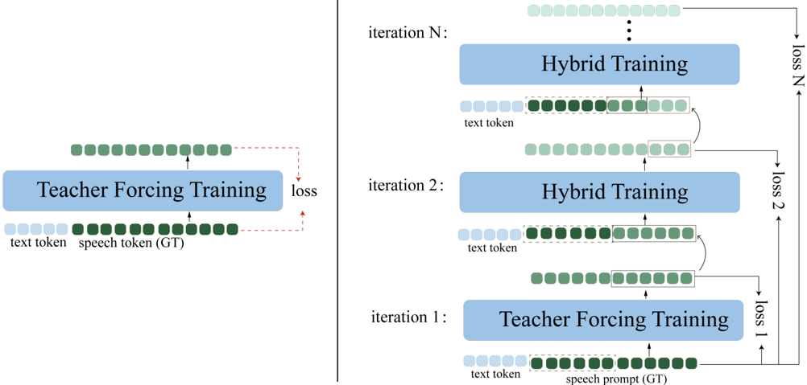

> [!abstract] arXiv · 2025 · Preprint
> **Zhang et al.** · [→ Paper](https://arxiv.org/abs/2509.17021) · Demo: ? · Code: ?
>
> A prompt-guided hybrid training scheme that mixes teacher-forced and self-generated tokens during fine-tuning of autoregressive LM-based TTS, with EOS-guided adaptive scheduling, to mitigate exposure bias and improve long-form synthesis quality.

## Problem

Autoregressive LM-based TTS models are trained with teacher forcing, where ground-truth speech tokens serve as input context at each prediction step. At inference, however, the model must rely entirely on its own previously generated tokens, a discrepancy known as exposure bias. In speech, this mismatch is more harmful than in text generation because speech tokens are dense (50-100 tokens per second) and errors compound rapidly. Observed symptoms include accelerated speaking rate during long utterances, premature or repeated end-of-sequence tokens, and prosodic flatness. Despite being a known problem in sequence modelling, exposure bias has received little systematic attention in the TTS literature.

## Method

The proposed approach fine-tunes an existing autoregressive LM-based TTS system (CosyVoice or CosyVoice2) using a hybrid training scheme that operates iteratively within each training step. In the first pass, the model is trained with standard teacher forcing, computing cross-entropy loss against ground-truth tokens. In subsequent passes, the output of each iteration is modified: the first T1 tokens are replaced by ground-truth tokens (the prompt protection strategy) while the remaining positions use the model's own predictions from the previous pass. A joint loss over both teacher-forced and free-running segments is back-propagated in a single update.

A key component is the adaptive free-running scheduling mechanism guided by end-of-sequence (EOS) prediction. The model tracks whether EOS is correctly predicted at each iteration; when premature EOS errors occur frequently, the number of free-running iterations is reduced to stabilise training. As training progresses and premature EOS becomes rare, the iteration count increases, gradually shifting the training distribution toward inference conditions. Prompt protection preserves ground-truth tokens at the start of each sequence to maintain training stability and strong prompt-following ability throughout this transition.

The method is applied to fine-tuning CosyVoice and CosyVoice2 on LibriSpeech (approximately 40,000 hours). Speech is discretised using a single-codebook vector quantiser with 4,096 entries. Training uses AdamW at a learning rate of 1x10^-5 with 10,000 warm-up steps before hybrid training is introduced. The total training overhead is 1.5x the baseline, attributed to running only a single backward pass per training step.

## Key Results

On LibriSpeech test-clean, hybrid training applied to CosyVoice2 achieves 4.21% WER and 0.78 speaker similarity, compared to 6.23% WER and 0.74 SIM for CosyVoice2 fine-tuned with standard teacher forcing (Table 1). Applied to the original CosyVoice, WER improves from 8.17% to 5.38% with a modest gain in speaker similarity. Gains are smaller on the Seed-TTS evaluation set, which contains shorter utterances (under 10 seconds), consistent with the hypothesis that exposure bias accumulates more in longer sequences. A human MOS evaluation on 30 samples from LibriSpeech test-clean shows the proposed method outperforms teacher-forcing fine-tuning and approaches ground-truth naturalness (Figure 2).

Ablation confirms both components contribute (Table 2): removing prompt protection raises WER to 7.25% and drops SIM to 0.65, while removing EOS-guided adaptive scheduling yields 4.98% WER and 0.72 SIM, compared to 4.21% WER and 0.80 SIM with both components active.

## Novelty Assessment

The core idea of mixing ground-truth and model-generated tokens during training is a variant of scheduled sampling, proposed for RNNs in 2015 and applied to neural machine translation. The genuinely new elements are: (1) the prompt protection strategy, which preserves early sequence tokens in ground-truth form to maintain stability and prompt-following during the transition to self-conditioned generation; and (2) the EOS-guided adaptive scheduling mechanism, which uses the model's own end-of-sequence prediction quality as a dynamic signal to control free-running intensity. These additions make the approach more practically stable for TTS than naive scheduled sampling, where unconstrained free-running iterations can destabilise training. The contribution is primarily a training-recipe innovation applied on top of existing systems rather than a new architecture.

## Field Significance

Moderate — this paper addresses a genuine and underexplored failure mode of autoregressive TTS: teacher forcing creates a distributional mismatch that worsens with sequence length, producing concrete degradation in intelligibility and prosody that subjective evaluation often misses at short durations. The EOS-guided adaptive mechanism provides a system-agnostic solution applicable to any autoregressive TTS model operating over discrete speech tokens, and the prompt protection strategy offers a practical recipe for stabilising hybrid training without the instabilities of unconstrained scheduled sampling.

## Claims

- **supports:** Exposure bias produces measurable quality degradation in autoregressive codec TTS, with the effect scaling with output sequence length.
  > *Evidence:* Token prediction accuracy under free-running inference is consistently lower than under teacher forcing, with the gap widening over sequence position; WER improvement from hybrid training is larger on long-form LibriSpeech (6.23→4.21%) than on short Seed-TTS utterances (4.83→4.64%). *(§3.4, Figure 3; §3.2, Table 1)*

- **supports:** Hybrid training that mixes teacher-forced and self-generated tokens reduces WER and improves speaker similarity in autoregressive LM-based TTS relative to standard teacher-forcing fine-tuning.
  > *Evidence:* Prompt-guided hybrid fine-tuning of CosyVoice2 on LibriSpeech reduced WER from 6.23% to 4.21% and raised speaker similarity from 0.74 to 0.78 on LibriSpeech test-clean (Table 1); human MOS scores approach ground-truth quality on 30-sample evaluation. *(§3.2, Table 1; §3.3, Figure 2)*

- **complicates:** The benefits of exposure-bias mitigation in autoregressive TTS diminish for short utterances where prediction errors have less opportunity to accumulate.
  > *Evidence:* On Seed-TTS utterances under 10 seconds, WER improvement is smaller (4.83→4.64) compared to LibriSpeech, where longer sequences amplify the compounding effect of distributional mismatch. *(§3.2, Table 1)*

- **supports:** EOS misprediction rate serves as a reliable proxy for training-time exposure bias severity, enabling adaptive control of self-conditioning intensity.
  > *Evidence:* EOS-guided adaptive scheduling tracks premature termination events across iterations; ablation shows removing this component raises WER from 4.21% to 4.98% and drops speaker similarity from 0.80 to 0.72 on LibriSpeech test-clean. *(§3.5; §3.6, Table 2)*

## Limitations and Open Questions

The evaluation is limited to LibriSpeech and Seed-TTS with a single speaker conditioning setup; generalisation to multilingual or highly expressive TTS domains is untested. The method is applied only as fine-tuning on top of existing CosyVoice models, leaving open whether hybrid training from scratch would yield similar or greater benefits. The MOS evaluation uses only 30 samples, which provides limited statistical power for assessing naturalness improvements. The 1.5x training overhead, while modest, is an additional cost relative to standard fine-tuning.

## Wiki Connections

- [[autoregressive-codec-tts|Autoregressive Codec TTS]] — the paper addresses a fundamental training pathology specific to this paradigm: the distributional mismatch between teacher-forced training and autoregressive inference over discrete speech tokens.
- [[zero-shot-tts|Zero-Shot TTS]] — the base systems (CosyVoice, CosyVoice2) are zero-shot TTS models that this paper fine-tunes, with speaker similarity serving as a primary evaluation metric.
- [[subjective-evaluation|Subjective Evaluation]] — MOS and A/B preference tests with human listeners are used alongside objective metrics to assess naturalness of synthesised speech.
- [[evaluation-metrics|Evaluation Metrics]] — WER and SPK-SIM are the primary objective metrics, evaluated on both LibriSpeech test-clean and Seed-TTS to capture the length-dependent nature of exposure bias.
- [[2407.05407|CosyVoice]] (CosyVoice) — the primary base model to which the proposed hybrid training is applied; used for ablation and direct comparison against standard teacher-forcing fine-tuning.
- [[2412.10117|CosyVoice 2]] (CosyVoice 2) — the second base model evaluated; achieves stronger baseline performance and shows the largest absolute WER improvement under the proposed training scheme.
- [[2406.02430|Seed-TTS]] (Seed-TTS) — provides one of the two evaluation test sets (1,000 utterances from Common Voice), representing diverse acoustic conditions and shorter utterances.
- [[2502.05512|IndexTTS]] (IndexTTS) — used as a baseline comparison in Table 1, providing context for the proposed method's performance on LibriSpeech and Seed-TTS.
