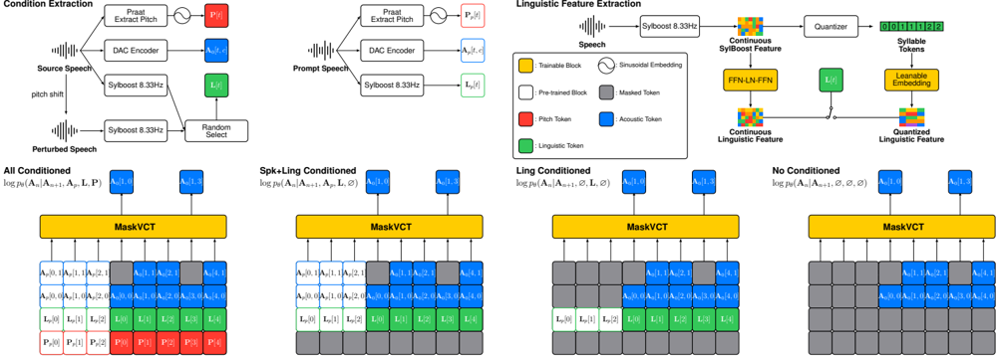

> [!abstract] arXiv · 2025 · Preprint
> **Lee et al.** (Johns Hopkins University) · [→ Paper](https://arxiv.org/abs/2509.17143) · Demo: ✓ · Code: ?
>
> MaskVCT is a zero-shot voice conversion system built on a masked codec language model that exposes speaker identity, linguistic content, and pitch contour as independently controllable factors via triple classifier-free guidance weights at inference time.

## Problem

Existing zero-shot voice conversion models are locked to a single conditioning configuration: a model is either pitch-conditioned or not, and either uses continuous or discrete linguistic features. This rigidity forces practitioners to choose a fixed operating point, trading off speaker similarity against intelligibility or pitch controllability without recourse. A deeper problem underlies this design constraint: SSL-derived frame-aligned linguistic features are "leaky," retaining enough pitch and speaker information to impede clean conversion of prosody. Pitch-conditioned systems depend on accurate external pitch predictors, while pitch-unconditioned systems cannot fully shed the source speaker's intonation, producing converted speech that retains the original's prosodic character.

## Method

MaskVCT is built on a masked generative codec language model following the MaskGIT/MaskGCT non-autoregressive paradigm. The backbone is a 16-layer Transformer encoder with 16 attention heads, 1024-dimensional embeddings, and 4096-dimensional FFN layers, augmented with rotary positional embeddings and PreLN. Separate classification heads per codebook predict acoustic tokens from the DAC 16kHz codec (9 codebooks at 50 Hz). The model is trained with a masked token prediction loss: given a randomly masked subset of codec tokens, the model reconstructs the original discrete indices conditioned on linguistic, pitch, and speaker features.

For linguistic conditioning, the key departure from prior work is the use of SylBoost syllabic tokens (8.33 Hz), which operate at a temporally coarser rate than standard frame-aligned SSL features and are trained to suppress within-frame pitch variation. This coarser quantisation reduces pitch leakage into the linguistic channel. The model additionally supports continuous linguistic features via a lightweight FFN projection, giving two selectable modes: discrete syllabic tokens (higher speaker similarity, lower intelligibility) and continuous features (higher intelligibility, some speaker leakage). Both modes are trained simultaneously with balanced 50/50 sampling.

Pitch is represented via log-scale sinusoidal embedding at 50 Hz (using Praat), which decouples the model from the resolution of the external pitch extractor. Speaker conditioning follows a prompt mechanism analogous to VALL-E: a 3-second reference clip is prepended as in-context conditioning. To build robustness to phase inconsistency, PhaseAug is applied before the DAC encoder, and 50% of training examples use pitch-shifted perturbed variants to prevent self-reconstruction shortcutting.

The core novelty is the extension of classifier-free guidance from single or dual formulations to a triple CFG scheme. Rather than subtracting an unconditional logit, MaskVCT subtracts a linguistics-only conditioned logit from the fully conditioned logit, then adds three independently weighted guidance terms: full conditioning (speaker + linguistic + pitch, weight `w_all`), speaker conditioning (speaker + linguistic, weight `w_spk`), and linguistic content (weight `w_ling`). This formulation allows users to sweep the CFG weights at inference to achieve any desired trade-off without retraining. Training samples the four conditioning combinations (all, speaker-only, linguistics-only, null) in a 6:1:2:1 ratio.

Two recommended operating modes emerge from ablation of CFG weights: MaskVCT-All (continuous features, `w_all`=1.5, `w_spk`=1.0, `w_ling`=1.0, pitch conditioned) maximises intelligibility and source-pitch tracking; MaskVCT-Spk (discrete syllabic tokens, `w_all`=0, `w_spk`=2.0, `w_ling`=0.5, pitch omitted) maximises speaker and accent similarity.

## Key Results

On LibriTTS-R test-clean (511 utterance pairs), MaskVCT-Spk achieves the highest speaker similarity of any system in the comparison at S-SIM 0.895, surpassing FACodec (0.883), MaskGCT-S2A (0.863), and FreeVC (0.855), and also leads in SS-MOS at 3.69 versus MaskGCT-S2A's 3.47 (Table 2). The cost is intelligibility: MaskVCT-Spk WER 6.47% and CER 3.09% trail FACodec's 3.55%/1.66% and even FreeVC's 3.96%/1.91%. MaskVCT-All recovers intelligibility (WER 4.68%, second to FACodec) and achieves the second-highest pitch correlation (FPC 0.417) but sacrifices speaker similarity (S-SIM 0.865) and SS-MOS (2.59). UTMOS scores for both modes (3.05 and 3.17) are below the reconstruction ceiling (3.09 DAC-GT) and competitive with baselines but below MaskGCT-S2A (3.24).

For accent conversion on L2-ARCTIC (Table 3), MaskVCT-Spk leads in SS-MOS for both Libri→L2 (3.23) and L2→L2 (3.98) directions, and reaches competitive accent similarity (A-SIM 0.362 and 0.406). MaskGCT-S2A has higher UTMOS in both cases, though confidence intervals overlap for most comparisons. MaskVCT stands out as the only system that transfers accented characteristics when converting native to non-native speech, whereas competing models tend to preserve LibriTTS's American or British accent. Parameter counts are competitive: MaskVCT uses 234M total parameters versus MaskGCT-S2A's 335M (600M+214M), operating at 2048 tokens per utterance compared to MaskGCT-S2A's 8192 (Table 2).

## Novelty Assessment

The triple CFG formulation is the paper's most genuinely novel contribution. Extending CFG from single or dual conditioning to three independently weighted guidance terms within a masked codec LM is not a large architectural change, but the combination of controllable pitch conditioning, dual linguistic representation modes, and tunable CFG weights within a single trained model is distinct from prior zero-shot VC systems. The syllabic representation choice (SylBoost) is borrowed from concurrent work rather than introduced here, and the masked codec backbone follows MaskGCT's established pattern. The engineering is solid but incremental. The evaluation is thorough with both objective and subjective metrics, multiple baselines, and an accent conversion test, though the test set size (511 pairs) is modest and the model is English-only.

## Field Significance

Moderate — MaskVCT addresses a real design constraint in zero-shot VC by demonstrating that a single model can span multiple controllability operating points via inference-time CFG weights. The triple CFG formulation for masked codec VC provides a practical mechanism for balancing the well-known speaker-similarity/intelligibility trade-off without retraining, an approach that can transfer to other multi-condition generative VC settings. The confirmation that syllabic tokens reduce pitch leakage at the cost of intelligibility is a useful empirical data point for the field's ongoing search for better linguistic representations in VC.

## Claims

- **supports:** In zero-shot voice conversion, temporally coarser syllabic representations reduce pitch leakage from linguistic features more effectively than standard frame-aligned SSL features, enabling cleaner prosody control at the cost of intelligibility.
  > *Evidence:* MaskVCT-Spk using SylBoost syllabic tokens achieves the lowest FPC (0.167) among all tested systems, indicating near-complete pitch independence from the source, while MaskVCT-All with continuous features retains more pitch correlation (FPC 0.417). *(§2.1, §4, Table 2)*

- **supports:** Multiple classifier-free guidance weights applied to distinct conditioning factors in a single masked generative model enable user-configurable inference-time trade-offs between intelligibility, pitch fidelity, and speaker similarity.
  > *Evidence:* MaskVCT defines triple CFG weights (w_all, w_spk, w_ling) over speaker, pitch, and linguistic conditions within one trained model; sweeping these weights continuously interpolates between MaskVCT-All (WER 4.68%, S-SIM 0.865) and MaskVCT-Spk (WER 6.47%, S-SIM 0.895). *(§2.5, §3.4, Table 2)*

- **complicates:** Syllabic speech representations that suppress pitch leakage in voice conversion also degrade content intelligibility through syllable misreadings caused by coarse temporal quantisation.
  > *Evidence:* MaskVCT-Spk achieves the highest speaker similarity (S-SIM 0.895) but the highest WER (6.47%) among systems tested, substantially above FACodec (3.55%) and FreeVC (3.96%); the conclusion section attributes misreadings to K-means syllable mapping errors in SylBoost. *(§4, §5, Table 2)*

- **supports:** Masked non-autoregressive codec models can match or exceed autoregressive and diffusion-based baselines on speaker similarity and quality in zero-shot VC while operating with fewer discrete tokens per utterance.
  > *Evidence:* MaskVCT-Spk (2048 tokens) achieves higher S-SIM (0.895) and SS-MOS (3.69) than MaskGCT-S2A (8192 tokens, S-SIM 0.863, SS-MOS 3.02) and competitive UTMOS (3.17 vs. 3.24). *(§3.4, §4, Table 2)*

## Limitations and Open Questions

> [!warning]
> Syllabic tokens introduce misreadings that WER alone cannot fully diagnose; the authors acknowledge the K-means quantiser cannot recover from incorrect syllable boundary assignments, and propose future work to address this with a trainable VQ module.

The model is English-only. Accent conversion experiments are limited to L2-ARCTIC and test only two conversion directions; how well the syllabic pitch-stripping generalises to tonal languages (where pitch is phonemic) is unexplored. The 511-pair test set is relatively small for statistical confidence, especially given the reported confidence intervals overlap for several key comparisons. No code or trained checkpoint is publicly released, limiting reproducibility.

## Wiki Connections

- [[voice-conversion|Voice Conversion]] — MaskVCT proposes a zero-shot VC system with inference-time trade-offs between speaker similarity and intelligibility via triple CFG, advancing controllability in codec-based VC.
- [[neural-codec|Neural Audio Codec]] — the system uses DAC 16kHz as its codec backbone, encoding speech into 9-codebook RVQ token streams that the masked Transformer is trained to predict.
- [[self-supervised-speech|Self-Supervised Speech]] — SylBoost, the syllabic representation model whose discrete tokens serve as MaskVCT's primary linguistic conditioning signal, is derived from self-supervised speech pre-training.
- [[prosody-control|Prosody Control]] — MaskVCT introduces a dedicated pitch conditioning channel that can be independently enabled or disabled at inference, providing explicit control over whether the converted speech follows the source or target pitch contour.
- [[subjective-evaluation|Subjective Evaluation]] — the evaluation combines human MOS for quality (Q-MOS), speaker similarity (SS-MOS), and accent similarity (AS-MOS) to provide ground-truth validation alongside automatic metrics.
