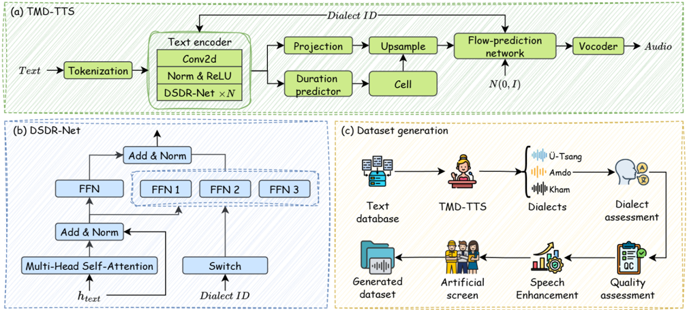

> [!abstract] arXiv · 2025 · Preprint
> **Yutong Liu et al.** (University of Electronic Science and Technology of China) · [→ Paper](https://arxiv.org/abs/2509.18060) · Demo: ? · Code: ?
>
> Introduces a unified Tibetan multi-dialect TTS framework that synthesizes parallel Ü-Tsang, Amdo, and Kham speech from explicit dialect labels, using a dynamic-routing FFN to sharpen dialectal distinctions.

## Problem

Tibetan has three major dialects (Ü-Tsang, Amdo, Kham) that differ substantially in phonology, lexicon, and syntax, and speech-to-speech dialect conversion between them is limited by the near-total absence of parallel dialectal speech data (prior resources, e.g. Zhuoma et al., provide only about 800 parallel samples, collected manually). The only prior Tibetan multi-dialect TTS approach shares a single mel-spectrogram decoder across dialects and injects dialect information only late in the pipeline via separate per-dialect WaveNet vocoders, which the authors argue restricts the model's ability to capture fine-grained dialectal distinctions and requires training and maintaining multiple heavy vocoders.

## Method

TMD-TTS is built on top of Matcha-TTS, replacing its single-dialect pipeline with a dialect-aware one. Tibetan text is tokenized and passed through a text encoder; a dialect ID (one of three discrete labels) is mapped to a normalized dialect embedding via an embedding layer, concatenated with hidden text features, and fused into the encoder output via a linear projection (the Dialect Fusion Module). This fused representation conditions both the duration predictor (which drives upsampling) and the flow-prediction network that generates mel-spectrograms, which are then converted to waveforms by a pretrained BigVGAN vocoder.

The core architectural contribution is the Dialect-Specialized Dynamic Routing Network (DSDR-Net), which replaces the standard Transformer feed-forward network. After multi-head self-attention produces hidden features, the dialect ID routes the signal through one of three dialect-specific "private" FFN sub-networks (in addition to a shared "public" FFN); the outputs of the public and the routed private FFN are summed. This conditional-computation mechanism gives each dialect its own dedicated capacity for modeling dialect-specific rhythm and intonation, rather than relying on a single shared FFN to absorb all dialectal variation from a low-dimensional embedding alone.

The paper also proposes a full data-generation pipeline built on TMD-TTS: text is sampled from a curated database, synthesized into dialectal speech, filtered by Dialect Embedding Cosine Similarity (DECS > 0.8) for dialect fidelity, filtered/enhanced by PESQ and DNSMOS thresholds (using MetricGAN+ for utterances below PESQ 3 or DNSMOS 2.7), and finally manually screened by native speakers. This pipeline is used to construct and release TMDD, a large-scale synthetic parallel Tibetan multi-dialect dataset. Training used a 179-hour, 1,500+-speaker corpus (44h Ü-Tsang, 45h Kham, 90h Amdo; 40k training samples per dialect, 300 each for validation/test), 500k training steps with Adam, a 216-character vocabulary, 128-dim dialect embeddings, and a 192-dim DSDR-Net, on two RTX 4090 GPUs.

## Key Results

Against reimplemented baselines (SC-CNN, VITS2, Matcha-TTS, each extended with the prior Tibetan multi-dialect design of Xu et al.), TMD-TTS achieves the best objective and subjective scores across all three dialects: e.g. Ü-Tsang 94.52% STOI / 3.03 PESQ / 17.91 dB SI-SDR / 2.78 DNSMOS, Amdo 94.92% STOI / 3.13 PESQ / 21.32 dB SI-SDR / 2.79 DNSMOS, Kham 93.17% STOI / 3.05 PESQ / 21.43 dB SI-SDR / 2.77 DNSMOS. Dialect fidelity is where the margin is largest: TMD-TTS reaches up to 88.09% DECS and 87.78% DCA, clearly ahead of the strongest baseline (Matcha-TTS, up to 65.8% DCA / 65.32% DECS). Naturalness MOS (3.83–3.86) and dialect Mean Opinion Classification (75.8–77.0%) also lead across all three dialects, at the cost of a modestly slower RTF (~0.031–0.032) than VITS2 (~0.020–0.021).

An ablation confirms both proposed components matter: removing the dialect fusion embedding drops DCA from 80.25% to 74.15% and DECS from 78.3% to 72.8%; replacing DSDR-Net with a standard FFN drops DCA to 60.12% and DECS to 58.6%; removing both collapses performance to 33.42% DCA / 32.2% DECS. The released TMDD dataset (98,142 utterances, ~102.6 hours from 122,700 synthesized and filtered candidates) is roughly 20x larger in sample count and 11x longer in duration than the prior Zhuoma et al. baseline dataset (4,763 utterances, ~9.5 hours), while matching or exceeding it on PESQ and SI-SDR. Downstream utility is validated on a speech-to-speech dialect conversion (S2SDC) task using DurFlex-EVC with BigVGAN vocoding: training on TMDD instead of the baseline dataset improves MOS from 3.07/3.54 to 3.23/3.63 at 16 kHz/22 kHz respectively.

## Novelty Assessment

The contribution is architectural but narrow in scope: DSDR-Net is a conditional-computation FFN routing mechanism (dialect ID selects one of several private FFN branches summed with a shared public FFN) applied specifically to dialect conditioning inside a Matcha-TTS backbone. The mixture-of-experts-style routing idea itself is not new to deep learning, but its application as a per-dialect specialized sub-network inside a flow-matching TTS FFN, combined with a dedicated dialect fusion module feeding both the text encoder and the flow-prediction network, is a genuine (if incremental) architectural addition over the prior Tibetan multi-dialect baseline, which only conditioned on dialect via separate output-stage vocoders. The comparisons are reasonably fair: all three baselines were reimplemented and extended with the same prior multi-dialect design for a like-for-like comparison. A second, arguably equally significant contribution is empirical/data-oriented: the TMDD dataset and its quality-filtering pipeline (DECS + PESQ/DNSMOS thresholds + manual screening), which is validated with a downstream S2SDC task rather than left unvalidated. The work is squarely a low-resource, single-language (Tibetan) application; no claims are made about generalization of DSDR-Net beyond dialect conditioning or beyond Tibetan.

## Field Significance

Moderate — this paper provides the first dedicated dynamic-routing mechanism for dialect-conditioned TTS in a genuinely low-resource, three-dialect setting, and backs it with both an ablation isolating the routing network's contribution and a downstream task (S2SDC) that validates the released synthetic dataset's utility rather than only its intrinsic audio quality. Its scope is narrow (one language family, no external comparison to non-Tibetan multi-dialect or multilingual TTS systems), so its primary value to the field is as a concrete data point on conditional-computation FFNs for fine-grained linguistic-variation control, plus a reusable large-scale Tibetan multi-dialect resource.

## Claims

- **supports:** Routing hidden representations through dialect-specific sub-networks inside the Transformer FFN captures fine-grained dialectal acoustic variation more effectively than conditioning through a shared-parameter network alone.
  > *Evidence:* Ablating DSDR-Net (replacing it with a standard shared FFN) while keeping the dialect fusion embedding drops dialect classification accuracy from 80.25% to 60.12% and dialect embedding cosine similarity from 78.3% to 58.6%. *(§3.3, Table 2)*
- **supports:** Injecting dialect/style conditioning early, into both the encoder and the generative (flow-prediction) network, produces more dialect-consistent speech than injecting it only at the output stage via separate per-dialect vocoders.
  > *Evidence:* Compared to a prior Tibetan multi-dialect design that shares a mel-decoder and uses separate per-dialect WaveNet vocoders, TMD-TTS's early dialect fusion module plus DSDR-Net reaches up to 88.09% DECS and 87.78% DCA versus a Matcha-TTS baseline extended with the late-fusion design (65.2–65.8% on the same metrics). *(§3.2, Table 1)*
- **supports:** Synthetic speech generated by a dialect-conditioned TTS system, when filtered for dialect consistency and perceptual quality, is usable as training data for a downstream speech-to-speech conversion task and can outperform a small, manually collected parallel corpus.
  > *Evidence:* A voice conversion model (DurFlex-EVC) trained on the TMDD dataset synthesized by TMD-TTS achieves higher MOS (3.23/3.63 at 16k/22kHz) than the same model trained on the prior manually collected baseline dataset (3.07/3.54). *(§3.5, Table 4)*
- **complicates:** Gains in speaker/style-consistency metrics from dialect- or attribute-specific conditioning mechanisms can come with a measurable inference-speed cost relative to simpler architectures.
  > *Evidence:* TMD-TTS's real-time factor (~0.031–0.032) is roughly 50% higher than VITS2's (~0.020–0.021), even though TMD-TTS still meets real-time synthesis requirements. *(§3.2)*

## Limitations and Open Questions

The evaluation is confined to a single language (Tibetan) and its three dialects; no experiments test whether DSDR-Net's routing mechanism generalizes to other dialect-continuum languages or to conventional multilingual TTS. The dialect classifier used for DCA/DECS metrics is itself a pretrained model whose own accuracy is not independently validated in this paper, so objective dialect-fidelity numbers are only as trustworthy as that classifier. Code and demo availability are not stated in the paper. The comparison baselines were reimplemented by the authors rather than run from official checkpoints, which is a reasonable and disclosed choice given the lack of existing public multi-dialect Tibetan TTS baselines, but leaves some residual uncertainty about baseline tuning.

## Wiki Connections

- [[multilingual-tts|Multilingual TTS]] — extends the multilingual/multi-variety conditioning problem to a within-language dialect continuum (Tibetan's three major dialects), a setting closely related to but distinct from cross-language multilingual TTS.
- [[flow-matching|Flow Matching]] — builds its generative backbone directly on Matcha-TTS's conditional flow-matching decoder, modifying only the conditioning and FFN routing mechanism.
- [[disentanglement|Disentanglement]] — the DSDR-Net's dialect-specific FFN routing is a mechanism for separating dialect-specific acoustic patterns from shared linguistic content within the same network.
- [[voice-conversion|Voice Conversion]] — validates the released synthetic dataset via a downstream speech-to-speech dialect conversion task built on an existing voice conversion model (DurFlex-EVC).
- [[evaluation-metrics|Evaluation Metrics]] — introduces a dialect-specific evaluation toolkit combining dialect embedding cosine similarity (DECS) and dialect classification accuracy (DCA) alongside standard speech-quality metrics.
