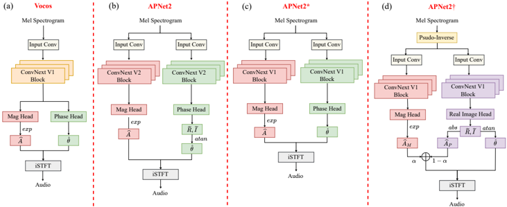

> [!abstract] arXiv · 2025 · Preprint
> **Lingling Dai et al.** (Institute of Acoustics, Chinese Academy of Sciences; Tencent AI Lab) · [→ Paper](https://arxiv.org/abs/2509.18806) · Demo: ? · Code: ?
>
> Diagnoses and fixes a severe performance collapse in dual-stream time-frequency vocoders by targeting three separate design axes: architectural topology, input source, and output formulation.

## Problem

Time-frequency (T-F) domain neural vocoders reconstruct waveforms by predicting magnitude and phase spectra and applying an inverse STFT, rather than directly upsampling in the time domain. Two architectural modalities dominate: single-stream designs, where magnitude and phase share most modeling capacity and only diverge at output heads (e.g. Vocos), and dual-stream designs, where magnitude and phase are estimated by largely independent branches (e.g. APNet2). Prior work has not systematically established which modality is preferable, or why. The authors find that this is not a purely academic question: on a single-speaker benchmark the two modalities perform comparably, but on a larger, more acoustically diverse multi-speaker benchmark the dual-stream model collapses catastrophically, while the single-stream model does not. The paper investigates why this collapse occurs and whether it can be fixed without abandoning the dual-stream design.

## Method

The analysis is built around two open-source T-F vocoders sharing similar modeling units (ConvNeXt blocks), loss functions, and training pipelines but differing in topology: Vocos (single-stream) and APNet2 (dual-stream). After ruling out modeling unit, output parameterization, and loss function as the cause of APNet2's collapse on LibriTTS (via a controlled ablation, APNet2*, that aligns APNet2 with Vocos on every factor except topology), the authors attribute the gap to the architectural topology itself, specifically the lack of information exchange between the magnitude and phase branches.

Three independent interventions are proposed, each targeting a different "space" in the generation pipeline:

- **Topological space:** two new inter-stream topologies are introduced between the fully shared (Vocos) and fully separate (APNet2) extremes — a partially-shared variant where magnitude and phase branches share a configurable number of layers, and a shuffled variant where the two streams exchange features at multiple layer depths while otherwise remaining independent.
- **Source space:** instead of feeding the compressed mel-spectrogram directly into the network, the mel-spectrogram is projected into the range space of the target linear spectrum via the pseudo-inverse of the mel filter bank, producing a coarser but T-F-bin-aligned "prior" spectrogram as input.
- **Output space:** rather than predicting phase directly or via an Atan-based parameterization, the phase branch is required to also produce a magnitude-consistent component (derived from its predicted real and imaginary parts), which is linearly combined with the magnitude branch's own prediction (weighted by a trainable scalar) to form the final magnitude estimate used in the loss. This couples the phase branch's gradient updates to the magnitude objective without changing the forward-pass magnitude prediction path.

All experiments train on the LibriTTS train-clean-100/360 and train-other-500 splits (following BigVGAN's split convention) and evaluate on LibriTTS test-clean/test-other, using official Vocos and APNet2 implementations with amplitude augmentation removed and learning rate aligned to 5e-4 for fair comparison. Eight objective metrics are used: PESQ, UTMOS, VISQOL, MCD, multi-resolution STFT loss, periodicity RMSE, V/UV F1, and pitch RMSE. No adversarial or perceptual losses beyond the vocoders' existing training recipes are introduced by this work; the modifications are purely architectural and objective-formulation changes layered on the existing Vocos/APNet2 training pipelines.

## Key Results

On LibriTTS, the unmodified dual-stream APNet2 collapses to PESQ 1.626 / UTMOS 1.663, far below single-stream Vocos at PESQ 3.487 / UTMOS 3.356, despite near-parity on single-speaker LJSpeech (§2.1, Table 1, Fig. 1). Aligning APNet2 with Vocos on modeling unit, output type, and loss (APNet2*) only partially closes the gap (PESQ 2.556), confirming topology as the dominant factor.

Adding inter-stream information exchange in the topological space substantially narrows this gap: the partially-shared variant with 6 shared layers reaches PESQ 3.461 / UTMOS 3.367, and the shuffled variant reaches PESQ 3.4 / UTMOS 3.344, both approaching the enlarged single-stream baseline Vocos-D (PESQ 3.607 / UTMOS 3.461) at comparable parameter counts (§4.1, Table 2).

Independently, source-space and output-space modifications each improve the fully separate APNet2* substantially even without any topology change: swapping the raw mel input for the pseudo-inverse mel prior alone raises PESQ from 2.556 to 3.197 and UTMOS from 1.886 to 2.987; adding the magnitude-informed output (MI-RI) on top raises PESQ further to 3.436. Combining prior-source and MI-RI-output modifications with each topology variant yields the paper's best dual-stream result, APNet2† (Separate topology, prior source, MI-RI output): PESQ 3.569 / UTMOS 3.41, closely matching Vocos-D's PESQ 3.576 / UTMOS 3.369 under the same source/output modifications (§4.2, Table 3). Spectrogram visualization further shows that the phase branch's magnitude term in APNet2† develops harmonic structure resembling the target, whereas the unmodified APNet2's does not (§4.3, Fig. 4).

## Novelty Assessment

The contribution is primarily diagnostic and engineering rather than a new architecture from scratch: all three interventions (weight sharing between parallel streams, range-space input priors via pseudo-inverse mel projection, and auxiliary consistency losses coupling two branches) are established ideas in adjacent domains such as speech enhancement and bandwidth extension, explicitly credited to prior work in those areas. What is new here is the systematic identification of a previously unreported failure mode, dual-stream T-F vocoder collapse at scale, and the demonstration that this collapse is attributable specifically to architectural topology rather than to modeling capacity, loss design, or output parameterization, isolated through a careful ablation chain (Table 1). The three "spaces" framing is a useful organizing device but the individual fixes are simple, and the paper is explicit that they are "simple yet effective" rather than conceptually novel. The evaluation, while broad across eight objective metrics, relies entirely on automatic predictors with no human listening test, and the comparison is confined to two vocoder families sharing near-identical modeling units by design, which limits how far the topology conclusion can be generalized to structurally different vocoders.

## Field Significance

Moderate — the paper documents a reproducible failure mode (dual-stream magnitude-phase vocoders collapsing on large, acoustically diverse multi-speaker data) that is not visible on small single-speaker benchmarks like LJSpeech, and shows this is fixable with lightweight modifications rather than a redesign. Its contribution is primarily diagnostic and empirical: it clarifies why architecturally similar T-F vocoders can diverge sharply in robustness, using two established open-source systems as the vehicle for the analysis rather than introducing a new vocoder architecture.

## Claims

- **supports:** Dual-stream architectures for joint magnitude-phase estimation are substantially more prone to performance collapse on large, acoustically diverse multi-speaker training data than single-stream architectures, even when modeling unit, output parameterization, and loss function are matched.
  > *Evidence:* APNet2 (dual-stream) collapses to PESQ 1.626 on LibriTTS versus Vocos (single-stream) at PESQ 3.487, despite near-parity on single-speaker LJSpeech; aligning APNet2 with Vocos on unit/output/loss (APNet2*) still leaves a large gap (PESQ 2.556 vs. 3.607). *(§2.1, Table 1, Fig. 1)*
- **supports:** Introducing weight sharing or periodic feature exchange between otherwise-independent magnitude and phase estimation streams substantially narrows the performance gap to fully shared-stream vocoder designs.
  > *Evidence:* Partially-shared (6 shared layers) and shuffled dual-stream topology variants raise PESQ from 2.556 (fully separate) to 3.461 and 3.4 respectively, approaching the shared-stream Vocos-D baseline of 3.607, at comparable parameter counts. *(§2.2, §4.1, Table 2)*
- **refines:** For T-F domain vocoders conditioned on mel-spectrograms, aligning the input representation with the target spectrum's range space (rather than using the compressed mel-spectrogram directly) improves reconstruction quality independently of any architectural change.
  > *Evidence:* Replacing the raw mel-spectrogram with a pseudo-inverse mel projection as input raises the fully separate APNet2* variant's PESQ from 2.556 to 3.197 and UTMOS from 1.886 to 2.987, with no modification to the network topology. *(§2.3, §4.2, Table 3)*
- **supports:** An auxiliary loss term that couples the gradient updates of otherwise-independent output branches can substitute for explicit architectural interaction between those branches.
  > *Evidence:* Requiring the phase branch to also produce a magnitude-consistent term used in the magnitude loss (MI-RI) raises separate-stream APNet2*'s PESQ from 3.197 to 3.436 without altering the forward-pass magnitude prediction path, and produces phase-branch magnitude estimates with harmonic structure resembling the target that are absent in the unmodified model. *(§2.4, §4.2, §4.3, Table 3, Fig. 4)*

## Limitations and Open Questions

> [!warning]
> Evaluation relies entirely on automatic objective metrics (PESQ, UTMOS, VISQOL, MCD, M-STFT, periodicity RMSE, V/UV F1, pitch RMSE); no human listening test (MOS or preference test) is reported, so perceptual validation of the reported gains is absent.

The analysis is confined to two vocoder families, Vocos and APNet2, that were deliberately chosen for their structural similarity in modeling unit, loss, and training pipeline; it is not established whether the topology-collapse finding or the three proposed fixes generalize to vocoders with substantially different modeling units (e.g. non-ConvNeXt backbones) or to time-domain vocoders. The paper also does not report inference-time latency or compute overhead for the pseudo-inverse mel projection or the added output branch, despite emphasizing efficiency as a motivation for T-F domain approaches over time-domain upsampling.

## Wiki Connections

- [[gan-vocoder|GAN Vocoder]] — analyzes and modifies the internal architecture of two representative T-F domain GAN vocoders (Vocos, APNet2), isolating architectural topology as the source of a training-scale-dependent failure mode.
- [[evaluation-metrics|Evaluation Metrics]] — benchmarks vocoder quality across eight objective metrics (PESQ, UTMOS, VISQOL, MCD, M-STFT, periodicity RMSE, V/UV F1, pitch RMSE) to isolate the effect of architectural topology from confounding factors.
