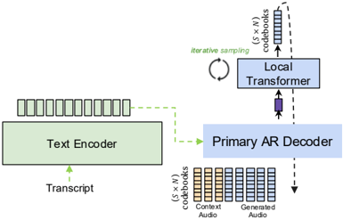

> [!abstract] arXiv · 2025 · Preprint
> **Roy Fejgin et al.** (NVIDIA) · [→ Paper](https://arxiv.org/abs/2509.19592) · Demo: ? · Code: ?
>
> Systematically compares autoregressive and MaskGIT-style local transformers for decoding intra-frame codebook dependencies in multi-codebook speech LMs, and introduces frame stacking, letting the primary decoder predict multiple codec frames per step while the local transformer resolves all their codebooks.

## Problem

Neural audio codecs represent speech as a [T, N] grid of codebook indices per frame, and codec-LM TTS systems must predict all N codebooks at every timestep. The simplest approach, parallel prediction, assumes the N codebooks are conditionally independent given the timestep and decodes them in one shot. This assumption is false by construction for residual vector quantization, where higher codebooks are residuals of lower ones, and is not enforced even for finite scalar quantization. Prior work has introduced an auxiliary local transformer (LT) to model these intra-frame dependencies, but the design space for the LT (autoregressive vs. iterative masked decoding) and its interaction with generation throughput had not been systematically characterized for speech.

## Method

The authors build on Koel-TTS, an encoder-decoder AR codec-LM TTS system: a text encoder processes linguistic input and a primary decoder autoregressively predicts discrete acoustic tokens from a 21.5 fps, 8-codebook NanoCodec. They study two LT designs that refine the primary decoder's per-frame hidden state into the N codebook entries. The autoregressive LT generates codebooks sequentially, conditioning each prediction on previously decoded codebooks within the same frame; this captures full intra-frame dependency but adds latency proportional to N. The MaskGIT-style LT instead starts from a fully masked frame and iteratively unmasks a subset of codebook predictions per forward pass (using non-causal self-attention and purity sampling to choose which tokens to unmask), allowing the number of decoding iterations P to be smaller than N and trading off speed against the joint-probability approximation error introduced when multiple tokens are unmasked in the same step.

Both LT designs are then combined with frame stacking: the primary decoder is trained to predict S consecutive frames (S × N codebooks) jointly per step, and the LT decodes all S × N codebooks from that single hidden state. Separate per-frame-index embedding tables (shared between primary decoder and LT) disambiguate stacked codebooks, and these embeddings are averaged across the stack and codebooks at the primary decoder's input. Because the LT is much smaller than the primary decoder and self-attends only over a short in-frame sequence (rather than the full generation history with cross-attention to the text encoder), throughput gains from stacking compound with the stacking factor S. To hold total parameter count roughly fixed across conditions, the non-LT baseline decoder uses 16 transformer layers while the LT variants split 12 layers in the primary decoder and 4 in the LT, all at dimension 768 with 12 attention heads.

## Key Results

On LibriTTS seen/unseen-speaker test sets (180 utterances each), evaluated via WER (Parakeet-TDT-1.1B ASR), speaker similarity (TitaNet-Large cosine similarity), Fréchet Distance (FD) in the codec's embedding space, and UTMOSv2-estimated naturalness: at stacking factor 1 (no stacking), both LT variants outperform the parallel-prediction baseline on speaker similarity, FD, and MOS, with WER differences within confidence intervals. Across every stacking factor tested (1, 2, 4), every LT-based configuration achieves lower FD than every parallel-sampled configuration, including the unstacked parallel baseline, indicating that iterative decoding produces a codec-frame distribution closer to ground truth regardless of stacking. At stacking factor 2, the AR LT reaches 2.1x throughput over the unstacked parallel baseline while improving FD and keeping WER, speaker similarity, and MOS within or better than baseline; the MaskGIT LT (3 sampling steps) reaches 3.1x throughput at comparable quality. Applying parallel sampling directly to a 2x-stacked model, rather than routing through the LT, degrades FD by 67% for unseen speakers relative to the unstacked parallel baseline and lowers MOS. At stacking factor 4, throughput reaches 2.9x (AR LT) and 5.5x (MaskGIT LT), but unseen-speaker speaker similarity drops substantially for both LT variants (from 0.765 at stack 1 to 0.642 AR / 0.624 MaskGIT at stack 4), and the MaskGIT LT shows a marked MOS decline that the authors attribute to using only 3 sampling steps for 32 tokens.

## Novelty Assessment

The AR and MaskGIT local-transformer designs are established techniques (the AR LT pattern appears in prior hierarchical codec-LM systems, and MaskGIT is adapted from image generation); the paper's contribution here is a controlled, systematic comparison of the two under matched parameter budgets rather than a new decoding architecture. Frame stacking is the more original element: it extends the LT beyond intra-frame refinement to also absorb the codebooks of multiple consecutive frames, letting the primary decoder run at an effectively lower frame rate without retraining the underlying codec. This is a genuine structural contribution, though a narrow one layered on top of an existing base system (Koel-TTS) and a single codec (NanoCodec). The paper is explicit that its main output is empirical characterization and practical deployment guidelines rather than a new fidelity record, and the honesty about where each configuration degrades (unseen-speaker robustness at high stacking, MaskGIT quality at few sampling steps) is a strength of the evaluation.

## Field Significance

Moderate — the paper provides controlled evidence that dependent (iterative) codebook decoding consistently beats parallel independent decoding across throughput regimes, and it demonstrates a concrete mechanism (frame stacking) for trading a bounded amount of quality for large throughput gains without retraining a lower-frame-rate codec. Its contribution is primarily an empirical characterization of an existing design pattern plus one structural extension, evaluated on a single base architecture and codec.

## Claims

- **supports:** Decoding codebooks of a multi-codebook acoustic frame with explicit intra-frame dependencies (iteratively) yields a generated token distribution closer to the ground truth than decoding all codebooks in parallel under an independence assumption.
  > *Evidence:* Across all tested frame-stacking factors (1, 2, 4), every autoregressive- or MaskGIT-local-transformer configuration achieves lower Fréchet Distance than every parallel-sampled configuration, including the unstacked parallel baseline. *(§3.3.1, Fig. 2e)*
- **supports:** Offloading intra-frame codebook decoding to a small auxiliary transformer lets a primary acoustic decoder predict multiple codec frames per generation step, substantially increasing throughput without retraining the underlying codec at a lower frame rate.
  > *Evidence:* At a frame-stacking factor of 2, the autoregressive local-transformer model reaches 2.1x throughput over the unstacked parallel baseline while improving Fréchet Distance and keeping WER, speaker similarity, and MOS within or better than baseline; the MaskGIT variant reaches 3.1x throughput at comparable quality. *(§2.4, §3.3.2, Table 1, Fig. 2f)*
- **complicates:** Parallel independent codebook prediction degrades disproportionately, not just proportionally, as more codebook information is packed into a single decoding step.
  > *Evidence:* Applying parallel sampling to a 2x frame-stacked model (instead of routing through the local transformer) increases unseen-speaker Fréchet Distance by 67% relative to the unstacked parallel baseline and lowers MOS. *(§3.3.2)*
- **complicates:** The throughput gains of iterative masked-prediction decoding for acoustic codebooks come at a quality cost that grows sharply once the number of sampling steps is small relative to the number of tokens being resolved per step.
  > *Evidence:* At a stacking factor of 4, the MaskGIT local transformer with 3 sampling steps decoding 32 tokens per step (8 codebooks × 4 stacked frames) shows a significant MOS drop relative to baseline, while the autoregressive local transformer at the same stacking factor does not exhibit this drop. *(§3.3.2, Fig. 2a)*

## Limitations and Open Questions

> [!warning]
> Robustness to unseen speakers degrades substantially at higher frame-stacking factors: unseen-speaker speaker similarity falls from 0.765 at stacking factor 1 to 0.642 (AR LT) and 0.624 (MaskGIT LT) at stacking factor 4, which the authors themselves flag by recommending high stacking only "when not needing zero-shot functionality."

All experiments build on a single base system (Koel-TTS) and a single codec (NanoCodec, FSQ-based, 8 codebooks at 21.5 fps); it is untested whether the same tradeoffs hold for RVQ-based codecs, different codebook counts, or other primary-decoder architectures. The MaskGIT local transformer's degradation at high stacking is attributed to using only 3 sampling steps, but the paper does not run the ablation that would confirm more steps recover quality, leaving the speed-quality Pareto frontier for MaskGIT only partially characterized. Training data is described only as "the same 18k hours of data as in the Koel-TTS paper," with no further specification of language, speaker count, or domain in this paper itself.

## Wiki Connections

- [[autoregressive-codec-tts|Autoregressive Codec TTS]] — the paper's local-transformer and frame-stacking mechanisms are extensions to the codebook-decoding stage of an autoregressive encoder-decoder codec-LM TTS system (Koel-TTS).
- [[neural-codec|Neural Audio Codec]] — the entire study is framed around resolving inter-codebook dependencies in a multi-codebook neural codec (NanoCodec, FSQ), and argues these dependencies are not enforced by codec training even outside RVQ.
- [[zero-shot-tts|Zero-Shot TTS]] — evaluation is conducted on seen and unseen speaker subsets of LibriTTS with speaker-similarity metrics, and the paper explicitly notes that its highest-throughput configuration should be avoided when zero-shot speaker generalization is required.
- [[transformer-enc-dec-tts|Transformer Encoder-Decoder TTS]] — the base system is an encoder-decoder TTS architecture (text encoder plus autoregressive decoder) to which the local-transformer refinement is added.
