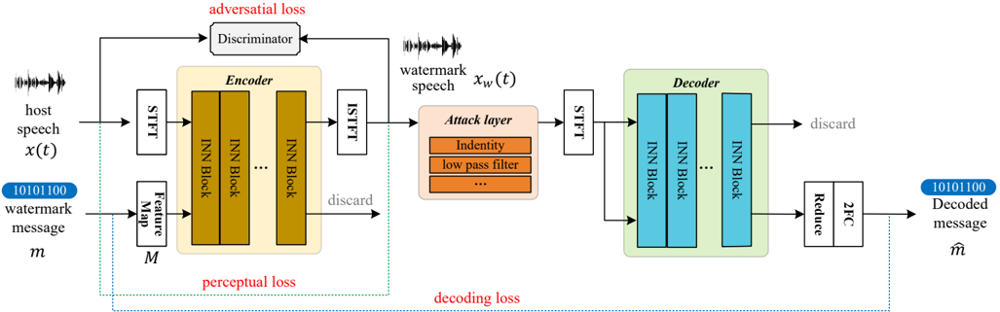
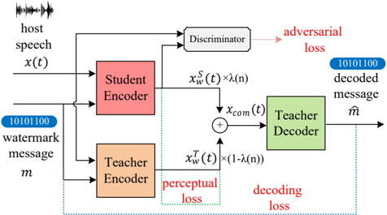

> [!abstract] arXiv · 2025 · Preprint
> **Yang Cui et al.** (Microsoft) · [→ Paper](https://arxiv.org/abs/2509.19812) · Demo: ✗ · Code: ✗
>
> Introduces PKDMark, a progressive knowledge distillation framework that compresses a robust invertible-neural-network speech watermarking model into a lightweight student, cutting computational cost by 93.6% while matching the full-size teacher's robustness and imperceptibility.

## Problem

Deep-learning watermarking systems resist advanced signal manipulations (re-recording, desynchronization, time-stretching, pitch-shifting) far better than DSP-based watermarking, but that robustness comes at a computational cost that limits real-time deployment inside speech synthesis and transmission pipelines. Conversely, DSP-based watermarking is cheap but brittle against exactly these attacks. Prior generative and post-hoc watermarking work (WavMark, AudioSeal, and related invertible-neural-network or codec-based systems) has largely optimized for robustness or imperceptibility independently of inference cost, leaving the efficiency-robustness trade-off unaddressed. A naive fix, compressing the watermark encoder and training it end-to-end against a fixed teacher decoder, transfers knowledge only at the output layer and, as this paper shows empirically, underperforms a full-size model by a wide margin.

## Method

PKDMark follows an encoder-attack-decoder pipeline operating in the complex Short-Time Fourier Transform (STFT) domain rather than on raw waveforms or mel-spectrograms. The host speech is converted to a complex spectrogram via STFT; a binary message is expanded through a two-layer feedforward network into a complex-valued message feature map that is repeated to match the spectrogram's time-frequency shape, encoding the same content in both the real and imaginary parts so that phase, not just amplitude, carries watermark information. An attack layer inserted between encoder and decoder simulates 14 distortion types (9 basic: noise, filtering, MP3 compression, downsampling, quantization, amplitude scaling, echo; 5 advanced: speed change, reverberation, pitch shift) during training to enforce resilience.

Training proceeds in two stages. First, a teacher model is trained using an invertible neural network (INN) with 8 blocks (5-layer ResNet modules, 32 channels each), where encoder and decoder share parameters to guarantee strict reversibility. The teacher is optimized jointly with a multi-scale STFT perceptual loss, an MSE decoding loss on both the recovered message bits and the intermediate message feature map, and an adversarial loss from a discriminator that distinguishes watermarked from original audio. Second, a compact student encoder (2 INN blocks, 16 channels) is trained via progressive knowledge distillation (PKD): the student and (frozen) teacher encoder outputs are linearly mixed with a schedule that increases the student's weight λ(n) from 0.1 to 1 over 40k steps, and the mixed output is decoded by the teacher decoder. At λ=0 this reduces to teacher-only training; at λ=1 it is equivalent to direct knowledge distillation (DKD) supervising only the output layer. This progressive schedule lets the student build a stable internal representation under teacher guidance before gradually relying on its own outputs, followed by a final joint fine-tuning stage. At inference, only the lightweight student encoder and the fixed teacher decoder are needed, embedding a 16-bit-per-second message.

Training uses a composite 1,000-hour corpus (400h CommonVoice, 300h LibriTTS, 200h ASVspoof 2021 DF, 100h Microsoft Azure TTS synthetic speech) at 24kHz, split 900/50/50 hours for train/validation/test, with STFT computed at FFT size 1,024 and hop length 600. Model size is not reported in parameter counts; computational cost is instead reported in FLOPS.

## Key Results

On the held-out test split, PKDMark's distilled student matches the teacher's robustness and imperceptibility closely: average bit error rate (BER) of 0.51% versus the teacher's 0.56% across 14 distortion types, PESQ of 4.30 versus 4.33, and SNR of 45.54dB versus 45.75dB (Table I). A CMOS test comparing original recordings against student-watermarked speech yields -0.04, indicating near-imperceptible degradation. On a separate detection task using 1,000 short TTS samples embedded with an 8-bit synchronization code, PKDMark reaches an average detection F1 of 99.6% across the same distortion suite.

Against open-source baselines at matched or lower bitrate, PKDMark's BER (0.51%) is substantially lower than WavMark (8.58% at 32bps) and a bitrate-matched WavMark-16bps variant (2.43%), and far lower than AudioSeal (18.66% average, driven by near-total failure under speed change and pitch-shift attacks despite achieving 0.00% BER on several basic distortions). On efficiency, the student reduces compute from the teacher's 36.0 GFLOPS to 2.3 GFLOPS (93.6% reduction), improving real-time factor by 84.7% on an NVIDIA T4 GPU (0.039 → 0.006) and 87.1% on an Intel i9-13900 CPU (0.155 → 0.020) (Table II). Ablations show that removing the complex (phase-plus-amplitude) message feature map raises BER to 1.77% and drops SNR to 42.25dB, and removing the multi-scale STFT loss raises BER to 1.23% and drops SNR to 40.34dB; a direct knowledge distillation (DKD) student trained under identical settings reaches only 1.94% BER and 4.08 PESQ, well behind PKDMark's 0.51% and 4.30.

## Novelty Assessment

The architectural core, an invertible-neural-network encoder-decoder with an adversarial discriminator, is a direct extension of WavMark, and progressive knowledge distillation itself is an established technique from language-model, vision, and retrieval literature. The paper's genuine contributions are narrower but concrete: a complex-domain (phase-aware) message feature map and multi-objective loss that measurably improve the teacher's robustness over WavMark, and a mixing-schedule distillation procedure adapted specifically to watermark encoder-decoder compression, which the ablation against direct distillation shows to be necessary rather than incidental. The comparisons are reasonably fair (a bitrate-matched WavMark-16bps baseline is included), but the paper benchmarks against only two open-source systems (WavMark, AudioSeal) and not against several more recent efficient watermarking methods it cites in related work (SilentCipher, DiscreteWM, MaskMark), so its efficiency claims relative to the current state of the art in watermarking remain untested.

## Field Significance

Moderate — this paper provides evidence that a staged, mixing-based distillation schedule can compress a deep audio watermarking model by an order of magnitude in compute while preserving robustness that plain output-layer distillation cannot achieve. Its contribution is infrastructure for making deep watermarking practical in real-time speech synthesis and transmission pipelines rather than a new generative or watermarking paradigm.

## Claims

- **supports:** Progressive, mixing-based knowledge distillation can compress a deep audio watermarking encoder to a fraction of its computational cost while matching the teacher model's robustness and imperceptibility.
  > *Evidence:* Distilling from an 8-block/32-channel INN teacher to a 2-block/16-channel student lowers GFLOPS by 93.6% (36.0 → 2.3) yet the student's average BER (0.51%) is lower than the teacher's (0.56%) and its PESQ (4.30) is within 0.03 of the teacher's (4.33). *(§IV.D-E, Tables I-II)*
- **complicates:** Distilling a compressed watermarking encoder by supervising it only through the teacher's decoder output, without intermediate mixing of encoder representations, transfers robustness poorly.
  > *Evidence:* A direct knowledge distillation (DKD) student trained under identical settings to PKDMark shows more than triple the bit error rate (1.94% vs 0.51%) and lower perceptual quality (PESQ 4.08 vs 4.30). *(§IV.E, Table I)*
- **refines:** Embedding watermark information using both phase and amplitude in the complex STFT domain, rather than amplitude alone, improves the robustness of deep audio watermarking against signal distortions.
  > *Evidence:* Removing the complex-valued message feature map from the teacher model (amplitude-only embedding) raises average BER from 0.56% to 1.77% and drops SNR from 45.75dB to 42.25dB. *(§IV.E, Table I)*
- **complicates:** Efficient watermark detectors that achieve near-perfect bit accuracy under basic signal distortions can still fail under advanced temporal-domain attacks such as time-stretching, pitch-shifting, or reverberation.
  > *Evidence:* AudioSeal attains 0.00% BER on several basic distortions but its BER rises to 47-59% under slow-speed, fast-speed, and pitch-shift attacks, driving its average to 18.66% versus PKDMark's 0.51% under the same 14-distortion suite. *(§IV.C, Table I)*

## Limitations and Open Questions

> [!warning]
> The paper explicitly leaves neural codec compression and neural denoising attacks untested, which is a significant gap given that the stated motivating threat, unauthorized voice cloning by modern generative speech models, increasingly routes synthesized audio through neural codecs before distribution.

Beyond that gap, the evaluation compares against only two open-source baselines (WavMark, AudioSeal); several more recent efficient or robust watermarking systems discussed in the paper's own related work (SilentCipher, DiscreteWM, MaskMark) are not empirically compared. The detection experiment relies on a simple majority-vote heuristic over an 8-bit synchronization code (7-of-8 bit match), whose robustness to attacks specifically targeting the sync code is not evaluated. The training corpus includes 100 hours of Microsoft Azure TTS synthetic speech whose characteristics are not detailed, and although CommonVoice is multilingual, no per-language robustness breakdown is reported.

## Wiki Connections

- [[evaluation-metrics|Evaluation Metrics]] — introduces a bit-error-rate and detection-F1 evaluation protocol across 14 distortion types (9 basic, 5 advanced) as a systematic robustness benchmark for speech watermarking.
- [[subjective-evaluation|Subjective Evaluation]] — validates imperceptibility with a CMOS listening test comparing original recordings against watermarked speech from human raters.
- [[voice-conversion|Voice Conversion]] — frames unauthorized voice cloning as the central security threat driving the watermark's design, though PKDMark's own encoder-decoder performs watermark embedding and detection rather than voice conversion itself.
