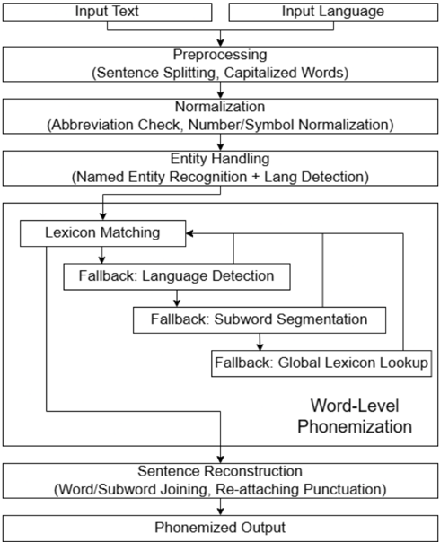

> [!abstract] arXiv · 2025 · Preprint
> **Johannes Wirth** (Hof University of Applied Sciences) · [→ Paper](https://arxiv.org/abs/2509.20086) · Demo: ? · Code: ✓
>
> Introduces a hybrid grapheme-to-phoneme framework combining large multilingual lexica, NLP disambiguation, and a novel statistical subword segmentation algorithm, and shows that a fine-tuned LLM trained on its synthetic output can generalize past its own deterministic accuracy on some out-of-vocabulary cases.

## Problem

Phonemization (grapheme-to-phoneme, G2P) is the text-to-speech front-end responsible for correct pronunciation, but existing tools force a trade-off. Rule-based systems with lexicon lookup (eSpeakNG, Gruut) are precise but struggle with morphologically complex compounds, foreign loanwords, and homographs, since exceptions and unseen words are handled by rigid rules or shallow statistical guesses. Neural G2P models (T5G2P, ByT5-based multilingual G2P) promise better out-of-vocabulary (OOV) generalization, but in practice inherit the errors of the eSpeak-derived training data they are distilled from and offer no mechanism for manual correction of specific mispronunciations, which is impractical to fix via retraining. No prior system had systematically combined expansive lexica, NLP-based disambiguation, and a principled statistical fallback for unseen compounds, nor directly measured whether a neural model trained on such a system's output could exceed it.

## Method

OLaPh is a hierarchical hybrid pipeline. Text is first pre-processed with part-of-speech (POS) tagging, named entity recognition (NER), and abbreviation/number normalization (using spaCy models and num2words, with a dedicated normalizer for German's case system). Each word is then phonemized through a multi-stage fallback sequence: primary lexicon lookup (built from recent Wiktionary dumps across English, German, French, and Spanish, with additional lexica prepared for six more languages), a foreign-language check via the Lingua language-detection library followed by lookup in the detected language's lexicon, and, if the word remains unresolved, a statistical subword segmentation algorithm for compound decomposition. As a final fallback, a global search spans all available lexica to catch unclassified tokens or foreign scripts. NER output allows entities (e.g., "FBI") to be phonemized using their source language's rules rather than the host language's, and POS tags resolve homographs (e.g., English "read" as present vs. past tense) using lexicon entries annotated by tag.

The subword segmentation algorithm is the paper's core novel component. For an out-of-lexicon word, it exhaustively scores all valid segmentations of the word into candidate subwords, using a composite function that weights each subword's corpus frequency (from a reference corpus of over 15 million Wikipedia sentences per language) by its relative length (exponent α) and a length-based penalty (favoring segments longer than two characters), then applies a global penalty for the total number of segments (exponent β, default 15) to favor fewer, larger subwords over many small ones. This exhaustive scoring is proposed as an alternative to linear left-to-right or right-to-left compound splitting, which the authors argue fails on languages such as German where compounding is highly productive.

As an extension beyond the deterministic framework, the authors fine-tune a 2B-parameter GemmaX-based LLM (originally optimized for translation) on 3 million grapheme-phoneme pairs synthesized by OLaPh from the FineWeb corpus (1.5M sentence pairs per language across English, French, German, and Spanish, plus 200K isolated lexicon entries per language). The model's tokenizer is extended with 256 phoneme tokens, and training reframes G2P as a translation task via an instruction template ("translate this from [source language] to phonemes: [input graphemes]"), fine-tuned for a single epoch with AdamW and an inverse-square-root learning rate schedule on two GPUs (17 hours). Unlike the rule-based framework, this "OLaPh LLM" performs end-to-end phonemization directly from raw text, without spaCy preprocessing.

## Key Results

On the WikiPron benchmark across English, French, German, and Spanish, OLaPh achieves an average phoneme error rate (PER) of 5.32%, roughly half the error of the next-best baselines: eSpeak-NG (9.84%) and Gruut (10.29%), and less than half of a ByT5-tiny multilingual G2P model (12.52%) (Table 2). On the OOV-only subset, OLaPh maintains its lead (5.47% avg PER vs. 10.05%–12.27% for the baselines), and its performance on Spanish OOV words (2.06% PER) is actually lower than its performance on the full Spanish set (2.58%) despite Spanish having the highest OOV rate in the benchmark (30.69%) (Table 3), which the authors take as evidence that the statistical segmentation fallback is a genuinely capable G2P method rather than a weak last resort.

The fine-tuned OLaPh LLM does not match the deterministic framework's overall accuracy (9.74% avg PER vs. 5.32%), but it outperforms eSpeak-NG and Gruut on German and Spanish, and in a sample-wise comparison against the deterministic framework on OOV words, the LLM wins outright on up to 22.49% of English OOV samples (and smaller but non-trivial shares in French, German, and Spanish) despite having been trained solely on the framework's own synthetic output (Table 4). English produces the highest PER for every system evaluated, which the authors attribute via manual audit largely to transcription inconsistencies in the WikiPron benchmark (allophonic variation, British/American mixups) rather than genuine phonemization failures.

## Novelty Assessment

The contribution is primarily an engineering integration: lexicon lookup, NER, POS tagging, and language detection are all established NLP components (spaCy, Lingua, Wiktionary-derived lexica) assembled into a multi-stage fallback pipeline. The one clearly novel algorithmic piece is the statistical subword segmentation scoring function, which is a genuine methodological addition rather than a reapplication of existing compound-splitting heuristics, and the paper backs it with a direct ablation-style comparison against non-segmenting baselines on OOV data. The comparative benchmark itself, evaluating four languages against three baseline families under normalized labels, is a solid empirical-benchmark contribution, though the improvement magnitude for English is partly attributable to benchmark noise rather than the method. The LLM extension is exploratory: it demonstrates an interesting "student exceeds teacher on some samples" phenomenon, but the underlying technique (instruction-tuned fine-tuning of a pretrained LLM on synthetic distillation data) is standard, and the paper is explicit that the framework, not the LLM, remains the stronger performer overall.

## Field Significance

Moderate — this paper packages known NLP techniques with one genuinely new statistical segmentation algorithm into an open-source phonemization tool that reduces PER substantially against established phonemizers, and it provides a controlled demonstration that a neural model distilled from a deterministic G2P system can exceed its teacher on a meaningful fraction of ambiguous cases without matching it overall. Its contribution is to the TTS text front-end rather than to speech generation architecture itself, and its evaluation is limited to word-level phoneme accuracy rather than downstream synthesized speech quality.

## Claims

- **supports:** Combining large multilingual lexica with a principled statistical fallback for out-of-vocabulary compound segmentation reduces phoneme error rate compared to purely rule-based or purely neural G2P systems.
  > *Evidence:* OLaPh achieves 5.32% average PER across English, French, German, and Spanish on WikiPron, versus 9.84% (eSpeak-NG), 10.29% (Gruut), and 12.52% (ByT5 tiny) *(§4.1, Table 2)*.
- **supports:** A statistical subword segmentation fallback can perform as a robust primary G2P mechanism for compound-rich, out-of-vocabulary words, not merely as a weak last resort.
  > *Evidence:* On Spanish, which has the highest OOV rate in the benchmark (30.69%), OLaPh's OOV-only PER (2.06%) is lower than its PER on the full dataset (2.58%), and its overall OOV-subset average PER (5.47%) closely tracks its full-dataset average (5.32%) *(§4.1, Table 3)*.
- **refines:** A neural G2P model distilled from a deterministic teacher's synthetic output can exceed the teacher on a meaningful share of ambiguous or out-of-vocabulary cases, even while trailing it in overall accuracy.
  > *Evidence:* The OLaPh LLM's average PER (9.74%) trails the OLaPh framework's (5.32%), but in a sample-wise comparison on OOV words the LLM wins outright on 22.49% of English samples, 10.16% of French, 9.01% of German, and 2.02% of Spanish samples *(§4.2, Table 4)*.
- **complicates:** Cross-system phoneme error rate comparisons for languages with deep orthography can be inflated by benchmark transcription inconsistencies rather than reflecting true differences in phonemization capability.
  > *Evidence:* Every evaluated system (eSpeak-NG, Gruut, ByT5, OLaPh, OLaPh LLM) shows its highest PER on English; manual sample audits attributed much of this increase to allophonic variation and British/American English mixups in the WikiPron reference labels rather than fundamental phonemic mapping failures *(§4.1, §5)*.

## Limitations and Open Questions

> [!warning]
> The evaluation measures phoneme error rate against WikiPron reference transcriptions only; the paper does not measure the downstream effect of these differences on synthesized speech quality or intelligibility in an actual TTS pipeline, and the authors explicitly flag this as unresolved future work.

The framework currently supports and is evaluated on only four languages (English, German, French, Spanish), despite lexica being prepared for six additional languages awaiting integration. The WikiPron benchmark itself is acknowledged to contain transcription inconsistencies, particularly for English, that were not corrected due to the manual effort required at scale, which caps how precisely the reported PER gaps can be interpreted. The LLM extension is trained and evaluated only on synthetic data generated by OLaPh itself, so its generalization is bounded by the coverage and consistency of that teacher signal rather than by human-labeled data; the authors note that scaling parameter count and training diversity may be needed before it can exceed the deterministic framework outright.

## Wiki Connections

- [[multilingual-tts|Multilingual TTS]] — provides an open-source phonemization front-end evaluated across four languages, directly addressing the text-normalization and pronunciation-accuracy needs of multilingual TTS pipelines.
- [[evaluation-metrics|Evaluation Metrics]] — conducts a controlled phoneme error rate comparison across five G2P systems on a shared, OOV-annotated benchmark, illustrating how benchmark label noise can confound cross-system metric comparisons.
