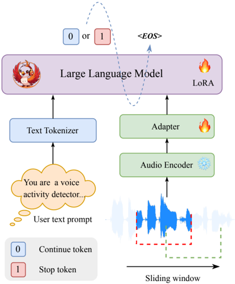

> [!abstract] arXiv · 2025 · Preprint
> **Weijie Wu et al.** (Xiamen University, DiDi Global) · [→ Paper](https://arxiv.org/abs/2509.20410) · Demo: ? · Code: ?
>
> Introduces an LLM-based streaming detector that decides whether a user has finished speaking based on semantic completeness, decoupled from the dialogue model itself.

## Problem

Full-duplex spoken dialogue systems must decide, in real time, whether a user has finished speaking so the assistant can respond without interrupting or leaving an awkward gap. Acoustic voice activity detection only distinguishes speech from silence, so it cannot tell a genuine pause from mid-sentence hesitation, causing premature interruptions or sluggish turn-taking. Prior semantic approaches either bolt an ASR module onto the pipeline (adding latency and losing acoustic information) or bake turn-taking prediction directly into the dialogue model itself (Moshi, LSLM), which forces retraining whenever the dialogue model changes and prevents the endpoint detector from being reused across systems.

## Method

Phoenix-VAD is a three-part pipeline: a Zipformer audio encoder (~150M parameters, pretrained on internal ASR data) converts raw waveform into 25 Hz frame-level features; an adapter (two linear layers with a ReLU) downsamples these features by concatenating consecutive frames and projects them into the text embedding space of a Qwen2.5-0.5B-Instruct backbone; the LLM then consumes the projected audio features alongside a text prompt describing the endpoint-detection task and autoregressively emits a `0` (Continue Speaking) or `1` (Stop Speaking) token followed by an end-of-sequence marker.

Training uses a sliding window strategy over 100 Hz Fbank features: each chunk spans a fixed window (2560 ms) advancing with a fixed stride (320 ms), and supervision is applied only to the label of the last chunk in the window, which lets the same model be run causally, chunk-by-chunk, at inference time. The audio encoder is kept frozen; only the adapter and a LoRA-adapted subset of the LLM are trained with a standard autoregressive cross-entropy loss. Training data is entirely synthetic: text spanning semantically complete and incomplete queries is generated from internal resources plus the ChatGPT API, converted to speech with Index-TTS using speaker prompts drawn from the seed-tts-eval timbre library (1,007 English and 1,010 Chinese prompts) for speaker diversity, with inserted silences simulating hesitations and interruptions, and Paraformer used to derive per-character timestamps for labeling stop-speaking boundaries. At inference, the model applies a short timeout (400 ms) after a semantically complete utterance and a longer timeout (1000 ms) after an incomplete one before finalizing the turn, and each chunk prediction takes roughly 50 ms on a single A6000 GPU.

## Key Results

On a held-out test set of 2,000 semantically complete and 2,000 semantically incomplete audio samples, Phoenix-VAD reaches 0.985–0.986 overall accuracy, with F1 scores of 0.905–0.918 for Stop Speaking and 0.992–0.993 for Continue Speaking (Table 2, Table 3). Against reported numbers for two recent alternatives (RTTL-DG and Semantic VAD, neither open-sourced, so the comparison uses figures from their own papers rather than a re-run), Phoenix-VAD's Continue Speaking F1 (0.993) exceeds both, while its Stop Speaking F1 (0.905) trails Semantic VAD's (0.959) despite operating on much finer 320 ms audio chunks rather than coarse text segments (Table 4). Ablations show that shrinking the chunk size from 320 ms to 160 ms hurts performance (Stop Speaking F1 drops from 0.905 to 0.819), and pretraining the adapter on ASR data alone before freezing it and fine-tuning only LoRA weights collapses Stop Speaking F1 to 0.325 (Table 5).

## Novelty Assessment

The architectural components, a frozen ASR encoder, a linear adapter, and an instruction-following LLM backbone fine-tuned with LoRA, are a well-established pattern in speech-LLM systems and are not novel on their own; this is primarily an engineering integration of existing pieces. The genuine methodological contribution is the sliding-window training and inference procedure that lets a decoder-only LLM produce chunk-level streaming predictions with supervision only on the final chunk of each window, applied specifically to the previously unaddressed task of ASR-free, plug-and-play semantic endpoint detection. The evaluation is entirely on synthetic, self-generated data, and the comparison to prior methods is not a controlled head-to-head (the baselines are neither reproduced nor open source), which limits how much the reported numbers can be trusted as a fair ranking.

## Field Significance

Moderate — the paper offers a concrete, decoupled design for semantic endpoint detection that can be swapped into different dialogue systems without retraining the dialogue model itself, addressing a gap identified in prior full-duplex approaches that entangle turn-taking prediction with the dialogue model. Its contribution is incremental relative to existing semantic-VAD approaches rather than a new capability, and its evidence base is limited to a single self-constructed benchmark.

## Claims

- **supports:** A dedicated LLM-based endpoint detector can perform semantic turn-taking judgments directly from raw audio without a separate ASR pass, while still supporting real-time, chunk-wise streaming inference.
  > *Evidence:* Phoenix-VAD encodes audio directly through a Zipformer encoder and adapter into an LLM, avoiding an explicit ASR module, and generates each chunk prediction in approximately 50 ms on a single NVIDIA A6000 GPU *(§3.2)*.
- **complicates:** In semantic endpoint detection, identifying that a speaker has stopped is substantially harder than identifying that they are continuing, because the "stop" class is both rarer and more ambiguous at pause boundaries.
  > *Evidence:* Across both test conditions, Stop Speaking recall is 0.888-0.892 versus 0.994-0.995 for Continue Speaking, and Stop Speaking F1 (0.905-0.918) consistently trails Continue Speaking F1 (0.992-0.993) *(§3.2, Table 2, Table 3)*.
- **complicates:** Reducing the temporal chunk size in streaming, window-based speech classification does not straightforwardly improve responsiveness, because finer granularity can amplify sensitivity to label-timestamp noise near decision boundaries.
  > *Evidence:* Shrinking the chunk size from 320 ms to 160 ms lowers Stop Speaking F1 from 0.905 to 0.819, attributed to increased prediction uncertainty near boundaries and magnified Paraformer timestamp error *(§3.3, Table 5)*.
- **refines:** Adapters that bridge audio encoders to an LLM backbone should be trained jointly with the target task rather than pretrained solely on an auxiliary ASR objective, since ASR-only supervision optimizes for lexical alignment at the expense of the fine-grained timing cues the downstream task needs.
  > *Evidence:* Freezing an ASR-pretrained adapter and tuning only LoRA weights collapses Stop Speaking F1 from 0.905 (jointly trained) to 0.325, while Continue Speaking F1 degrades far less (0.993 to 0.914) *(§3.3, Table 5)*.

## Limitations and Open Questions

> [!warning]
> All training and evaluation data is synthetically generated (LLM-authored text converted to speech via Index-TTS, with inserted silences simulating hesitation and interruption); the system has not been evaluated on real spontaneous conversational recordings or genuine user interruptions, which materially limits claims about real-world reliability.

The comparison against RTTL-DG and Semantic VAD relies on numbers reported in those papers rather than a reproduced, matched evaluation, since neither baseline is open source. The paper also flags its own remaining gaps: no rejection mechanism (handling cases where the model should abstain), no training on real-world recordings, and no end-to-end integration test with a live dialogue model, all left as future work.

## Wiki Connections

- [[spoken-language-model|Spoken Language Model]] — Phoenix-VAD is a concrete instance of feeding an external, streaming audio signal through an encoder-adapter bridge into an instruction-following LLM for a non-generative classification task.
- [[evaluation-metrics|Evaluation Metrics]] — the paper constructs its own precision/recall/F1/accuracy benchmark for semantic endpoint detection because no standard evaluation protocol existed for the task.
- [[2502.05512|IndexTTS]] — used as the text-to-speech engine to synthesize all training and test audio for the endpoint-detection dataset.
- [[2406.02430|Seed-TTS]] — its seed-tts-eval timbre library supplies the English and Chinese speaker prompts used to diversify synthesized training speech.
- [[2501.06282|MinMo]] — cited as an alternative full-duplex approach that adds a linear interruption-prediction layer directly onto the dialogue model, contrasted with Phoenix-VAD's decoupled design.
- [[2410.11190|Mini-Omni2]] — cited as another entangled turn-taking approach that Phoenix-VAD's plug-and-play design is positioned against.
