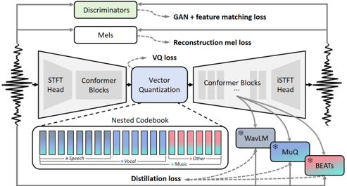

> [!abstract] arXiv · 2025 · Preprint
> **Yushen Chen et al.** (Shanghai Jiao Tong University, Tencent Hunyuan, Peking University) · [→ Paper](https://arxiv.org/abs/2509.21968) · Demo: ✓ · Code: ✓
>
> Introduces a single-codebook neural audio codec that unifies speech, vocal, music, and general sound reconstruction at roughly 700 bps using a domain-nested "matryoshka" codebook and single-stage multi-domain distillation.

## Problem

Neural audio codecs built on residual vector quantization (RVQ) push reconstruction fidelity but produce long, multi-layer token sequences that complicate autoregressive generation. Single-layer quantizer codecs (e.g. BigCodec, WavTokenizer) address this for speech alone, and semantic-distillation codecs (SpeechTokenizer, Mimi) inject linguistic information into acoustic tokens, but almost all of this work is domain-specific to speech. The one prior attempt at a unified single-codebook codec across speech, vocal, music, and sound, UniCodec, relies on a rigid-split codebook, a domain-aware mixture-of-experts encoder, and a complex multi-stage training pipeline; it also cannot handle audio segments that mix domains at inference time and exhibits audible over-smoothing and aliasing artifacts. The paper asks whether a single codebook can serve genuinely mixed-domain 16 kHz audio, in one training stage, without a rigid domain-routing mechanism.

## Method

AUV follows the standard encoder-quantizer-decoder acoustic codec recipe (as in EnCodec and DAC), but replaces the usual convolutional or transformer backbone with conformer blocks operating on STFT features rather than waveform or mel input, using an STFT head at the input and an iSTFT head to resynthesize the waveform at the output. This removes the need for learned up/downsampling modules since the token rate matches the STFT hop length (50 Hz here). More decoder layers than encoder layers are used (12 vs. 8), motivated by the empirical finding that scaling the decoder, not the encoder, is what improves reconstruction. Training combines the standard VQ-GAN losses used in BigCodec (quantizer loss, mel loss, adversarial loss, feature-matching loss) with a multi-period discriminator and a multi-scale STFT discriminator, adopting the FFT-size configuration introduced by Stable-Codec to reduce periodic spectral artifacts.

The core architectural contribution is the nested ("matryoshka") codebook. A single codebook of 16,384 (or, in the scaled-data setting, 20,480) entries is partitioned into four overlapping index ranges: speech is the smallest, most nested range; vocal (singing without accompaniment) is a superset of speech; music is a superset of vocal; and non-human sound occupies the remaining disjoint range. During training the input's domain label is provided so the model can learn to place semantically dense information into progressively larger nested partitions, but at inference time the model receives no domain label and must select codebook entries from the full space unaided. This nested prior is contrasted against a "no-split" (whole codebook, no structure) and a "rigid-split" (UniCodec-style, mutually exclusive partitions) baseline in ablation.

The second component is multi-domain semantic distillation: a learner head attached to the 6th layer of the AUV decoder is trained to match, via a combined L1 and cosine-similarity loss, the frame-level hidden representations of frozen domain teacher models — WavLM (layers 13–24) for speech, MuQ (layers 5–10) for vocal and music, and BEATs (all layers) for music and non-human sound. Unlike prior single-domain distillation approaches (SpeechTokenizer, Mimi), this applies distillation signals from three different self-supervised teacher families simultaneously within one codec.

AUV is trained on roughly 120,000 hours of mixed-domain audio (95K-hour Emilia and LibriTTS for speech, ~20K in-house hours for vocal/music, and a filtered AudioSet subset for other sound) in a single training stage, contrasting with UniCodec's three-stage pipeline. Model size in total parameters is not reported; the conformer blocks use a hidden size of 512 with an FFN multiplier of 4.

## Key Results

On LibriSpeech test-clean speech reconstruction (Table 1), AUV (20,480-entry codebook, 50 Hz token rate) reaches WER 3.64, STOI 0.91, PESQ-WB 2.40, SPK-SIM 0.81, and UTMOS 4.09 — comparable to, though not uniformly better than, domain-specific single-layer codecs such as BigCodec, X-codec2, and MagiCodec, and modestly ahead of the closest unified-codec baseline, UniCodec (WER 3.78, PESQ-WB 2.65, SPK-SIM 0.81). On the non-speech domains (Table 2, Audiobox Aesthetics scores), AUV comprehensively outperforms UniCodec on both a vocal test set and AudioSet eval across all four aesthetic axes (e.g. Content Enjoyment 5.90 vs. 5.06 on vocal). Qualitatively, the paper reports that UniCodec's rigid-split codebook produces perceptible artifacts, over-smoothing, and aliasing on mixed-domain and non-speech audio (Fig. 2), which AUV avoids.

The downstream generative capacity test (§4.3, Table 4) trains an autoregressive TTS model (EmoVoice) on AUV tokens versus tokens from BigCodec, X-codec2, and UniCodec, evaluating on a LibriSpeech-PC split derived from F5-TTS. AUV-token-trained models achieve markedly lower WER (4.51–4.89 vs. 12.79–17.52 for the codec baselines) and higher UTMOS, though speaker similarity remains modest (SPK-SIM ≈ 0.43–0.44) and roughly on par with the baselines rather than clearly ahead. Ablations (Table 3) isolate the individual gains: nested codebook alone improves WER from 4.30 (no-split) / 4.21 (rigid-split) to 3.99; adding multi-domain distillation improves it further to 4.05 reconstruction WER and materially better downstream generation WER; and scaling training data from 3K to 120K hours yields the largest single jump (WER 4.00 → 3.64). A training attempt using MagiCodec-extracted codes (131,072-entry codebook) reportedly failed, attributed to the larger codebook's higher downstream modeling burden.

## Novelty Assessment

The contribution is architectural: the nested/matryoshka codebook is a genuinely new way to structure a shared vector-quantization space across overlapping audio domains, and the paper provides a direct ablation (no-split vs. rigid-split vs. nested) and codebook-usage statistics that support its central claim that domains are hierarchically related rather than disjoint. The conformer-plus-STFT backbone choice is itself incremental (Vocos and Conformer are both prior components combined here), and the distillation mechanism follows an established recipe (SpeechTokenizer, Mimi) extended to three teacher families instead of one. Comparisons are made primarily against one direct competitor (UniCodec) and general single-layer speech codecs; the paper is honest that AUV does not clearly surpass all domain-specific SOTA codecs in raw reconstruction metrics, framing its advantage instead as competitive reconstruction plus single-stage training, mixed-domain robustness, and reduced artifacts. As an ICASSP 2026 submission at preprint stage, the evaluation, while multi-faceted, still relies on a fairly small ablation dataset (3K hours) for most controlled comparisons, with the full 120K-hour run reported only for the final configuration.

## Field Significance

Moderate — this paper offers a concrete architectural refinement to the small but growing niche of unified, domain-general single-codebook audio codecs, directly addressing the multi-stage training complexity and mixed-domain artifacts of the one existing unified competitor (UniCodec). The nested codebook design and its associated index-distribution analysis provide a re-usable structural idea (overlapping rather than disjoint domain partitions) that could inform future work on shared audio tokenizers, though the paper's own evaluation is limited to comparisons against a single direct unified-codec baseline plus a handful of domain-specific speech codecs.

## Claims

- **supports:** A shared single codebook can be structured with overlapping, nested domain partitions rather than rigid disjoint splits, improving both reconstruction and downstream generation quality relative to a rigid-split design.
  > *Evidence:* Ablating codebook design at fixed codebook size and data scale, the nested codebook reduces reconstruction WER from 4.21 (rigid-split) to 3.99 and downstream TTS generation WER from 6.26 to 4.99 on LibriSpeech-PC test-clean. *(§4.4, Tables 3–4)*
- **supports:** Distilling frame-level representations from multiple domain-specific self-supervised teacher models into one acoustic codec can improve reconstruction and generation quality across all the covered domains simultaneously, not just the domain of a single teacher.
  > *Evidence:* Adding multi-domain distillation (WavLM for speech, MuQ for vocal/music, BEATs for sound) on top of the nested codebook further raises the speech-partition code-usage ratio from 37.1% to 38.2% and improves downstream TTS generation WER from 4.99 to 4.51. *(§3.3, §4.4, Tables 3–4)*
- **complicates:** Unifying multiple audio domains into a single, shared quantization codebook does not close the gap with domain-specific single-layer codecs on every reconstruction metric, even when the unified model uses a larger codebook and lower token rate.
  > *Evidence:* On LibriSpeech test-clean, AUV's PESQ-WB (2.40) and SPK-SIM (0.81) trail dedicated speech codecs such as DAC (4.01, 0.95) and are roughly on par with, not clearly better than, BigCodec and UniCodec. *(§4.2, Table 1)*
- **complicates:** Larger unified codebooks intended to accommodate more audio domains can hurt downstream autoregressive generation quality by increasing the modeling burden on the generative model consuming the tokens, even when reconstruction quality is unaffected.
  > *Evidence:* Scaling the codebook from 16,384 to 20,480 entries (C0 vs. C2) yields slightly worse downstream generation WER (4.51 vs. 4.89) despite improved reconstruction metrics; training an autoregressive model on codes from a still-larger 131,072-entry codebook (MagiCodec) reportedly failed outright. *(§4.3, Table 4)*

## Limitations and Open Questions

The paper reports no total parameter count for the AUV encoder-decoder, limiting direct efficiency comparison with baselines whose sizes are known. Downstream generative evaluation is restricted to a single autoregressive TTS backbone (EmoVoice) trained on a comparatively small 1K-hour subset of LibriSpeech, so it is unclear whether the reconstruction and generation gains hold at larger downstream training scales or with non-autoregressive generators. Speaker similarity in the downstream TTS setting remains low in absolute terms (SPK-SIM ≈ 0.43–0.44) across all codecs tested, including AUV, suggesting the codec-level improvements shown here do not yet translate into strong speaker fidelity for generated speech. The domain-label input used during training but withheld at inference creates a train/inference mismatch whose effect on codebook index selection is only indirectly probed via the reported index-distribution statistics, not directly ablated.

## Wiki Connections

- [[neural-codec|Neural Audio Codec]] — proposes a single-codebook neural codec unifying speech, vocal, music, and sound reconstruction, extending the single-layer quantizer line of work to mixed audio domains.
- [[gan-vocoder|GAN Vocoder]] — trains its encoder-decoder with a VQ-GAN objective (multi-period and multi-scale STFT discriminators, adversarial and feature-matching losses) following the BigCodec recipe.
- [[self-supervised-speech|Self-Supervised Speech]] — distills frame-level representations from frozen self-supervised teacher models (WavLM, MuQ, BEATs) directly into the codec's decoder as a core training signal.
- [[autoregressive-codec-tts|Autoregressive Codec TTS]] — validates its tokens' usability for autoregressive TTS by training an existing AR TTS model on AUV codes and comparing generation WER against tokens from other codecs.
- [[evaluation-metrics|Evaluation Metrics]] — reports a broad set of objective reconstruction metrics (WER, STOI, PESQ, SPK-SIM, UTMOS, Audiobox Aesthetics) across speech, vocal, music, and sound domains.
- [[2025.acl-long.937|UniCodec]] — the paper's primary unified-codec baseline, whose rigid-split codebook and three-stage training AUV directly targets and compares against throughout.
- [[2409.05377|BigCodec]] — AUV's base loss functions and adversarial training setup follow BigCodec's recipe, and BigCodec also serves as a domain-specific reconstruction and downstream-generation baseline.
- [[2410.00037|Moshi (Mimi)]] — Mimi's encoder-decoder is used as a direct architectural comparison point to demonstrate the benefit of AUV's conformer-STFT backbone design.
- [[2411.19842|Stable-Codec]] — AUV adopts Stable-Codec's multi-scale STFT discriminator FFT-size configuration to reduce periodic spectral artifacts.
- [[2308.16692|SpeechTokenizer]] — cited as a precedent for single-domain semantic distillation into acoustic codec tokens, which AUV extends to multiple simultaneous domain teachers.
- [[2408.16532|WavTokenizer]] — the earlier single-codebook codec whose whole-codebook design UniCodec (and by extension AUV) is positioned against.
- [[2025.acl-long.313|F5-TTS]] — its LibriSpeech split is used to derive the test set for AUV's zero-shot TTS downstream generation evaluation.
- [[2504.12867|EmoVoice]] — used as the autoregressive TTS model trained on top of AUV and baseline codec tokens to evaluate downstream generative capacity.
