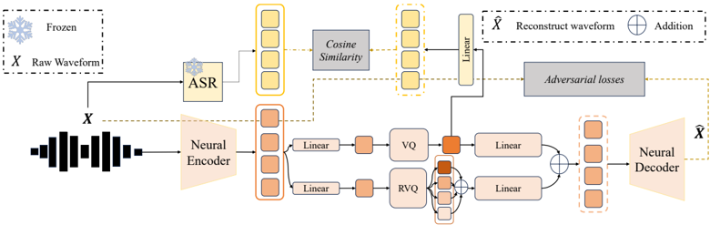
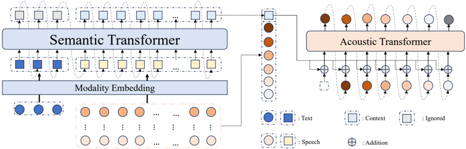

> [!abstract] arXiv · 2025 · Preprint
> **Junjie Cao et al.** (AMAP Speech, Tsinghua University) · [→ Paper](https://arxiv.org/abs/2509.22062) · Demo: ✗ · Code: ✗
>
> Splits comprehension from acoustic rendering into two autoregressive Transformers built on a semantically-distilled split-RVQ codec, and adds a test-time parallel-inference correction step for zero-shot TTS.

## Problem

Single-codebook semantic tokenizers (typically SSL-derived) are easy for a language model to learn but lose fine acoustic detail; multi-codebook RVQ acoustic tokenizers preserve reconstruction fidelity but lack explicit linguistic structure, forcing the downstream language model to learn the text-to-acoustics mapping from scratch. Prior semantic-distillation codecs (SpeechTokenizer, Mimi) distill from self-supervised speech models, and Mimi in particular reports that forcing semantic structure into the residual codebook trades off reconstruction quality. Separately, standard autoregressive TTS models generate all acoustic tokens in a single pass that conflates text/speech "understanding" and acoustic "rendering," and are inherently prone to compounding error accumulation over long token sequences.

## Method

The paper proposes CaT-TTS, built on two components. First, S3Codec is a split-RVQ neural codec based on the DAC autoencoder architecture. Rather than distilling semantic structure from a self-supervised model, S3Codec distills from the encoder of a pretrained Whisper ASR model into a dedicated plain-VQ layer, with the remaining K-1 RVQ levels applied in parallel (not residually) to preserve acoustic detail. This "split" design follows Mimi's approach of separating the semantic codebook from the acoustic residual, but substitutes an ASR teacher for an SSL teacher. The codec runs at 24kHz, 12.5Hz frame rate, 8 codebooks of 4096 entries each (~1.2kbps), and is trained with a GAN-based reconstruction objective (multi-period and multi-resolution STFT discriminators, multi-scale mel L1 loss) plus a cosine-distance semantic distillation loss against projected Whisper embeddings.

Second, CaT-TTS uses an "Understand-then-Generate" dual-Transformer architecture. A decoder-only Semantic Transformer (1536-dim, 12 layers) takes the text prompt and the semantic codes of the audio prompt and autoregressively models a high-level plan: instead of predicting discrete token IDs with cross-entropy, it predicts continuous next-frame semantic embeddings under an MSE objective, formed by summing the K codebook channels at each frame. A decoder-only Acoustic Transformer (1024-dim, 8 layers) conditions on this plan and autoregressively generates the hierarchical RVQ tokens coarse-to-fine. The two modules are trained jointly under a combined MSE (semantic) + cross-entropy (acoustic) objective.

At inference, the paper adds Masked Audio Parallel Inference (MAPI), inspired by classifier-free guidance and parallel scaling laws: the input sequence is duplicated into P streams, each masked differently at the attention level, and the P outputs are combined with softmax-normalized weights predicted by a small MLP, rather than fixed averaging. The system trains on a ~200k-hour proprietary corpus (~85% Chinese, ~15% English) using AdamW with 20K warm-up steps on 8 H20 GPUs, with the parallel-stream count set to 4 at inference.

## Key Results

On Seed-TTS-eval, CaT-TTS (0.4B total) reports WER of 1.56% (test-zh), 2.35% (test-en), and 9.75% (test-hard), and is competitive with or better than other "pure AR" baselines (VALL-E, Q-TTS, Llasa-1B/3B/8B) despite being smaller than the largest Llasa variant. Against hybrid AR+flow-matching systems (Seed-TTS, CosyVoice 2/3, F5-TTS) CaT-TTS's WER is comparable but its speaker similarity (SIM 0.668-0.678) trails those systems (SIM 0.71-0.80), a gap the authors attribute to the absence of an explicit continuous acoustic-feature (e.g., mel-spectrogram or speaker-similarity-vector) conditioning stage. On the harder PGC-Hard/PGC-Poly out-of-domain test sets, CaT-TTS outperforms VALL-E, Q-TTS, and a self-implemented Llama+flow-matching CosyVoice reproduction on WER and UTMOS.

An ablation removing the semantic distillation loss (training on a smaller sub-dataset) raises WER from 3.31% to 3.97% on SeedTTS-test, 9.74% to 11.83% on PGC-Hard, and 16.57% to 18.34% on PGC-Poly, with SIM and UTMOS also dropping. A separate small-model comparison shows S3Codec-based training yields lower WER (3.30% SeedTTS-test) than an otherwise identical setup using plain DAC (4.21%). For the codec alone, S3Codec is reported as comparable to high-bitrate Encodec/DAC-8 on PESQ/STOI at a much lower frame rate (12.5Hz vs. 75Hz) and bitrate (~1.2kbps), and higher SIM than Mimi, MBCodec, and SpeechTokenizer at matched codebook counts.

## Novelty Assessment

The contribution is architectural rather than a data-scale or engineering-integration story. S3Codec's split-RVQ-with-semantic-distillation design directly follows Mimi and SpeechTokenizer, with the specific novelty being the choice of an ASR (Whisper) teacher instead of an SSL teacher; the paper provides a direct ablation (S3Codec vs. DAC-based training) supporting that this substitution helps, but does not isolate whether an SSL-teacher variant of the same split design would perform similarly. The "Understand-then-Generate" dual-Transformer split, and the continuous-embedding-prediction objective for the Semantic Transformer, are the paper's most distinctive architectural ideas, though the underlying two-stage AR+AR pattern (coarse semantic prediction followed by acoustic token generation) is structurally similar to existing two-stage codec-LM systems (VALL-E, Q-TTS, CosyVoice), differing mainly in how the intermediate representation is modeled (continuous MSE-predicted embeddings rather than discrete tokens or a separate NAR/flow-matching stage). MAPI is a lightweight test-time ensembling technique with a plausible but self-reported evaluation only on a small model and small held-out subsets.

## Field Significance

Moderate — the paper offers a reasoned incremental refinement to split-RVQ semantic-acoustic codec design and demonstrates that a fully autoregressive, decoupled comprehension/rendering architecture can match "pure AR" competitors on WER without a flow-matching or NAR acoustic stage. Its clearest empirical contribution is the ablation showing that ASR-based semantic distillation into the codec's primary codebook measurably improves downstream TTS intelligibility, providing one data point on codec design choices for autoregressive speech LMs.

## Claims

- **supports:** Injecting explicit linguistic structure into the primary codebook of a neural speech codec reduces the downstream language model's learning burden and improves synthesis intelligibility.
  > *Evidence:* Removing the semantic distillation loss during codec-conditioned TTS training raises WER from 3.31% to 3.97% on SeedTTS-test, 9.74% to 11.83% on PGC-Hard, and 16.57% to 18.34% on PGC-Poly, with SIM and UTMOS also degrading. *(§4.3, Table 4)*
- **supports:** An automatic speech recognition model can serve as an effective semantic teacher for codec distillation, as an alternative to self-supervised speech representation models.
  > *Evidence:* S3Codec distills Whisper encoder embeddings (rather than HuBERT/SSL features) into the first RVQ level; a small model trained with S3Codec reaches 3.30% WER on SeedTTS-test vs. 4.21% for an otherwise identical model using undistilled DAC tokens. *(§E.2, Table 5)*
- **complicates:** Fully autoregressive TTS systems that omit an explicit continuous acoustic-feature conditioning stage (e.g., mel-spectrogram or speaker-similarity-vector guidance) tend to underperform hybrid AR+NAR or flow-matching systems on speaker similarity even when intelligibility is competitive.
  > *Evidence:* CaT-TTS reports SIM of 0.668-0.678 across test sets versus 0.71-0.80 for Seed-TTS, CosyVoice 2/3, and F5-TTS, despite comparable or better WER among AR-only baselines. *(§4.2, Table 2-3)*
- **refines:** Test-time parallel decoding with learned, input-dependent aggregation weights can reduce autoregressive error accumulation at near-zero added latency, but the achievable robustness gain is bounded by how many parallel streams are used, trading GPU utilization against benefit.
  > *Evidence:* MAPI ablation across increasing parallel-stream counts shows WER improving and becoming more stable across 10 repeated inferences per sample, while the authors note GPU resource utilization rises correspondingly and stream count must be tuned per deployment scenario. *(§4.3, §3.3, Figure 3-4)*

## Limitations and Open Questions

> [!warning]
> Training relies on an unreleased proprietary corpus (~200k hours, ~85% Chinese / ~15% English), and neither code nor a demo is available, which limits independent verification of the reported results.

The semantic-distillation ablation (removing the loss) and the MAPI ablation are both run on smaller sub-datasets and reduced-size "CaT-TTS-small" models rather than the full 0.4B system, so it is not established that the same magnitude of gains transfers to the full-scale model. Speaker similarity remains a clear weak point relative to hybrid and NAR baselines, which the authors attribute to the deliberate absence of continuous acoustic conditioning rather than treat as a target for improvement. The evaluation is also dominated by Chinese-language and Chinese-out-of-domain test sets (PGC-Hard, PGC-Poly, Seed-TTS test-zh/test-hard), with comparatively less English-language evidence.

## Wiki Connections

- [[autoregressive-codec-tts|Autoregressive Codec TTS]] — proposes a dual-stage AR+AR architecture (semantic planning then acoustic rendering) as an alternative to single-stage codec-LM or AR+NAR/flow-matching pipelines.
- [[neural-codec|Neural Audio Codec]] — introduces S3Codec, a split-RVQ codec that distills ASR (rather than SSL) semantic structure into its primary codebook while keeping acoustic residual levels separate.
- [[zero-shot-tts|Zero-Shot TTS]] — evaluates zero-shot voice cloning via audio-prompt conditioning across Seed-TTS and out-of-domain PGC benchmarks.
- [[multilingual-tts|Multilingual TTS]] — trains and evaluates on a mixed Chinese/English corpus with separate test-zh, test-en, and test-hard benchmarks.
- [[disentanglement|Disentanglement]] — the split-RVQ codec explicitly separates semantic (ASR-distilled) and acoustic (residual RVQ) information into distinct codebook spaces.
- [[2509.17006|MBCodec]] — used as one of the baseline codecs compared against S3Codec on reconstruction quality (SIM, PESQ, STOI, STFT/Mel distance).
