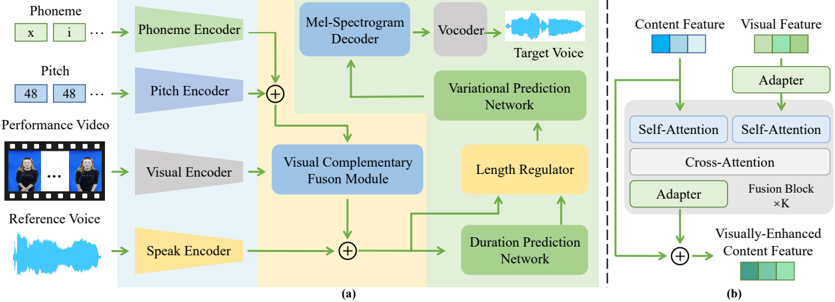

> [!abstract] arXiv · 2025 · Preprint
> **Ke Gu et al.** (Xiamen University) · [→ Paper](https://arxiv.org/abs/2509.22718) · Demo: ✗ · Code: ?
>
> Introduces duration-free singing voice synthesis by fusing synchronized lip-movement cues from performance video with text and pitch, removing the need for explicit phoneme-level duration inputs at inference.

## Problem

Singing voice synthesis (SVS) systems typically require fine-grained, phoneme-level duration inputs (either predicted from a score or supplied manually) before synthesis can proceed. This duration dependency raises the barrier to practical use, since accurate phoneme-level durations are expensive to produce and are unavailable in casual, performance-driven use cases. Prior SVS work (HiFiSinger, DiffSinger, VISinger2, StyleSinger, Prompt-Singer, ExpressiveSinger) has focused on improving audio fidelity, style transfer, and natural-language controllability, but has consistently relied on text and reference audio alone, overlooking a complementary signal available whenever a singer performs on camera: synchronized lip movement, which is correlated with phoneme timing and can substitute for explicit duration annotation.

## Method

The paper formulates a new task: given a silent video of a singer, a reference audio clip (for timbre), a lyric sequence, and an aligned pitch sequence, generate target singing audio that is lip-synchronized, matches the lyrics and pitch contour, and preserves the reference timbre, without any explicit duration sequence as input.

PerformSinger addresses this task with a pipeline of parallel multi-branch multimodal encoders, a fusion module, prediction networks, a mel-spectrogram decoder, and a vocoder. A FastSpeech2-style phoneme encoder and a pitch embedding layer jointly produce a content feature; a d-vector speaker encoder extracts a timbre embedding from the reference audio; and a pretrained lip-reading encoder (3D convolution plus an 18-layer ResNet) extracts visual features from a cropped mouth-region video sequence. The core architectural contribution is the Visual Complementary Fusion Module (VCFM), which first aligns the visual features to the content feature's semantic space via an adapter (up-projection, GELU, down-projection), then progressively injects visual information into the content feature through a stack of K fusion blocks, each combining self-attention on both streams with cross-attention (content as query, visual as key/value) followed by LayerNorm and the adapter, with a residual connection.

The visually-enriched content feature then drives a FastSpeech2-style duration predictor (replacing the need for externally supplied durations) and a Length Regulator, followed by a diffusion-based pitch/voicing predictor and a residual-vector-quantization-based style extractor (following StyleSinger) for frame-level variational features. A DiffSinger-style diffusion decoder converts the fused representation into an 80-bin mel-spectrogram (48 kHz, 1024 FFT, 256 hop), which HiFi-GAN converts to waveform. Training uses a composite loss combining mel reconstruction, duration, pitch, and quantization terms, and follows a two-stage schedule: stage one trains the phoneme/pitch encoders, prediction networks, and decoder on audio-text-pitch data alone; stage two introduces the (frozen) visual encoder and the VCFM module and jointly fine-tunes the remaining components. Model size is not reported in the paper.

To support the task, the authors construct VisualSinger, a dataset of synchronized audio-video singing performances (9 singers, 69 songs, 1,248 utterances, ~3.07 hours) built from a Chinese subset of the URSing dataset plus web-collected performance videos, with phoneme boundaries obtained via Montreal Forced Aligner and manually corrected, and pitch extracted via Parselmouth and refined with ROSVOT.

## Key Results

On the VisualSinger test set (Setting 1: same-voice reference), PerformSinger achieves the best score on every reported objective metric: MCD 3.1125, F0 Frame Error 0.3921, singer cosine similarity (COS) 0.9206, LSE-C 1.4270, and LSE-D 10.2782, all improving on the strongest baseline, StyleSinger adapted to a duration-free setting (MCD 3.358, FFE 0.4494, COS 0.9141, LSE-C 1.3057, LSE-D 10.4129). Subjective MOS scores (audio quality, pitch naturalness, timbre similarity, audio-video synchronization) also favor PerformSinger across all four dimensions and across all four evaluation settings (same voice, another voice of the same singer, different singer, unseen singer), though the margins over StyleSinger are consistently small (roughly 0.05–0.2 MOS points).

A second visual-dubbing baseline, HPMDubbing (and a pitch-augmented variant, HPMDubbing-P), performs far worse across the board (MOS-Q around 1.45–1.46 vs. 3.71 for PerformSinger), which the authors attribute to HPMDubbing's design for movie dubbing rather than the pitch-dynamic demands of singing. Ablations show that the proposed VCFM fusion strategy clearly outperforms an alternative stepwise monotonic attention fusion mechanism, and that the two-stage training schedule outperforms single-stage training on every metric.

All comparisons are run on the authors' own VisualSinger dataset; no external or third-party benchmark is used, and the closest competitor (StyleSinger) had to be adapted from its native reference-audio-only setting to remove duration inputs for a fair comparison.

## Novelty Assessment

The genuine architectural contribution is the Visual Complementary Fusion Module, a progressive attention-based mechanism for injecting lip-cue features into a text/pitch content representation to eliminate the need for explicit phoneme-level durations. This module and the broader duration-free multimodal SVS formulation are new to singing voice synthesis, though the individual components it composes (FastSpeech2-style predictors, a DiffSinger-style diffusion decoder, a pretrained lip-reading encoder, HiFi-GAN vocoding, RVQ-based style extraction from StyleSinger) are all established techniques drawn from adjacent work. The paper's second contribution, the VisualSinger dataset, is arguably the more durable output: it is the first audio-visual SVS dataset with phoneme-level annotation, and future multimodal SVS work will likely need a dataset of this kind regardless of which fusion architecture is used. The evaluation is confined entirely to a small, self-constructed dataset (9 singers, ~3 hours, Chinese only) with one adapted baseline and one purpose-built baseline, so the claimed "state-of-the-art" performance is not benchmarked against the wider SVS literature on any shared, external test set.

## Field Significance

Moderate — this paper opens a new sub-problem within singing voice synthesis (video-conditioned, duration-free synthesis) and contributes both a fusion mechanism and a first-of-its-kind annotated audio-visual dataset that lowers the barrier for follow-up work in this direction. Its evidence, however, is limited to a single small in-house dataset and two baselines, so the result is best read as a proof of concept for the task rather than a broadly validated advance.

## Claims

- **supports:** Synchronized visual cues from a speaker's or singer's mouth region can substitute for explicit phoneme-level duration annotations in duration-based speech and singing synthesis pipelines.
  > *Evidence:* Replacing externally supplied phoneme durations with a duration predictor conditioned on lip-cue-fused content features (via VCFM) allows the duration predictor and Length Regulator to operate without duration inputs at inference, while achieving lower MCD and FFE than a duration-free StyleSinger baseline that has no visual input. *(§3.5, §5.1, Table 1)*
- **complicates:** Fusion mechanisms designed for one cross-modal alignment problem do not transfer directly to singing, because singing's rhythmic and prosodic complexity differs from speech.
  > *Evidence:* Adopting StyleDubber's Stepwise Monotonic Multi-head Attention (originally designed for movie-dubbing lip-speech alignment) for textual-visual fusion in this SVS setting produced worse MCD, COS, and LSE-D than the no-visual baseline, whereas the proposed VCFM improved on the same baseline across all metrics. *(§5.2, Table 3)*
- **supports:** Staged training that first establishes a strong acoustic model before introducing an auxiliary modality improves quality over jointly training all components from the start.
  > *Evidence:* The two-stage schedule (stage one trains phoneme/pitch encoders and decoder; stage two adds the frozen visual encoder and VCFM) outperforms single-stage training on every objective metric (MCD 3.1125 vs. 3.1307, FFE 0.3921 vs. 0.4022, COS 0.9206 vs. 0.9195, LSE-C 1.4270 vs. 1.3888, LSE-D 10.2782 vs. 10.3146). *(§5.2, Table 3)*
- **complicates:** Visual dubbing architectures built for spoken dialogue do not generalize to singing without substantial adaptation, even when augmented with pitch information.
  > *Evidence:* HPMDubbing, a lip-synchronized speech dubbing model, and its pitch-augmented variant HPMDubbing-P both perform far below SVS-specific baselines on every metric (e.g., MOS-Q of 1.45–1.46 vs. 3.54–3.71 for singing-specific systems), despite HPMDubbing-P adding phoneme-level pitch as input. *(§4.1, §5.1, Table 1)*

## Limitations and Open Questions

> [!warning]
> All results are reported on a single self-constructed dataset (9 singers, 69 songs, ~3 hours, Chinese language only), evaluated against two baselines that were adapted from other tasks or settings rather than SVS systems natively designed for duration-free, multimodal input. There is no evaluation on an external or multi-lingual benchmark, so the generality of the reported gains beyond this dataset is untested.

The visual encoder is frozen during stage-two training rather than fine-tuned jointly with the rest of the pipeline, which may limit how well lip-cue features adapt to the singing domain specifically (the encoder was pretrained for general audio-visual speech tasks, not singing). The paper also does not report model parameter counts or inference latency, so the practical cost of adding a video branch relative to text-only SVS systems is not established. Manual TextGrid annotation required 40-45 human-hours per hour of audio, indicating that scaling VisualSinger-style datasets to more singers or languages will be labor-intensive.

## Wiki Connections

- [[singing|Singing Voice Synthesis]] — introduces a duration-free formulation of the singing voice synthesis task by using synchronized video lip cues as a substitute for explicit phoneme-level duration inputs.
- [[disentanglement|Disentanglement]] — the RVQ-based style extraction network (adopted from StyleSinger) separates timbre-independent style features from the reference audio to align with fused content features.
- [[prosody-control|Prosody Control]] — the diffusion-based pitch and voicing predictor generates frame-level F0 and voicing labels conditioned on the visually-enriched content representation, controlling pitch dynamics independently of the duration predictor.
- [[zero-shot-tts|Zero-Shot TTS]] — evaluates an unseen-singer setting in which timbre is transferred from a reference clip of a speaker not seen during training, following the zero-shot voice adaptation paradigm.
- [[speaker-adaptation|Speaker Adaptation]] — uses a d-vector speaker encoder to condition synthesis on a reference singer's timbre across four evaluation settings of increasing speaker mismatch.
