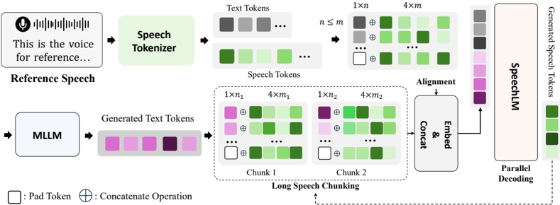

> [!abstract] arXiv · 2025 · Preprint
> **Chengyao Wang et al.** (CUHK, HKUST, SmartMore) · [→ Paper](https://arxiv.org/abs/2509.25131) · Demo: ✓ · Code: ✓
>
> Introduces an omni-modal LLM that decouples multimodal understanding from real-time speech generation into a "brain-mouth" dual-track architecture, using chunk-based parallel decoding to close the text-speech token-rate gap for long-horizon, timbre-stable zero-shot voice cloning.

## Problem

Omni-modal LLMs that fold audio understanding and speech generation into a single vision-centric backbone struggle with long-form audio: they cannot reliably process inputs beyond a few minutes, and cascaded or naively-extended TTS pipelines built on top of them accumulate alignment errors and lose timbre consistency as generated speech grows past a few dozen seconds. The root cause the paper identifies is a token-rate mismatch: at 25 Hz, a speech tokenizer produces far more tokens per second than the corresponding text stream, so as an utterance lengthens the correlation between text and speech tokens weakens, autoregressive decoding accumulates errors, and inference slows. Prior long-form TTS systems (MOSS-TTSD, Higgs-Audio-v2) and omni-LLMs (Qwen2.5-Omni) either do not target long-form generation directly or degrade sharply on it, and no existing benchmark systematically measures long-form TTS quality or complex-text handling (URLs, formulas, code-switching).

## Method

MGM-Omni separates the system into an MLLM ("brain") for multimodal reasoning and text generation, built on Qwen2.5-VL, and a SpeechLM ("mouth") for real-time speech synthesis, initialized from Qwen3 with a six-block randomly-initialized TTS-Adapter appended to convert text representations into speech representations. The MLLM consumes text, image, video, and audio and emits text tokens; the SpeechLM consumes those text tokens plus a personalized reference audio clip and autoregressively predicts discrete speech tokens from the CosyVoice2 FSQ tokenizer (25 Hz), which are converted to mel-spectrograms via the CosyVoice2 flow-matching model and rendered to waveform with a HiFi-GAN vocoder.

For audio understanding, a dual audio encoder (Qwen2-Audio, continually trained on Whisper-large-v3, plus Belle-Whisper-large-v3 for Chinese) produces complementary acoustic and semantic features that are fused via an information-mining cross-attention module inspired by Mini-Gemini, then trained with a two-stage pipeline (audio-to-text alignment, then unified omni-modal instruction tuning) and length-aware dynamic batching to support inputs beyond an hour.

For speech generation, Chunk-Based Parallel Decoding addresses the token-rate gap directly: the input text is split into chunks processed sequentially by the SpeechLM, with a four-text-token delay before speech token generation begins within each chunk (using padding tokens) so every speech token stays aligned to its corresponding text token while retaining prior text and speech as context. On top of this, Parallel Decoding extends the vocabulary so the model predicts a text token together with k speech tokens per step (k=4 in the final configuration), averaging their embeddings on input and using the TTS-Adapter plus a shared LM head to predict k speech tokens per step on output, a scheme the authors note is atypical for FSQ tokenizers (usually applied to RVQ tokenizers) but works well here.

Voice cloning is trained on roughly 300k hours of raw speech (Emilia, Libri-heavy, Common Voice, AISHELL series) plus about 100k hours of TTS-synthesized Chinese/English conversational speech (sourced from Belle-10M and Lamini-Instruct, text-refreshed with Qwen2.5-72B and synthesized with MegaTTS3), in a two-stage regime: pre-training freezes the Qwen3 backbone and trains only the TTS-Adapter for text-speech alignment, then post-training jointly fine-tunes the LLM and adapter (adapter learning rate 5x the LLM's) on high-fidelity synthesized speech.

## Key Results

On short-form zero-shot TTS (Seed-TTS-Eval), the largest SpeechLM variant (MGM-Omni-TTS-4B) reaches WER 2.22 / SIM 0.686 on English and CER 1.18 / SIM 0.758 on Chinese, edging out CosyVoice2, Qwen2.5-Omni, and Higgs-Audio-v2 across most metrics at comparable or smaller parameter counts (Table 5a). On the paper's own long-form benchmark, Long-TTS-Eval, the 2B model attains RTF 0.19, EN WER 4.98, and ZH CER 5.58 on standard text, and EN-hard WER 26.26 / ZH-hard CER 23.58 on complex text (URLs, formulas, numbers), each substantially better than CosyVoice2 (chunked), MOSS-TTSD-v0.5, and Higgs-Audio-v2, all of which show WER/CER above 27 and often above 60 on the hard split (Table 5b). Ablations show that removing chunk-based decoding raises long-form error rates past those of the concurrent baselines, and that parallel decoding trades a small quality drop for roughly 3x faster inference at k=4 (Table 6). On the understanding side, MGM-Omni matches or exceeds Qwen2.5-Omni on ASR (CommonVoice-ZH CER 4.0 vs. 5.2, AISHELL CER 1.8) and AIR-Bench audio QA, and its needle-in-the-haystack test shows it handling audio inputs up to 4,500 seconds where Qwen2.5-Omni degrades. The authors emphasize the model was trained on under 400k hours of audio versus the 1M-10M hours reported for concurrent long-form TTS systems.

## Novelty Assessment

The dual-track "brain-mouth" separation of understanding (MLLM) from generation (SpeechLM), the dual audio encoder with information mining, and the two-stage training recipe are largely direct extensions of the authors' own prior work (Lyra) and Mini-Gemini, combined with off-the-shelf components (Qwen2.5-VL, Qwen3, CosyVoice2's tokenizer and flow-matching model, HiFi-GAN). The genuinely new contribution is Chunk-Based Parallel Decoding: combining chunked, token-delayed text-speech alignment with multi-token parallel prediction on an FSQ tokenizer, which the paper explicitly notes is unusual (parallel decoding is typically paired with RVQ tokenizers). This mechanism is well-motivated by the token-rate analysis and the ablations support its contribution to both data efficiency and long-form robustness. The introduction of Long-TTS-Eval is a secondary but useful contribution, filling a real gap in existing TTS benchmarks that focus on short utterances and clean text. Overall the paper is best characterized as an engineering-integration system with one targeted architectural innovation (chunk-based parallel decoding) rather than a new paradigm; comparisons against concurrent long-form TTS baselines are reasonably fair in that error rates are reported on the same benchmark and evaluation pipeline the authors built.

## Field Significance

moderate: this paper provides a concrete, ablated solution to the text-speech token-rate mismatch that degrades long-form autoregressive TTS, and demonstrates it can outperform contemporaneous long-form systems while using substantially less training audio. It sits within a crowded, fast-moving cluster of concurrent omni-LLM speech systems (Qwen2.5-Omni, Higgs-Audio-v2, MOSS-TTSD) rather than establishing a new direction on its own, but its chunk-based parallel decoding scheme and the accompanying Long-TTS-Eval benchmark are reusable contributions for evaluating and improving long-horizon speech generation specifically.

## Claims

- **supports:** Chunking text into aligned segments with a short token-delay before speech decoding reduces error accumulation in long-form autoregressive speech generation.
  > *Evidence:* Removing chunk-based decoding raises Long-TTS-Eval error rates above those of concurrent long-form TTS baselines, and with it enabled MGM-Omni-TTS-2B achieves EN-hard WER 26.26 versus 42.48-98.61 for CosyVoice2, MOSS-TTSD-v0.5, and Higgs-Audio-v2. *(§4.2, Table 6)*
- **supports:** Multi-token parallel decoding is not restricted to RVQ speech tokenizers and can be applied effectively to finite scalar quantization (FSQ) tokenizers.
  > *Evidence:* Increasing parallel decoding size on the CosyVoice2 FSQ tokenizer maintains TTS quality on Seed-TTS-Eval while cutting inference RTF by roughly 3x at parallel size 4. *(§4.2, Table 6)*
- **complicates:** Increasing the parallel decoding size trades off synthesis error rate against inference speed rather than improving both simultaneously.
  > *Evidence:* Larger parallel sizes in the ablation slightly raise audio error rate even as they substantially accelerate inference, leading the authors to select a parallel size of 4 as a balance point. *(§4.2)*
- **refines:** Separating multimodal reasoning from speech synthesis into distinct model components can improve long-form audio understanding without sacrificing speech generation efficiency.
  > *Evidence:* The dual-track brain-mouth design lets the MLLM handle needle-in-the-haystack audio inputs up to 4,500 seconds while the SpeechLM independently achieves the lowest RTF among compared long-form TTS systems. *(§4.1.1, §4.1.3, Figure 5, Table 5b)*

## Limitations and Open Questions

The long-form evaluation itself is partly self-authored: Long-TTS-Eval is introduced by this paper, and while its construction and normalized-text scoring procedure are documented, results on it cannot yet be cross-checked against independent replications. The comparison in Table 5b is limited to three baseline systems, and the qualitative long-speech examples in the appendix (a classical Chinese poem and a code-switched English-Chinese poem) are illustrative rather than a systematic error analysis. The paper does not report results on emotion or prosody control, nor does it evaluate robustness to reference audio recorded in noisy or far-field conditions. The 32B MLLM variant's long-form and vision-speech results are mixed relative to the 7B variant (e.g., lower TextVQA-Speech and EN-hard performance context is not directly reported for 32B TTS), suggesting scaling benefits are not uniform across all sub-tasks.

## Wiki Connections

- [[spoken-language-model|Spoken Language Model]] — MGM-Omni's SpeechLM is an LLM (Qwen3) adapted to consume text and reference-audio tokens and autoregressively emit speech tokens, extending an LLM backbone into a speech-generating module.
- [[zero-shot-tts|Zero-Shot TTS]] — the system performs zero-shot voice cloning from a personalized reference audio clip without speaker-specific fine-tuning, evaluated on Seed-TTS-Eval.
- [[streaming-tts|Streaming TTS]] — chunk-based decoding and the chunk-aware CosyVoice2 flow-matching model together support low-latency, streaming speech generation.
- [[neural-codec|Neural Audio Codec]] — speech is represented via the CosyVoice2 FSQ speech tokenizer at 25 Hz, whose token rate directly motivates the paper's chunk-based parallel decoding design.
- [[autoregressive-codec-tts|Autoregressive Codec TTS]] — the SpeechLM autoregressively predicts discrete FSQ speech tokens conditioned on text and reference audio.
- [[multilingual-tts|Multilingual TTS]] — training and evaluation cover both Chinese and English, including code-switched long-form text.
- [[2412.10117|CosyVoice2]] — MGM-Omni directly reuses CosyVoice2's FSQ speech tokenizer and chunk-aware flow-matching model, and compares against it as a non-native long-TTS baseline extended via chunking.
- [[2406.02430|Seed-TTS]] — Seed-TTS-Eval is used as the short-form zero-shot TTS benchmark for WER/CER and speaker similarity comparisons.
- [[2503.20215|Qwen2.5-Omni]] — serves as the primary omni-LLM baseline for audio understanding, omni-modality understanding, and short-form speech generation comparisons.
- [[2505.09388|Qwen3]] — the SpeechLM is initialized from a pretrained Qwen3 language model with an appended TTS-Adapter.
- [[2210.02747|Flow Matching for Generative Modeling]] — the flow-matching formulation underlies the CosyVoice2 module MGM-Omni uses to convert speech tokens to mel-spectrograms.
- [[2010.05646|HiFi-GAN]] — used as the final vocoder that converts generated mel-spectrograms into waveform audio.
- [[2407.10759|Qwen2-Audio]] — forms the primary branch of the dual audio encoder used for audio understanding.
- [[2502.18924|MegaTTS 3]] — used to synthesize the TTS training data (Belle-10M and Lamini-Instruct conversations) that supplements the raw speech corpus.
