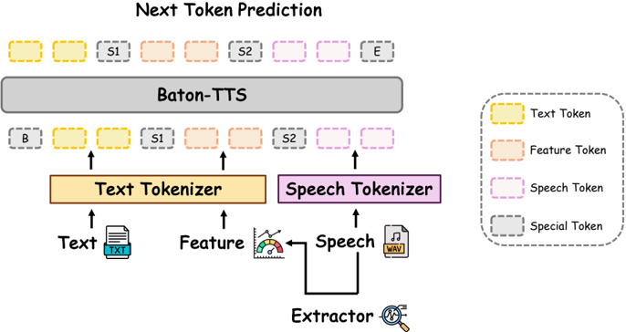

> [!abstract] arXiv · 2025 · Preprint
> **Yue Wang et al.** (Tencent) · [→ Paper](https://arxiv.org/abs/2509.26514) · Demo: ? · Code: ✓
>
> Decouples controllable speech synthesis into an LLM that translates instructions into explicit textual vocal features (pitch, energy, timbre) and a separate TTS model that renders those features into speech, avoiding the need for manually annotated instruction-speech pairs.

## Problem

Instruction-guided controllable TTS conventionally trains a model end-to-end to map free-form natural-language style instructions directly to speech, requiring large annotated corpora of instruction-speech pairs. Such annotation is expensive, suffers from low inter-annotator agreement, and caps the model's expressive range at whatever styles were labeled. The paper argues this approach also fails to fully exploit the linguistic intelligence already present in LLMs used as TTS backbones: LLMs are treated as opaque sequence generators rather than as reasoning systems capable of interpreting nuanced instructions.

## Method

BatonVoice reframes controllable TTS through an "operationalist" lens: instead of mapping instructions to speech directly, an LLM ("conductor") first interprets the instruction and text into a quantifiable, interpretable vocal plan, expressed as a JSON list of explicit vocal features (pitch mean and slope, energy RMS and slope, spectral centroid) computed per prosodically-stable segment. A separate TTS model, BatonTTS ("orchestra"), then renders speech conditioned on this textual plan and the input text.

BatonTTS follows a CosyVoice2-style design: an LLM backbone (Qwen3-1.7B or Qwen2.5-0.5B) autoregressively generates a sequence of text tokens, verbalized feature tokens, and discrete speech tokens; a frozen, pre-trained CosyVoice2 speech decoder (token encoder, conditional flow-matching model, HiFi-GAN vocoder) then converts the generated speech tokens into a mel spectrogram and waveform. Because the decoder is frozen, all training effort is spent teaching the LLM to control speech features through language.

Training proceeds in three stages. Stage 1 (Pre-Training) trains the LLM with a standard causal language-modeling objective on ~103K hours of speech-text pairs (VoxBox) to establish baseline text-to-speech-token generation. Stage 2 (SFT) fine-tunes on 377,619 utterances (>500 hours) where speech is reconstructed through the frozen decoder, vocal features are extracted from the reconstruction with the Parselmouth library over word-merged, duration-stable segments, and the model learns to generate speech tokens conditioned on text plus the verbalized feature plan. Stage 3 (Preference Optimization) constructs a preference dataset automatically: outputs from the Stage-1 model that fail WER or speaking-rate thresholds are labeled "rejected," while outputs from the Stage-2 SFT model that pass the same thresholds under the same vocal plan are labeled "chosen." The model is then optimized with Anchored Preference Optimization (APO-down), using the SFT model as reference policy, without any manually labeled expressive data. At inference, the external conductor LLM (Gemini 2.5 Pro in the main experiments) generates the vocal plan from the user's instruction and text; this plan and text are then passed to BatonTTS.

## Key Results

On the Seed-TTS English benchmark, BatonVoice-1.7B reaches 57.6% emotion classification accuracy (Gemini-2.5-Pro judge), beating the strongest closed-source baseline Minimax-2.5-HD (48.6%) by 9.0 points and CosyVoice2 (37.8%) by nearly 20 points, while holding WER to 2.5 (versus 1.5 for Minimax, 2.1 for CosyVoice2, 3.4 for CosyVoice). Notably, CosyVoice and CosyVoice2 use 556 and 1,500 hours of manually annotated instruction data respectively yet underperform BatonVoice's 57.6%, which uses zero hours of such annotation. Preference optimization contributes a consistent gain on top of SFT (52.2% → 57.6% emotion accuracy for the 1.7B model; 51.6% → 52.8% for 0.5B), and scaling the LLM backbone from 0.5B to 1.7B improves both accuracy (+4.8) and WER.

On a Chinese emotion benchmark, despite BatonTTS post-training being English-only, BatonVoice-1.7B reaches 56.2% accuracy, surpassing CosyVoice (52.0%, native/optimized for Chinese) and Minimax-2.5-Turbo (50.6%), demonstrating zero-shot cross-lingual transfer of the feature-control capability. A separate ablation shows synthesis quality tracks conductor LLM capability directly: swapping only the conductor (BatonTTS itself unchanged) from Qwen3-1.7B to Gemini-2.5-Pro raises emotion accuracy from 29.8% to 57.6%, with Qwen3-80B (39.8%) and Qwen3-Max (47.8%) falling monotonically in between.

Human evaluation on a free-form instruction-following test set (50 role-play instructions derived from Social IQa) tells a more mixed story: BatonVoice achieves only a 56% win rate against CosyVoice (roughly comparable) and a 30% win rate against Minimax-2.5-HD, with annotators citing weaker fluency and naturalness. A controlled feature-representation study on RAVDESS shows the numerical vocal-plan format achieves 1.54 Mel-Cepstral Distortion versus 2.62 for a caption-based qualitative description, and removing any single feature (pitch, energy, or spectral centroid) degrades reconstruction fidelity.

## Novelty Assessment

The individual components are not new: the LLM-backbone-plus-frozen-codec-decoder architecture is adapted directly from CosyVoice2, and Anchored Preference Optimization is an existing alignment technique. The genuinely new contribution is the operationalist reframing itself (decoupling instruction *understanding*, handled by a general-purpose, swappable LLM, from feature *rendering*, handled by a specialized TTS model trained only on English), together with a training pipeline whose preference data is constructed entirely from automatic, objective quality heuristics (WER, speaking rate) rather than manually annotated instruction-speech pairs or human preference labels. The demonstration that swapping the conductor LLM alone, without touching BatonTTS, changes emotion accuracy by nearly 30 points is the paper's strongest evidence that this decoupling has real architectural value, not just training-recipe value. The claimed zero-shot cross-lingual generalization is also a meaningful empirical finding, though it should be read alongside the human evaluation results, which show the approach still trails a top commercial system on perceived naturalness despite winning on the automated emotion-accuracy metric.

## Field Significance

> [!tip]
> High: introduces a general "objectify-into-text" decoupling paradigm for controllable TTS that removes the dependency on annotated instruction-speech corpora and demonstrates that synthesis quality scales directly with the linguistic intelligence of an external, swappable LLM, without retraining the speech-generation model itself.

The paper demonstrates a concrete mechanism (explicit, quantifiable vocal features as an intermediate representation) by which a TTS system can benefit from stronger general-purpose LLMs at inference time without any TTS-specific retraining, and shows this transfers zero-shot to an unseen language despite English-only post-training. Both results point toward controllable TTS architectures that are decoupled from any single instruction-following model's capability ceiling.

## Claims

- **supports:** Decoupling instruction interpretation from speech rendering, via an explicit intermediate textual feature representation, can match or exceed instruction-annotated controllable TTS systems without requiring any manually labeled instruction-speech data.
  > *Evidence:* BatonVoice-1.7B reaches 57.6% emotion accuracy using 0 hours of manual instruction annotation, exceeding CosyVoice (43.8%, 556 hours) and CosyVoice2 (37.8%, 1,500 hours) on the same Seed-TTS-derived English emotion benchmark. *(§3.2, Table 1)*
- **supports:** When conditioning signals are represented as explicit text rather than learned embeddings, a downstream generation model can gain synthesis quality from a stronger upstream language model without any retraining of the generation model itself.
  > *Evidence:* Holding BatonTTS fixed and only changing the external "conductor" LLM that produces the vocal plan, emotion accuracy rises monotonically from 29.8% (Qwen3-1.7B) through 39.8% (Qwen3-80B) and 47.8% (Qwen3-Max) to 57.6% (Gemini-2.5-Pro). *(§3.5, Figure 3b)*
- **complicates:** Automatic emotion-classification accuracy and human-judged naturalness can diverge, so strong performance on an LLM-judged style-control metric does not guarantee a favorable human preference outcome against commercial systems.
  > *Evidence:* On a free-form instruction-following test set judged by trained human annotators, BatonVoice wins only 56% of comparisons against CosyVoice and just 30% against Minimax-2.5-HD, with annotators specifically citing weaker fluency and naturalness. *(§3.3, Table 2)*
- **refines:** Numerical, structured representations of prosodic control targets transfer more precisely to a conditioned TTS decoder than free-text qualitative descriptions of the same target style.
  > *Evidence:* On a RAVDESS reconstruction task, the structured numerical vocal-plan format achieves 1.54 Mel-Cepstral Distortion versus 2.62 for an equivalent caption-based qualitative description, and ablating any single numerical feature (pitch, energy, or spectral centroid) increases MCD. *(§B.2, Table 5)*

## Limitations and Open Questions

The paper's headline emotion-control results across both English and Chinese benchmarks rely entirely on an LLM (Gemini-2.5-Pro) as an automatic judge rather than human raters; the one benchmark that does use human evaluation shows BatonVoice losing to the top closed-source baseline on naturalness and fluency (30% win rate against Minimax-2.5-HD), a gap not visible in the automated emotion-accuracy metric.

The vocal-plan representation is limited to pitch, energy, and spectral centroid; the authors note that finer-grained paralinguistic features such as emphatic stress and non-verbal vocalizations are not captured and are left to future work. Best reported results depend on using a large, capable, and likely costly external LLM (Gemini 2.5 Pro) as the conductor at inference time; using the in-house model of the same size as the orchestra as its own conductor (Qwen3-1.7B, 29.8% accuracy) performs far worse, so the practical quality of the system is bottlenecked by conductor access and cost, not by BatonTTS alone. Cross-lingual generalization is demonstrated on one unseen language (Chinese) with instructions and text machine-translated by the same LLM family used for judging, which leaves open how the approach performs on languages more typologically distant from English or evaluated independently of the conductor/judge model.

## Wiki Connections

- [[instruction-conditioned-tts|Instruction-Conditioned TTS]] — reframes instruction-guided control as translating free-form instructions into an explicit, quantifiable vocal-feature plan rather than training an end-to-end instruction-to-speech mapping.
- [[emotion-synthesis|Emotion Synthesis]] — targets emotional expressiveness as its primary evaluation axis, reporting emotion classification accuracy on curated English and Chinese benchmarks.
- [[prosody-control|Prosody Control]] — introduces an explicit, decoder-independent mechanism (pitch mean/slope, energy RMS/slope, spectral centroid) for controlling prosodic attributes via text.
- [[autoregressive-codec-tts|Autoregressive Codec TTS]] — follows a CosyVoice2-style design where an LLM backbone autoregressively predicts discrete speech tokens later rendered by a frozen decoder.
- [[flow-matching|Flow Matching]] — relies on a frozen, pre-trained conditional flow-matching model (inherited from CosyVoice2) to convert discrete speech tokens into mel spectrograms.
- [[2412.10117|CosyVoice2]] — BatonTTS adopts CosyVoice2's speech tokenizer and frozen speech decoder (flow-matching model + HiFi-GAN vocoder) as its rendering backend.
- [[2301.02111|VALL-E]] — represents the foundational neural-codec-language-model paradigm that BatonTTS's autoregressive text-plus-feature-plus-token generation extends.
- [[2505.07916|MiniMax-Speech]] — used as the strongest closed-source baseline family (Minimax-2.5-HD/Turbo, Minimax-2.0-HD) that BatonVoice compares against on both English and Chinese emotion benchmarks.
- [[2503.01710|Spark-TTS]] — used as an open-source baseline for both intelligibility (WER) and emotion accuracy comparisons.
- [[2504.12867|EmoVoice]] — its EmoVoice-DB corpus is one of the expressive speech sources used to build BatonTTS's SFT training data.
- [[2506.02863|CapSpeech]] — its CapSpeech-AgentDB corpus contributes conversational-agent-style speech to BatonTTS's SFT training data.
- [[2406.02430|Seed-TTS]] — its test set is used as the intelligibility (WER) benchmark for both the English and Chinese evaluations.
