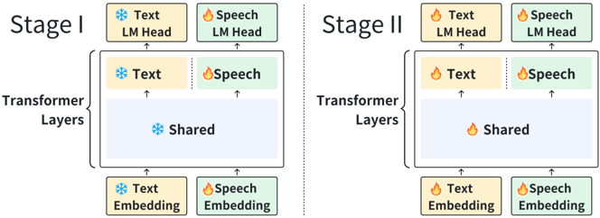

> [!abstract] arXiv · 2025 · Preprint
> **Xingjian Zhao et al.** (Shanghai Innovation Institute, Fudan University, MOSI) · [→ Paper](https://arxiv.org/abs/2510.00499) · Demo: ? · Code: ?
>
> Extends a pretrained text LLM to generate speech directly from speech input, with no text tokens in the generation path, while preserving most of the backbone's original reasoning ability.

## Problem

Cascaded spoken dialogue pipelines (ASR → text LLM → TTS) discard paralinguistic cues and add latency. End-to-end alternatives that accept speech input directly (SpeechGPT, Moshi, PSLM, GLM-4-Voice) still generate through a text intermediate, which introduces latency, prevents faithful production of non-verbal vocalizations that lack text equivalents, and forces a trade-off between speech and text capability: naively expanding an LLM's vocabulary or adding parallel speech-generation heads tends to erode the model's original textual reasoning (the paper cites SpiritLM's MMLU accuracy dropping from 45.3 to 36.9 after speech modeling is added). Achieving a genuinely text-free speech-to-speech LLM without this degradation had not been demonstrated.

## Method

The system is built on a pretrained Qwen3-8B text backbone. The authors first run a layer-wise similarity analysis: using forced alignment between speech and text tokens, they compute a DTW-based cosine-similarity score between the hidden states of aligned speech/text token pairs at each of the 28 layers of a preliminary speech-augmented model. The score rises through the first ~11 layers, plateaus through the middle layers, and drops in the final layers, indicating that shared representations fuse early but diverge again near the output. Motivated by this, the model introduces a "modality-based layer split": the final four layers of the 36-layer Transformer are duplicated into two parallel branches, one specializing in text-token prediction and one in speech-token prediction, both initialized from the same pretrained weights, while all preceding layers remain shared across modalities.

Training proceeds in two pretraining stages. Stage 1 freezes the entire text backbone and trains only the newly added speech embeddings, speech-branch layers, and speech LM head, using roughly 4M hours of speech: interleaved speech-text data (podcasts, aligned via ASR + CTC into 3-6s chunks) and unsupervised raw-audio data (video sources, no transcript), plus synthetic interleaved speech-text pairs generated by converting FineWeb-Edu text to audio with CosyVoice 2. Stage 2 unfreezes progressively larger portions of the shared layers (three unfreezing strategies are ablated) while mixing in text-only data to prevent forgetting. A supervised fine-tuning stage then trains on ~1.5M synthesized QA pairs covering all four input/output modality combinations (speech/text in both directions), built by adapting text QA data for spoken delivery with an LLM, synthesizing audio with Seed-TTS and MOSS-TTSD, and filtering with an ASR-based WER threshold.

The speech tokenizer targets a single-codebook, low-bitrate, fully-streaming representation: the encoder is fine-tuned from the GLM-4-Voice tokenizer (modified to be fully causal instead of block-causal) using an ASR objective rather than a reconstruction objective, following CosyVoice 2's design philosophy. The decoder reuses CosyVoice 2's flow-matching architecture with a reduced chunk size to lower streaming latency.

## Key Results

On the tokenizer (Table 3), the encoder reaches 10.80% overall WER, well below non-streaming codecs Mimi-8 (14.45%) and CosyVoice 2 (13.78%) despite a lower bitrate and frame rate, though it trails GLM-4-Voice's non-causal, chunk-based tokenizer (9.17%). On the decoder (Table 4), the model improves on CosyVoice 2 in both English (WER 4.14 vs. 4.63) and Chinese (WER 2.86 vs. 3.11) at half the frame rate, with only a marginal drop in speaker similarity (SIM 0.67 vs. 0.68 on English).

For the pretrained model (Table 5), it outperforms Moshi, GLM-4-Voice, and SpiritLM on speech StoryCloze/zh-StoryCloze while reaching much higher text scores (MMLU 67.19, CMMLU 69.53) than GLM-4-Voice (57.49/54.39), Moshi (49.8), and SpiritLM (36.9), evidencing preserved text ability.

On spoken QA after fine-tuning (Table 6), the fully text-free model beats the text-guided GLM-4-Voice on the speech-to-text setting for LlamaQA (77.33 vs. 74.33) and WebQA (45.9 vs. 39.22), and reports the highest speech-quality score (UTMOS 4.37 vs. 4.25). However, on the harder speech-to-speech setting, GLM-4-Voice's text-guided pipeline still wins on TriviaQA (43.20 vs. 28.8) and WebQA (38.34 vs. 36.71), and is close on LlamaQA (65.67 vs. 63.67). The ablation study (Table 7) shows that removing frozen pretraining (NF) costs roughly 4-6 points of MMLU/CMMLU and 1-2 points of speech StoryCloze relative to the frozen-pretrain variants, and additionally removing the layer split (NF-NoSplit) degrades all four metrics further.

## Novelty Assessment

The core contribution is architectural: the modality-based layer split, motivated by an explicit layer-wise similarity analysis and combined with frozen-backbone pretraining, is a new mechanism for adding a speech modality to a pretrained text LLM while limiting degradation of its original capability, and the ablation in Table 7 isolates the effect of each component cleanly. The speech tokenizer and decoder, however, are incremental modifications of existing systems (the encoder is fine-tuned from GLM-4-Voice's tokenizer, the decoder reuses CosyVoice 2's flow-matching architecture), and the overall training recipe (data construction, evaluation protocol) closely follows GLM-4-Voice and Moshi. The paper's own results also show the text-free approach does not uniformly outperform text-guided baselines on the harder speech-to-speech setting, so "comparable to, and sometimes ahead of" is a more accurate summary than the "state-of-the-art" framing used in the abstract.

## Field Significance

> [!tip]
> High — this paper provides a concrete architectural mechanism (layer split plus frozen pretraining) for removing the text bottleneck from speech-to-speech LLMs while limiting the usual text-ability degradation, backed by ablations that isolate each design choice; it demonstrates that a fully text-free generation path can match or exceed a text-guided baseline on several spoken QA settings, though not all.

## Claims

- **supports:** Freezing a pretrained LLM's original parameters while training newly added modality-specific components first, before gradually unfreezing, better preserves the model's original in-modality (text) competence than training all parameters jointly from the start.
  > *Evidence:* Table 7 ablation: the frozen-pretrain variant (FP-Full) reaches MMLU/CMMLU of 66.5/69.15, versus 62.11/64.11 for the otherwise-identical no-frozen-pretrain variant (NF) trained for the same ~2 epochs. *(§5, Table 7)*
- **supports:** Giving each modality its own specialized output layers at the top of a shared Transformer, rather than folding a new modality's tokens directly into the existing vocabulary and layer stack, improves performance in both the new and original modality.
  > *Evidence:* Table 7: removing the modality-based layer split (NF-NoSplit) while keeping all else equal lowers speech StoryCloze accuracy (55.80 vs. 56.60) and MMLU (60.97 vs. 62.11) relative to the split variant (NF). *(§5, Table 7)*
- **complicates:** Removing the text intermediate from LLM-based speech-to-speech generation does not yet uniformly close the performance gap with text-guided generation on knowledge-intensive spoken question answering.
  > *Evidence:* Table 6: on speech-to-speech TriviaQA and WebQA, the fully text-free model scores 28.8 and 36.71 respectively, versus 43.20 and 38.34 for the text-guided GLM-4-Voice baseline, even though the text-free model leads on speech-to-text LlamaQA and WebQA. *(§4.3, Table 6)*
- **complicates:** Constraining a semantic speech tokenizer to be fully causal for true streaming operation costs some recognition accuracy relative to a similarly-designed but non-causal or chunk-based variant.
  > *Evidence:* Table 3: at the same frame rate and bitrate (12.5Hz, 175bps), the fully-causal streaming tokenizer reaches 10.80% overall WER versus 9.17% for the chunk-based (2s block) GLM-4-Voice tokenizer it is fine-tuned from. *(§4.1, Table 3)*

## Limitations and Open Questions

> [!warning]
> On the hardest speech-to-speech settings (TriviaQA, WebQA), the fully text-free model trails a text-guided baseline by a substantial margin (e.g., TriviaQA S→S 28.8 vs. 43.20), showing the text-free paradigm has not yet closed the gap for knowledge-intensive spoken dialogue.

Speech quality is assessed only with the automatic UTMOS and DNSMOS proxies; no human MOS or preference listening test is reported for either the tokenizer or the full dialogue system. The supervised fine-tuning data is entirely synthetic (LLM-adapted text paired with TTS-generated audio from Seed-TTS and MOSS-TTSD), so robustness to spontaneous, noisy, or emotionally varied real human speech is untested. Coverage is limited to English and Chinese, and code/demo availability is not stated in the paper.

## Wiki Connections

- [[spoken-language-model|Spoken Language Model]] — adapts a pretrained text LLM (Qwen3-8B) into a native speech generator through architectural modification rather than training a speech model from scratch.
- [[speech-to-speech|Speech-to-Speech]] — directly targets removing the text intermediate from spoken dialogue generation, evaluating both speech-to-text and speech-to-speech QA settings.
- [[flow-matching|Flow Matching]] — reuses a flow-matching decoder adapted from CosyVoice 2 to convert the LM's discrete speech tokens back into waveform.
- [[autoregressive-codec-tts|Autoregressive Codec TTS]] — generates single-codebook speech tokens autoregressively from a shared Transformer backbone before flow-matching resynthesis.
- [[neural-codec|Neural Audio Codec]] — introduces a fully-causal, ASR-trained, single-codebook streaming tokenizer optimized for semantic transfer over reconstruction fidelity.
- [[multilingual-tts|Multilingual TTS]] — trains and evaluates the model jointly on English and Chinese interleaved speech-text corpora.
- [[2410.00037|Moshi]] — used as a full-duplex, text-guided baseline in the spoken QA and StoryCloze comparisons.
- [[2412.02612|GLM-4-Voice]] — the tokenizer this paper's encoder is fine-tuned from, and the strongest text-guided baseline it compares against throughout evaluation.
- [[2412.10117|CosyVoice 2]] — supplies the ASR-training philosophy for the tokenizer encoder and the flow-matching decoder architecture adapted here for lower-latency streaming.
- [[2402.05755|SpiritLM]] — cited as evidence that adding speech modeling to an LLM can severely degrade text ability, motivating the frozen-pretraining design.
- [[2505.09388|Qwen3 Technical Report]] — provides the pretrained text backbone that the modality-based layer split is initialized from.
- [[2409.06666|LLaMA-Omni]] — discussed as a prior speech-to-speech LLM that still depends on text prompts to guide generation, unlike this paper's text-free approach.
- [[2408.16725|Mini-Omni]] — discussed as a progressive-unfreezing precedent for adding speech to a frozen LLM backbone, contrasted with this paper's frozen-then-split strategy.
- [[2504.18425|Kimi-Audio]] — its answer-normalization protocol is adopted for judging spoken QA answers in evaluation.
