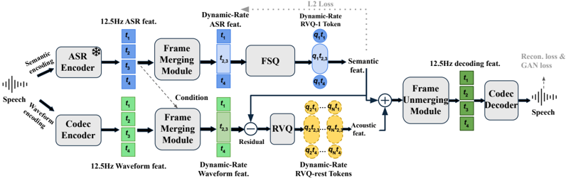
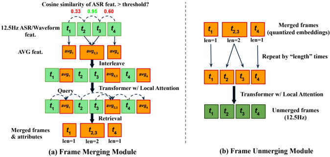

> [!abstract] arXiv · 2025 · Preprint
> **Jiaqi Li et al.** (CUHK-Shenzhen / Microsoft) · [→ Paper](https://arxiv.org/abs/2510.00981) · Demo: ✓ · Code: ✓
>
> FlexiCodec is a neural audio codec that pushes semantic token preservation to sub-10 Hz frame rates by using a frozen ASR encoder to guide dynamic adaptive frame merging, achieving 4.15% RVQ-1 WER at 6.25 Hz average frame rate — 7.6x better than a retrained DualCodec baseline. Accepted to ICLR 2026.

## Problem

Speech language models and autoregressive TTS systems incur quadratic attention cost proportional to sequence length. Standard codecs (EnCodec 75 Hz, DAC 75 Hz, SpeechTokenizer 50 Hz) produce sequences 10–15× longer than corresponding text. Low-frame-rate alternatives have stagnated around 12.5 Hz (Mimi, DualCodec). Pushing below 12.5 Hz with naive encoder stride increases causes severe semantic degradation: DualCodec retrained to 6.25 Hz reaches 31.5% WER on RVQ-1 reconstruction (vs. 2.1% ground-truth), losing phonetic detail in fixed-resolution downsampling. Two root causes are identified: (1) fixed downsampling discards transient phonetic details equally regardless of content, and (2) SSL features used for semantic distillation retain leaked acoustic/paralinguistic information that prevents effective frame merging.

## Method

FlexiCodec uses a dual-stream architecture followed by dynamic frame merging, quantization, and frame unmerging decoding.

**Dual-Stream Feature Extraction.** Two parallel encoders process 16 kHz waveforms at 12.5 Hz:
- An ASR stream uses a frozen pre-trained SenseVoice-Small (230M, encoder-only Transformer, trained on 300 k hours with CTC loss) to produce semantic features e_s.
- A convolutional codec encoder (CNN blocks with strides [4,4,5,8,2]) produces acoustic features e_a.

**Dynamic Frame Merging Module.** ASR cosine similarity between adjacent 12.5 Hz frames guides adaptive merging: contiguous frames with pairwise similarity > threshold τ are averaged into a single merged frame, recording their group length ℓ_k. A local-windowed-attention Transformer refines the merged sequence. At training, τ is sampled uniformly from [0.7, 1.0], enabling the model to learn across a range of frame rates. At τ = 1.0, no merging occurs (12.5 Hz); lower τ produces lower average rates down to 3 Hz.

**Semantic Quantization (RVQ-1).** Finite Scalar Quantization (FSQ) with D=5 dimensions at L=8 levels (32,768 codebook entries) quantizes the compressed ASR features into RVQ-1 semantic tokens with an L2 feature alignment loss.

**Acoustic Quantization (RVQ-rest).** A residual (waveform features minus ASR features) is quantized by 24-layer RVQ (4,096 entries per layer) to encode fine acoustic detail.

**Frame Unmerging and Reconstruction.** Frame length attributes expand the merged sequence back to 12.5 Hz; another local-attention Transformer smooths transitions; a mirrored CNN decoder synthesizes waveform.

Training uses 216M parameters on 54 k hours (Librilight-Large), 8 × V100 32 GB GPUs, 800 k steps, with composite loss: multi-scale L1 mel reconstruction + GAN (MPD + MRSD) + RVQ codebook + L2 semantic feature alignment.

FlexiCodec-TTS integrates the codec into an AR (250M, predicts RVQ-1 + frame lengths with two heads) + NAR (300M, CosyVoice-inspired conditional flow matching at 50 Hz mel or 12.5 Hz codec features) framework, trained on 50 k hours (Libriheavy).

## Key Results

**Codec evaluation (LibriSpeech test-clean):**

At 6.25 Hz average frame rate, FlexiCodec achieves RVQ-1 WER of 4.15% vs. DualCodec 31.5% and DAC ~70%+. This is the first codec to reach near-ground-truth semantic preservation (2.1% GT) at below 10 Hz without requiring text transcription.

Across bitrate tiers, FlexiCodec at each rate outperforms or matches same-bitrate baselines on PESQ, UTMOS, and SIM while substantially improving WER(RVQ-1).

Dynamic frame rate ablation: replacing dynamic merging with fixed-stride encoding at 6.25 Hz increases RVQ-1 WER by a relative 26% (4.15 → 5.22) and ASR-probing WER by 21%.

ASR vs. SSL features ablation: switching to w2v-bert-2 SSL features (DualCodec's choice) causes WER to jump from 4.15 to 27.3 at 6.25 Hz, confirming ASR features are the key enabler.

**TTS evaluation (FlexiCodec-TTS with 50 Hz NAR, Librispeech-PC-test-clean):**

At 6.25 Hz AR: WER 3.2%, SIM-o 0.65, NMOS 3.32, QMOS 3.40 — competitive with CosyVoice (WER 3.2%, NMOS 3.17). AR RTF is 0.07, representing a 7.3× speedup over CosyVoice's AR stage. Full system RTF is 0.18 (vs. 0.62 for CosyVoice).

Key finding: lower AR frame rate does not degrade TTS performance — 8.3 Hz and 6.25 Hz AR achieve equal or better WER/SIM-o than 12.5 Hz AR. Higher NAR frame rate (50 Hz mel > 12.5 Hz FlexiCodec features) is important for naturalness.

Phoneme-rate correlation on TIMIT: Pearson r = 0.775 between utterance phoneme rate and FlexiCodec dynamic frame rate, confirming the token boundary adapts to phonetic complexity.

## Novelty Assessment

The primary technical novelty is the ASR-feature-guided dynamic frame merging in the low-frame-rate (3–12.5 Hz) regime, combined with controllable inference-time frame rate from a single model. The choice of ASR features over SSL features for semantic decoupling (confirmed by substantial ablation evidence) is a clear and well-supported finding. The Transformer-based frame merging and unmerging modules add incremental benefit. The overall system is a meaningful advance over Mimi and DualCodec: it achieves semantically richer tokens at lower frame rates without requiring text transcription. Accepted to ICLR 2026.

## Field Significance

> [!tip]
> High — FlexiCodec provides the first practical solution for sub-10 Hz codec tokens that preserve phonetic detail without requiring text transcriptions, removing a longstanding barrier to efficient speech LM training. Its finding that ASR-derived features are decisively superior to SSL features for dynamic frame merging is a concrete, actionable design principle for low-frame-rate codec development. The demonstration that 6.25 Hz AR tokens achieve competitive TTS quality with 7.3× AR speedup strengthens the case for low-frame-rate codecs as the backbone of next-generation speech generation systems.

## Claims

- ASR-derived semantic features enable substantially better phonetic preservation at very low codec frame rates than SSL-derived features. *(§4.2, Table 5, Appendix D)*
- Dynamic frame rate allocation, guided by semantic similarity, improves codec semantic preservation compared to fixed low-frame-rate downsampling by adapting token density to phonetic complexity. *(§4.3, Tables 3–4)*
- Dynamic codec frame rate correlates strongly with phoneme rate, with the merging boundary approximating syllabic units for typical speech. *(§4.3, Figure 4)*
- Reducing the AR codec token rate in TTS does not necessarily degrade output quality, and can yield large speedups, provided the NAR stage decodes at sufficient temporal resolution. *(Appendix B.2, Table 6)*
- Codec RVQ-1 semantic token quality, as measured by reconstruction WER, degrades sharply below 12.5 Hz for SSL-augmented codecs using fixed-rate downsampling. *(§4.2, Figure 3)*

## Limitations and Open Questions

- The codec is trained on English audiobook speech (LibriLight-Large); semantic tokens fail on unseen languages without fine-tuning (multilingual WER(RVQ1) ~100% for Chinese/Korean). The acoustic stream generalizes better.
- Maximum segment length ℓ_k is capped at 8 frames; very long silence regions or unusually slow speech may hit this cap.
- The 216M parameter footprint is larger than simpler codecs (DAC 74M, Mimi 78M), though encoding RTF remains practical (0.018).
- The paper does not address streaming/causal operation; the dual-stream encoder and dynamic merging require full-segment processing.
- TTS subjective evaluations use only 6 expert listeners per system — a limited sample for establishing statistical significance.

## Wiki Connections

This paper is a direct contribution to [[neural-codec]], establishing a new state of the art for low-frame-rate semantic preservation. It is highly relevant to [[autoregressive-codec-tts]] because low-frame-rate tokens directly reduce AR model computational cost; the finding that 6.25 Hz AR performs comparably to 12.5 Hz is actionable for VALL-E-family systems. The paper connects to [[spoken-language-model]] because efficient codec tokens are foundational for audio LLMs. The hierarchical RVQ disentanglement strategy (semantic RVQ-1 vs. acoustic RVQ-rest) relates to [[disentanglement]]. In-corpus references include [[2412.17048|Why SLMs Fail]] (Wang et al. on SLM coherence failures, which motivates the need for lower-rate semantic tokens) and [[2508.16790|TaDiCodec]] (a concurrent 6.25 Hz codec that requires text transcription, which FlexiCodec explicitly addresses).
