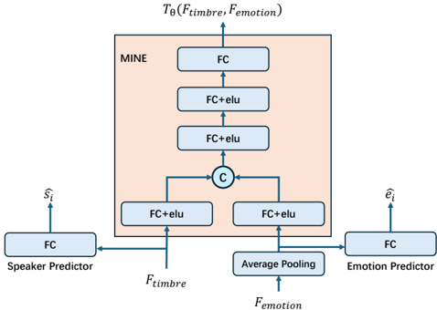

> [!abstract] arXiv · 2025 · Preprint
> **Jianing Yang et al.** (The University of Tokyo / Institute of Science Tokyo) · [→ Paper](https://arxiv.org/abs/2510.01722) · Demo: ? · Code: ?
>
> Introduces a FastSpeech2-based emotional TTS system that predicts phoneme-level emotion embeddings while explicitly disentangling them from global timbre via mutual-information minimization.

## Problem

Prior emotional and style-transfer TTS systems (Global Style Tokens, StyleSpeech, Tacotron-GST) compress a reference utterance into a single global style vector fused with the phoneme encoder output. This captures overall speaking style but cannot represent how emotion and prosody vary phoneme-by-phoneme, and it risks losing fine acoustic detail by collapsing the reference into one embedding. Separately, disentanglement approaches built on mutual-information minimization (e.g., MIST) have mostly targeted separating linguistic content from a single holistic "style" embedding, leaving timbre, emotion, and local prosody entangled within that style representation itself. Discrete-codec-based reference encoders (DC Comix TTS) improve fidelity from unseen speakers but still rely on a single utterance-level code embedding, again limiting phoneme-level control. The paper targets both gaps at once: fine-grained (phoneme-level) emotion conditioning, and explicit separation of that emotion signal from speaker timbre.

## Method

The backbone is FastSpeech 2 (FS2): a four-block Feed-Forward Transformer (FFT) phoneme encoder, a six-block FFT mel-spectrogram decoder, and a Variance Adaptor (length regulator, pitch predictor, energy predictor). A Style Encoder is inserted after the Phoneme Encoder, composed of two parallel branches: a global Timbre Extractor (a GST-style reference encoder plus style-token layer, producing a single timbre embedding) and a phoneme-aware Emotion Extractor. The Emotion Extractor encodes the reference mel-spectrogram with the same reference encoder, then uses a lightweight Phoneme-Emotion Projection Adapter (PEPA, two 1-D convolutional layers) to project phoneme-encoder outputs into the reference encoder's acoustic space. A multi-head cross-attention module (phoneme embeddings as queries, reference-encoder features as keys/values) produces phoneme-synchronous emotional features; positional encoding is deliberately omitted from the reference features to prevent the target text's content from leaking through the reference channel. A second cross-attention plus style-token layer and a self-attentive pooling layer smooth the result into a per-phoneme emotion embedding sequence, which is added to the phoneme encoder output and combined with the timbre embedding via layer normalization.

Disentanglement between the timbre and emotion embeddings is enforced with Mutual Information Neural Estimation (MINE), following the Donsker-Varadhan variational bound on KL divergence. A trainable scorer network processes the pooled global emotion embedding and the timbre embedding through separate FC+ELU layers, concatenates them, and outputs a scalar mutual-information estimate; the TTS model minimizes this estimate while the estimator itself is trained to maximize it (adversarial min-max). Unlike prior MI-based disentanglement work, the authors add explicit supervision: an Emotion Predictor and a Speaker Predictor are trained to classify emotion and speaker identity from the emotion and timbre embeddings respectively, giving the MI objective a concrete optimization target rather than an unconstrained minimization.

Training proceeds in two stages. Stage one trains FS2 without the Style Encoder, using only neutral-emotion utterances, to obtain a phoneme encoder that is not sensitive to emotion-related variation. Stage two adds the Style Encoder, freezes the stage-one encoder/decoder weights, and jointly optimizes reconstruction, duration, pitch, energy, emotion-classification, and speaker-classification losses alongside the MINE-based MI penalty (six loss terms, weighted 1.0/1.0/1.0/1.0/1.0/0.1). Mel-spectrograms are converted to waveforms with a HiFi-GAN vocoder (UNIVERSAL_V1 checkpoint) fine-tuned on the target training set. No neural audio codec is used; representations remain continuous mel-spectrograms throughout.

## Key Results

On the English subset of ESD (10 speakers, 5 emotions, 80/10/10 split), the proposed model is compared against FS2+GST, StyleSpeech, FS2+MIST, and DC Comix TTS, all rebuilt on the same FS2 backbone for a controlled comparison (Table I). The proposed method attains MOS 3.63 ± 0.10, statistically on par with the strongest baseline (FS2+MIST, 3.62 ± 0.10), while achieving the best SMOS (3.41 ± 0.06 vs. 2.89-3.26 for baselines) and the lowest MCD (8.23 vs. 8.65-9.09). On the automatic emotion-recognition proxy (UAA, from a Whisper-large-v2 model fine-tuned on ESD), the proposed method reaches 82.42%, narrowly ahead of StyleSpeech (82.22%) and well ahead of DC Comix TTS's discrete-code reference encoder (58.79%). All comparisons control for content leakage by drawing the reference utterance from a fixed, different-text sample matching the target's speaker and emotion. An ablation (Table II) removing the Emotion/Speaker Predictors and MINE individually shows both components contribute: removing both drops UAA to 56.84% and increases MCD to 9.71, confirming that the explicit classification objective, not mutual-information minimization alone, drives most of the gain. A t-SNE projection of utterance-level emotion embeddings (Fig. 3, not reproduced here as it is a results visualization rather than an architecture diagram) shows tighter, better-separated emotion clusters than the strongest baseline.

## Novelty Assessment

The architectural contribution is a phoneme-level emotion embedding pathway (PEPA plus cross-attention alignment against the reference encoder) combined with an MI-guided disentanglement scheme that adds explicit auxiliary classification objectives on top of standard MINE minimization. Both the phoneme-level emotion extractor and the "MINE + explicit predictors" combination are genuine architectural additions relative to the cited baselines. However, the underlying building blocks (GST-style reference encoders, MINE, cross-attention, FastSpeech2) are all established components; the contribution is their combination and the anti-content-leakage engineering (omitting positional encoding on reference features, matched-speaker/emotion but different-text reference sampling), not a new training paradigm or backbone. The evaluation is confined to a single dataset (ESD English subset, 10 known speakers, closed-set), so claims of "zero-shot"-style generalization made in the introduction are not directly tested by the reported experiments: the test split uses the same speakers seen in training, only held-out utterances. The authors themselves note in the conclusion that FastSpeech2 is not a state-of-the-art backbone for naturalness and expressivity, positioning this as a controlled ablation study of a disentanglement mechanism rather than a leaderboard-topping system.

## Field Significance

Moderate — the paper provides a controlled, same-backbone comparison showing that phoneme-level, MINE-disentangled emotion embeddings improve style similarity (SMOS) and emotion-recognition accuracy over global-style-vector baselines without a naturalness (MOS) penalty. Its contribution is primarily architectural at the module level (Style Encoder design, PEPA, dual MI-plus-classifier disentanglement) rather than a new training paradigm, and its evaluation scope (single dataset, closed speaker set, FS2 backbone) limits how far the results generalize.

## Claims

- **supports:** Explicit classification objectives that predict target attributes (e.g., emotion, speaker identity) from disentangled embeddings provide a stronger and more reliable disentanglement signal than mutual-information minimization alone.
  > *Evidence:* Ablating both the Emotion/Speaker Predictors and MINE drops emotion-recognition UAA from 82.42% to 56.84% and worsens MCD from 8.23 to 9.71, a larger degradation than removing either component individually. *(§V-F, Table II)*
- **supports:** Predicting phoneme-level, rather than utterance-level, style embeddings from a reference signal improves perceived style/emotion similarity without degrading naturalness relative to global-style-vector baselines.
  > *Evidence:* The proposed phoneme-aware Emotion Extractor achieves the highest SMOS (3.41 ± 0.06) among all compared systems while matching the best baseline's MOS (3.63 vs. 3.62 for FS2+MIST), evaluated on the same FS2 backbone. *(§V-E, Table I)*
- **complicates:** Fine-grained style embeddings derived from a reference utterance can leak the reference's lexical content into the synthesized output unless the conditioning pathway is explicitly constrained against it.
  > *Evidence:* The authors omit positional encoding from the reference mel-spectrogram features specifically to prevent "content leakage," and construct evaluation reference clips from a fixed, different-text utterance matching only speaker and emotion, to avoid an artificial similarity boost from shared lexical content. *(§V-E)*
- **refines:** Discrete-codec-derived reference embeddings do not uniformly outperform continuous mel-spectrogram reference embeddings for capturing emotional expressiveness.
  > *Evidence:* DC Comix TTS, which replaces the GST reference encoder with an EnCodec-style discrete-code encoder, scores the lowest emotion-recognition UAA (58.79%) of all four baselines, below both continuous-mel-based systems (FS2+GST 74.22%, FS2+MIST 76.17%) on the same evaluation protocol. *(§V-E, Table I)*

## Limitations and Open Questions

> [!warning]
> All experiments use a single dataset (the English subset of ESD, 10 known speakers, 5 emotion categories), and the reported test split is held-out utterances from the same speaker/emotion combinations seen in training, not unseen speakers. This limits how much the results support the zero-shot generalization framing used in the paper's introduction.

The authors acknowledge that FastSpeech2 is not state-of-the-art in naturalness or expressivity and explicitly propose porting the phoneme-level emotion embedding and disentanglement mechanism to diffusion-based or language-model-based TTS backbones as future work. The MOS gain over the strongest baseline is small and within overlapping confidence intervals, so the naturalness claim is best read as parity rather than improvement; the clearer gains are in style similarity (SMOS) and disentanglement quality (UAA, t-SNE separation). The paper also does not report model parameter counts, training compute, or inference latency, limiting reproducibility and cross-system efficiency comparison.

## Wiki Connections

- [[emotion-synthesis|Emotion Synthesis]] — proposes a phoneme-level emotion embedding mechanism explicitly designed to separate emotional content from speaker timbre in expressive TTS.
- [[disentanglement|Disentanglement]] — combines mutual-information minimization (MINE) with explicit emotion/speaker classification losses to separate timbre and emotion representations into distinct embedding spaces.
- [[transformer-enc-dec-tts|Transformer Encoder-Decoder TTS]] — builds its Style Encoder on top of the FastSpeech 2 transformer encoder-decoder backbone.
- [[subjective-evaluation|Subjective Evaluation]] — reports MOS and SMOS from ten human judges alongside objective MCD and UAA metrics.
- [[2006.04558|FastSpeech 2]] — used unmodified as the TTS backbone (phoneme encoder, decoder, variance adaptor) into which the Style Encoder is inserted.
- [[2010.05646|HiFi-GAN]] — used as the vocoder (fine-tuned on the target training set) to convert generated mel-spectrograms to waveforms.
- [[2210.13438|EnCodec]] — the discrete-code reference encoder in the DC Comix TTS baseline is built on an EnCodec-style front end, compared against directly in Table I.
