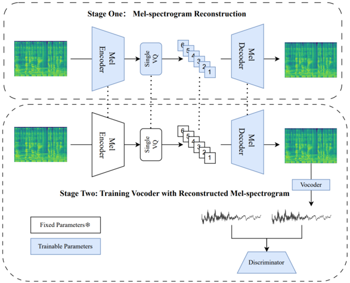

> [!abstract] arXiv · 2025 · Preprint
> **Jingyi Li et al.** (International Digital Economy Academy (IDEA)) · [→ Paper](https://arxiv.org/abs/2510.01903) · Demo: ? · Code: ✗
>
> Compresses full-bandwidth (44.1 kHz) audio into a single codebook by tokenizing the mel-spectrogram in two dimensions (time and frequency) rather than one, closing much of the fidelity gap between single-codebook and multi-codebook neural audio codecs.

## Problem

Multi-stage residual vector quantizers (RVQ) can compress full-bandwidth audio with minimal quality loss, but the resulting multi-codebook token sequences are expensive to predict autoregressively, hurting efficiency and robustness in downstream language models. Single vector quantization (SVQ) collapses this to one codebook, which is attractive for acoustic language models, but existing single-codebook codecs (e.g. WavTokenizer, UniCodec) have not been designed for full 44.1/48 kHz bandwidth: their 1D tokenizers process only the temporal axis, forcing all frequency variation into one token sequence per frame, which the authors argue wastes codebook capacity on frequency-variant redundancy and leaves high-frequency detail poorly reconstructed.

## Method

MelTok reframes the audio tokenizer as a two-dimensional problem. Instead of compressing a waveform or spectrogram along only the temporal axis (a "1D tokenizer"), it applies 2D convolutions directly over the log-mel spectrogram (built with at least 96 mel filter banks to preserve high-frequency detail), so the time and frequency axes are both compressed before a single vector quantizer selects one code per patch from an 8192-entry, 64-dimensional codebook. The encoder is adapted from the Cosmos image/video tokenizer's convolutional-and-attention downsampling stack.

Training proceeds in two stages. In stage one, a VQ-VAE-style tokenizer reconstructs the log-mel spectrogram from discrete tokens, trained with an L1 mel-reconstruction loss plus a VGG-19-based perceptual loss (later replaced by a Gram-matrix loss for fine-tuning) to counter the over-smoothing that pure L1 reconstruction produces. In stage two, the tokenizer's encoder and quantizer are frozen, and a Vocos-style GAN vocoder is trained to turn the reconstructed mel-spectrogram tokens (not ground-truth mel-spectrograms) into a waveform, jointly with a fine-tuned decoder and a multi-resolution/multi-period discriminator pair. The paper motivates using tokens rather than ground-truth mel-spectrograms as vocoder input with a Lipschitz-continuity argument: because the vocoder maps a finite codebook, quantization error propagated to the waveform is provably bounded, which the authors use to justify design choices such as Snake activations (bounded derivative) in the generator and spectral normalization in the discriminator, both intended to keep the vocoder's Lipschitz constant controlled.

## Key Results

On the AudioSet evaluation set, MelTok's single codebook (3.4 kbps, 260 tokens/sec) obtains the best LSD (0.77) and MCD (2.92) of all compared codecs, including 9-codebook DAC (LSD 0.81, MCD 3.9) and Spectral Codec, while reaching VISQOL 4.17, close to DAC's 4.19 and well above the other single-codebook baselines WavTokenizer (VISQOL 3.26) and UniCodec (VISQOL 3.18). An ablation isolating the tokenizer (fixed vocoder, same training) shows the 2D tokenizer dramatically outperforms a matched 1D tokenizer at the same bitrate (VISQOL 4.36 vs 3.56, LSD 0.67 vs 1.09, MCD 2.64 vs 11.47), and a separate ablation shows adding the VGG perceptual loss improves LSD (0.76 → 0.66) and VISQOL (4.18 → 4.29) over L1-only training. A 15-participant MUSHRA listening test is reported to show quality comparable to multi-codebook codecs, though no numeric MUSHRA scores are given in the text. On out-of-distribution downstream tasks, results are mixed: MelTok is competitive on sound-event classification (F1 0.3398 vs SNAC's 0.3223 and DAC's 0.3363) but trails several multi-codebook codecs on GTZAN music-genre classification (accuracy 0.57 vs 0.60–0.65 for DAC, SNAC, Spectral Codec, and Nvidia Codec, and 0.63 for the ground-truth reference).

## Novelty Assessment

The core contribution is architectural: applying genuine 2D (time-frequency) convolutions to mel-spectrogram tokenization for a single-codebook codec, rather than the 1D convolution-over-time pattern used by prior single-codebook work such as WavTokenizer and UniCodec. This is a focused, well-motivated design change (also explored for spectrograms in FunCodec, which the paper's own related work cites, though with an RVQ rather than single-quantizer back end) combined with a two-stage training recipe and a Lipschitz-continuity argument for why decoding from discrete tokens rather than continuous mel-spectrograms stabilizes GAN vocoder training. The theoretical bounded-error analysis is a genuine addition to the paper's reasoning, though it is a design justification rather than a new learning algorithm. The perceptual-loss and two-stage training choices are largely established techniques (VGG perceptual loss, Vocos-style GAN vocoding, feature matching, spectral normalization) applied in a new combination rather than invented here.

## Field Significance

moderate — This paper demonstrates that reorganizing tokenization around the true 2D structure of a spectrogram, rather than treating frequency as another temporal-like dimension, materially improves what a single codebook can reconstruct at full bandwidth, narrowing the gap to multi-codebook codecs on several fidelity metrics. It provides a concrete architectural alternative for the current shift toward single-codebook representations in audio language models, backed by ablations isolating the tokenizer's contribution from other pipeline changes.

## Claims

- **supports:** Structuring a tokenizer to compress genuinely two-dimensional time-frequency data, rather than folding frequency variation into a single temporal token sequence, reduces representational redundancy and improves reconstruction fidelity at a matched codebook size.
  > *Evidence:* With a fixed downstream vocoder, replacing a 1D tokenizer with a 2D tokenizer at the same bitrate improves VISQOL from 3.56 to 4.36 and reduces MCD from 11.47 to 2.64. *(§4.2, Table 1)*
- **supports:** Adding a perceptual loss computed on the intermediate spectral representation, on top of a plain L1 reconstruction loss, reduces over-smoothing artifacts in discrete audio tokenizers.
  > *Evidence:* Adding a VGG-19-based perceptual loss to mel-spectrogram reconstruction improves LSD from 0.76 to 0.66 and VISQOL from 4.18 to 4.29 relative to L1-only training. *(§4.2, Table 2, Figure 4)*
- **supports:** A single-codebook audio codec can approach the fidelity of multi-codebook residual-VQ codecs on full-bandwidth reconstruction, narrowing the traditional efficiency/quality trade-off between codebook count and reconstruction quality.
  > *Evidence:* At 3.4 kbps with one codebook, the proposed codec achieves the best LSD (0.77) and MCD (2.92) among all compared codecs (including 9-codebook DAC) and a VISQOL (4.17) far above other single-codebook baselines WavTokenizer (3.26) and UniCodec (3.18). *(§4.3, Table 3)*
- **complicates:** Strong reconstruction-fidelity scores for a codec do not guarantee that its tokens preserve task-relevant semantic content as well as codecs with lower fidelity scores, particularly for structured classification tasks.
  > *Evidence:* Despite leading fidelity metrics overall, the proposed codec's reconstructed audio yields only 0.57 accuracy on GTZAN music-genre classification, below multi-codebook codecs Spectral Codec (0.65), SNAC (0.63), and the 0.63 ground-truth reference. *(§4.4, Table 6)*
- **complicates:** Claims of high-fidelity full-bandwidth (44/48 kHz) audio compression are constrained by the scarcity of genuinely high-resolution training data, since much publicly available "full-bandwidth" audio is itself upsampled from lower sampling rates.
  > *Evidence:* The authors report that training is disrupted when data artificially upsampled to a high sampling rate is used, and note that even open 44/48 kHz corpora often contain content originally recorded at 16 kHz. *(§Limitations and Future Work)*

## Limitations and Open Questions

The authors identify that training is disrupted by artificially-upsampled low-resolution audio masquerading as full-bandwidth data, and that open high-fidelity audio datasets remain scarce, which directly limits how much compression benefit the method can currently demonstrate. They also explicitly note that this paper only evaluates MelTok's reconstruction and downstream-classification capability; MelTok-derived tokens have not yet been used to train an audio language model, so the paper's claims are about compression and reconstruction quality, not about downstream generative performance. The GTZAN genre-classification results (§4.4, Table 6) show the codec underperforming several multi-codebook baselines despite winning on reconstruction-fidelity metrics, indicating that fidelity gains do not automatically transfer to preserved semantic/discriminative content for all downstream tasks.

## Wiki Connections

- [[neural-codec|Neural Audio Codec]] — proposes a 2D time-frequency tokenizer that compresses full-bandwidth (44.1 kHz) audio into a single codebook, directly extending the single-codebook branch of neural codec design.
- [[gan-vocoder|GAN Vocoder]] — builds its second-stage waveform decoder on a Vocos-style GAN vocoder, adapted to take discrete mel-spectrogram tokens rather than continuous mel-spectrograms as input.
- [[evaluation-metrics|Evaluation Metrics]] — reports a broad battery of objective codec-fidelity metrics (VISQOL, LSD, MCD, STFT/Mel distance, FAD) alongside downstream WER and speaker-similarity checks to characterize reconstruction quality.
- [[subjective-evaluation|Subjective Evaluation]] — runs a 15-participant MUSHRA-style listening test to validate that objective fidelity gains correspond to perceived quality comparable to multi-codebook codecs.
- [[2408.16532|WavTokenizer]] — used as the primary single-codebook baseline throughout the objective and downstream-task comparisons, which MelTok outperforms on fidelity metrics at a higher bitrate.
- [[2502.06490|Discrete Audio Tokens: A Review]] — cited as background motivating the shift from multi-stage residual quantization toward single-codebook tokenization for audio language models.
- [[2212.04356|Whisper]] — used as a fixed, off-the-shelf tool (Whisper-tiny) to compute word error rate on reconstructed vocal audio as a downstream intelligibility check.
