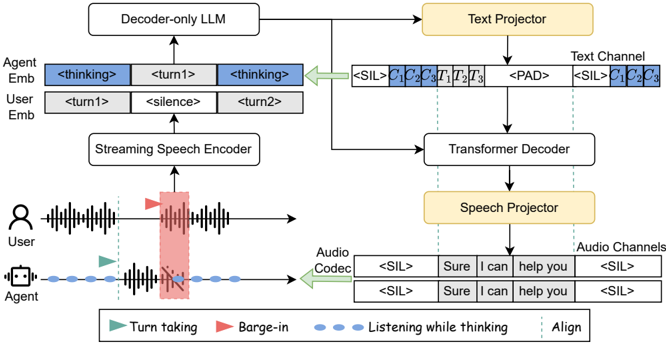

> [!abstract] arXiv · 2025 · Preprint
> **Donghang Wu et al.** (Nanyang Technological University, StepFun, Mila) · [→ Paper](https://arxiv.org/abs/2510.05150) · Demo: ? · Code: ?
>
> Replaces the repeated silence tokens that full-duplex spoken dialogue models emit while listening with a structured, causal reasoning chain, so the agent "thinks" during the listening window instead of remaining idle.

## Problem

Full-duplex spoken dialogue language models (SDLMs) continuously ingest streaming user speech while generating a response, which lets them handle barge-in and natural turn-taking. During the listening phase, however, existing systems keep the language model idle by having it repeatedly predict a "silence" token until the user finishes speaking. The paper argues this wastes the listening window (no intent modeling or response planning happens while the model is listening) and is potentially harmful on its own terms, since long runs of a repeated token are known to bias next-token distributions in autoregressive models. Standard LLM reasoning techniques such as Chain-of-Thought cannot be substituted directly, because they assume a complete input is available before reasoning starts and are not preemptible, whereas a full-duplex agent must reason incrementally from partial audio and be ready to speak the instant the user stops, without incurring extra latency.

## Method

The base network follows a fairly standard full-duplex recipe: a streaming speech encoder (12.5 Hz frame rate) turns the user's audio into continuous embeddings, which are projected by a modality adapter and summed with the agent's text-token embeddings before being fed into an LLM backbone (initialized from Qwen2.5-1.5B-Instruct). Unlike some prior full-duplex designs that have the LLM predict both text and audio tokens jointly, this LLM backbone predicts only the agent's text tokens; a separate autoregressive Transformer decoder, conditioned on the LLM's hidden states and previously generated speech tokens, then predicts the agent's speech tokens. Speech tokens are produced by Nanocodec with Finite Scalar Quantization at 12.5 Hz. The streaming encoder, LLM backbone, and Transformer decoder are jointly fine-tuned with a multi-channel next-token-prediction objective.

The paper's contribution sits in how the agent's text-token stream is constructed during the listening phase. Instead of filling this stretch with repeated `<SIL>` tokens, the authors insert a "chronological thinking chain": a sequence of typed reasoning nodes generated incrementally as semantic segments of user speech arrive. Node types are adapted from the ACT-R cognitive-architecture theory (Entity, Intent, Action, Knowledge, Logic), each mapping to a corresponding ACT-R module (visual, goal, manual, declarative, production system). Thinking-chain tokens are produced offline for training data by prompting Qwen2.5-72B-Instruct on the dialogue transcript, then spliced into the position previously occupied by silence tokens, bounded by `<BOC>`/`<EOC>` markers. To respect the strict-causality and no-added-latency constraints, chain length is truncated to fit within the available silence-token budget: if the full chain is longer than the space available, only as many complete nodes as fit are kept, ensuring the chain is preemptible and that switching to actual response generation never requires extra time once the user stops speaking.

Training data is entirely synthetic: seed topics (Wikipedia, SpokenWOZ, Llama Questions formats) are expanded into text dialogues by Qwen2.5-72B-Instruct, paired with generated chronological thinking chains, and then converted to speech with Step-Audio-TTS-3B using voice-cloned prompts drawn from a library of over 50,000 single-speaker clips, yielding roughly 15,200 hours of dialogue audio across three datasets (GenConv, SpokenWOZ-G, Llamaq-G).

## Key Results

Against an ablation without the thinking mechanism (CT-Duplex w/o thk) and against SALM-Duplex (a prior model with a near-identical backbone but joint text/audio prediction in a single LLM), chronological thinking improves GPT-judged response quality by 8.75% on SpokenWOZ (reasoning-heavy task-oriented dialogue) but only 2.09% on MtBenchEval (casual multi-turn dialogue), consistent with the mechanism targeting reasoning rather than general fluency. On factual-knowledge benchmarks (Llama Questions, Web Questions), the gain from thinking is negligible (31.4% vs. 30.4% and 13.3% vs. 13.2% accuracy), since these tasks require retrieval rather than reasoning. Against a broader set of published full-duplex and half-duplex baselines (Moshi, GLM-4-Voice, SpeechGPT, TWIST, Spectron), CT-Duplex at 1.5B parameters outperforms all but GLM-4-Voice (9B, half-duplex) on these benchmarks. On turn-taking and barge-in metrics (measured on the Impatient dataset), adding chronological thinking leaves turn-taking latency and barge-in latency essentially unchanged relative to the no-thinking variant, while improving barge-in success rate from 88.63% to 94.05%. A 10-rater A/B listening test on SpokenWOZ-derived dialogues found the thinking variant preferred on both response content and, somewhat unexpectedly, audio quality — the authors attribute the audio-quality gain to reduced agent text-prediction loss freeing capacity for the audio-prediction objective.

## Novelty Assessment

The network architecture itself (streaming encoder, LLM backbone, codec, Transformer decoder) is not new; it is explicitly built on the same encoder, tokenizer, and codec as SALM-Duplex, and the paper attributes some of its gains simply to decoupling audio-token prediction from the LLM backbone, a design choice shared with SALM-Duplex's newer variant rather than invented here. The genuinely new contribution is the chronological thinking chain itself: a typed, ACT-R-inspired reasoning representation that replaces silence tokens under strict causality and zero-added-latency constraints, plus the offline pipeline (large-LLM-generated chains, truncation-aware splicing) used to produce training supervision for it. This is a concrete, well-motivated mechanism design rather than a repackaging of existing chain-of-thought methods, but its validation is narrow: gains are measured only on synthetic, TTS-generated training and evaluation data, using GPT-4o-mini as an automatic judge, and the comparison against larger baselines conflates model scale, duplex mode, and the thinking mechanism.

## Field Significance

Moderate — this paper demonstrates a concrete way to make productive use of the listening-phase token budget in full-duplex spoken dialogue models, an idle capacity that most existing full-duplex designs simply discard as repeated silence tokens. The reported gains are real but modest and concentrated on reasoning-heavy dialogue, and the evaluation relies entirely on synthetic, TTS-generated data with automatic (GPT-based) and small-scale human A/B judging rather than large-scale human evaluation or real spontaneous speech.

## Claims

- **supports:** Replacing idle silence-token prediction with structured incremental reasoning during the listening phase of a full-duplex spoken dialogue model improves response quality on tasks that require multi-step reasoning, with limited effect on tasks that do not.
  > *Evidence:* Adding the chronological thinking chain improves GPT-judged response quality by 8.75% on SpokenWOZ (task-oriented dialogue requiring cross-turn and logical reasoning) but only 2.09% on MtBenchEval (casual multi-turn dialogue) *(§4.4.1, Table 3)*.
- **supports:** Decoupling audio-token prediction into a separate decoder conditioned on the LLM's hidden states, rather than having a single LLM backbone predict both text and audio tokens, improves response quality in speech-to-speech dialogue models with an otherwise comparable architecture.
  > *Evidence:* Both CT-Duplex variants (LLM predicts text only, separate Transformer decoder predicts speech) outperform SALM-Duplex (LLM predicts both text and audio jointly) on GPT score, BLEU, and Sentence-BERT similarity across SpokenWOZ and MtBenchEval, and on accuracy for Llama Questions and Web Questions *(§4.4.1, Table 3; §4.4.2, Table 4)*.
- **complicates:** Reasoning mechanisms added to the listening phase of a full-duplex dialogue model yield little benefit on tasks that depend primarily on retrieving factual knowledge rather than performing multi-step inference over the conversation.
  > *Evidence:* Chronological thinking produces only a 1.0-point accuracy gain on Llama Questions (31.4% vs. 30.4%) and a 0.1-point gain on Web Questions (13.3% vs. 13.2%) over the no-thinking ablation, attributed to these benchmarks requiring minimal reasoning *(§4.4.2, Table 4)*.
- **supports:** Reasoning content for a streaming dialogue agent can be amortized within an existing idle listening window without introducing additional turn-taking or barge-in latency, provided the reasoning representation is compact and preemptible.
  > *Evidence:* Turn-taking latency differs by only 0.23s and barge-in latency by 0.01s between the thinking and no-thinking variants, while barge-in success rate improves from 88.63% to 94.05% with thinking enabled *(§4.4.3, Table 5)*.
- **complicates:** Cross-system comparisons of full-duplex spoken dialogue models against half-duplex or turn-based systems on knowledge benchmarks conflate architectural duplex mode and model scale with the effect of any specific mechanism under study.
  > *Evidence:* GLM-4-Voice (half-duplex, 9B parameters) outperforms CT-Duplex (full-duplex, 1.5B parameters) on Llama Questions and Web Questions accuracy, a gap the authors attribute partly to GLM-4-Voice's larger scale and its lack of real-time causal constraints rather than to the presence or absence of chronological thinking *(§4.4.2)*.

## Limitations and Open Questions

> [!warning]
> All training and evaluation dialogue audio is synthetically generated: text dialogues are produced by Qwen2.5-72B-Instruct and converted to speech via voice-cloning TTS (Step-Audio-TTS-3B) rather than collected from real spontaneous conversations. This leaves open whether the reported gains transfer to genuine human-human or human-agent speech with natural disfluencies, overlaps, and noise.

- The chronological thinking chain's supervision itself is generated offline by a large teacher LLM (Qwen2.5-72B-Instruct); truncation analysis in the appendix shows that for 94.7%-98.9% of dialogue turns across the three training sets, the full thinking chain fits within the available silence budget, meaning a nontrivial fraction of turns receive truncated (incomplete) reasoning chains during training.
- Subjective validation is limited to a single A/B test with 10 English-speaking raters on SpokenWOZ-derived dialogues, evaluating only the thinking vs. no-thinking ablation rather than comparing against external baselines.
- Objective response-quality evaluation relies on an LLM judge (GPT-4o-mini) rather than large-scale human MOS-style evaluation, and all reported benchmarks and training data appear to be English-only.

## Wiki Connections

- [[spoken-language-model|Spoken Language Model]] — implements a full-duplex speech-in, speech-out dialogue model where an LLM backbone continuously consumes an external streaming user-speech signal rather than only its own generated output.
- [[speech-to-speech|Speech-to-Speech]] — proposes a mechanism specific to full-duplex speech-to-speech dialogue, addressing what the agent's internal token stream should contain while it listens to the user.
- [[streaming-tts|Streaming TTS]] — operates under strict causality and zero-added-latency constraints, generating both reasoning and response tokens incrementally as user speech streams in.
- [[neural-codec|Neural Audio Codec]] — represents agent speech as discrete tokens from Nanocodec with Finite Scalar Quantization at a 12.5 Hz frame rate.
- [[subjective-evaluation|Subjective Evaluation]] — validates the proposed mechanism with a human A/B listening test in addition to automatic GPT-judged and text-similarity metrics.
- [[2505.15670|SALM-Duplex]] — the primary baseline, sharing a near-identical streaming encoder, codec, and LLM backbone, but predicting text and audio jointly in the LLM rather than decoupling them into a separate decoder.
- [[2410.00037|Moshi]] — an earlier full-duplex speech-text foundation model used as a benchmark comparison on factual-knowledge and turn-taking/barge-in metrics.
- [[2412.02612|GLM-4-Voice]] — a larger, half-duplex spoken chatbot baseline that outperforms CT-Duplex on factual-knowledge benchmarks, motivating the paper's discussion of duplex mode and scale confounds.
- [[2502.11946|Step-Audio]] — its Step-Audio-TTS-3B voice-cloning model is used to synthesize the multi-speaker training dialogue audio for this paper's synthetic datasets.
- [[2305.15255|Spoken QA Spectrogram LLM]] — its Llama Questions format is reused as the seed template for constructing this paper's Llamaq-G factual-knowledge training and evaluation data.
- [[2509.06502|FireRedChat]] — cited as a contemporaneous full-duplex voice interaction system representing the broader engineering landscape this paper's mechanism targets.
