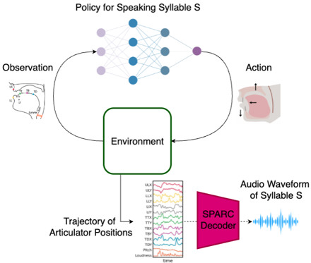
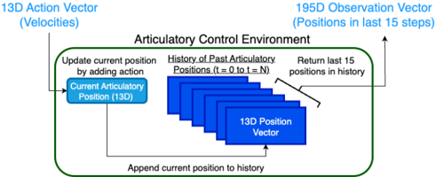

> [!abstract] arXiv · 2025 · Preprint
> **Akshay Anand et al.** (UC Berkeley) · [→ Paper](https://arxiv.org/abs/2510.05619) · Demo: ? · Code: ?
>
> Reframes speech generation as a motor-control problem, training a reinforcement learning policy to move vocal tract articulators directly rather than predicting acoustic features.

## Problem

Mainstream speech generation systems are large transformer-based models that map input signals to acoustic representations through opaque intermediate embeddings. This gives strong naturalness and expressiveness but little interpretability or grounding in how humans physically produce speech, which is a liability in applications such as clinical diagnosis of motor speech disorders, where practitioners need to trace an output back to an underlying articulatory cause rather than treat the model as a black box. Prior white-box articulatory models were rule-based and did not generalize, while newer neural articulatory representations (e.g. SPARC) establish a link between articulatory kinematics and acoustics but do not generate speech through an actual control process the way a human speaker does. The paper asks whether speech generation can instead be modeled as an explicit feedback control system over articulator movements.

## Method

The paper casts syllable-level speech production as a reinforcement learning control problem, directly analogous to a robot arm learning to move its joints toward a goal. A policy controls six vocal tract articulators (tongue dorsum, tongue blade, tongue tip, lower incisor, upper lip, lower lip), each with two spatial degrees of freedom, plus a loudness channel, giving a 13-dimensional continuous action space representing articulator velocities at each timestep. The state is a stack of the last 15 frames of articulator positions and loudness (195 dimensions), providing short-term motion history so the policy can infer direction of movement, which a single position snapshot cannot convey.

At the start of each episode the environment is configured with a target syllable, represented as an embedding. As the policy acts, the resulting articulator trajectory is decoded into an audio waveform at every step using SPARC, a pretrained articulatory-to-speech decoder. That partial waveform is passed to Sylber, a pretrained syllable-embedding and detection model, which extracts an embedding for the most recently detected syllable; the reward at each timestep is the cosine similarity between this embedding and the target syllable's embedding, with a fixed penalty of -1 if Sylber detects no syllable at all. Both SPARC and Sylber are used as fixed, pretrained components; only the control policy is trained. The policy and value function are both multi-layer perceptrons, trained with Proximal Policy Optimization (PPO) in an on-policy, online setting chosen to mirror how infants iteratively refine articulation from their own acoustic feedback. Six separate policies are trained, one per target syllable (please, road, fan, loot, cat, age), each for 25,000+ episodes of 50 timesteps (~1 second of speech), with action-noise standard deviation annealed from 0.7 to 0.05 over training to shift from broad exploration to stable control.

## Key Results

All six per-syllable policies converge, with reward and cosine-similarity-to-target curves rising steadily over training and stabilizing after an initial high-variance exploration phase (§3.1, Figure 4). At convergence, final similarity scores to the target syllable embedding range from 0.79 (fan) to 0.92 (please, age), exceeding 0.85 for four of six syllables (Table 1). Trajectory analysis of the "please" policy shows articulator movements tracing the expected phonetic sequence /p l iy z/ in order, including a bilabial closure for /p/, tongue-tip elevation for /l/, dorsum elevation for the vowel, and a truncated frication for /z/ (§3.2, Figure 5), indicating the learned control strategy is not just reward-maximizing but phonetically coherent. A single human reviewer transcribed the policy-generated audio for each syllable: please, loot, and cat were transcribed correctly, while road, fan, and age were misheard as "roar," "fand," and "we" respectively (§3.3, Table 1). The paper does not benchmark against any existing TTS system or report standard automatic intelligibility/naturalness metrics (WER, MOS, etc.); the only quantitative comparisons are its own reward and similarity curves and the single-rater transcription table.

## Novelty Assessment

The contribution is genuinely architectural at the level of framing: recasting speech generation as an RL-controlled motor task over explicit articulator trajectories, with a syllable-embedding model providing dense step-wise reward, is not a standard TTS pipeline pattern and is not merely a re-application of an existing generative architecture to a new domain. That said, the individual building blocks (PPO, MLP actor-critic, and two externally pretrained models, SPARC and Sylber) are all off-the-shelf; the novelty is entirely in how the control loop and reward signal are assembled, not in any new network component. The empirical validation is minimal by TTS standards: six isolated syllables, one training run per syllable rather than a shared multi-syllable policy, no comparison to any baseline synthesis system, and an intelligibility check performed by a single (unspecified) human transcriber rather than a listening panel. The paper itself is explicit that this is a proof of concept that "does not yet match the performance of current data-driven neural speech synthesis systems."

## Field Significance

Moderate — the paper introduces a genuinely different paradigm for speech generation, control-theoretic articulatory synthesis trained end-to-end with reinforcement learning and a learned perceptual reward, that stands apart from the acoustic-latent generative models that dominate current TTS. Its significance is primarily conceptual: it demonstrates feasibility of the idea at syllable scale with a single human transcriber's judgment, rather than providing evidence that this approach is competitive with or complementary to mainstream synthesis at any practical scale.

## Claims

- **supports:** A reinforcement learning policy can be trained to produce recognizable speech sounds purely from acoustic-similarity feedback, without ever being given a direct acoustic reconstruction loss on the output waveform.
  > *Evidence:* Six per-syllable PPO policies, rewarded only by cosine similarity between Sylber embeddings of generated and target audio, converge to similarity scores between 0.79 and 0.92, and a human transcriber correctly recognized three of the six generated syllables (please, loot, cat). *(§3.1, §3.3, Table 1)*
- **complicates:** Reward signals based on similarity to a target embedding can reinforce partially correct articulatory sequences, so a policy can achieve high similarity scores while still failing to realize the full intended phonetic sequence.
  > *Evidence:* Despite similarity scores of 0.87, 0.79, and 0.92 respectively, road, fan, and age were misheard by the human transcriber as "roar," "fand," and "we," showing the policy learns the onset of a syllable more reliably than its coda. *(§3.3, Table 1)*
- **refines:** Explicit, low-dimensional articulatory control can serve as an interpretable intermediate representation for speech generation, in which motor commands can be traced back to individual phonetic targets.
  > *Evidence:* The trained "please" policy's 13-dimensional articulator/loudness trajectory decomposes into distinguishable, temporally ordered gestures corresponding to /p/, /l/, /iy/, and /z/, allowing the sequence of phonemes to be read directly off the trajectory plot. *(§3.2, Figure 5)*
- **complicates:** Reinforcement-learning-based articulatory control frameworks, in their current form, face a substantial gap in scale and perceptual quality relative to data-driven neural speech synthesis.
  > *Evidence:* The framework trains one independent policy per syllable over six syllables total (not a shared policy or full-sentence generation), and the authors state explicitly that the model does not yet achieve the perceptual quality of current data-driven neural synthesis systems. *(§4 Discussion)*

## Limitations and Open Questions

> [!warning] The intelligibility evaluation is a single human transcriber judging six syllables produced by six independently trained per-syllable policies; there is no listening panel, no MOS/naturalness rating, no automatic ASR-based intelligibility check, and no statistical treatment of the result, so the reported "accurate human transcription" for three of six syllables should be read as an anecdotal feasibility signal rather than a validated intelligibility measure.

Beyond the evaluation methodology, the framework operates only at the isolated-syllable level with a separate policy trained per syllable; it does not yet demonstrate a single shared policy generalizing across syllables, connected speech, or sentence-level production, which the authors identify as a direction for future goal-conditioned RL work. The approach also depends entirely on two externally pretrained, fixed components (SPARC's articulatory decoder and Sylber's syllable embeddings), so its achievable quality is upper-bounded by what these existing models can represent and decode; the paper does not analyze how errors or limitations in SPARC or Sylber propagate into the control policy's behavior. No comparison to any existing TTS or articulatory-synthesis baseline is reported, so the framework's competitiveness on standard measures of naturalness or intelligibility (MOS, WER) is unknown.

## Wiki Connections

- [[self-supervised-speech|Self-Supervised Speech]] — the reward signal driving policy training is computed entirely from Sylber, a pretrained syllable-embedding model, making a self-supervised speech representation the central training signal rather than an auxiliary evaluation tool.
- [[subjective-evaluation|Subjective Evaluation]] — intelligibility is assessed through human transcription of the generated syllables rather than any automatic metric, though the evaluation is limited to a single rater.
- [[evaluation-metrics|Evaluation Metrics]] — the paper substitutes a novel embedding-similarity score (Sylber cosine similarity to a target syllable) for standard TTS quality metrics, since no existing benchmark measures articulatory-control-based synthesis quality.
