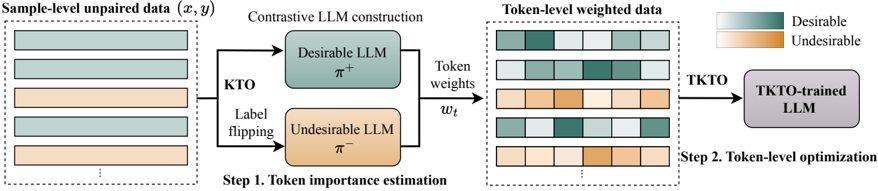

> [!abstract] arXiv · 2025 · Preprint
> **Rikuto Kotoge et al.** (SpiralAI Inc.) · [→ Paper](https://arxiv.org/abs/2510.05799) · Demo: ? · Code: ?
>
> Introduces TKTO, a token-level extension of Kahneman-Tversky Optimization that eliminates the need for paired preference data and automatically concentrates reward on the specific tokens responsible for pronunciation errors in LLM-based TTS.

## Problem

Preference optimization methods such as DPO have been applied to LLM-based TTS to improve intelligibility and naturalness, but they require paired desirable/undesirable samples for the same utterance. In practice, TTS systems tend to produce consistently correct or consistently incorrect output for a given input, so genuinely paired samples are rare, wasting most collected feedback and severely limiting the amount of usable training data. A second, orthogonal problem is granularity: pronunciation correctness is a token- or character-level property (e.g. which reading of an ambiguous word was produced), yet DPO-style preference optimization assigns a single utterance-level label, forcing the model to learn from a coarse signal that does not localize which tokens were actually responsible for the error.

## Method

The paper formulates TTS as autoregressive generation of an acoustic token sequence from input text, with the LLM decoder producing tokens that are converted to waveform by a vocoder (§2). The base model is CosyVoice2 (0.5B parameters), fine-tuned on 20K hours of Japanese speech, further adapted per-speaker on 23 hours of speech for each of a female and a male Japanese speaker (§4.1).

TKTO (Token-level Kahneman-Tversky Optimization) operates in two steps (Figure 2, §3). First, two contrastive LLMs, π+ and π-, are trained on the same unpaired desirable/undesirable preference data using the KTO objective, with π- trained on the same data but with desirable/undesirable labels swapped. The log-ratio between π+ and π- at each token position estimates a token-level importance weight (clamped to a bounded range to stabilize optimization), so that tokens on which the two contrastive models disagree strongly are treated as more diagnostic of the preference signal. Second, TKTO defines a per-token reward as the log-ratio between the policy model and a reference policy, combines it with a KL-based per-token reference baseline, and passes it through a logistic (prospect-theoretic) value function identical in form to KTO's utterance-level value function but applied independently at every token. The final TKTO loss is the importance-weighted sum of these per-token values across the sequence (§3.2, Eq. 6), replacing the single utterance-level term used by KTO and DPO.

Because KTO (unlike DPO) does not require paired comparisons, the desirable and undesirable samples used to build π+/π- and to compute the TKTO loss can come from unpaired pools: for each text sentence, five synthesized speech samples per speaker are generated, and the samples with lowest/highest character error rate (CER, measured with Whisper-large-v3) are labeled desirable/undesirable independently, without needing both labels to originate from the same utterance. Training the two contrastive LLMs adds a small pre-computation step (about 10 minutes on 8×A100 GPUs in the paper's setup), and all preference-optimization runs use 1 epoch at a 1e-6 learning rate (§4.4, Appendix B).

## Key Results

On a purpose-built Japanese benchmark targeting the ambiguous word "辛い" (karai/tsurai), TKTO trained on unpaired data raises pronunciation accuracy from 0.683/0.668 (base CosyVoice2 model, female/male) to 0.949/0.958, and reduces CER from 0.128/0.138 to 0.075/0.085, while also lowering the bad-case ratio (CER > 0.3) to 0.029/0.027 (§4.2, Table 1). These numbers exceed the paired-data TKTO variant (0.681/0.701 accuracy, limited to 1.5K paired samples) and exceed standard unpaired KTO (0.933/0.952 accuracy) on every metric, and also surpass reference industry systems gpt-4o-mini-tts and gemini-2.5-pro-preview-tts on both accuracy and CER (§4.2). The unpaired training pool is about 6× larger than the paired pool (9K vs. 1.5K samples) because only 10.5% of generated utterances contain both a desirable and an undesirable sample (§4.4). In the token-weight analysis, the target ambiguous-character tokens receive an average reward of 0.22 versus 0.12 overall on desirable samples, and the paper reports token rewards on targeted tokens are 12.8× stronger than baseline (§4.2, Figure 4). In subjective evaluation, NMOS improves from 4.09 (base) to 4.17 (KTO) to 4.21 (TKTO) (Table 2, §4.3). On a second, independently constructed Chinese polyphonic-disambiguation benchmark ("行", xíng/háng), unpaired TKTO again gives the best results (accuracy 0.898 vs. 0.645 base, CER 0.014 vs. 0.024 base) (§4.5, Table 3), and a robustness check with a different ASR backend (parakeet-tdt_ctc-0.6b-ja) confirms the same ranking as with Whisper (Appendix D, Table 5).

## Novelty Assessment

The core contribution is a training-objective extension: lifting KTO's utterance-level prospect-theoretic value function to the token level, using a pair of contrastively-trained LLMs (trained on original vs. label-swapped preference data) to derive per-token importance weights without any token-level annotation. This is a genuine and reasonably elegant extension of KTO (Ethayarajh et al., 2024) and connects to prior token-level importance-sampling work; it does not modify the underlying TTS architecture (CosyVoice2 is used unchanged as the backbone). The main practical benefit demonstrated, working around the pairing bottleneck of DPO-style preference data in TTS, is well-motivated and empirically supported. The evaluation, however, is narrow: both benchmarks are specifically constructed around a single ambiguous word/character in each language, all experiments use a single 0.5B parameter model, and results are not shown for general naturalness or robustness gains outside this targeted pronunciation-disambiguation setting.

## Field Significance

Moderate — this paper provides a token-level preference-optimization objective that removes the paired-data requirement standing in the way of DPO-style alignment for TTS pronunciation errors, and demonstrates the resulting data efficiency and accuracy gains on two independently constructed disambiguation benchmarks (Japanese and Chinese). Its evidence is confined to a single 0.5B backbone and a narrow, hand-built evaluation targeting specific ambiguous tokens, so it functions as a useful addition to the TTS preference-optimization toolkit rather than a benchmark-redefining result.

## Claims

- **supports:** Reformulating preference optimization to accept unpaired desirable/undesirable samples substantially increases usable training data relative to paired formulations in TTS, because TTS systems tend to produce consistently correct or consistently incorrect output rather than genuinely paired successes and failures for the same input.
  > *Evidence:* Only 10.5% of generated utterances contained both a desirable and an undesirable sample; paired methods (DPO) were limited to 1.5K samples while unpaired methods used 9K samples, roughly 6× more usable data. *(§4.4, Table 1)*
- **supports:** Token-level importance weighting derived from contrastive preference models can automatically concentrate optimization signal on the specific tokens responsible for a preference difference, without requiring token-level human annotation.
  > *Evidence:* The token corresponding to the ambiguous target character received an average reward of 0.22 versus an overall mean of 0.12 for desirable samples, and -1.54 for undesirable samples, and a case study showed weights concentrated on the target character's tokens. *(§4.2, Figures 4-5)*
- **complicates:** Utterance-level paired preference optimization for TTS is prone to relying on a narrow, biased subset of training examples, which limits the learning signal and reduces generalization compared to formulations that can use unpaired data.
  > *Evidence:* Paired DPO/KTO training was restricted to the rare subset of utterances where both a correct and an incorrect pronunciation sample existed for the same text, and underperformed unpaired variants across accuracy, CER, and bad-case ratio on both speakers. *(§4.2, Table 1)*
- **refines:** Preference-optimization gains for pronunciation disambiguation in LLM-based TTS are not specific to a single language's script or phonology, but transfer to token-level ambiguity structures (e.g. heteronyms/polyphones) in a second, typologically different language.
  > *Evidence:* Applying the same TKTO method to a Chinese polyphonic-character benchmark ("行") improved accuracy from 0.645 (base) to 0.898 (unpaired TKTO) and reduced CER from 0.024 to 0.014, mirroring the Japanese results. *(§4.5, Table 3)*
- **complicates:** Reported gains from a novel preference-optimization objective for TTS may not indicate how the method behaves at larger model scale, when only a single small backbone size has been tested.
  > *Evidence:* All experiments use a single 0.5B-parameter CosyVoice2 backbone; the authors state that larger versions of the same backbone were not publicly available and computational constraints prevented scaling experiments. *(§Limitations)*

## Limitations and Open Questions

The paper's own Limitations section notes that evaluation is restricted to challenging Japanese and Chinese pronunciation-disambiguation data, and that only a single 0.5B model size was tested because larger checkpoints of the same backbone were unavailable and further pretraining was computationally infeasible; scaling behavior and transfer to other model architectures are left unexplored. The benchmarks themselves are also narrow by construction: both the Japanese and Chinese evaluation sets are built around a single ambiguous word/character, so it is unclear how the method performs on naturalness or robustness dimensions unrelated to targeted pronunciation correctness, or on a broader vocabulary of ambiguous cases. TKTO is described as an off-policy method; the authors note extending it to an on-policy setting is left to future work.

## Wiki Connections

- [[rlhf-speech|RLHF Speech]] — extends the KTO branch of preference optimization (rather than DPO) to the token level for TTS, removing the paired-sample requirement that limits utterance-level preference alignment.
- [[autoregressive-codec-tts|Autoregressive Codec TTS]] — applies its preference-optimization method to an autoregressive LLM-based TTS backbone that generates acoustic tokens conditioned on text.
- [[neural-codec|Neural Audio Codec]] — operates directly over the acoustic token sequence produced by the codec-based TTS backbone, assigning importance weights at the token level.
- [[subjective-evaluation|Subjective Evaluation]] — validates objective CER/accuracy gains with human-rated naturalness (NMOS) and ABX preference tests conducted by Japanese native annotators.
- [[2412.10117|CosyVoice 2]] — uses CosyVoice2 (0.5B) as the base LLM-based TTS backbone that TKTO fine-tunes via preference optimization.
- [[2025.acl-long.313|F5-TTS]] — includes F5-TTS (with and without G2P) as a non-LLM flow-matching baseline, which shows much lower pronunciation accuracy than the LLM-based models on the ambiguous-pronunciation benchmark.
- [[2025.acl-long.598|INTP]] — is direct prior work applying preference alignment (DPO-style) to zero-shot TTS intelligibility, which this paper's TKTO method extends to the token level to address its paired-data requirement.
