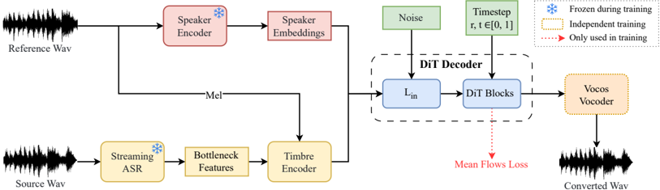

> [!abstract] arXiv · 2025 · Preprint
> **Guobin Ma et al.** (Northwestern Polytechnical University (ASLP@NPU)) · [→ Paper](https://arxiv.org/abs/2510.08392) · Demo: ✓ · Code: ✓
>
> Introduces a 14M-parameter streaming zero-shot voice conversion system that combines chunk-wise autoregressive denoising with a mean-flow objective to achieve single-step (1-NFE) spectrogram generation.

## Problem

Streaming zero-shot voice conversion has settled into two architectural camps, each failing one of the three practical requirements (fast, lightweight, high-fidelity). Autoregressive (AR) language-model-based systems (StreamVoice, StreamVoice+) produce high-fidelity output but rely on sequential decoding, which incurs high latency, and require large parameter counts (101M-153M) to reach strong quality, ruling out real-time CPU inference. Non-autoregressive (NAR) systems trade this off differently: lightweight conformer-based models (DualVC2) generalize poorly to unseen speakers in zero-shot settings, while diffusion-transformer approaches (Seed-VC) that use sliding-window processing to enable streaming can fragment long-term context and speaker characteristics because of the fixed window size. No existing streaming VC system had combined AR-level consistency with NAR-level speed and a small parameter footprint.

## Method

MeanVC follows the standard recognition-synthesis VC pipeline: a streaming ASR module (Fast-U2++) extracts bottleneck features (BNFs) from the source waveform; a timbre encoder fuses these BNFs with fine-grained timbre information from a reference mel-spectrogram; a pre-trained speaker encoder (ECAPA-TDNN) extracts speaker embeddings from a reference waveform; and a diffusion transformer (DiT) decoder generates the converted mel-spectrogram conditioned on both signals, which Vocos then renders to a 16 kHz waveform.

The central design is a chunk-wise autoregressive denoising strategy applied inside the DiT decoder. BNFs are divided into small chunks (160 ms by default), and a chunk-wise causal attention mask (inspired by MoonCast's masking scheme) lets each noisy chunk attend to itself and up to K preceding clean chunks, while clean chunks attend only to themselves. This preserves cross-chunk speaker and context consistency without requiring full-sequence AR decoding. During inference, previously generated clean mel-spectrogram chunks are concatenated as a cache, enabling streaming generation chunk by chunk.

To remove the multi-step sampling cost inherent to conditional flow matching (CFM), MeanVC adopts mean flows: instead of regressing the instantaneous velocity field, the model regresses the average velocity field over a time interval, derived via a Jacobian-vector product identity, so that a single function evaluation (1-NFE) can map directly from the prior noise sample to the endpoint of the flow trajectory. When the interval endpoints coincide, the objective reduces to standard flow matching. Finally, a diffusion adversarial post-training (DAPT) stage is added to counteract the over-smoothing typical of one-step flow-matching output: the DiT generator's own weights initialize a discriminator backbone, augmented with cross-attention-only blocks at two of its four layers, and the pair is trained adversarially to sharpen high-frequency spectral detail.

The full VC module has 14M parameters, trained on a DNSMOS-filtered 10,000-hour Mandarin subset of Emilia, with 100 ms-scale streaming ASR features and mel-spectrogram targets (no discrete audio codec is used).

## Key Results

On the Seed-TTS Mandarin test set (2,018 zero-shot source-target pairs), MeanVC outperforms StreamVoice and Seed-VC on NMOS (3.82 vs. 3.81/3.76), SMOS (3.87 vs. 3.67/3.62), CER (5.01% vs. 9.32%/6.03%), and SSIM (0.687 vs. 0.543/0.582), while using far fewer parameters (14M vs. 101M for StreamVoice and 25M for Seed-VC). It trails Seed-VC only on DNSMOS (3.76 vs. 3.84), which the authors attribute to its smaller parameter budget. On efficiency, the VC module alone reaches an RTF of 0.136 on a single-core, single-thread AMD EPYC 7542 CPU (vs. 7.039 for Seed-VC and 13.632 for StreamVoice), and the full pipeline (ASR + VC + vocoder) achieves an overall RTF of 0.322 with 211.52 ms end-to-end chunk latency, comfortably under the real-time threshold, without any inference-time quantization.

In an intra-dataset comparison against DualVC2 (matched parameter count, trained from scratch on the same filtered Emilia data plus AISHELL-3), MeanVC outperforms DualVC2 on DNSMOS, CER, and SSIM both on clean and noisy source recordings even before fine-tuning, with the largest margin appearing under noisy input (CER 12.84% vs. 16.28%). Ablations show that removing DAPT degrades all metrics, removing the clean-chunk cache substantially worsens CER (train-inference mismatch), and shrinking the chunk size to 80 ms halves latency but noticeably hurts CER and DNSMOS, while increasing it to 200 ms improves quality at a 25% latency cost, confirming an explicit latency-quality trade-off around the 160 ms default.

## Novelty Assessment

The core novelty is architectural: MeanVC is, to the authors' knowledge, the first system to combine chunk-wise autoregressive attention masking with a mean-flow training objective inside a DiT decoder specifically for streaming zero-shot VC, unifying properties from AR (context consistency) and NAR (parallel, single-step generation) paradigms that prior streaming VC work treated as mutually exclusive. The individual components, however, are not new: mean flows, DiT, chunk-wise causal masking, and adversarial post-training on a self-initialized discriminator are all adapted from prior work in image/video generation, TTS, or podcast generation and applied here to VC. The contribution is therefore best read as a novel recombination of existing generative-modeling techniques for a new efficiency point in streaming VC, rather than a new generative principle. The evaluation is reasonably fair (matched-parameter DualVC2 retrained on identical data) but is restricted to Mandarin speech and a single held-out ASR/vocoder configuration, so generalization to other languages or acoustic domains is untested.

## Field Significance

Moderate — the paper demonstrates that a mean-flow objective combined with chunk-wise causal masking can deliver competitive zero-shot VC quality at roughly an order of magnitude fewer parameters and inference cost than prior streaming VC systems, providing a concrete efficiency data point for streaming voice conversion. Its scope is narrow (Mandarin-only training and evaluation, single-lab short-paper format) and its architectural components are individually borrowed, so it reads as a solid engineering advance within streaming VC rather than a new generative paradigm.

## Claims

- **supports:** Regressing the average velocity field of a flow-matching trajectory (mean flows) enables competitive single-step (1-NFE) generation quality in speech synthesis tasks beyond the image domain in which the technique was introduced.
  > *Evidence:* MeanVC's mean-flow-trained DiT decoder reaches 1-NFE sampling that outperforms multi-step diffusion (Seed-VC) and AR (StreamVoice) baselines on NMOS, SMOS, CER, and SSIM on the Seed-TTS Mandarin test set. *(§3.2, Table 1)*
- **supports:** Chunk-wise causal attention masking allows non-autoregressive decoders to retain autoregressive-style long-term context consistency without paying the latency cost of full sequential decoding.
  > *Evidence:* The chunk-wise causal mask, which lets each noisy chunk attend to up to K preceding clean chunks, produces a full-pipeline RTF of 0.322 and 211.52 ms latency while still improving SSIM and CER over conformer-based (DualVC2) and diffusion sliding-window (Seed-VC) alternatives. *(§2.2, §3.2, Table 1)*
- **complicates:** Reducing streaming chunk size to lower latency degrades conversion quality, indicating a hard latency-quality trade-off rather than a free efficiency gain in chunk-based streaming generation.
  > *Evidence:* Shrinking the chunk size from 160 ms to 80 ms halves per-chunk latency but raises CER from 5.01% to 9.97% and lowers DNSMOS from 3.76 to 3.56; increasing to 200 ms improves DNSMOS to 3.83 and lowers CER to 4.42% at a 25% latency increase. *(§3.4, Table 3)*
- **complicates:** Reducing model parameter count in a flow-matching-based generator can trade off perceptual audio quality (as measured by non-intrusive quality predictors) even when other quality metrics improve.
  > *Evidence:* MeanVC's 14M-parameter model achieves higher NMOS, SMOS, CER, and SSIM than the 25M-parameter Seed-VC baseline but scores lower on DNSMOS (3.76 vs. 3.84), which the authors attribute directly to its smaller parameter size. *(§3.2, Table 1)*
- **refines:** Adversarial post-training initialized from a generator's own weights can mitigate the over-smoothing artifacts characteristic of one-step (or few-step) flow-matching/diffusion mel-spectrogram generation.
  > *Evidence:* Ablating the diffusion adversarial post-training (DAPT) stage degrades DNSMOS (3.76 → 3.68), CER (5.01% → 5.86%), and SSIM (0.687 → 0.673), attributed to reduced correction of bright-line, high-frequency artifacts in the generated mel-spectrograms. *(§2.4, §3.4, Table 3)*

## Limitations and Open Questions

Training and both evaluation sets (Seed-TTS Mandarin test set, AISHELL-3) are restricted to Mandarin speech; the paper reports no results on other languages or on cross-lingual voice conversion, so it is untested whether the chunk-wise mean-flow approach generalizes beyond this setting. Efficiency numbers are measured on a single CPU configuration without quantization, and the paper does not report GPU inference numbers or behavior under concurrent multi-stream serving. The DNSMOS gap relative to Seed-VC is attributed to parameter count but not further diagnosed (e.g., whether it stems from the smaller DiT decoder specifically or from another architectural difference). The ablation study varies chunk size only across three values (80/160/200 ms) and does not explore the maximum context window K systematically beyond a brief note that very short chunks with too much historical access degrade performance.

## Wiki Connections

- [[flow-matching|Flow Matching]] — MeanVC adapts the mean-flow reformulation of flow matching (regressing the average rather than instantaneous velocity field) to achieve 1-NFE sampling in a DiT-based VC decoder.
- [[voice-conversion|Voice Conversion]] — the paper's entire contribution is a streaming, zero-shot voice conversion system built on the standard recognition-synthesis pipeline.
- [[zero-shot-tts|Zero-Shot TTS]] — MeanVC targets zero-shot speaker transfer to unseen target speakers via reference-waveform speaker embeddings and reference-mel timbre conditioning, the same prompt-conditioning paradigm used in zero-shot TTS.
- [[streaming-tts|Streaming TTS]] — the chunk-wise autoregressive denoising strategy and causal attention mask are designed specifically to enable low-latency, chunk-by-chunk streaming generation.
- [[gan-vocoder|GAN Vocoder]] — the diffusion adversarial post-training stage applies adversarial training directly to the mel-spectrogram generator to counteract over-smoothing, and the pipeline uses Vocos as its output vocoder.
- [[2411.09943|Seed-VC]] — used as the primary diffusion-transformer streaming VC baseline, which MeanVC outperforms on NMOS, SMOS, CER, and SSIM at roughly half the parameter count.
- [[2406.02430|Seed-TTS]] — its Mandarin test set (2,018 source-target pairs) is used as the zero-shot evaluation benchmark for MeanVC and both baselines.
- [[2503.14345|MoonCast]] — MeanVC's chunk-wise causal attention mask is directly inspired by MoonCast's masking strategy, adapted here from podcast generation to streaming voice conversion.
