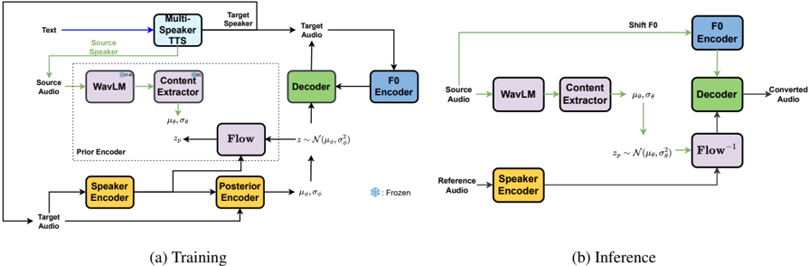

> [!abstract] EMNLP · 2025 · Conference
> **Huu Tuong Tu et al.** (VNPT AI / Hanoi University of Science and Technology / National Economics University) · [→ Paper](https://arxiv.org/abs/2510.09061) · Demo: ✓ · Code: ?
>
> Trains a voice conversion model directly on synthetic source-target speech pairs generated by a multi-speaker TTS system, replacing reconstruction-based feature disentanglement with a direct input-output mapping objective.

## Problem

Voice conversion systems typically decompose speech into content and speaker-identity representations that are recombined at inference, whether via ASR-derived phonetic posteriorgrams, self-supervised bottleneck features, or k-nearest-neighbor retrieval over self-supervised embeddings. Disentangling these factors cleanly is difficult in practice: text-based content encoders introduce transcription and alignment errors, and self-supervised bottleneck or vector-quantization methods trade off between retaining residual speaker information (if the bottleneck is too wide) and losing content information (if it is too narrow). Because these systems are trained with a reconstruction objective on real audio (input and target are the same utterance), they never see an explicit example of what a genuine speaker-to-speaker transformation with fixed content should look like, which the paper argues is a mismatch with the actual voice conversion objective.

## Method

The core idea is to sidestep disentanglement entirely by constructing training pairs where source and target audio are guaranteed to share identical linguistic content but differ only in speaker identity. This is achieved by driving a pretrained multi-speaker VITS text-to-speech model with the same encoded linguistic latent (text encoding, duration, and prosody) but two different speaker embeddings, producing a source and a target utterance from a single shared linguistic latent trajectory rather than two independently generated utterances. The resulting pairs are frame-aligned by construction, removing the need for forced alignment or symbolic (phoneme/text) intermediates.

The voice conversion model itself adopts a FreeVC-style VAE + GAN backbone: source audio is passed through a frozen pretrained WavLM and a content extractor to obtain a content distribution, while target audio is passed through a speaker encoder and posterior encoder to obtain a posterior latent distribution regularized toward the content-derived prior via a KL loss. Because the synthetic target differs from the source primarily in pitch, the target's F0 is extracted and fed to the decoder as an explicit conditioning feature to prevent pitch/content mismatch during training.

Training proceeds in two phases. Phase 1 trains the full pipeline on synthetic VITS-generated pairs (drawn from the same speaker pool used in the original VITS/VCTK release), with WavLM kept frozen; this phase learns speaker-independent content representations from clean, perfectly aligned supervision. Phase 2 fine-tunes on real multi-speaker recordings (LibriSpeech train-clean-100/360) with a standard reconstruction objective (input = output audio), while keeping WavLM and the content extractor frozen to preserve the speaker-independence learned in phase 1; this phase adapts the model to unseen speakers and out-of-domain audio without requiring any transcripts. At inference, a reference (prompt) audio supplies the target speaker embedding, and the source F0 is median-shifted to match the reference F0 before being passed to the decoder, enabling any-to-any zero-shot conversion. The training objective combines the standard VAE/GAN loss terms used in FreeVC: a KL divergence loss, a phase-dependent L1 reconstruction/conversion loss on mel-spectrograms, adversarial and feature-matching losses.

## Key Results

On any-to-any zero-shot conversion (LibriSpeech test-clean, 1,000 sampled pairs), the proposed method reports the best intelligibility among the compared systems (WER 1.74, CER 0.53) and the highest speaker cosine similarity (SECS 86.70), against FreeVC, KNN-VC, Diff-HierVC, DDDM-VC, and FaCodec (NaturalSpeech 3) baselines run from their official released checkpoints (§4.2, Table 1). This corresponds to the paper's headline 16.35% relative WER reduction and 5.91% SECS improvement over the strongest prior methods. Subjective naturalness (MOS 3.42) trails FreeVC's 3.60, which the authors attribute to FreeVC being trained on cleaner VCTK-quality data versus their LibriSpeech fine-tuning corpus; a combined naturalness/similarity metric (B-MOS) still favors the proposed method overall (§5.1, Table 1).

Ablations (Table 2) show that removing the F0 encoder, or skipping phase-2 fine-tuning, each degrades WER/CER; removing phase-2 fine-tuning is especially damaging to speaker similarity (SECS drops from 86.70 to 70.78) while naturalness actually improves slightly, indicating that phase-1-only training yields clean but speaker-generic content representations that do not transfer to unseen speakers (§5.2). Clustering-based leakage metrics (ARI, NMI, Silhouette) computed on content embeddings are lower for the proposed model than for FreeVC on the same backbone, supporting a claim of reduced speaker leakage into the content stream (§5.2, Table 3). Language-adaptation experiments (Chinese, Italian, Vietnamese) show phase-2 fine-tuning on unlabeled target-language audio substantially reduces CER/WER relative to the phase-1-only model, though a gap to ground-truth transcription accuracy remains in all three languages (§5.3–A.2, Table 4).

## Novelty Assessment

The backbone architecture (VAE + GAN + speaker/content/F0 conditioning, following FreeVC) is not new. The genuine contribution is the training paradigm: using a multi-speaker TTS model to synthesize frame-aligned source-target pairs that differ only in speaker identity, and training the voice conversion model as a direct supervised mapping rather than a reconstruction task. The paper explicitly frames this as the first use of synthetic TTS-generated parallel data for voice conversion training, which is a training-objective innovation rather than a model-structure one. The two-phase synthetic-then-real fine-tuning recipe and the explicit F0 conditioning are comparatively incremental engineering additions layered on top of this core idea. Evaluation is thorough for a findings-track paper (objective + subjective metrics, an ablation, a leakage-clustering analysis, and language-adaptation experiments), but all baselines are run from public checkpoints trained on different data than the proposed model's LibriSpeech fine-tuning stage, which complicates strict naturalness comparisons.

## Field Significance

Moderate — this paper demonstrates that a multi-speaker TTS model can be repurposed as a synthetic-data generator to supply direct, alignment-free input-output supervision for voice conversion training, avoiding the disentanglement bottleneck that reconstruction-based VC methods face. It provides useful quantitative evidence (leakage-clustering metrics, F0-PCC, ablations) that this training signal reduces measurable speaker leakage relative to a matched reconstruction-trained baseline, but the underlying architecture is a known FreeVC-style backbone and the language-adaptation results still trail ground truth.

## Claims

- **supports:** Training a voice conversion model on frame-aligned synthetic pairs (same content, different speaker, generated from a shared TTS linguistic latent) can outperform reconstruction-based disentanglement training on speaker similarity and intelligibility.
  > *Evidence:* Against FreeVC, KNN-VC, Diff-HierVC, DDDM-VC, and FaCodec baselines on LibriSpeech test-clean, the synthetic-data-trained model achieves the best WER (1.74), CER (0.53), and SECS (86.70) among all compared systems. *(§5.1, Table 1)*
- **supports:** Explicit F0 conditioning at the decoder helps a voice conversion model preserve pitch contours when source and target utterances differ in speaker-driven pitch statistics.
  > *Evidence:* Removing the F0 encoder increases WER (1.74→2.07) and CER (0.53→0.61); the full model also reports the highest F0 Pearson correlation coefficient among compared systems, including a diffusion-based baseline that also conditions on F0. *(§5.2, Table 2, Figure 3)*
- **complicates:** A voice conversion model trained purely on synthetic TTS-generated pairs from a fixed speaker pool does not generalize speaker similarity to unseen speakers without additional fine-tuning on real, speaker-diverse data.
  > *Evidence:* Removing phase-2 real-data fine-tuning drops SECS from 86.70 to 70.78, even though the phase-1-only model's NISQA naturalness score is higher (4.59 vs. 4.04), showing the synthetic-only model produces clean audio but fails to transfer to out-of-domain speakers. *(§5.2, Table 2)*
- **supports:** Content representations trained with a synthetic parallel-data objective can retain measurably less residual speaker identity than representations trained via a reconstruction objective on the same backbone.
  > *Evidence:* On clustering-based leakage metrics (Adjusted Rand Index, Normalized Mutual Information, Silhouette Score) computed on content embeddings, the proposed model scores lower than FreeVC (same backbone architecture) on all three metrics, and t-SNE visualization shows more speaker-dispersed content embeddings. *(§5.2, Table 3, Figure 2)*
- **complicates:** Fine-tuning a voice conversion model to a new language using only unlabeled target-language audio narrows, but does not close, the intelligibility gap to native ground-truth speech.
  > *Evidence:* After phase-2 language adaptation, CER/WER against ground-truth transcriptions remains higher than the ground-truth ASR baseline in all three tested languages (e.g., Vietnamese 8.83 vs. 2.53 ground truth, Italian 22.62 vs. 11.96 ground truth). *(§Appendix A.2, Table 4)*

## Limitations and Open Questions

The authors' own stated limitation is that the approach depends on access to a high-quality, well-labeled multi-speaker corpus to first train the TTS system that generates the synthetic training pairs, and the paper does not explore how synthetic data quality from different TTS backbones would affect downstream voice conversion performance (§Limitations). Baseline naturalness (MOS) comparisons are also confounded by training-data quality differences: FreeVC is trained on the cleaner VCTK corpus while the proposed model's phase-2 fine-tuning uses LibriSpeech, which the authors themselves note likely disadvantages their MOS score independent of the method itself (§5.1). Language-adaptation and emotion-preservation experiments (Appendix A) are secondary analyses on relatively small evaluation sets (400 utterances per language, 400 emotional clips) rather than the paper's core evaluation.

## Wiki Connections

- [[voice-conversion|Voice Conversion]] — proposes a synthetic-data training paradigm as an alternative to reconstruction-based disentanglement for any-to-any voice conversion.
- [[disentanglement|Disentanglement]] — replaces implicit feature disentanglement with frame-aligned synthetic supervision, and quantifies residual speaker leakage in the resulting content representations via clustering metrics.
- [[self-supervised-speech|Self-Supervised Speech]] — uses a frozen pretrained WavLM as the source-audio content extractor within the conversion pipeline.
- [[speaker-adaptation|Speaker Adaptation]] — relies on a phase-2 real-data fine-tuning stage specifically to adapt the synthetic-data-trained model to unseen, out-of-domain speakers.
- [[prosody-control|Prosody Control]] — introduces an explicit F0 extraction-and-shifting mechanism to condition the decoder on target pitch independent of the content representation.
- [[multilingual-tts|Multilingual TTS]] — fine-tunes the same voice conversion model on unlabeled speech from three additional languages (Chinese, Italian, Vietnamese) to test cross-lingual adaptation.
- [[2403.03100|NaturalSpeech 3]] — used as the FaCodec baseline in the any-to-any voice conversion comparison (Table 1).
- [[2104.00355|Speech Resynthesis from Discrete Disentangled Self-Supervised Representations]] — representative of the self-supervised, text-free disentanglement line of work this paper positions itself against.
- [[2312.15185|emotion2vec]] — used to extract emotion embeddings for the appendix analysis of emotional information preservation in converted speech.
- [[2206.08317|Paraformer]] — used as the Chinese ASR tool for computing CER in the language-adaptation experiments.
- [[2012.03411|MLS]] — supplies the Italian training and evaluation data used in the language-adaptation experiments.
