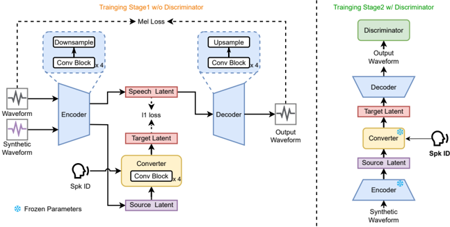

> [!abstract] arXiv · 2025 · Preprint
> **Zhao Guo et al.** (Northwestern Polytechnical University (ASLP@NPU)) · [→ Paper](https://arxiv.org/abs/2510.09245) · Demo: ✓ · Code: ?
>
> Trains a lightweight, low-latency streaming voice conversion system end-to-end on synthetic parallel data generated by a pretrained zero-shot VC model, avoiding the ASR bottleneck features and explicit content-speaker disentanglement that conventional streaming VC pipelines rely on.

## Problem

Streaming voice conversion (VC) must operate causally, with strictly limited access to future context, which magnifies the shortcomings of conventional disentanglement strategies. ASR-based bottleneck-feature (BNF) pipelines suffer performance degradation under streaming ASR constraints, incur latency from ASR lookahead requirements, and propagate errors through a cascaded pipeline. Speech representation disentanglement (SRD) methods that avoid ASR still require carefully tuned architectures to balance speaker similarity against naturalness, and this balance is harder to maintain under streaming constraints. The paper's premise is that both families of approach inherit structural complexity from trying to explicitly separate content and speaker information, and that this complexity is precisely what breaks down when future context is limited.

## Method

SynthVC sidesteps explicit disentanglement by training supervised, end-to-end, on synthetic parallel data. A pretrained zero-shot VC model (Seed-VC) is used purely as a data generator: given a source utterance and a randomly sampled reference utterance from a timbre-diverse pool (built from Emilia), Seed-VC produces a converted waveform. The original speaker ID is retained as the target label, yielding training triplets that let SynthVC learn to reverse the timbre shift introduced by the generator and recover the original speaker's characteristics.

The backbone is AudioDec, a causal encoder-quantizer-decoder neural codec, modified by removing the vector-quantization layer to keep the latent space continuous and fully differentiable. A dedicated Converter module (four convolutional blocks with residual units) is inserted between the encoder and decoder; it takes the source latent plus a learnable embedding of the target speaker ID and outputs a transformed latent matching the target timbre. The authors report that training the autoencoder directly on synthetic waveform pairs (i.e., converting at the waveform level rather than in latent space) causes over-smoothing, since mel-spectrogram L1 losses average across timbre variation when several speaker identities are involved; separating compression (encoder/decoder) from timbre transformation (Converter) is presented as the fix.

Training proceeds in two stages. Stage 1 jointly optimizes the encoder, decoder, and converter with a weighted combination of mel-spectrogram reconstruction loss and an L1 conversion loss between the converted latent and the target-speaker latent (weights 45 and 5). Stage 2 freezes the encoder and converter and fine-tunes only the decoder adversarially, using UnivNet-style discriminators (multi-resolution spectrogram discriminator and multi-period discriminator) with mel, adversarial, and feature-matching losses (weights 45, 1, 2). To avoid a training/inference mismatch, stage 2 uses "Aligned Training": the decoder is fed the Converter's output during training (matching what it receives at inference) rather than the raw encoder output. Inference operates on 1-second chunks with a 50 ms chunk size; total latency is chunk size plus measured inference time. Three size variants (small/base/large) trade parameter count (8.24M / 14.7M / 57.56M) and latent dimension (192/256/512) for quality and speed.

## Key Results

On AISHELL-3 (218 Mandarin speakers, 10 held-out target speakers), SynthVC-base reaches N-MOS 3.51, S-MOS 3.77, and I-MOS 3.76, outperforming both baselines — DualVC2 (an ASR-BNF streaming model: N-MOS 3.41, S-MOS 3.65, I-MOS 3.78) and DualVC3 in stand-alone mode (an SRD-based streaming model: N-MOS 3.19, S-MOS 3.57, I-MOS 3.46) — across naturalness and speaker similarity, though not on intelligibility MOS versus DualVC2. Seed-VC, the non-streaming zero-shot model used as SynthVC's own data generator, scores highest overall (N-MOS 4.02, S-MOS 4.34) but is explicitly excluded from the streaming comparison since it is not latency-constrained.

Objectively, SynthVC-base achieves CER 6.27% and SPK-COS 0.626, both better than DualVC2 (CER 6.31%, SPK-COS 0.530) and DualVC3 (CER 9.77%, SPK-COS 0.511). SynthVC-base's SPK-COS (0.626) is reported as slightly higher than Seed-VC's (0.611), which the authors attribute to SynthVC converting into a fixed, closed set of target speakers rather than performing zero-shot inference across arbitrary speakers — the comparison is not apples-to-apples on this dimension. On latency (measured single-core on an Intel i5-10210U CPU), SynthVC-small/base/large total 71.9/77.1/96.3 ms versus DualVC2's 186.4 ms and DualVC3's 43.58 ms; DualVC3 is faster but trails substantially on every quality metric. Ablations (Figure 3, spectrogram comparison) show that removing the Converter causes over-smoothed, high-frequency-deficient output, and removing Aligned Training introduces spectral artifacts from the training/inference distribution mismatch.

## Novelty Assessment

The architectural backbone (AudioDec codec, UnivNet-style discriminators) is entirely reused from prior work; the paper's contribution is the training recipe built around it. Two elements are genuinely new in combination: (1) using a pretrained zero-shot VC model purely as a synthetic-parallel-data generator to supervise a separate, lightweight streaming converter, sidestepping ASR/disentanglement modules entirely, and (2) the latent-space Converter plus Aligned Training design, which the paper's own ablations show is necessary to avoid over-smoothing and training/inference mismatch artifacts that a naive waveform-level version of the same idea would incur. The evaluation is narrow: a single language (Mandarin), a single dataset (AISHELL-3) with a fixed set of 10 target speakers, and latency measured on a specific desktop CPU rather than mobile/edge hardware. The comparison baselines (DualVC2, DualVC3) are reasonable and recent, but the paper does not compare against other synthetic-data-driven or closed-set streaming VC approaches, so how much of the gain is attributable to the specific data-generation strategy versus the architecture is not isolated.

## Field Significance

Moderate — the paper demonstrates a viable, comparatively simple recipe for supervising streaming voice conversion without ASR bottleneck features or explicit disentanglement losses, and its ablations isolate two concrete failure modes (waveform-level over-smoothing, training/inference latent mismatch) that a latent-space converter and aligned training address. The contribution is a training-and-architecture recipe validated on one language and one dataset rather than a new paradigm; it provides useful evidence for the field's move toward synthetic-data supervision in streaming VC without establishing generality beyond its own setting.

## Claims

- **supports:** Synthetic parallel data generated by a pretrained zero-shot voice conversion model can supervise a separate, lightweight streaming voice conversion system end-to-end, without requiring ASR bottleneck features or explicit content-speaker disentanglement modules.
  > *Evidence:* SynthVC is trained on triplets (w_syn, w, sid) generated by Seed-VC and outperforms an ASR-BNF baseline (DualVC2) and an SRD-based baseline (DualVC3) on N-MOS, S-MOS, CER, and SPK-COS while using no ASR or disentanglement components. *(§3.2, §4.4, Table 1, Table 2)*
- **supports:** Separating waveform compression from speaker-timbre transformation into distinct latent-space modules avoids the over-smoothing that direct waveform-level supervision with mel-spectrogram losses produces when training across multiple speaker identities.
  > *Evidence:* An ablation training the autoencoder directly on synthetic waveform pairs (no Converter) produces blurred, high-frequency-deficient spectrograms, while the full model with a dedicated Converter preserves spectral detail. *(§3.3, §6, Figure 3)*
- **supports:** In encoder-converter-decoder pipelines trained with adversarial losses, matching the decoder's training-time input distribution to its inference-time input (i.e., feeding it the converter's output rather than the raw encoder output during adversarial fine-tuning) is necessary to avoid audible spectral artifacts.
  > *Evidence:* Removing "Aligned Training" (feeding the decoder the encoder's output during stage-2 adversarial training instead of the converter's output) introduces noticeable spectral artifacts and degraded audio quality relative to the full SynthVC system. *(§3.4, §6, Figure 3)*
- **complicates:** Objective speaker-similarity comparisons between closed-set, speaker-ID-conditioned voice conversion systems and zero-shot voice conversion systems are not directly comparable, because converting into a fixed, known set of target speakers is an easier task than converting into arbitrary unseen speakers from a reference utterance.
  > *Evidence:* SynthVC-base's SPK-COS (0.626) slightly exceeds Seed-VC's (0.611) despite Seed-VC scoring higher on every subjective metric; the authors attribute this to SynthVC converting to a fixed set of 10 known target speakers versus Seed-VC's zero-shot inference across arbitrary speakers. *(§5.1, Table 2)*

## Limitations and Open Questions

> [!warning]
> SynthVC converts only to a fixed, closed set of target speakers seen during training (10 speakers evaluated, drawn from AISHELL-3's 218), conditioned via a learnable per-speaker ID embedding. Despite using a zero-shot VC model to generate its training data, SynthVC itself is not a zero-shot or any-to-any voice conversion system, and its speaker-similarity numbers are not directly comparable to those of zero-shot baselines on that basis.

The evaluation is confined to a single language (Mandarin) and a single training/eval corpus (AISHELL-3), so generalization to other languages or more acoustically diverse conditions is untested. Latency is measured on a specific single-core desktop CPU (Intel i5-10210U); behavior on mobile or embedded hardware, and under real network jitter in an actual RTC deployment, is not reported. The quality of SynthVC's training data is bounded by Seed-VC's own conversion quality, so any systematic artifacts or biases in Seed-VC's output could propagate into SynthVC's learned mappings, though this is not directly measured. Code availability is not stated in the paper beyond a link to audio samples.

## Wiki Connections

- [[voice-conversion|Voice Conversion]] — proposes a streaming, closed-set voice conversion architecture trained without ASR-based or representation-disentanglement content-speaker separation.
- [[streaming-tts|Streaming TTS]] — targets low-latency, causal chunk-wise streaming inference (77.1 ms end-to-end for the base variant) as its central design constraint.
- [[zero-shot-tts|Zero-Shot TTS]] — repurposes a pretrained zero-shot voice conversion model (Seed-VC) as a synthetic parallel-data generator rather than optimizing for zero-shot conversion itself.
- [[neural-codec|Neural Audio Codec]] — builds its streaming autoencoder backbone on AudioDec, a causal encoder-quantizer-decoder neural codec, with the quantization layer removed for continuous latents.
- [[gan-vocoder|GAN Vocoder]] — fine-tunes its decoder adversarially with UnivNet-style multi-resolution spectrogram and multi-period discriminators to recover waveform detail lost by pure reconstruction loss.
- [[2411.09943|Seed-VC]] — used as the pretrained zero-shot voice conversion model that generates SynthVC's synthetic parallel training data, and as a non-streaming quality upper bound in evaluation.
- [[2407.05361|Emilia]] — sampled (400,000 utterances) as the timbre-diverse reference corpus used to generate varied synthetic conversions during training-data construction.

