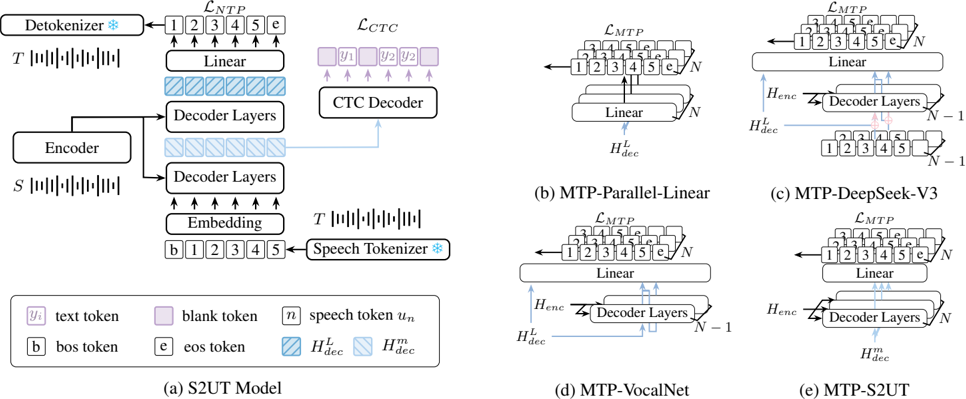

> [!abstract] arXiv · 2025 · Preprint
> **Jianjin Wang et al.** (Northeastern University; NiuTrans Research; Kunming University of Science and Technology) · [→ Paper](https://arxiv.org/abs/2510.10003) · Demo: ? · Code: ?
>
> Introduces a multi-token-prediction (MTP) training loss applied at the intermediate CTC layer of a speech-to-unit translation (S2UT) model, improving discrete-unit speech translation quality beyond existing final-layer MTP variants.

## Problem

Direct speech-to-speech translation systems built on discrete speech tokens (the S2UT paradigm) treat each token as a next-token-prediction target, but a single speech token rarely corresponds to a complete semantic unit; several consecutive tokens are typically needed to express one concept. This sparsity increases prediction entropy and modeling difficulty. Multi-token prediction (MTP), originally proposed as an auxiliary loss for text LLMs and later adapted for spoken dialogue token generation, offers a way to enrich each position's representation by forcing it to anticipate several future tokens at once. However, prior MTP variants (MTP-Parallel-Linear, MTP-DeepSeek-V3, MTP-VocalNet) all apply this loss only at the final decoder layer, which the authors argue enriches the representation too late in the network to meaningfully reduce downstream token uncertainty. No prior work had applied MTP within the S2UT framework at all, let alone tested where in the decoder the auxiliary loss should act.

## Method

The base architecture is the standard S2UT model (Lee et al., 2022): a 12-layer Conformer encoder (hidden size 256) encodes source speech into `H_enc`, and a 6-layer Transformer decoder (hidden size 512) autoregressively predicts a sequence of discrete target-speech tokens via cross-attention to `H_enc`, trained with a next-token-prediction (NTP) loss. A CTC decoder is attached after an intermediate decoder layer (the 3rd of 6) to provide auxiliary target-text supervision, and two additional lightweight Transformer decoders attached after the encoder's 6th and 8th layers provide source- and target-text multi-task supervision.

The paper implements and compares four MTP loss variants layered onto this backbone: MTP-Parallel-Linear (N independent linear heads on the final hidden state), MTP-DeepSeek-V3 (teacher-forced token embeddings plus additional Transformer decoder blocks per future-token position), MTP-VocalNet (same as DeepSeek-V3 but without the teacher-forced token embedding, to avoid MTP degenerating into NTP), and the paper's own proposed MTP-S2UT. The key architectural change in MTP-S2UT is *where* the MTP loss is applied: instead of the final decoder layer `H^L_dec`, it is applied to the intermediate hidden state `H^m_dec` at the same layer where the CTC loss is computed (layer 3), on the hypothesis that this layer already fuses speech and text modal information and is therefore the most effective point at which to force early semantic enrichment. Each position predicts N=7 subsequent speech tokens; all MTP decoder variants use 3 decoder layers per future-token head (chosen after preliminary experiments showed diminishing returns beyond 3 layers) and a shared linear output projection. MTP parameters are discarded at inference time, so none of the variants add inference-time cost. Speech targets are tokenized with one of three interchangeable tokenizers: an unsupervised mHuBERT k-means unit tokenizer (k=1000) paired with a unit-based vocoder, or one of two supervised tokenizers (S3 tokenizer, codebook size 6561; GLM-4-Voice tokenizer, codebook size 16384), both resynthesized via a flow-matching mel-spectrogram model followed by a vocoder.

## Key Results

On CVSS-C French→English with the S3 tokenizer, MTP-S2UT raises greedy-decoding ASR-BLEU from a 17.79 NTP baseline to 24.36, and remains the best variant under beam search (25.16 at beam 10), ahead of MTP-DeepSeek-V3 (24.31), MTP-VocalNet (24.27), and MTP-Parallel-Linear (22.52) (§3.4, Table 1). The same ordering (MTP-S2UT > DeepSeek-V3 ≈ VocalNet > Parallel-Linear > baseline) holds across all three speech tokenizers tested, including the self-supervised mHuBERT k-means tokenizer (baseline 22.02 → MTP-S2UT 23.59 greedy) and the GLM-4-Voice tokenizer (baseline 21.62 → MTP-S2UT 23.97 greedy), and on the independent CVSS-C Spanish→English task with the S3 tokenizer (baseline 16.67 → MTP-S2UT 21.87 greedy, Table 2). All comparisons are against the authors' own re-implementations of the prior MTP variants under matched decoder depth (3 layers each), which is a reasonably controlled comparison, though it is still a single research group's implementation rather than the original authors' released code.

Two supporting analyses probe the mechanism. First, decoding CTC output from the intermediate hidden state shows that MTP training shifts the first-occurrence position of text tokens earlier in the sequence relative to the NTP baseline, except for MTP-DeepSeek-V3, whose teacher-forced token input keeps semantic information more stable rather than forward-shifted (§3.5.1, Table 3). Second, an entropy analysis over 1.2M speech-token predictions on the Fr→En S3-tokenizer test set shows that all MTP variants shift probability mass toward lower-entropy predictions relative to the NTP baseline, with MTP-S2UT showing the most pronounced reduction (§3.5.2, Figure 3).

## Novelty Assessment

The contribution is a targeted training-objective refinement rather than a new architecture: MTP-S2UT reuses the exact decoder-block mechanism of MTP-VocalNet (itself an adaptation of DeepSeek-V3's MTP module) and changes only which hidden layer the loss operates on, moving it from the final decoder layer to the intermediate CTC layer. The paper is explicit that this is the first application of any MTP variant to the S2UT framework, which is a genuine gap being filled, and the systematic four-way comparison across three tokenizers and two language pairs is more thorough than a typical single-ablation paper. However, the core idea, that intermediate-layer auxiliary supervision helps because that layer already carries fused cross-modal information, follows directly from the pre-existing observation that CTC loss is applied there; the paper does not introduce a new mechanism so much as relocate an existing one to a layer already instrumented for another purpose. The scope is also narrow: two language pairs (Fr→En, Es→En) on a single benchmark (CVSS-C), no comparison against non-S2UT S2ST architectures (e.g., translatotron-style or cascaded systems), and no analysis of computational overhead during training.

## Field Significance

Moderate. This paper provides the first systematic evidence that multi-token-prediction losses transfer effectively to speech-to-unit translation and, more specifically, that the layer at which such a loss is applied materially affects its benefit, a design axis prior MTP work (in LLMs and spoken dialogue models) had not varied. Its contribution is a training-recipe refinement validated across three tokenizers and two language pairs rather than a new architecture, and the evaluation is confined to one benchmark family, so its scope is narrower than the level at which S2UT itself was introduced.

## Claims

- **supports:** Predicting multiple future discrete tokens during training (multi-token prediction), rather than only the next token, improves the quality of discrete-unit speech generation models.
  > *Evidence:* All four MTP loss variants outperform the next-token-prediction S2UT baseline on ASR-BLEU across three speech tokenizers and two language pairs, with the best variant raising greedy ASR-BLEU from 17.79 to 24.36 on CVSS-C Fr-En with the S3 tokenizer. *(§3.4, Table 1, Table 2)*
- **refines:** The benefit of multi-token-prediction training for discrete-unit speech generation depends on which network layer the auxiliary loss is applied to, not only on predicting multiple future tokens.
  > *Evidence:* Applying the MTP loss to the intermediate decoder layer where CTC loss is computed (MTP-S2UT) consistently outperforms applying the identical loss mechanism only at the final decoder layer (MTP-DeepSeek-V3, MTP-VocalNet), e.g. 24.36 vs. 23.38 vs. 23.29 ASR-BLEU (greedy, S3 tokenizer). *(§3.4, Table 1)*
- **supports:** Enriching intermediate hidden representations with future-token information reduces a discrete-unit generation model's predictive uncertainty over subsequent tokens.
  > *Evidence:* Entropy analysis over 1.2M speech-token predictions shows all MTP variants shift probability mass toward low-entropy predictions relative to the NTP baseline, with MTP-S2UT producing the largest reduction. *(§3.5.2, Figure 3)*
- **complicates:** Feeding teacher-forced ground-truth tokens into a multi-token-prediction module can offset the forward semantic-planning effect that MTP training is intended to induce.
  > *Evidence:* MTP-DeepSeek-V3, the only variant that conditions its future-token prediction on real (teacher-forced) target-token embeddings, is the sole variant that fails to show the forward shift of text-token first-occurrence positions seen in CTC decoding for the other variants, and correspondingly underperforms MTP-S2UT and MTP-VocalNet on ASR-BLEU. *(§3.5.1, Table 3)*

## Limitations and Open Questions

Evaluation is restricted to CVSS-C on two translation directions (Fr→En, Es→En), both translating into English; no results are reported for translation out of English or between non-English language pairs, so it is untested whether the intermediate-layer placement advantage generalizes to typologically different target languages. The paper compares only against its own re-implementations of prior MTP variants (Parallel-Linear, DeepSeek-V3, VocalNet) rather than against non-MTP S2ST architectures more broadly (e.g. UnitY-style two-pass models or cascaded ASR+MT+TTS pipelines), so the absolute competitiveness of MTP-S2UT against the wider S2ST literature is not established. Training overhead introduced by the additional MTP decoder blocks (3 layers per future-token position, N=7) is not quantified, even though the paper notes MTP parameters are discarded at inference.

## Wiki Connections

- [[speech-to-speech|Speech-to-Speech]] — the paper's S2UT backbone and all four MTP variants are trained and evaluated within a direct speech-to-speech translation pipeline that quantizes, translates, and resynthesizes target speech.
- [[neural-codec|Neural Audio Codec]] — the target speech is represented as discrete tokens from one of three interchangeable tokenizers (S3 tokenizer, GLM-4-Voice tokenizer, mHuBERT k-means units), and MTP-S2UT's gains are shown to hold across all three codec-like representations.
- [[autoregressive-codec-tts|Autoregressive Codec TTS]] — the decoder autoregressively predicts discrete speech tokens position-by-position, the same generation paradigm as autoregressive codec-based TTS, with MTP added as an auxiliary training signal over that token sequence.
- [[multilingual-tts|Multilingual TTS]] — the system is evaluated on two source-language-to-English translation directions (French and Spanish), testing whether the MTP-S2UT training benefit is consistent across language pairs.
- [[2412.10117|CosyVoice 2]] — the paper adopts CosyVoice 2's S3 speech tokenizer as one of three interchangeable target-speech tokenizers used to test whether the MTP-S2UT training benefit generalizes across tokenizer choice.
