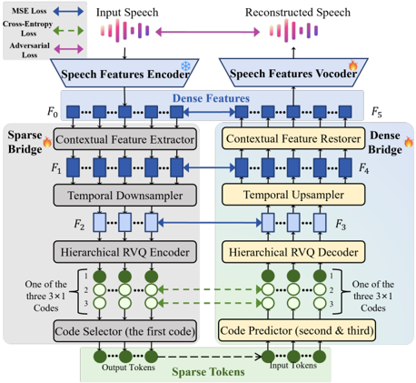
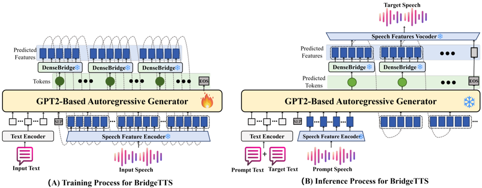

> [!abstract] arXiv · 2025 · Preprint
> **Jingyuan Xing et al.** (South China University of Technology) · [→ Paper](https://arxiv.org/abs/2510.11646) · Demo: ✓ · Code: ✗
>
> Introduces a dual sparse/dense speech representation with bidirectional bridging modules that lets an autoregressive TTS model predict tokens at a much lower frame rate while reconstructing rich continuous features for synthesis, addressing the speed-quality trade-off in AR zero-shot TTS.

## Problem

Autoregressive zero-shot TTS systems generate discrete speech tokens sequentially, and the paper identifies two specific limitations in this setup. First, there is an inherent token rate-quality trade-off: existing systems either lower the token frame rate to speed up generation at the cost of expressiveness, or enrich each token with more information to preserve quality at the cost of generation efficiency, but no prior method escapes this trade-off. Second, AR speech token training directly inherits the cross-entropy objective from text LLMs, which penalizes any token mismatch uniformly. Because adjacent speech tokens in the acoustic space can differ only in subtle prosodic or timbral variation, this token-level loss provides no fine-grained signal about how acoustically close a wrong prediction actually is, which the paper terms a text-oriented supervision mismatch.

## Method

The paper's core contribution is BridgeCode, a dual speech representation paradigm consisting of sparse discrete tokens and dense continuous features, connected by two symmetric bridging networks, SparseBridge and DenseBridge, that convert between them. Continuous features are first extracted by a frozen wav2vec 2.0 Base encoder (768-dim, borrowed from GPT-Talker). SparseBridge compresses these features with multi-scale convolutions (kernel sizes 1, 3, 5), downsamples the frame rate by a factor of 5, and quantizes the result with a hierarchical residual vector quantizer (RVQ) that splits the feature into three sub-vectors, each quantized with a 3-level RVQ; a code selector then keeps only the first RVQ index per sub-vector as the sparse token, following the VALL-E observation that first-level RVQ codes carry most of the perceptually relevant information. DenseBridge mirrors this pipeline in reverse: a code predictor fills in the missing (second and third) RVQ indices from the sparse tokens, a hierarchical RVQ decoder reconstructs quantized features, and a multi-scale convolutional network upsamples and refines them back to the original continuous feature resolution. Inspired by VDVAE, the two bridging modules are trained with layer-wise alignment between their intermediate features, and the overall BridgeCode training loss combines a code-prediction cross-entropy loss, a feature-reconstruction MSE loss, and a HiFi-GAN-based adversarial loss on the vocoded output.

Built on top of BridgeCode, BridgeTTS retrains a GPT-2-based autoregressive generator to predict sparse tokens at the reduced 10Hz rate rather than raw discrete codes at 25–50Hz. Unlike a conventional AR-TTS model that feeds back a single predicted token at each step, BridgeTTS instead feeds back five consecutive continuous feature frames reconstructed by the frozen DenseBridge, giving the AR model richer context for the next-token prediction and allowing it to observe (and thus better control) the continuous features that will ultimately drive synthesis. Training jointly optimizes a token-level cross-entropy loss (token loss) against the ground-truth sparse tokens and a feature-level MSE loss (feature loss) between the DenseBridge-reconstructed features and the ground-truth continuous features, directly addressing the text-oriented supervision mismatch by adding acoustically-aware supervision on top of token classification. At inference, the AR generator autoregressively predicts sparse tokens conditioned on reference (prompt) speech features and a concatenation of reference and target text, converts each predicted token to continuous features via the frozen DenseBridge, and feeds the result back for the next step until an end-of-speech token is produced or a length limit is reached; the final continuous feature sequence is vocoded with the HiFi-GAN-based vocoder fine-tuned during BridgeCode training.

## Key Results

On LibriTTS, BridgeTTS is compared against VALL-E, UniAudio, a zero-shot-adapted GPT-Talker, and CosyVoice, all further trained on the same data using their original pretrained weights as initialization. BridgeTTS operates at the lowest token rate of any compared system (10Hz, versus 50Hz for VALL-E/UniAudio/GPT-Talker and 25Hz for CosyVoice) while achieving the lowest WER on both the LibriTTS development set (3.4%, versus 5.9–11.4% for the 50Hz baselines and 6.8% for CosyVoice) and the test set (4.9%, versus 8.0–18.5% for the other systems). SMOS, QMOS, and UTMOS are competitive but not best-in-class: on the test set BridgeTTS scores SMOS 4.01 and UTMOS 3.894, ahead of VALL-E, UniAudio, and GPT-Talker, but behind CosyVoice's SMOS 4.12, QMOS 4.29, and UTMOS 4.148. An ablation on the test set shows that removing DenseBridge (training the AR model on compressed sparse tokens alone) degrades WER from 4.9% to 13.8% and UTMOS from 3.894 to 3.443, and removing the feature loss alone degrades WER to 7.1% and UTMOS to 3.471, both while token rate stays fixed at 10Hz. A separate comparison of a baseline 50Hz AR generator against its DenseBridge-enhanced BridgeTTS counterpart on the test set reports a real-time factor of 0.37x relative to the baseline's 1x, alongside a WER improvement from 9.8% to 4.9%.

## Novelty Assessment

The contribution is architectural but built by recombining existing components in a new configuration rather than introducing a fundamentally new mechanism: the hierarchical RVQ compression borrows the VALL-E first-code-index heuristic, the layer-wise bridging alignment is explicitly inspired by VDVAE, the continuous feature encoder is a frozen wav2vec 2.0 model reused from GPT-Talker, and the vocoder is HiFi-GAN. What is new is the specific combination: a symmetric bidirectional bridging pair that lets an AR model operate on a much sparser token sequence than its underlying continuous representation, paired with a joint token-level and feature-level training objective and an AR conditioning scheme that consumes reconstructed continuous features rather than raw tokens. The ablations in Table 2 give direct evidence that both the DenseBridge reconstruction and the feature loss meaningfully contribute to quality, which supports the architectural claim beyond just the headline comparison table. The evaluation, however, is limited to a single dataset (LibriTTS) and a single language (English), and the perceptual metrics (SMOS, QMOS) still trail the strongest baseline (CosyVoice), so the paper's central claim is best read as a favorable efficiency-quality trade-off rather than an outright quality improvement.

## Field Significance

Moderate — this paper provides a concrete architectural mechanism, and matching ablation evidence, for decoupling the token rate an AR speech model must predict from the frame rate of the continuous features actually used for synthesis. It demonstrates that this decoupling can substantially reduce AR generation steps and word error rate without abandoning autoregressive generation, but the evaluation is confined to a single English dataset and the system does not exceed the strongest existing baseline on subjective quality, so its significance is incremental within the token-rate-reduction line of AR-TTS work rather than a general capability shift.

## Claims

- **supports:** Decoupling the token rate an autoregressive model must predict from the frame rate of the continuous representation used for final synthesis, via a bidirectional bridging module, can reduce AR generation steps while improving or maintaining intelligibility relative to systems operating on denser raw token sequences.
  > *Evidence:* At a 10Hz sparse token rate, BridgeTTS achieves the lowest WER among compared systems on both the LibriTTS development set (3.4% vs. 5.9-11.4% for 50Hz baselines, 6.8% for the 25Hz CosyVoice baseline) and test set (4.9% vs. 8.0-18.5%), while all baselines operate at 25-50Hz token rates. *(§3.3, Table 1)*
- **supports:** Adding an explicit feature-level reconstruction loss alongside token-level cross-entropy during autoregressive speech token training improves synthesis quality beyond what token-classification supervision alone provides, because it penalizes acoustic distance rather than treating all token mismatches equally.
  > *Evidence:* Removing the feature loss (`-w/o L features`) while keeping the same 10Hz token rate degrades WER from 4.9% to 7.1% and UTMOS from 3.894 to 3.471 on the LibriTTS test set. *(§3.4, Table 2)*
- **supports:** Reconstructing dense continuous features from compressed discrete tokens via a dedicated bridging network preserves synthesis quality that direct low-frame-rate token compression alone cannot achieve.
  > *Evidence:* Training the AR generator on compressed sparse tokens without DenseBridge reconstruction (`-w/o DenseBridge`) raises WER from 4.9% to 13.8% and lowers UTMOS from 3.894 to 3.443 on the LibriTTS test set, despite the token rate staying fixed at 10Hz in both conditions. *(§3.4, Table 2)*
- **complicates:** Reducing an AR-TTS system's token generation rate to improve efficiency does not automatically close the gap with larger, more heavily engineered systems on subjective naturalness and speaker similarity.
  > *Evidence:* On the LibriTTS test set, BridgeTTS's SMOS (4.01) and QMOS (4.11) trail CosyVoice's SMOS (4.12) and QMOS (4.29) even though BridgeTTS uses a lower token rate (10Hz vs. 25Hz) and achieves a lower WER (4.9% vs. 8.0%). *(§3.3, Table 1)*

## Limitations and Open Questions

> [!warning]
> All experiments are conducted on a single English corpus (LibriTTS, 16kHz) with no cross-lingual or cross-domain evaluation, so it is untested whether the sparse/dense bridging mechanism generalizes to other languages, larger-scale multilingual training data, or noisier real-world speech.

Beyond the single-dataset scope, the paper reports no total parameter count for the AR generator or bridging modules, making direct efficiency comparisons to baselines incomplete. The bridging modules and continuous feature encoder are frozen at AR-generator training time, so the system's quality ceiling is bounded by how well BridgeCode reconstructs features from sparse tokens; the paper does not report headroom analysis on this bound. No code repository is released, only a demo page, which limits independent reproduction of the reported numbers.

## Wiki Connections

- [[autoregressive-codec-tts|Autoregressive Codec TTS]] — proposes a sparse/dense dual-token mechanism specifically to reduce the per-step token rate an AR codec-based TTS model must predict, addressing the AR speed-quality trade-off directly.
- [[zero-shot-tts|Zero-Shot TTS]] — conditions the AR generator on reference speech features and reference text at inference to clone unseen speakers without fine-tuning.
- [[neural-codec|Neural Audio Codec]] — introduces BridgeCode, a hierarchical RVQ-based tokenizer with paired bidirectional bridging networks for converting between sparse discrete tokens and dense continuous features.
- [[self-supervised-speech|Self-Supervised Speech]] — builds its dense continuous feature space directly on a frozen wav2vec 2.0 encoder, using self-supervised pretrained representations as the backbone for both compression and reconstruction.
- [[2301.02111|VALL-E]] — used as a Table 1 baseline and as the source of the first-RVQ-index selection heuristic that SparseBridge's code selector relies on.
- [[2407.05407|CosyVoice]] — used as the strongest Table 1 baseline; BridgeTTS achieves a lower WER and token rate but trails CosyVoice on SMOS, QMOS, and UTMOS.
- [[2310.00704|UniAudio]] — used as a Table 1 baseline AR system operating at a 50Hz token rate, against which BridgeTTS reports both lower WER and lower token rate.
- [[2508.16790|TaDiCodec]] — cited as a related approach to reducing AR token generation rate, situating BridgeCode within the broader trend toward lower-frame-rate speech tokenizers.
- [[2010.05646|HiFi-GAN]] — its discriminators and adversarial loss are used to train the vocoder that synthesizes speech from BridgeCode's reconstructed continuous features.
