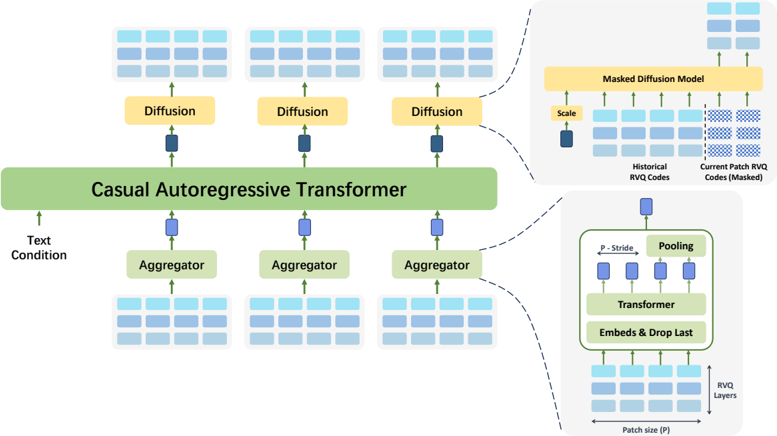

> [!abstract] arXiv · 2025 · Preprint
> **Yakun Song et al.** (SJTU / ByteDance) · [→ Paper](https://arxiv.org/abs/2510.12210) · Demo: ✓ · Code: ?
>
> DiSTAR couples a causal AR language model with a discrete masked diffusion transformer that operates entirely in a multi-codebook RVQ code space, achieving blockwise parallelism, joint time-depth modeling of RVQ layers, and test-time bitrate control without retraining — while eliminating the explicit duration predictor.

## Problem

Two established approaches to zero-shot TTS both have structural weaknesses. Single-codebook AR models (VALL-E family) suffer from exposure bias over long sequences, speaker/style drift, and high inference cost. Continuous-latent AR+diffusion hybrids (DiTAR family) are powerful but sensitive to distributional shift, dependent on explicit duration predictors, and require careful alignment engineering. A third option — multi-codebook RVQ discrete representations — has desirable properties (stable LM training, explicit EOS, interpretable decoding) but prior work has not fully exploited the intra-frame depth structure across RVQ layers, typically flattening codebooks or using delay patterns that sacrifice parallelism or consistency. The question DiSTAR addresses is whether a purely discrete system can natively model both temporal (across frames) and depth (across RVQ layers within a frame) dependencies while retaining efficient patch-level parallelism.

## Method

DiSTAR formulates speech generation as a patch-wise process over discrete RVQ token streams. A long sequence of RVQ codes (9 layers, 64Hz from a MAGICODEC-based transformer codec) is sliced into patches of P frames with stride S ≤ P (allowing overlap).

**AR drafting (causal LM).** A Qwen2.5-style decoder-only transformer models dependencies across patches. It ingests text (phoneme sequences) and overlapping windows of previous RVQ codes via a lightweight aggregator (a bidirectional RoFormer encoder that compresses P frames into one patch embedding using cross-time average pooling). The AR LM produces a contextual conditioning vector h_k for each patch position.

**Masked diffusion infilling (MDM).** Given h_k and a history window of previously generated codes, a bidirectional non-causal transformer completes all tokens within the current patch in parallel using a discrete masked diffusion objective (LLaDA-style). The forward process independently masks each RVQ token with probability λ(t) (cosine schedule); training minimizes cross-entropy on masked positions. Inference uses iterative decoding: starting from all-masked, at each step the MDM predicts all masked positions, retains the most confident fraction, and re-masks the least confident — mirroring the forward trajectory.

**Key design choices:**
- *No explicit duration predictor*: the AR LM uses a discrete [EOS] token to terminate patch generation naturally.
- *Stochastic layer truncation*: during training, the top ℓ ∼ Uniform{0, ..., 8} RVQ layers are randomly dropped, teaching the model to decode from shallower stacks. At inference, pruning upper RVQ layers directly controls bitrate and compute without retraining.
- *RVQ-aware sampling*: three lightweight inference heuristics improve stability — (1) layer-wise temperature cooling (T_layer=0.8 for deep RVQ layers), (2) position-wise temperature shaping (T_time=0.95 for farther-ahead positions within a patch), (3) hybrid greedy/sample switching (first 50% sampled, last 50% greedy). These address a tail-first bias where non-autoregressive training makes later positions overconfident.
- *Classifier-free guidance*: implemented in the MDM by independently dropping AR conditioning and history code window with probability 0.1 each; guidance applied to history only (scale 1.25) at inference.

Two model sizes: DISTAR-base (0.15B) and DISTAR-medium (0.3B). Trained on 64 × A100 80GB for 0.6M steps on Emilia English (~50K hours).

## Key Results

On LibriSpeech-PC test-clean (Table 1), DISTAR-medium achieves WER 1.66% — best among all compared systems (F5TTS 2.02%, DiTAR 2.39%, IndexTTS 2.57%, E2TTS 2.74%) — with SIM 0.67 and UTMOS 4.27. On SeedTTS test-en, DISTAR-medium WER 1.32% matches F5TTS (1.35%) and leads DiTAR (1.78%), with SMOS 3.31±0.25 and CMOS +0.22±0.13 above the human baseline in subjective listening (Table 2).

RVQ layer pruning (Figure 2) shows that retaining all 9 layers maximizes SIM (higher acoustic detail); WER is minimized around 6 layers and remains stable across depths, confirming the upper layers encode acoustic detail rather than linguistic content.

Ablations show patch size P=8 is optimal: P=2 collapses WER to 4.5% (insufficient intra-patch context); larger patches hurt by encouraging copy shortcuts. CFG scheme (nested vs. single-step) has negligible impact on objective metrics.

## Novelty Assessment

DiSTAR is a well-executed combination of two prior ideas — AR patch drafting (from DiTAR) and discrete masked diffusion (from LLaDA) — applied to the RVQ code space rather than continuous latents. The entirely discrete architecture is the principled differentiator: staying in RVQ token space preserves the training stability and inference controllability of discrete LMs while adding intra-patch parallel decoding. The stochastic layer truncation trick for test-time bitrate control is elegant and practical. The RVQ-specific sampling heuristics are empirically validated but ad hoc. The comparison with DiTAR (ingested) is direct and fair (same evaluation benchmarks, similar parameter counts), and DISTAR-medium matches or beats DiTAR with 0.3B vs. 0.6B parameters. The contribution is primarily a careful systems integration rather than a fundamentally new technique.

## Field Significance

Moderate — DiSTAR demonstrates that operating entirely in a discrete RVQ token space can match or exceed continuous-latent AR+diffusion hybrids at lower parameter cost, providing concrete evidence that the discrete route remains competitive for zero-shot TTS. The stochastic layer truncation technique enables test-time bitrate and compute control without retraining, a practically useful property for deployment-constrained settings. The work can serve as a reference point for future hybrid discrete-generative architectures combining AR drafting with non-autoregressive intra-patch refinement.

## Claims

- Operating entirely in a discrete RVQ code space with AR patch drafting and masked diffusion infilling achieves robustness and naturalness competitive with continuous-latent AR+diffusion hybrids at lower or comparable parameter counts. *(§4.2, Table 1)*
- Stochastic RVQ layer truncation during training enables test-time bitrate and compute control via layer pruning without retraining, with upper RVQ layers encoding acoustic detail rather than linguistic content. *(§3.4, §4.4)*
- Non-autoregressive intra-patch training induces a tail-first confidence bias in discrete masked diffusion, requiring decoding heuristics to realign the inference trajectory with the training distribution. *(§3.4)*
- Patch-level parallelism in a discrete AR+MDM framework mitigates exposure bias from single-codebook AR models while preserving explicit EOS-based duration control, eliminating the need for forced alignment or duration predictors. *(§1, §3.1.2)*

## Limitations and Open Questions

Training is English-only (Emilia English); multilingual and cross-domain generalization is not evaluated. The custom 0.3B RVQ codec is not publicly released separately, adding a dependency. The masked diffusion NFE count (24 steps per patch) is higher than typical flow-matching systems (10–32 NFE total), though patch-level parallelism partially offsets this. The tail-first bias in non-autoregressive training requires the three-heuristic sampling fix, indicating the training objective does not fully address intra-patch position dependencies. Performance at very long speech (minutes-scale) synthesis is not characterized.

## Wiki Connections

- [[2502.03930|DiTAR]] shares the AR+patch-diffusion architecture but uses continuous latents; DiSTAR operates entirely in discrete RVQ space, trading continuous-space expressivity for discrete training stability
- [[2025.acl-long.313|F5-TTS]] is a primary baseline; DiSTAR-medium matches its WER on SeedTTS test-en with comparable parameter count
- [[2412.10117|CosyVoice 2]] is evaluated as a subjective listening baseline in Table 2
- [[2406.02430|Seed-TTS]] defines the SeedTTS benchmark used for evaluation
- [[2509.02020|FireRedTTS-2]] appears as a subjective evaluation baseline in Table 2
- [[2407.05407|CosyVoice]] provides context for the multilingual discrete-token TTS line of work
- [[2301.02111|VALL-E]] is a related in-corpus reference
- [[autoregressive-codec-tts]] concept: DiSTAR exemplifies coupling AR drafting with non-autoregressive intra-patch refinement to mitigate exposure bias
- [[diffusion-tts]] concept: extends discrete masked diffusion to the RVQ multi-codebook domain
- [[neural-codec]] concept: the custom MAGICODEC-based RVQ codec is central to the architecture
- [[zero-shot-tts]] concept: evaluated on standard zero-shot TTS benchmarks (LibriSpeech-PC, SeedTTS)
