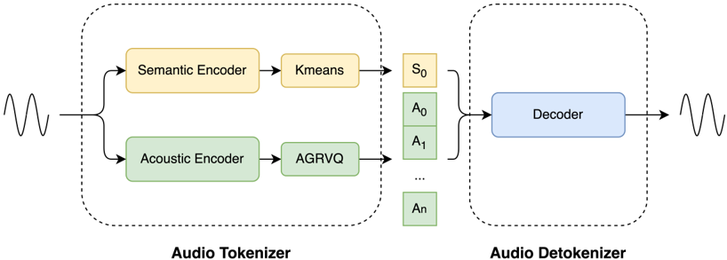
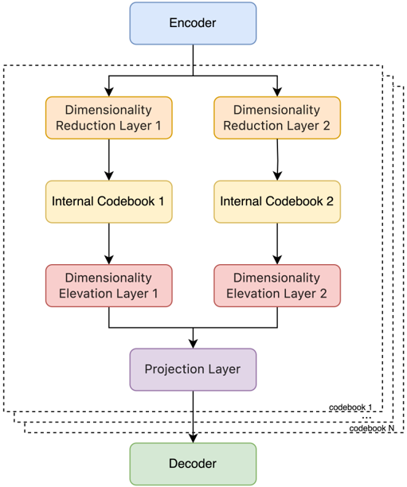

> [!abstract] arXiv · 2025 · Preprint
> **Xiaohan Zhao et al.** (Meituan, LongCat Team) · [→ Paper](https://arxiv.org/abs/2510.15227) · Demo: ✓ · Code: ✓
>
> Introduces an industrial-grade audio tokenizer/detokenizer that decouples semantic and acoustic encoding into separate paths, reaching a 16.67 Hz frame rate and bitrates as low as 0.43 kbps while remaining intelligible and streaming-decodable.

## Problem

Speech LLM pipelines need discrete speech tokens that are simultaneously easy for an autoregressive model to predict and rich enough to reconstruct natural-sounding audio. Prior codecs push in one direction or the other: pure acoustic codecs (EnCodec, DAC) capture fine detail but leave the language model to rediscover linguistic structure from scratch, while semantic-distillation codecs (SpeechTokenizer, Mimi) inject linguistic information into the first residual codebook but then have to accept a loss of fine acoustic detail as more distilled layers are added. The paper also identifies a second, less discussed tension: speech tokens are far less information-dense than text tokens, so any codec used inside a speech LLM must balance frame rate and codebook count against the language model's context window, since naively adding more codebooks to preserve fidelity makes autoregressive prediction exponentially harder without techniques such as RQ-Transformer or delay patterns.

## Method

LongCat-Audio-Codec splits the tokenizer into two independent encoder paths that are fused only at the quantization stage: a semantic encoder for linguistic content and an acoustic encoder for fine-grained detail, motivated by the observation that convolutional layers generalize well to unseen acoustic detail while transformers are better suited to capturing long-range semantic structure (§2.2.2). The semantic encoder is a Conv2d front-end followed by 26 transformer blocks operating on 60 ms frames (16.67 Hz); its output embeddings are discretized via k-means into a single 8192-entry semantic codebook. Semantic tokens are trained in two phases: unsupervised pretraining with BEST-RQ on in-house data, followed by supervised fine-tuning on Chinese and English ASR with CTC loss; layer-wise probing shows the last hidden layer of the CTC-finetuned model yields the strongest downstream semantic representations (§4.1, Tables 1–3).

The acoustic encoder is a modified version of the DAC-style encoder matched to the same 16.67 Hz frame rate as the semantic path, so the two streams can later be combined without resampling. Its output is quantized with Adaptive Grouped Residual Vector Quantization (AGRVQ): the encoder latent is split by two learned projection layers into two lower-dimensional sub-latents, each coded with an independent 90-entry codebook, whose product forms an effective 90×90 = 8,100-entry acoustic codebook per residual layer. Three such acoustic residual codebooks are stacked on top of the single semantic codebook to form a 4-codebook configuration, which the authors argue is sufficient to capture the information needed for reconstruction (§3.1.2, Appendix A).

The detokenizer (decoder) is composed of LSTM, convolution, and causal transposed-convolution layers, and is designed for training-inference-consistent streaming with only 3 frames (180 ms) of lookahead, avoiding the extra masking machinery that diffusion-based detokenizers require (§3.2). Training proceeds in three stages: Stage 1 pretrains the encoder on ~500,000 hours of diverse in-house audio using mel loss followed by adversarial (discriminator) loss once training stabilizes, prioritizing intelligibility over fine reconstruction; Stage 2 freezes the encoder/quantizer, selects a target number of codebooks, and retrains only the decoder on ~1,000 hours of high-quality recordings plus ~250,000 hours of generatively-enhanced audio while also upsampling from 16 kHz to 24 kHz; Stage 3 (optional) further fine-tunes the decoder on a small set of target speakers (~20) for improved timbre fidelity in downstream deployments with a fixed speaker roster (§4.2).

## Key Results

Grouped by bitrate band and compared against other semantic-carrying codecs, LongCat-Audio-Codec's 4-codebook configuration (0.87 kbps) achieves WER 1.48 and GPE 1.65, the best in its 0.85–2 kbps group against Mimi (1.10 kbps, WER 2.44) and LLM-Codec (0.85 kbps, WER 6.25), while also posting the highest PESQ (2.30), STOI (0.921), and SECS (0.942) in that group (§4.3.3, Table 5). At the extreme low end, the 2-codebook configuration (0.43 kbps) reaches WER 2.10 and STOI 0.839, beating S3Tokenizer (0.60 kbps, WER 2.12, STOI 0.673) and LSCodec (0.45 kbps, WER 3.33, STOI 0.688). Against pure acoustic codecs at comparable bitrates (Table 6), the 4-codebook configuration again posts the lowest WER (1.48 vs. TiCodec 3.31, SNAC 2.25, WavTokenizer 2.45) though its PESQ/STOI trail WavTokenizer slightly. Decoder-only Stage 2/3 retraining substantially improves speaker fidelity on a held-out speaker not seen during Stage 1 pretraining: CAM++ similarity rises from 0.717 (Stage 1) to 0.860 (Stage 2) to 0.938 (Stage 3 few-shot SFT), and the Stage 2 decoder's audio quality (UTMOS 4.12, SIGMOS 3.35, NISQA 4.33) approaches or exceeds the LibriTTS test-B reference recordings on some dimensions (§4.3.4, Tables 7, Figure 6). A separate Train-More-Use-Less (TMUL) ablation shows that selecting a subset of codebooks from a codec pretrained with more codebooks yields lower average reconstruction error than training directly at the target codebook count (§4.3.2, Table 4).

## Novelty Assessment

The contribution is primarily architectural: the dual conv/transformer encoder split, the AGRVQ scheme (an adaptive variant of grouped residual quantization building on prior grouped-RVQ work), and the three-stage encoder/decoder-decoupled training recipe (TMUL plus optional speaker SFT) are genuine design choices rather than a straightforward reapplication of an existing codec to a new dataset. That said, each individual piece draws heavily on established techniques — grouped RVQ, BEST-RQ pretraining, k-means semantic tokenization, and GAN-based codec training are all established elsewhere — so the paper's real contribution is the specific combination and multi-stage recipe tuned for industrial speech-LLM deployment, not a fundamentally new quantization or generative paradigm. The comparisons are organized by matched bitrate bands, which is a fairer setup than raw leaderboard comparisons, but all training data is proprietary and unreleased, so the reported gains cannot be independently reproduced from scratch even though inference code and checkpoints are open-sourced.

## Field Significance

Moderate — the paper contributes a reproducible (via released checkpoints), carefully engineered semantic-acoustic codec design that demonstrates competitive intelligibility and reconstruction quality at bitrates below 1 kbps, and its AGRVQ quantization and train-more-use-less recipe offer concrete techniques other codec designs targeting speech LMs could adopt. The paper does not report end-to-end results from a speech LM trained on its tokens, so its downstream utility for language modeling specifically is demonstrated only indirectly, through reconstruction and intelligibility probes on the codec itself.

## Claims

- **supports:** Decoupling semantic and acoustic information into separate encoder paths and codebooks lets a low-frame-rate codec preserve intelligibility at bitrates below 1 kbps without collapsing reconstruction quality.
  > *Evidence:* At 0.43 kbps (16.67 Hz, 2 codebooks) the codec reaches WER 2.10 and STOI 0.839, outperforming S3Tokenizer (0.60 kbps, WER 2.12, STOI 0.673) and LSCodec (0.45 kbps, WER 3.33, STOI 0.688) in the same sub-0.65 kbps comparison group. *(§4.3.3, Table 5)*
- **supports:** Training a codec with more codebooks than will be deployed and then selecting a subset at inference time produces better reconstruction than training directly at the deployed codebook count.
  > *Evidence:* The Train-More-Use-Less ablation shows train-3-use-1 achieves lower STOI/MR-STFT/MR-MEL error than train-1-use-1 on both Chinese and English in-house test data, attributed to first-layer codebooks capturing dominant information more reliably under multi-codebook training. *(§4.3.2, Table 4)*
- **complicates:** Speaker and timbre fidelity in a pretrained speech codec depends substantially on a dedicated decoder fine-tuning stage rather than being fully available from generic pretraining alone.
  > *Evidence:* Speaker similarity (CAM++) for a held-out speaker unseen during Stage 1 rises from 0.717 after generic Stage 1 pretraining to 0.860 after Stage 2 decoder retraining with the speaker mixed into high-quality data, and to 0.938 after Stage 3 few-shot SFT on roughly 20 speakers. *(§4.3.4, Figure 6)*
- **complicates:** For codecs intended to feed autoregressive speech LMs, bitrate reduction via additional codebooks has diminishing practical value once the codebook count grows large enough to require RQ-Transformer- or delay-pattern-style mitigations for AR inference complexity.
  > *Evidence:* The paper restricts its design to 4 acoustic-plus-semantic codebooks and reports that, in a Flow-Matching-based probing experiment, the information carried by 4 codebooks reconstructs to a quality comparable to a 22–26-codebook configuration when paired with a stronger decoder, arguing that further codebook scaling would not be AR-friendly. *(§2.3.1, §Appendix A, Figure 7)*

## Limitations and Open Questions

> [!warning]
> The paper reports no end-to-end evaluation of a speech LLM trained on LongCat-Audio-Codec tokens; every result is a reconstruction, intelligibility, or downstream-probe metric computed on the codec in isolation, so the tokens' practical utility inside an actual autoregressive speech LM pipeline is not directly demonstrated here.

The authors state that the design is optimized primarily for speech and offers insufficient support for music and general sound effects, and that the current model accepts a maximum input length of 30 seconds, requiring pre-slicing of longer audio (§5, Conclusion). All training data (roughly 750,000+ hours across the three stages) is proprietary and in-house; while inference code and checkpoints are released, the training recipe cannot be independently reproduced from public data. The music-domain codebook-sufficiency argument in Appendix A relies on a separate 32-codebook music-only codec and a Flow Matching probing decoder rather than the deployed speech decoder, so its generalization to the released speech codec's own decoder is not directly verified.

## Wiki Connections

- [[neural-codec|Neural Audio Codec]] — proposes a decoupled semantic-acoustic tokenizer/detokenizer with a novel Adaptive Grouped Residual Vector Quantization scheme targeting sub-1 kbps bitrates for speech LLM pipelines.
- [[disentanglement|Disentanglement]] — separates linguistic content and fine-grained acoustic detail into distinct encoder paths and codebook structures, restricting semantic information to a single codebook to avoid degrading acoustic reconstruction.
- [[self-supervised-speech|Self-Supervised Speech]] — builds its semantic tokenizer on BEST-RQ self-supervised pretraining before supervised ASR fine-tuning, using the resulting representations as the basis for k-means semantic tokenization.
- [[streaming-tts|Streaming TTS]] — designs the detokenizer as a causal, training-inference-consistent streaming decoder with 180 ms lookahead latency, avoiding the masking overhead of diffusion-based detokenizers.
- [[2410.00037|Moshi]] — used as a semantic-distillation baseline (via its Mimi codec) in the 0.85–2 kbps comparison group, where LongCat-Audio-Codec reports lower WER and higher PESQ/STOI/SECS at a lower bitrate.
- [[2308.16692|SpeechTokenizer]] — cited as a representative semantic-distillation codec design and compared directly as a semantic-codec baseline in the >2 kbps group.
- [[2408.16532|WavTokenizer]] — used as a pure acoustic-codec baseline in the 0.85–2 kbps group, the only baseline to slightly exceed LongCat-Audio-Codec on PESQ/STOI at a similar bitrate.
- [[2411.19842|Stable-Codec]] — cited as an example of the model-scale-up direction for acoustic codecs and compared as a baseline in the 0.65–0.85 kbps group, where LongCat-Audio-Codec reports substantially lower WER.
- [[interspeech-2025-1106|LSCodec]] — cited as an example of decoupling global (speaker) information to reduce bitrate and compared directly as a baseline at sub-0.65 kbps.
- [[2305.02765|HiFi-Codec]] — its grouped residual vector quantization approach directly inspired the AGRVQ quantizer design used in this paper's acoustic tokenizer.
- [[2506.23325|XY-Tokenizer]] — cited as an alternative approach to mitigating the semantic-acoustic conflict in low-bitrate codecs, part of the same design space this paper addresses via encoder decoupling.
- [[2210.13438|EnCodec]] — cited as a foundational acoustic-only codec and compared directly as a high-bitrate baseline in the >2 kbps group.
