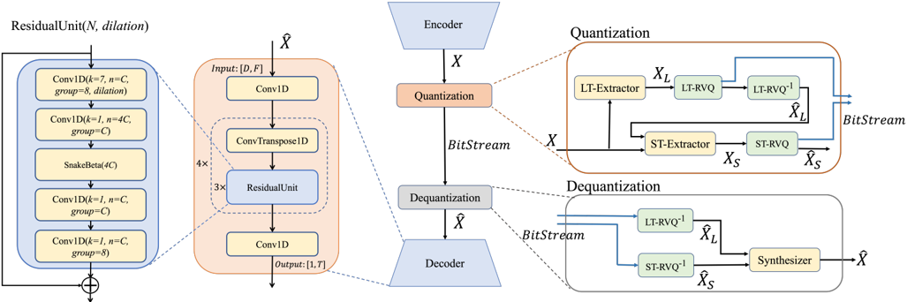

> [!abstract] arXiv · 2025 · Preprint
> **Jiang et al.** (ByteDance) · [→ Paper](https://arxiv.org/abs/2510.15364) · Demo: ✗ · Code: ✗
>
> Introduces LDCodec, a neural audio codec whose decoder reaches DAC-comparable reconstruction quality at roughly 1/166th the decoding compute, targeting on-device streaming media playback.

## Problem

End-to-end neural audio codecs such as SoundStream, EnCodec, and DAC deliver high-fidelity reconstruction at low bitrates but require decoders costing several GMACs, which is impractical for on-demand streaming clients such as smartphones. Prior low-complexity alternatives (Lyra2, FunCodec, LightCodec) reduce compute through group convolutions, depthwise convolutions, or frequency-band splitting, but the paper argues that none of these approaches reach satisfactory quality once complexity is pushed low enough for mobile decoding.

## Method

LDCodec follows the standard encoder–quantizer–decoder neural codec pipeline, with an encoder architecture matching DAC. The decoder uses four upsampling blocks (factors 8, 5, 4, 2), each followed by three dilated residual units. Each residual unit is redesigned around an expand-activate-shrink pattern: a Conv1D layer first expands the channel dimension, a SnakeBeta activation (a variant of the Snake activation used in BigVGAN, swapped in to better model periodic components) processes the expanded feature, and a second Conv1D layer shrinks it back down; group convolutions throughout the decoder further cut compute.

The quantizer, LSRVQ (Long-term and Short-term Residual Vector Quantization), splits the encoder feature into a long-term component (extracted across multiple frames at a coarser rate) and a short-term residual component, each quantized by its own cascade of RVQ layers before a synthesizer merges the two quantized streams back into the decoder input. A beam-search procedure is applied during LSRVQ encoding to improve quantization efficiency without adding decoder-side complexity.

For adversarial training, LDCodec combines multi-period and multi-resolution spectrogram discriminators with a new subband-fullband frequency discriminator: the STFT spectrogram is split into subbands modeled by separate convolution stacks, then recombined and passed through additional convolutions that model the full spectrogram jointly, intended to fix the cross-subband pattern mismatch that plain subband splitting introduces. The loss combines HingeGAN adversarial loss, L1 feature matching, codebook/commitment losses, and a modified multi-scale mel-reconstruction loss with two added terms: a transient-weighted term that upweights reconstruction error on detected transient frames, and an asymmetric energy term that penalizes excess (over-)reconstructed energy more heavily than under-reconstruction. LDCodec is trained on AIShell-3 and LibriTTS resampled to 16kHz, using DAC's optimizer configuration, batch size 16, for 800k steps.

## Key Results

At 6kbps, LDCodec's decoder runs at 0.26 GMACs, close to a channel-pruned DACLite baseline (0.28 GMACs) and well below official DAC (43.3 GMACs). Objectively (Table I), LDCodec reaches ViSQOL 4.14, close to official DAC's 4.17 despite the ~166x compute reduction, and above DACLite (3.97) and FunCodec (3.89) at the same bitrate and comparable complexity; LDCodec also edges out Opus at 12kbps (ViSQOL 4.11) on ViSQOL, though Opus at 16-20kbps still scores higher. On Mel and STFT distance, LDCodec is worse than official DAC but better than DACLite and FunCodec. In the MUSHRA-inspired subjective listening test (Figure 3), LDCodec at 6kbps scores 4.24, above Opus at 12kbps (4.10), DACLite (4.14), and FunCodec (2.94) at matched bitrate. Ablations (Table II) attribute the gains to each component: removing the proposed residual unit drops ViSQOL to 3.97 (matching DACLite despite similar complexity), removing LSRVQ raises STFT distance from 1.46 to 1.507, and removing the subband-fullband discriminator raises STFT distance to 1.497. The asymmetric energy loss trades a small Mel-distance regression (0.943 to 0.973) for what the authors describe as a subjectively cleaner (less noisy) reconstruction, though this trade-off is not independently confirmed with a subjective ablation score.

## Novelty Assessment

The contribution is architectural rather than a new paradigm: LDCodec composes four incremental design changes (a redesigned residual unit borrowing SnakeBeta from BigVGAN, a multi-scale long/short-term RVQ quantizer, a subband-fullband discriminator, and two added mel-loss terms) on top of the established DAC encoder-decoder-GAN recipe. Each component is individually validated by ablation, which is a strength, but none of the four is conceptually new in isolation, temporal-scale RVQ splitting echoes prior work the paper itself cites (TiCodec, SNAC, Predictive TF-Codec), and subband spectrogram discriminators build directly on DAC's own subband STFT discriminator. The genuine result is that this specific combination lets a codec decoder run at roughly 1/166th of DAC's official decoding compute while staying close to DAC's objective quality and beating other low-complexity baselines (DACLite, FunCodec) at matched compute; that is a real, if narrow, engineering advance for the low-complexity codec sub-area.

## Field Significance

Moderate — this paper adds a validated, ablated design recipe to the small cluster of low-complexity neural codec work (alongside Lyra2, FunCodec, LightCodec), demonstrating that careful residual-unit and quantizer redesign can close much of the quality gap to full-complexity DAC at a small fraction of decoding compute. Its evaluation is limited to a single research group's internal comparison rather than a shared low-complexity codec benchmark, so the contribution is best read as evidence within that sub-area rather than a new direction for codec research generally.

## Claims

- **supports:** A redesigned residual unit (channel-expansion, alternative periodic activation, channel-shrinkage) can recover reconstruction quality lost to a low-complexity decoder budget more effectively than simply narrowing an existing codec's channel width.
  > *Evidence:* Removing the proposed residual unit (leaving a plain channel-pruned decoder) drops ViSQOL from 4.14 to 3.97 even though decoder compute is nearly identical (0.26 vs 0.28 GMACs). *(§III.C, Table II)*
- **supports:** Splitting a codec's latent features into separately-quantized long-term and short-term streams to exploit inter-frame temporal correlation improves reconstruction fidelity over quantizing each frame independently, at matched bitrate and decoder complexity.
  > *Evidence:* Removing the long/short-term split (LSRVQ) and quantizing features directly increases STFT distance from 1.46 to 1.507 at the same 6kbps bitrate and 0.26 GMACs decoder budget. *(§III.C, Table II)*
- **supports:** A neural codec decoder's compute budget can be reduced by two orders of magnitude relative to a full-size baseline while retaining most of its objective reconstruction quality, provided the compute reduction is paired with targeted architectural changes rather than uniform channel pruning alone.
  > *Evidence:* LDCodec's decoder (0.26 GMACs) reaches ViSQOL 4.14 versus official DAC's 4.17 at 43.3 GMACs, a roughly 166x compute reduction for a 0.03 ViSQOL gap, while a naively channel-pruned decoder (DACLite) at similarly low compute (0.28 GMACs) only reaches ViSQOL 3.97. *(§III.B, Table I)*
- **complicates:** Objective distance-based codec metrics and subjective listening-test scores do not rank low-bitrate neural codecs consistently, so compute- or bitrate-matched comparisons need both kinds of evidence before declaring one codec superior.
  > *Evidence:* FunCodec and DACLite differ only modestly in objective ViSQOL (3.89 vs 3.97) but diverge sharply in the subjective test (2.94 vs 4.14 MOS), and Opus at 12kbps and LDCodec at 6kbps are close on ViSQOL (4.11 vs 4.14) while the subjective gap is similarly close but not proportionally the same (4.10 vs 4.24). *(§III.B, Table I, Figure 3)*

## Limitations and Open Questions

The evaluation is confined to a single internal test set of 40 multilingual speech sequences and out-of-domain samples for the subjective test; no public low-complexity codec benchmark or independent replication is used, and the paper reports no confidence intervals or significance tests beyond the error bars shown in Figure 3. Comparisons to DAC, FunCodec, and DACLite are useful but all baselines were retrained or evaluated by the authors under their own training data and pipeline, which leaves open how the results would look against each baseline's own reported numbers. The paper also does not report a parameter count for the model (only decoder GMACs), nor any latency or memory measurements on an actual mobile device, despite motivating the work with smartphone deployment. No code or pretrained models are released, limiting independent verification of the reported gains.

## Wiki Connections

- [[neural-codec|Neural Audio Codec]] — proposes a low-decoding-complexity variant of the DAC-style encoder-quantizer-decoder codec family, targeting on-device streaming deployment rather than raw reconstruction quality alone.
- [[gan-vocoder|GAN Vocoder]] — adapts multi-period and multi-resolution spectrogram discriminators from vocoder literature (HiFi-GAN, UnivNet-style designs) into a new subband-fullband discriminator for codec training.
- [[subjective-evaluation|Subjective Evaluation]] — validates codec quality with a MUSHRA-inspired crowd-sourced listening test alongside objective ViSQOL, Mel, and STFT distance metrics, and shows the two can diverge.
- [[2210.13438|EnCodec]] — cited as the codec whose multiscale STFT discriminator and spectral loss recipe LDCodec builds on and extends with a subband-fullband discriminator variant.
- [[2010.05646|HiFi-GAN]] — its multi-period waveform discriminator is used directly as one of LDCodec's discriminator components.
- [[2206.04658|BigVGAN]] — the SnakeBeta activation and channel expand/shrink pattern used in LDCodec's redesigned residual unit are adapted from BigVGAN's decoder design.
