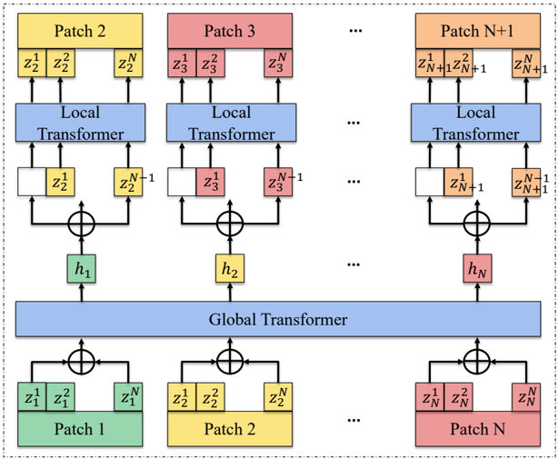

> [!abstract] arXiv · 2025 · Preprint
> **Xusheng Yang et al.** (Peking University / Tencent AI Lab / Tencent Hunyuan) · [→ Paper](https://arxiv.org/abs/2510.16718) · Demo: ✓ · Code: ✓
>
> Introduces a neural speech codec that operates at an ultra-low 5Hz frame rate, using a Transformer-based long-term dependency module and a hierarchical global-local autoregressive Transformer to keep multi-layer RVQ token modeling tractable, cutting LLM-based TTS inference cost roughly threefold while preserving reconstruction and synthesis quality.

## Problem

Autoregressive LLM-based TTS systems built on neural speech codecs pay a per-frame cost at inference: each codec frame requires a forward pass through the language model, so higher codec frame rates directly translate into slower generation. State-of-the-art codecs such as SoundStream, EnCodec, DAC, and APCodec operate at 50-75 frames per second, making autoregressive decoding expensive. Recent work has pushed frame rates down to a "moderate" 12.5Hz (Mimi, DualCodec, ALMTokenizer), but reducing frame rate further tends to cause a sharp drop in reconstruction quality and phoneme intelligibility because each token must now represent a much longer, more information-dense span of speech. Whether a frame rate as low as 5Hz can retain both high-fidelity reconstruction and usable synthesis quality had not been systematically investigated before this paper.

## Method

U-Codec is a convolutional encoder-decoder codec with a residual vector quantization (RVQ) bottleneck, following the general structure of SoundStream/EnCodec/DAC/Mimi but re-optimized for 5Hz operation. The encoder downsamples a 16kHz waveform through five residual convolutional blocks with strides [8, 5, 4, 4, 4] (or [5,4,4,4,4] for a 12.5Hz variant), yielding one token per 200ms. Because each token now spans a long segment of speech, the paper adds a contextual Transformer bottleneck (8 layers, 8 heads, RoPE, hidden size 512) directly after downsampling, applied before quantization rather than after it (the reverse of Mimi's ordering), to explicitly model inter-frame dependencies before compression discards information. Quantization uses factorized RVQ (FRVQ): code lookup happens in a low-dimensional space (8-d) while embeddings are stored at higher dimension (1024-d), and cosine-similarity (L2-regularized) coding replaces Euclidean-distance lookup for more stable codebook utilization. The paper systematically sweeps RVQ depth (8 to 100 layers) and codebook size (4 to 16,384 entries) at 5Hz to characterize the quality/bitrate trade-off. Training combines multi-scale mel-spectrogram reconstruction loss, LSGAN adversarial loss with a HiFi-GAN-style multi-period discriminator and multi-scale STFT discriminator (both borrowed from BigCodec), feature-matching loss, and a VQ commitment loss.

Deep RVQ stacks (up to 32 or 100 layers) at 5Hz improve reconstruction quality but increase the number of tokens an autoregressive TTS model must predict per frame, offsetting the frame-rate savings. To address this, the paper builds a downstream TTS system around a hierarchical global-local Transformer ("Codecformer," extending a prior 3-layer-RVQ/50Hz design) that groups each frame's N RVQ tokens into a "patch": a global Transformer models dependencies across the T frame-level patches (reducing the sequence the global network sees from T×N to T), while a local Transformer autoregressively predicts the N tokens within each patch conditioned on the global hidden state. This keeps the expensive global attention computation nearly independent of RVQ depth, so the design scales to 32- or even 100-layer RVQ without a proportional increase in global-model cost. The TTS model is trained on Libriheavy (50k hours) with text and speech tokens concatenated in a single sequence; the global Transformer has 24 layers (1536-d, 12 heads), the local Transformer 8 layers, and inference uses top-k (k=5) multinomial sampling with an audio prompt for zero-shot speaker conditioning.

## Key Results

On LibriSpeech test-clean codec reconstruction, U-Codec with 32-layer RVQ at 5Hz reaches WER 3.44, PESQ 3.20, STOI 0.93, and SPK-SIM 0.87, matching the intelligibility (STOI) of the much higher-frame-rate BigCodec (50Hz) and improving over Mimi (12.5Hz, PESQ 2.25) and DualCodec (12.5Hz, PESQ 2.54) despite running at less than half their frame rate; it still trails high-frame-rate DAC (50Hz, PESQ 4.15, SPK-SIM 0.95) *(§4.1.2, Table 2)*. Increasing RVQ depth from 16 to 32 layers at 5Hz improves PESQ from 3.02 to 3.20 and SPK-SIM from 0.83 to 0.87, and removing the Transformer bottleneck in favor of convolution degrades WER from 3.44 to 5.40 at matched configuration *(§4.1.2, Table 3)*.

On zero-shot TTS built on U-Codec, the 32-layer-RVQ/5Hz configuration reaches SIM-r 0.6757, SIM-o 0.600, and WER 1.8 on a LibriSpeech test-clean subset, comparable to VoiceBox (SIM-o 0.66, WER 1.9) and better than UniAudio (SIM-r 0.64) at less than a tenth of UniAudio's total inference compute *(§4.2.2, Table 4, Table 6)*. Subjective evaluation gives NMOS between 3.67 and 4.19 and SMOS up to 4.38 across the 5Hz RVQ-depth variants, exceeding the paper's own reproduced UniAudio baseline (NMOS 3.68, SMOS 4.02) *(§4.2.2, Table 5)*. On complexity, the 32-layer-RVQ/5Hz TTS system uses 0.89G total MACs versus 45.6G for the reproduced UniAudio (SoundStream, 3-layer RVQ, 50Hz) baseline, and the 8-layer-RVQ/5Hz configuration achieves an RTF of 0.52, a roughly 2-3x speedup over the 50Hz UniAudio baseline (RTF 1.40) *(§4.3, Table 6)*.

## Novelty Assessment

The core contribution is architectural: a codec design that pushes the operating frame rate to 5Hz, a level the paper claims is unprecedented for a codec targeting fully discrete, high-fidelity speech tokens, achieved through the combination of a pre-quantization Transformer bottleneck (placed before compression rather than after, unlike Mimi) and factorized RVQ tuning. The extension of the global-local Codecformer pattern from its original 3-layer-RVQ/50Hz setting to 8-100-layer RVQ at 5Hz is a genuine scaling contribution, not just a reapplication, since deep RVQ stacks at low frame rates create a sequence-length/quality trade-off that the hierarchical design is specifically built to resolve. That said, the individual components (convolutional codec backbone, RVQ with GAN-style adversarial training, hierarchical global-local Transformer for long token sequences) are each drawn from prior codec and audio-generation work (SoundStream/EnCodec/DAC/BigCodec, CodecFormer); the paper's novelty lies in how these pieces are combined and re-tuned to make an extreme frame-rate regime work, rather than in inventing a fundamentally new mechanism. The systematic RVQ-depth/codebook-size sweep is a useful empirical contribution but is secondary to the architectural claim.

## Field Significance

moderate — This paper extends the active line of low-frame-rate speech codec research (Mimi at 12.5Hz, DualCodec, ALMTokenizer) to a substantially lower 5Hz operating point while keeping reconstruction quality and downstream TTS quality within range of higher-frame-rate systems. It demonstrates that the token-sequence-length bottleneck in autoregressive codec-based TTS can be addressed jointly at the codec level (frame-rate reduction) and the language-model level (hierarchical global-local token prediction), providing a concrete efficiency data point (roughly 3x inference speedup, over 50x reduction in TTS-side MACs) for that combined approach.

## Claims

- **supports:** Reducing codec frame rate below the commonly used 10-15Hz range is achievable without a proportional loss in reconstruction quality, provided compression is paired with an explicit long-term dependency model and sufficiently deep residual quantization.
  > *Evidence:* At 5Hz with 32-layer RVQ, U-Codec reaches PESQ 3.20 and STOI 0.93, matching the STOI of 50Hz BigCodec and exceeding the PESQ of 12.5Hz Mimi (2.25) and DualCodec (2.54). *(§4.1.2, Table 2)*
- **supports:** Hierarchical global-local token modeling that decouples inter-frame from intra-frame prediction lets autoregressive codec-based TTS scale to much deeper RVQ stacks without a proportional increase in the dominant global-attention computation cost.
  > *Evidence:* Extending the Codecformer pattern from 3-layer RVQ at 50Hz to 8-100-layer RVQ at 5Hz keeps global MAC cost between 0.163-0.277G across all 5Hz configurations, versus 0.906G for the 50Hz SoundStream/UniAudio baseline, while total TTS MACs drop from 45.6G to as low as 0.89G at comparable SIM/WER. *(§4.3, Table 6)*
- **complicates:** Lower codec frame rates reduce per-step language-model computation but do not straightforwardly reduce end-to-end inference time, because the deeper RVQ stacks needed to preserve quality at low frame rates introduce more sequential decoding steps.
  > *Evidence:* The 100-layer-RVQ/5Hz configuration keeps total MACs modest (1.45G) but has the highest measured RTF (4.68) of all 5Hz variants, higher even than the 12.5Hz 8-layer configuration (RTF 1.33), because autoregressive decoding over 100 sequential codebook layers limits parallel throughput. *(§4.3, Table 6)*
- **complicates:** At ultra-low frame rates, convolution-only architectures are insufficient to preserve reconstruction quality; explicit attention-based long-term dependency modeling is necessary.
  > *Evidence:* Ablating the Transformer bottleneck in the 32-layer-RVQ/5Hz configuration (replacing it with convolution) degrades WER from 3.44 to 5.40 and SPK-SIM from 0.87 to 0.84 at matched bitrate. *(§4.1.2, Table 3)*

## Limitations and Open Questions

The evaluation is limited to English read speech from LibriSpeech test-clean (codec reconstruction) and a 4-hour LibriSpeech test-clean subset (TTS), so it is unclear how the 5Hz design generalizes to spontaneous, noisy, or multilingual speech beyond the training corpora's coverage, or to speaking styles with denser prosodic variation than read audiobook speech. U-Codec at 5Hz still trails high-frame-rate codecs such as DAC on PESQ (3.20 vs. 4.15) and SPK-SIM (0.87 vs. 0.95), so the paper positions the approach as a favorable quality/efficiency trade-off rather than a strict quality improvement. The paper also does not report a total parameter count for either the codec or the TTS model, limiting direct compute-cost comparison beyond the MAC and RTF figures given. Finally, the deepest RVQ configuration (100 layers) illustrates that MAC efficiency and wall-clock latency (RTF) can diverge, meaning frame-rate reduction alone does not guarantee faster real-world inference without also controlling RVQ depth.

## Wiki Connections

- [[neural-codec|Neural Audio Codec]] — proposes a codec that pushes the operating frame rate to 5Hz, extending the low-frame-rate codec line established by Mimi, DualCodec, and ALMTokenizer.
- [[autoregressive-codec-tts|Autoregressive Codec TTS]] — builds an autoregressive TTS model directly on U-Codec's discrete tokens, using a hierarchical global-local Transformer to keep deep RVQ stacks tractable for LLM-based generation.
- [[zero-shot-tts|Zero-Shot TTS]] — evaluates the codec-driven TTS system in a zero-shot setting with reference-audio speaker prompts, comparing similarity and naturalness against established zero-shot baselines.
- [[streaming-tts|Streaming TTS]] — the 5Hz frame rate and reduced per-frame forward-pass count are motivated explicitly by inference-speed constraints relevant to low-latency autoregressive generation.
- [[2410.00037|Moshi]] — directly compared against as the 12.5Hz reference point (Mimi codec); U-Codec is explicitly positioned as operating at 2.5x lower frame rate than Mimi.
- [[2310.00704|UniAudio]] — the paper reproduces UniAudio's SoundStream-3RVQ-c1024-based TTS system as its main efficiency and quality baseline, and its hierarchical Codecformer design is extended from UniAudio's global-local Transformer pattern.
- [[2409.05377|BigCodec]] — U-Codec adopts BigCodec's HiFi-GAN multi-period and multi-scale STFT discriminator design and is compared against it as a high-frame-rate (50-80Hz) reconstruction baseline.
- [[2505.13000|DualCodec]] — a contemporaneous 12.5Hz low-frame-rate codec discussed as related work and compared directly on reconstruction metrics.
- [[2504.10344|ALMTokenizer]] — cited as a query-based, semantically-rich 12.5Hz codec that U-Codec's ultra-low-frame-rate design goes beyond.
- [[2408.16532|WavTokenizer]] — included as a high-frame-rate (75Hz) single-codebook baseline in the reconstruction comparison table.
- [[2301.02111|VALL-E]] — cited as the pioneering codec-language-model TTS paradigm and included as a baseline in the zero-shot TTS comparison.
- [[2406.05370|VALL-E 2]] — cited as an extension of the VALL-E codec-LM paradigm via grouped code modeling, situating U-Codec's TTS design within that lineage.
