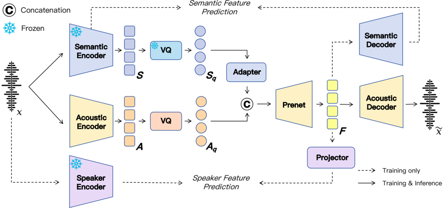

> [!abstract] arXiv · 2025 · Preprint
> **Wenxi Chen et al.** (Shanghai Jiao Tong University (X-LANCE Lab), Soul AI Lab) · [→ Paper](https://arxiv.org/abs/2510.16841) · Demo: ? · Code: ✓
>
> SAC is a neural speech codec that fully separates semantic and acoustic modeling into two independent token streams, rather than fusing them before quantization, achieving both stronger semantic representation and stronger reconstruction quality than prior semantically-supervised codecs.

## Problem

Speech codecs face a persistent tension between two goals: reconstructing high-fidelity audio and producing tokens that carry rich, LM-friendly semantic content. Pure acoustic codecs (SoundStream, EnCodec, DAC) reconstruct well but their tokens correlate poorly with linguistic content, limiting compatibility with text-based language models. Pure semantic tokenizers (from SSL or supervised models) align well with content but discard the acoustic detail needed for high-quality synthesis. Prior attempts to bridge this gap — SpeechTokenizer's semantic distillation into the first RVQ layer, and the "X-shaped" designs of X-Codec and XY-Tokenizer that inject semantic features and fuse them with acoustic embeddings before quantization — improve semantic alignment over unsupervised codecs, but the paper argues these fused representations still fall short of pure semantic tokens in semantic relevance, because the fused tokens must simultaneously serve two competing objectives (semantic prediction and spectrogram reconstruction). SAC asks whether semantic and acoustic tokens can instead be disentangled at the token level so each stream can specialize.

## Method

SAC is built on the VQ-GAN paradigm (VQ-VAE encoder-quantizer-decoder trained with adversarial and feature-matching losses) and comprises two parallel encoding streams that remain separate through quantization. The semantic stream uses a pre-trained, frozen speech tokenizer (from Zeng et al., 2024b) that extracts continuous features at 50 Hz, temporally pools them to 12.5 Hz, and vector-quantizes them; keeping this tokenizer frozen during SAC training is intended to prevent the semantic representation from being biased toward acoustic detail. The acoustic stream follows an EnCodec-style convolutional encoder with DAC-style factorized single-codebook quantization, operating at a higher frame rate (25 Hz or 50 Hz, depending on the target bitrate) to capture fine-grained acoustic information such as timbre and emotional attributes that the semantic stream omits.

At decoding time, the quantized acoustic and (adapter-upsampled) semantic embeddings are concatenated and passed through a ConvNeXt-based prenet that upsamples the joint representation to 50 Hz before a mirrored convolutional decoder reconstructs the waveform. Two auxiliary supervision signals regularize training without affecting the frozen encoders: an MSE loss between a CNN-based semantic decoder's prediction and the ground-truth semantic features (preserving linguistic content through decoding), and an MSE loss between a lightweight MLP projector's prediction (from the mean/std of the fused features) and a frozen ERes2Net speaker embedding (preserving global timbre). The overall generator objective combines multi-scale L1 reconstruction loss, VQ commitment/codebook loss, adversarial loss (MPD + multi-scale STFT discriminators, least-squares GAN objective), feature-matching loss, and the two auxiliary MSE losses. Both codebooks contain 16,384 entries; SAC is trained on roughly 20,000 hours of bilingual (Chinese/English) speech drawn from Emilia, WenetSpeech4TTS, LibriSpeech, Libriheavy, MLS, and in-house data, for 850k steps on 8 H20 GPUs. To validate SAC as a downstream tokenizer, the authors also train a single-stage autoregressive TTS model (Qwen3-0.6B backbone) that predicts SAC's dual-stream tokens via an interleaved flattening scheme proportional to the two streams' frame-rate ratio, on a 100k-hour bilingual corpus.

## Key Results

At comparable bitrates, SAC achieves the best or near-best scores on STOI, PESQ, UTMOS, SIM, and WER against a wide field of baselines (DAC, EnCodec, Mimi, SpeechTokenizer, SemantiCodec, BigCodec, X-Codec/X-Codec2, XY-Tokenizer, WavTokenizer, MagiCodec, TS3-Codec), reproduced on the same LibriSpeech test-clean set (Table 1, Table 2). At 875 BPS (62.5 Hz), SAC reaches a WER of 2.35% (ground truth: 2.16%) and a UTMOS of 4.25, exceeding the ground-truth UTMOS of 4.09. At a much lower 525 BPS (37.5 Hz), SAC still reaches UTMOS 4.27, WER 2.53%, and SIM 0.78 — a SIM gain of 0.15 over the second-best comparable-bitrate model. Robustness holds on the noisier LibriSpeech test-other set (Table 7, Table 8) and is corroborated by a 20-listener MOS study restricted to low-bitrate models, where SAC scores 3.94 versus a 3.98 ground-truth score and clearly ahead of SemantiCodec (2.8), X-Codec (3.18), and WavTokenizer (3.2) (Table 10).

On the ARCH semantic-representation benchmark (emotion, intent, and digit classification via linear probing), SAC's concatenated stream representations reach an average accuracy of 56.94–57.57% across bitrate configurations, roughly 10 points above the next-best codec (XY-Tokenizer, 46.96%) and competitive with continuous SSL features (HuBERT 59.77%, WavLM 60.38%), while clearly exceeding wav2vec 2.0 (46.97%) and data2vec (54.48%) (Table 3).

In the semantic-only reconstruction disentanglement test (masking the acoustic stream), SAC's WER is 3.99% versus 30.67% for SemantiCodec, and SAC's SIM drops to 0.17 (near speaker-independent) with a mean cross-utterance speaker similarity of 0.64, indicating semantic-only decoding converges toward a single generic timbre rather than leaking the original speaker's identity (Table 5). When used as the tokenizer for a single-stage AR TTS model trained on 100k hours, the resulting system substantially outperforms comparably-sized pure-AR baselines Spark-TTS and Llasa on the Seed-TTS-eval benchmark, reaching WER 1.06% / UTMOS 4.21 on the English test set and CER 0.90% / UTMOS 3.34 on the Chinese test set, though with a slightly lower SIM (0.54–0.65) than the baselines (Table 9).

## Novelty Assessment

The core idea of disentangling semantic and acoustic tokens is not new in itself — SemantiCodec pursued a similar dual-stream split, and the "X-shaped" codecs (X-Codec, XY-Tokenizer) inject semantic supervision alongside acoustic modeling. SAC's contribution is a more complete separation: keeping the semantic stream entirely frozen and never fusing it with acoustic features before quantization, rather than injecting semantic features into a shared representation. The paper's own ablations (Table 4, Table 13) support this design choice empirically — removing the semantic supervision loss barely affects SAC's performance, in contrast to the reported sharp degradation in "X-shaped" models under the same ablation — which is meaningful evidence that the architectural separation, not the auxiliary loss, is doing the disentangling work. The individual components (EnCodec-style acoustic encoder, DAC-style factorized quantization, ConvNeXt prenet, ERes2Net speaker supervision) are all established techniques recombined rather than newly invented. The downstream single-stage AR TTS result is a genuine and notable empirical finding (sub-1% CER on Seed-TTS test-zh), but it is best read as validation of the codec's token quality rather than a TTS-architecture contribution, since the AR model itself is a standard decoder-only Transformer over an interleaved token scheme.

## Field Significance

> [!tip]
> High — SAC provides the cleanest reported disentanglement to date between linguistic content and speaker identity at the codec-token level, demonstrated directly through masked semantic-only and acoustic-only reconstruction, and shows this disentanglement translates into a downstream AR TTS system that surpasses prior pure-AR baselines in intelligibility.

The paper's comprehensive, like-for-like reproduction of a large field of codec baselines at matched bitrates strengthens the empirical case that full stream separation outperforms the "inject-and-fuse" family of semantically-supervised codecs on both reconstruction and semantic-probing benchmarks. Its ablations directly isolate architecture from auxiliary loss as the source of the improvement, which is useful evidence for the broader codec-design literature.

## Claims

- **supports:** Fully separating semantic and acoustic token streams (rather than fusing semantic features into a shared representation before quantization) improves semantic representation quality without sacrificing reconstruction fidelity.
  > *Evidence:* On the ARCH benchmark, SAC's dual-stream tokens reach 56.94–57.57% average accuracy, roughly 10 points above the best "X-shaped" fused codec (XY-Tokenizer, 46.96%), while simultaneously achieving state-of-the-art UTMOS and WER on LibriSpeech test-clean reconstruction at comparable bitrates. *(§5.1, §5.2, Table 1, Table 3)*
- **supports:** A dual-stream codec can achieve near-complete disentanglement between linguistic content and speaker identity purely through architectural separation, without an explicit adversarial or information-bottleneck disentanglement objective.
  > *Evidence:* Semantic-only (acoustic-masked) reconstruction reaches WER 3.99% (vs. 30.67% for the comparable dual-stream codec SemantiCodec) while SIM collapses to 0.17, and mel-spectrogram analysis shows semantic-only decoding retains no speaker-specific formant structure. *(§5.5, Table 5, Figure 4)*
- **refines:** Explicit auxiliary semantic supervision during codec decoder training is far less necessary when the semantic stream is architecturally isolated from the reconstruction objective, contrary to codec designs that fuse semantic and acoustic tokens before quantization.
  > *Evidence:* Removing the semantic supervision loss L_sem causes only a slight PESQ drop and under 1% change in ARCH semantic-representation accuracy for SAC, whereas prior "X-shaped" models (e.g., XY-Tokenizer) are reported to suffer substantial ASR-probing degradation without equivalent supervision. *(§5.3, §Appendix H, Table 4, Table 13)*
- **complicates:** Gains in codec-token intelligibility for downstream generative modeling can come at the cost of speaker similarity when using coarser (lower frame-rate) token configurations.
  > *Evidence:* The single-stage AR TTS model built on the 37.5 Hz SAC tokenizer achieves markedly lower WER/CER than pure-AR baselines on Seed-TTS-eval, but shows a slight SIM reduction, which the authors attribute to the coarser temporal granularity of the low-bitrate variant relative to the 50 Hz codecs used by the baselines. *(§Appendix D, Table 9)*

## Limitations and Open Questions

> [!warning]
> The semantic tokenizer underlying SAC's semantic stream is trained under ASR-style supervision and aligned specifically to textual/linguistic objectives; the authors state this limits SAC's generalizability beyond the speech domain (e.g., to music or general sound), since semantics in those domains extend beyond linguistic alignment. *(§Limitations)*

Additional limitations noted in the paper: the downstream AR TTS experiments use only the 37.5 Hz SAC configuration due to compute constraints, leaving the higher-rate (62.5 Hz) variant's zero-shot TTS behavior unexplored; a small-scale ablation (LibriSpeech-only training) shows that reduced training-data speaker diversity causes SAC to overfit to a narrow speaker distribution, substantially lowering SIM even though reconstruction-quality metrics remain strong; and the subjective MOS evaluation (Appendix E) was restricted to low-bitrate models with a relatively small pool of 20 listeners and 30 utterances, since high-bitrate reconstructions were judged perceptually indistinguishable in pilot testing.

## Wiki Connections

- [[neural-codec|Neural Audio Codec]] — SAC is a new codec architecture that explicitly separates semantic and acoustic quantization into independent streams rather than fusing them, directly extending the neural-codec design space.
- [[disentanglement|Disentanglement]] — SAC's training objective architecturally isolates linguistic content from speaker/timbre information across two token streams, and the paper directly measures the resulting disentanglement via masked semantic-only and acoustic-only reconstruction.
- [[autoregressive-codec-tts|Autoregressive Codec TTS]] — the paper trains a single-stage autoregressive TTS model over SAC's interleaved dual-stream tokens to validate the codec as a generative tokenizer, comparing directly against pure-AR baselines.
- [[zero-shot-tts|Zero-Shot TTS]] — the downstream AR TTS system is evaluated in the zero-shot voice-cloning setting via Seed-TTS-eval, using prompt audio to condition synthesis.
- [[subjective-evaluation|Subjective Evaluation]] — the paper runs a 20-listener MOS study on low-bitrate reconstructions to validate that UTMOS gains reflect genuine perceptual quality rather than metric artifacts.
- [[2301.02111|VALL-E]] — SAC's downstream TTS system is explicitly contrasted with VALL-E's two-stage AR+NAR generation pipeline, using a simpler single-stage AR decoder over SAC's tokens instead.
- [[2406.02430|Seed-TTS]] — the paper adopts Seed-TTS-eval as its zero-shot TTS benchmark to evaluate SAC-based AR TTS against prior pure-AR systems.
- [[2407.05407|CosyVoice]] — cited as the originator of the supervised semantic-tokenizer paradigm (the S3 tokenizer) that subsequent semantically-supervised codecs, including the "X-shaped" family SAC compares against, built upon.
