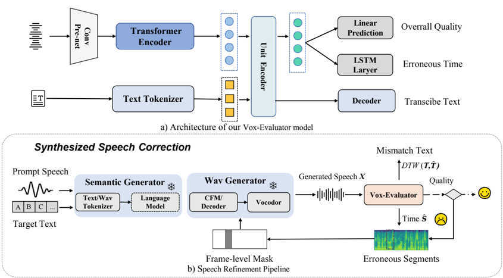

> [!abstract] arXiv · 2025 · Preprint
> **Hualei Wang et al.** (Tencent AI Lab) · [→ Paper](https://arxiv.org/abs/2510.20210) · Demo: ✓ · Code: ?
>
> Introduces a single multi-level evaluator that localizes pronunciation and quality errors in zero-shot TTS output and uses that signal both to regenerate faulty segments and to guide fine-grained preference alignment.

## Problem

Zero-shot TTS systems built on autoregressive language models, diffusion, and masked generative objectives produce highly natural speech, but the sampling randomness and implicit text-speech alignment underlying non-autoregressive models frequently introduce mispronunciations, audible noise, and abnormal pauses. Existing remedies for these failures are two-stage pipelines that first locate mispronunciations with a stack of external tools (ASR models, self-supervised alignment models, Montreal Forced Aligner) and then re-synthesize the affected span with a text-based speech-editing model. This apparatus is computationally heavy, cannot detect audio-quality degradation (as opposed to text mismatches), and is disconnected from the separate line of work on preference alignment for TTS, which typically relies on coarse, utterance-level reward signals (e.g., whole-utterance WER or speaker-similarity scores) that are costly to collect and prone to over-optimizing the full utterance rather than the specific segment that is actually wrong.

## Method

Vox-Evaluator is a single encoder-decoder model that replaces the ASR+alignment+quality-assessment cascade with one network trained to (1) predict the temporal scope of erroneous speech segments, (2) transcribe the synthesized speech so mismatches with the target text can be detected, and (3) predict a holistic quality score for the whole utterance. The architecture, built on prior speech-text alignment work (SpeechLM, STFT), comprises a speech encoder (1-D convolutional feature extraction feeding a wav2vec2.0-based transformer), a unit encoder (a BART-style bidirectional encoder that jointly attends over the speech encoder's semantic tokens and phoneme-tokenized target text), a text decoder (an autoregressive BART-style decoder that regenerates the target text conditioned on the unit encoder output, whose divergence from the ground truth flags content mismatches), and two lightweight prediction heads: an MLP quality-score predictor and a two-layer bidirectional LSTM timestamp predictor with a sigmoid output. The model is initialized from a checkpoint pre-trained with self-supervised masked token prediction and supervised speech-phoneme/speech-text alignment, then fine-tuned end to end with a composite objective combining frame-wise focal loss (for the class-imbalanced timestamp prediction), token-level cross-entropy (for text decoding), and mean squared error (for quality-score regression).

At inference, the correction pipeline runs the evaluator on synthesized speech, aligns the predicted transcript against the target text with Dynamic Time Warping to localize semantic mismatches, converts the flagged spans (with a small safety margin) into a speech mask, and regenerates only the masked spans using an existing editing-capable TTS backbone (F5-TTS or VoiceCraft) conditioned on the preserved audio and the text. This detect-mask-regenerate loop repeats for up to two iterations. Separately, the evaluator's fine-grained error and quality signal is used to construct preference pairs (a higher-fidelity "winning" sample versus a lower-fidelity "losing" sample generated under identical conditions) for Direct Preference Optimization on the TTS backbone, restricting the DPO loss computation to the flagged segments rather than the full utterance. Because no suitable supervision existed for training the evaluator itself, the authors construct FGES (Fine-Grained Erroneous Speech), a 22K-sample dataset synthesized from Emilia-Large text prompts and LibriTTS speech prompts using existing TTS models, deliberately covering four error categories (mispronunciation/omission, repetition, punctuation/prosody, and augmentation-induced audio corruption), with labels obtained via Whisper-Large-v3 transcription, Montreal Forced Aligner timestamps, and Audiobox-Aesthetics plus manual quality scoring.

## Key Results

On the FGES test set, Vox-Evaluator reaches an IOU of 0.782 for localizing erroneous segments, a 19.7-percentage-point absolute improvement over a fine-tuned wav2vec2.0 baseline (0.653), and a transcription WER of 2.64%, better than both SenseVoice (3.43%) and Whisper-S (3.05%) despite having fewer or comparable parameters (185M). Removing the pre-trained initialization ("wo/pretrained") collapses IOU to 0.435, showing the pre-trained speech-text checkpoint is critical rather than incidental. Applied as a correction mechanism on Seed-TTS test-en and LibriSpeech-PC test-clean, the evaluator-guided refinement reduces WER for F5-TTS from 1.73% to 1.42% (a 21% relative reduction) and for VoiceCraft from 7.56% to 5.11% (a 32% relative reduction), with corresponding CMOS gains, while speaker similarity is largely preserved. In the preference-alignment setting, evaluator-guided segment-level DPO on F5-TTS lowers WER from 1.73% to 1.55% and raises Sim-o to 0.683 over 2000 training steps, with CMOS and SMOS improving in step with the objective TTSDS2 metrics. Ablations isolating error detection from quality evaluation show error detection alone accounts for most of the gain (F5-TTS failure rate on TTSDS2 drops from 12% to 6%), with the combination only marginally better; F5-TTS is also shown to be more failure-resistant than VoiceCraft under the same correction pipeline.

## Novelty Assessment

The evaluator architecture itself is a genuine, if incremental, architectural contribution: unifying timestamp localization, text-mismatch detection, and holistic quality scoring in one encoder-decoder network (rather than the standard ASR+MFA+separate quality-model cascade) is a meaningful simplification with a demonstrable accuracy gain over a comparable single-purpose baseline. The correction and preference-alignment applications, however, are largely engineering integration: masked speech regeneration and DPO-based preference alignment for TTS are both established techniques, and the paper's contribution there is to supply a better, more localized reward/error signal rather than a new correction or alignment mechanism. The FGES dataset is a useful, purpose-built resource, though it is entirely synthetic and augmentation-based rather than drawn from naturally occurring TTS failures, which somewhat limits how representative its error distribution is of real deployment failures.

## Field Significance

Moderate — the paper provides a plausible, empirically validated simplification of the fragmented error-detection and preference-reward tooling around zero-shot TTS, and demonstrates measurable WER and stability gains on two different TTS backbones without requiring backbone fine-tuning. Its contribution is incremental relative to the underlying correction and DPO techniques it builds on, and its evaluation, while solid, is limited to two backbone families and a synthetic error dataset.

## Claims

- **supports:** A single evaluator that jointly localizes acoustic errors and predicts holistic quality can substitute for a cascade of separate ASR, alignment, and quality-assessment tools in TTS quality control.
  > *Evidence:* Vox-Evaluator, trained on the FGES dataset, achieves a segment-localization IOU of 0.782 versus 0.653 for a fine-tuned wav2vec2.0 baseline, and a transcription WER of 2.64% versus 3.43%/3.05% for SenseVoice/Whisper-S, with a comparable or smaller parameter count. *(§Main Results, Table 2)*
- **supports:** Detecting and regenerating only the erroneous segments of zero-shot TTS output, rather than fully re-synthesizing an utterance, can materially reduce word error rate on hard cases without any additional model fine-tuning.
  > *Evidence:* Evaluator-guided correction on Seed-TTS test-en reduces WER by 21% for F5-TTS (1.73% → 1.42%) and by 32% for VoiceCraft (7.56% → 5.11%), consistent across LibriSpeech-PC test-clean as well. *(§Main Results, Table 3)*
- **supports:** Restricting a preference-optimization loss to timestamp-localized error segments, rather than computing it over the full utterance, improves the intelligibility and speaker-similarity gains obtainable from DPO-based alignment of TTS models.
  > *Evidence:* Segment-level DPO guided by Vox-Evaluator lowers F5-TTS's WER from 1.73% to 1.55% and raises Sim-o to 0.683 over 2000 training steps, with parallel improvement in CMOS and SMOS. *(§Fine-grained Preference Alignment, Figure 3)*
- **complicates:** Preference-alignment gains from a learned reward model plateau and can reverse with continued training once the reward signal saturates.
  > *Evidence:* The paper reports that continued DPO training beyond the early stage decreases model performance because the feedback reward saturates once high-quality samples exhibit minimal variation, increasing the difficulty of further preference optimization. *(§Fine-grained Preference Alignment)*
- **complicates:** The benefit of automatic error-detection-guided correction is backbone-dependent, since backbones that already fail less often leave less room for the same correction mechanism to improve.
  > *Evidence:* Ablation on TTSDS2 shows F5-TTS's failure rate drops from 12% to 6% with error detection alone, and the authors note F5-TTS is inherently less prone to speech corruption than VoiceCraft under the same pipeline. *(§Ablation Study, Table 4)*

## Limitations and Open Questions

> [!warning]
> The Vox-Evaluator is trained entirely on the synthetic FGES dataset, whose errors are produced by deliberately perturbing or corrupting TTS output (mispronunciation/omission synthesis, repetition, punctuation/prosody manipulation, and noise augmentation) rather than collected from naturally occurring TTS failures. Generalization to the full distribution of real-world zero-shot TTS failure modes is not directly tested.

The correction and preference-alignment pipelines are validated on only two backbone families (F5-TTS and VoiceCraft), both editing-capable non-autoregressive or hybrid systems; applicability to purely autoregressive codec-LM TTS backbones without an explicit editing mode is not evaluated. The number of correction iterations (two) and the DPO training-step budget before reward saturation are both set empirically on the evaluated backbones and may require re-tuning for other systems or domains. The paper also does not compare Vox-Evaluator against other joint error-detection-and-quality-assessment models beyond a single fine-tuned wav2vec2.0 baseline.

## Wiki Connections

- [[zero-shot-tts|Zero-Shot TTS]] — targets a core failure mode of zero-shot TTS (sampling-induced mispronunciation and quality degradation) and validates its correction and alignment pipeline directly on zero-shot TTS backbones.
- [[evaluation-metrics|Evaluation Metrics]] — introduces a multi-level evaluator and the FGES benchmark for jointly measuring error localization, text-mismatch detection, and holistic speech quality.
- [[rlhf-speech|RLHF Speech]] — proposes segment-localized Direct Preference Optimization guided by the evaluator's error signal, refining coarser utterance-level preference alignment approaches.
- [[subjective-evaluation|Subjective Evaluation]] — validates both the FGES dataset annotations and the correction/alignment gains with human CMOS and SMOS listening tests alongside objective metrics.
- [[self-supervised-speech|Self-Supervised Speech]] — builds the evaluator's speech encoder on a self-supervised wav2vec2.0 backbone and initializes from a checkpoint pre-trained with self-supervised masked token prediction.
- [[2025.acl-long.313|F5-TTS]] — used as one of two backbone TTS systems for the error-correction and fine-grained preference-alignment experiments, showing the largest reported quality gains.
- [[2403.16973|VoiceCraft]] — used as the second backbone TTS system for error correction, providing a contrast case where correction yields larger relative but smaller absolute WER gains than on F5-TTS.
- [[2406.02430|Seed-TTS]] — Seed-TTS test-en serves as the primary evaluation benchmark for the speech-correction and preference-alignment experiments.
- [[1904.02882|LibriTTS]] — supplies the speech prompts used to synthesize the FGES training dataset.
- [[2407.05361|Emilia]] — supplies the text prompts (from Emilia-Large) used to synthesize the FGES training dataset.
- [[2409.00750|MaskGCT]] — used as a zero-shot TTS baseline for comparison on Seed-TTS test-en.
- [[2403.03100|NaturalSpeech 3]] — used as a zero-shot TTS baseline for comparison on Seed-TTS test-en.
- [[2204.02152|UTMOS]] — used as one of the automatic naturalness metrics for evaluating the TTS backbones before and after correction.
