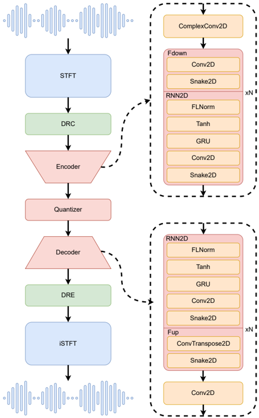

> [!abstract] Interspeech · 2025 · Conference
> **Zixiang Wan et al.** (Anker Inc) · [→ Paper](https://arxiv.org/abs/2510.21209) · Demo: ✗ · Code: ✗
>
> Introduces a neural audio codec that operates entirely in the compressed spectral domain using only CNN and RNN layers, reaching M-level FLOPs and K-level parameter counts while remaining competitive with, or superior to, waveform-based codecs an order of magnitude larger.

## Problem

Neural audio codecs (NACs) are increasingly used both as compression tools and as the tokenizer front end for speech language models (SLMs), where the codec's compute budget, memory footprint, and streaming ability directly limit deployment on edge hardware and low-latency SLM pipelines. Mainstream codecs (SoundStream, EnCodec, DAC) operate on raw waveforms and require G-level FLOPs and M-level parameter counts, which the authors argue is unsuitable for edge deployment; the design space of lightweight, streaming codecs remains underexplored. Existing spectrogram-based alternatives (Lyra, TFNet, ESC, FreqCodec) reduce compute by working in the frequency domain, but the paper's framing is that spectrogram-based codecs generally still underperform waveform-based ones on audio quality, leaving open whether a spectral-domain design can close that gap while keeping the compute advantage.

## Method

SpecTokenizer converts a 16 kHz waveform to a complex STFT spectrogram, applies dynamic range compression (DRC) to the spectrum, encodes the compressed spectrum with an encoder built solely from alternating 2D convolution (`Fdown`) and RNN2D blocks, quantizes the latent with a residual vector quantizer (RVQ, 12 codebooks of size 1024) or an alternative single large codebook, and decodes back through a mirrored decoder (transposed convolutions plus RNN2D blocks) followed by dynamic range expansion (DRE) and inverse STFT to reconstruct the waveform. The DRC/DRE pair compresses the spectrum's amplitude via a power-law function \(f(|s|) = |s|^{1/p}\) (with \(p=2\)) while preserving phase, addressing the high dynamic range of raw spectral magnitudes that otherwise complicates direct spectral modeling. Each RNN2D block uses a frame-wise layer normalization (FLNorm) designed for streaming (normalizing per time step over channel and frequency), a GRU for its low memory footprint and stability on short-horizon audio dependencies, and a Snake2D periodic activation (following prior work showing periodic activations outperform standard ones for audio). Training uses an adversarial objective combining reconstruction, adversarial, feature-matching, and commitment losses, with a Multi-Period Discriminator (from HiFi-GAN) and a Multi-Band Multi-Scale STFT discriminator (from DAC). For the single-large-codebook variant, the authors add EMA-based codebook updates, factorized codebook lookup, an expiration mechanism, and a data pool module that accumulates historical batches to improve codebook utilization under a codebook size much larger than a single batch.

The encoder/decoder is trained from scratch separately per bitrate on LibriTTS (approximately 585 hours of English speech), downsampling to a 50 fps frame rate through four `Fdown` blocks. A "mini" configuration keeps the same architecture with much narrower channel widths ([16, 24, 32, 64, 96] vs. [192, 256, 384, 800, 1280]) to demonstrate scalability of compute and parameters.

## Key Results

At 6 kbps, SpecTokenizer reports the best score among all compared codecs (EnCodec, DAC, FreqCodec) on WER, PESQ, STOI, SDR, MelLoss, UTMOS, and XLSR-MOS on the LibriTTS test set, with SDR reported as 10.47 versus 7.48 for EnCodec at 6 kbps and 1.03 for DAC at 6 kbps *(Table 2)*. At 4 kbps, SpecTokenizer again leads on all reported metrics against HiFi-Codec, SpeechTokenizer, DAC, and FreqCodec, with the authors noting the margin over other codecs widens relative to 6 kbps and that DAC's quality drops sharply at this bitrate while FreqCodec and SpecTokenizer degrade more gracefully *(§4.5.2, Table 2)*. At an extreme 0.5 kbps under the single-large-codebook setting, SpecTokenizer with a 32k codebook (denoted SpecTokenizer*) achieves the best PESQ, STOI, and MelLoss among the RVQ/single-codebook codecs compared, and ranks second on WER, SDR, UTMOS, and XLSR-MOS *(§4.5.3, Table 2)*. On compute, a miniaturized SpecTokenizer (0.43 GFLOPs, 0.45M params) matches or exceeds FreqCodec (2.18 GFLOPs, 4.5M params) at 4 kbps while using about 20% of the FLOPs and 10% of the parameters, and is reported to use roughly 0.8% of DAC's FLOPs and 0.6% of DAC's parameters for comparable or better PESQ/SDR *(Table 3)*. Ablations show every architectural component (spectral compression, FLNorm, Snake2D, multi-scale modeling) contributes to quality, with removing Snake2D producing the largest PESQ drop *(§4.6, Table 4)*. All comparisons reuse the official released weights of the baseline codecs rather than retraining them under matched conditions, so differences in training data and recipe between SpecTokenizer and the baselines are not fully controlled.

## Novelty Assessment

The core contribution is architectural: a codec built solely from CNN and RNN layers (no self-attention) operating in a compressed complex-spectrum domain, combined with a streaming-friendly frame-wise layer normalization and a spectral dynamic-range-compression step designed specifically to make spectral-domain modeling competitive with waveform-domain modeling. The single-large-codebook improvements (data pool, factorized lookup, expiration mechanism) are largely adaptations of existing techniques from prior codec and VQ-VAE work rather than new mechanisms. The headline result, that a spectrogram-based, RNN-based codec can match or beat much larger waveform-based codecs at a fraction of the compute and parameters, is the paper's most notable empirical claim, though it rests on baseline comparisons using pretrained checkpoints rather than models retrained under identical conditions.

## Field Significance

moderate — the paper provides a concrete data point that spectral-domain, convolution-plus-RNN codec architectures can reach competitive reconstruction quality at substantially lower compute and parameter budgets than mainstream waveform-based codecs, which is directly relevant to deploying speech-language-model tokenizers on edge hardware or in low-latency streaming settings. Its evidence is limited to a single training corpus (LibriTTS) and to comparisons against baselines run from released checkpoints rather than retrained matched baselines, so the generality of the efficiency-quality trade-off across domains and training conditions is not established by this paper alone.

## Claims

- **supports:** A codec operating in a dynamic-range-compressed complex spectral domain, built from alternating convolution and RNN layers, can achieve reconstruction quality competitive with or exceeding waveform-domain codecs while using substantially less compute and fewer parameters.
  > *Evidence:* At 4 kbps, a miniaturized SpecTokenizer (0.43 GFLOPs, 0.45M params) matches or exceeds FreqCodec (2.18 GFLOPs, 4.5M params) and DAC (55.66 GFLOPs, 74.06M params) on PESQ/SDR using roughly 20% of FreqCodec's compute/10% of its parameters, and about 0.8%/0.6% of DAC's *(§4.5.4, Table 3)*.
- **supports:** Applying an explicit dynamic-range compression/expansion step to the complex spectrum before encoding helps address the high dynamic range of raw spectral magnitudes and measurably improves reconstruction quality over omitting it.
  > *Evidence:* Removing DRC/DRE ("- DRC&DRE") increases WER from 2.74% to 3.11% and MelLoss from 0.531 to 0.775 at 6 kbps, the largest MelLoss degradation among the four ablated components *(§4.6, Table 4)*.
- **complicates:** Codecs trained with semantic-distillation objectives can retain strong content/intelligibility performance even when general audio-fidelity metrics degrade sharply at very low bitrates, indicating WER alone can be a misleading proxy for overall reconstruction quality.
  > *Evidence:* At 0.5 kbps, SpeechTokenizer performs poorly on PESQ, STOI, SDR, and MOS-based metrics but comparatively well on WER, which the authors attribute to semantic distillation concentrating content information in its first codebook *(§4.5.3)*.
- **complicates:** Benchmark comparisons between codecs that reuse each baseline's officially released, independently-trained weights rather than retraining every model on identical data understate the uncertainty in cross-codec quality comparisons, since architecture, training data, and training recipe are confounded.
  > *Evidence:* Baseline results for EnCodec, HiFi-Codec, DAC, FreqCodec, SpeechTokenizer, and WavTokenizer are obtained from "official weights provided by" each model rather than a controlled retraining on the paper's own LibriTTS training set *(§4.2)*.

## Limitations and Open Questions

> [!warning] All baseline comparisons use each competing codec's officially released checkpoints rather than models retrained on the same data and recipe as SpecTokenizer, so the reported efficiency and quality gains are not isolated from confounds in training data, training duration, and hyperparameters between systems.

Evaluation is limited to a single training corpus (LibriTTS, English read speech); the paper does not report results on noisy, multilingual, or non-speech (e.g., music) audio, so generalization of the reported efficiency-quality trade-off beyond clean English speech is untested within this paper. At the most extreme bitrate tested (0.5 kbps), SpecTokenizer's WER (20.32%) is substantially worse than at 4-6 kbps and is not clearly the best among compared codecs, indicating the architecture's advantages are most pronounced in the 4-6 kbps range rather than uniformly across the tested bitrate spectrum. Code and pretrained models are not released, limiting independent reproduction of the reported numbers.

## Wiki Connections

- [[neural-codec|Neural Audio Codec]] — proposes a lightweight, streaming spectral-domain codec architecture as an alternative point in the codec design space to waveform-based codecs.
- [[streaming-tts|Streaming TTS]] — targets streaming-capable, low-latency encoding/decoding suitable for real-time speech-language-model pipelines.
- [[spoken-language-model|Spoken Language Model]] — motivates the codec design around the token-rate, single-codebook, and compute constraints relevant to using a codec as an SLM tokenizer front end.
- [[evaluation-metrics|Evaluation Metrics]] — evaluates the codec using the Codec-SUPERB @ SLT 2024 protocol across ASR-based (WER) and signal-level (PESQ, STOI, SDR, MelLoss, UTMOS, XLSR-MOS) metrics.
- [[2210.13438|High Fidelity Neural Audio Compression]] (EnCodec) — used as a waveform-based RVQ baseline codec at 6 and 12 kbps.
- [[2305.02765|HiFi-Codec]] — used as a group-residual-VQ waveform-based baseline at 4 kbps.
- [[2308.16692|SpeechTokenizer]] — used as a semantic-distillation waveform-based baseline codec at 4 and 0.5 kbps.
- [[2408.16532|WavTokenizer]] — used as a single-codebook waveform-based baseline codec at 0.5 kbps.
- [[1904.02882|LibriTTS]] — used as the training corpus and evaluation test set for all reported results.
- [[2204.02152|UTMOS]] — used as one of the naturalness metrics for evaluating reconstructed speech quality.
