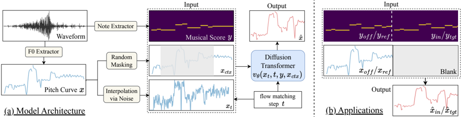

> [!abstract] arXiv · 2025 · Preprint
> **Jingyue Huang et al.** (Smule Labs, UC San Diego) · [→ Paper](https://arxiv.org/abs/2510.21685) · Demo: ? · Code: ?
>
> StylePitcher generates style-following pitch curves for singing that transfer a reference singer's expressive F0 patterns while staying aligned with a target melody, and can be applied without retraining to pitch correction, singing voice synthesis, and singing voice conversion alike.

## Problem

Pitch curves carry much of what makes a singing performance distinctive: vibrato, ornaments, pitch bending, and other singer-specific expressive detail layered on top of the notated melody. Most existing pitch-curve components in singing pipelines treat pitch as singer-agnostic, either reusing the source F0 curve unchanged (as in most singing voice conversion systems) or predicting a "clean" curve to match target notes (as in pitch correction). This discards the expressive fingerprint of a performance. A smaller set of prior systems does model style-informed pitch, but each is built as an auxiliary module bolted onto a specific task, such as pitch correction or synthesis, with task-specific inputs, outputs, and hyperparameters. Adapting these to a new singing application requires retraining from scratch, so no general-purpose, style-preserving pitch generator exists that can serve pitch correction, synthesis, and conversion alike.

## Method

StylePitcher formulates pitch curve generation as a conditional masked-infilling problem: given a partially masked fundamental-frequency (F0) sequence, a note (symbolic score) sequence, and an unvoiced indicator, the model predicts the masked F0 segments so that they continue the style patterns visible in the surrounding unmasked context while staying aligned with the target notes. Because style is inferred implicitly from context rather than from an explicit singer embedding or label, the model generalizes to unseen singers without retraining.

The generator is a diffusion transformer (DiT) trained with a rectified flow objective. Pitch curves and their masked context, together with the note sequence, are linearly projected into token embeddings, concatenated along the frame dimension, and combined with a sinusoidally encoded flow-matching timestep before being passed through the transformer. The model learns a velocity field that transports Gaussian noise toward the true F0 signal over an ODE integrated from t=0 to t=1, with the training loss computed only on masked frames. Classifier-free guidance is applied during both training (randomly dropping the note, context, and unvoiced conditions) and inference (integrating a CFG-modified velocity field). The full model has 49M parameters (8 layers, 8 heads, 512 hidden dimension, rotary position embeddings) and is trained on 1,916 hours of multi-speaker singing from DAMP-VSEP and DAMP-VPB.

To obtain reliable score conditioning without manual annotation, the authors extract F0 with RMVPE and MIDI with Basic Pitch (substituting RMVPE's pitch activations for Basic Pitch's own), then apply a Gaussian-blur smoothing algorithm to the multi-pitch activation map to suppress spurious short notes introduced by expressive techniques like vibrato, followed by removal of short rests and notes.

Once trained, the same model is applied without retraining to three tasks by changing only which segments are masked: (1) automatic pitch correction, where the off-key F0 is provided as context and the corrected segment is generated conditioned on target notes; (2) zero-shot singing voice synthesis with style transfer, where a reference performance supplies the style context and a masked target segment is generated to match target notes from an SVS model; and (3) style-informed singing voice conversion, where reference and target audio features are concatenated and the target pitch segment is regenerated to carry over the reference singer's pitch style on top of an existing timbre-conversion pipeline.

## Key Results

On the Chinese GTSinger test set, StylePitcher improves over Diff-Pitcher on all reported pitch-alignment metrics (RPA 68.64 vs. 67.40, OA 73.04 vs. 70.30) and substantially lowers LSTM-classifier discriminability between generated and real curves (51.85% vs. 69.43% accuracy for Diff-Pitcher and 71.48% for StyleSinger), with near-chance accuracy indicating the generated curves are difficult to distinguish from real pitch curves *(Table 1)*.

In the listening test (19 participants, 76 ratings per task/model/aspect), StylePitcher improves style preservation and audio quality over Diff-Pitcher on pitch correction (MOS-S 3.64 vs. 3.38, MOS-Q 3.26 vs. 3.09) at the cost of lower pitch-correction accuracy (MOS-P 3.84 vs. 4.18); it improves style capture over StyleSinger on zero-shot SVS with comparable quality (MOS-S 3.33 vs. 3.21, MOS-Q 3.11 vs. 3.07); and on style-informed SVC it improves style transfer over the unchanged-F0 in-house baseline (MOS-S 2.95 vs. 2.62) while trading off a small amount of quality (MOS-Q 2.72 vs. 3.03) *(Table 2, §5.2)*. Ablations show that removing the smoothing algorithm slightly improves strict pitch-alignment metrics (by adhering more closely to the score) but the full inpainting/context mechanism is necessary: removing context degrades all objective metrics *(§5.1, Table 1)*.

## Novelty Assessment

The core novelty is architectural: casting pitch-curve generation as a masked-infilling problem solved with a rectified-flow DiT, borrowing the Voicebox-style infilling formulation but applying it to F0 curves rather than speech/audio tokens, and using implicit in-context style modeling instead of explicit speaker or style embeddings. This lets a single trained model serve three previously separate singing tasks without retraining, which is a genuine departure from prior task-specific pitch modules. The rectified-flow and DiT components themselves are established techniques; the contribution is their application, together with the masked-infilling formulation and a smoothing-based data-annotation pipeline, to a task (general-purpose expressive pitch generation) that has not previously been addressed as a single unified model. The evaluation is comparative across all three target tasks and includes a genuine human listening study, but each per-task baseline comparison uses a different, relatively small test set, and the subjective study draws on only 19 raters.

## Field Significance

Moderate — StylePitcher demonstrates that a single flow-matching pitch generator, trained purely as a masked-infilling model, can replace three separate task-specific pitch modules (pitch correction, SVS style transfer, and SVC style transfer) without retraining. It provides a concrete architectural template for treating pitch curves as a general-purpose intermediate representation rather than a task-bound auxiliary output, though the evaluation is limited to modest listening-test scale and single-dataset objective comparisons per task.

## Claims

- **supports:** Reformulating pitch-curve generation as a masked-infilling task solved with a flow-matching transformer allows a single model to serve multiple downstream singing tasks without task-specific retraining.
  > *Evidence:* The same trained model, without modification, is applied to pitch correction, zero-shot SVS style transfer, and SVC style transfer purely by changing which frames are masked, and outperforms or matches task-specific baselines on each. *(§3.3, Tables 1 and 2)*
- **supports:** Modeling pitch style implicitly through unmasked context, rather than through explicit speaker or style embeddings, enables generalization to singers unseen during training.
  > *Evidence:* StylePitcher requires no singer labels or embeddings yet achieves lower LSTM-classifier discriminability between generated and real F0 curves (51.85% accuracy, near chance) than task-specific baselines evaluated on the same unseen GTSinger test set. *(§5.1, Table 1)*
- **complicates:** Preserving singer-specific pitch expressiveness in singing voice conversion can trade off against perceived audio quality when the conversion pipeline lacks content-aware constraints.
  > *Evidence:* Style-informed SVC improves style-transfer MOS over the unchanged-F0 baseline (2.95 vs. 2.62) but loses quality MOS (2.72 vs. 3.03), which the authors attribute to expressive techniques being applied without content awareness, occasionally producing unnatural results. *(§5.2, Table 2)*
- **complicates:** A pitch-alignment metric computed strictly against the target musical score can penalize models that intentionally deviate from the score to preserve expressive style.
  > *Evidence:* The ablation without the smoothing algorithm achieves slightly better RPA/PCA/OA scores than the full model by adhering more strictly to musical scores, even though the smoothed model better preserves style-consistent pitch bends and ornaments. *(§5.1, Table 1)*

## Limitations and Open Questions

> [!warning] The subjective evaluation is small in scale (19 participants, 76 ratings per task/model/aspect) and each per-task comparison uses a different baseline and test set (Diff-Pitcher's own samples for APC, GTSinger for SVS/SVC), so cross-task comparisons and statistical robustness of the reported MOS gaps should be treated cautiously.

The authors themselves note that applying expressive pitch techniques without content awareness can produce unnatural results in the SVC setting, and leave resolving this to future work. The model also depends on automatically extracted F0 and MIDI (RMVPE, Basic Pitch) rather than ground-truth annotations, so its behavior on singing styles or vocal techniques poorly captured by these extractors (e.g., extreme belting, non-Western ornamentation) is untested. The paper reports objective metrics only on a single Chinese-language test set (GTSinger), leaving cross-lingual robustness of the style-transfer mechanism unverified.

## Wiki Connections

- [[singing|Singing Voice Synthesis and Conversion]] — proposes a task-agnostic pitch generator that unifies pitch correction, synthesis, and conversion under one flow-matching model rather than separate task-specific pitch modules.
- [[voice-conversion|Voice Conversion]] — introduces a style-informed singing voice conversion variant that regenerates pitch to carry over the reference singer's expressive style instead of reusing the source F0 unchanged, as most prior SVC systems do.
- [[prosody-control|Prosody Control]] — provides an explicit, retraining-free mechanism for controlling and transferring pitch-curve expressiveness (vibrato, bends, ornaments) independently of the underlying melody or content.
- [[flow-matching|Flow Matching]] — applies a rectified-flow diffusion transformer to a new signal domain (F0 curves) via a masked-infilling training objective, rather than to spectrograms or codec tokens.
- [[subjective-evaluation|Subjective Evaluation]] — runs a human listening test across three singing tasks rating pitch accuracy, style, and quality on 5-point Likert scales, rather than relying on objective proxies alone.
