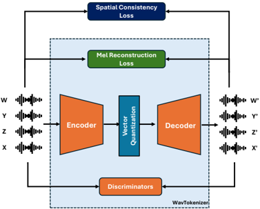

> [!abstract] arXiv · 2025 · Preprint
> **Parthasaarathy Sudarsanam et al.** (Tampere University / Microsoft Research) · [→ Paper](https://arxiv.org/abs/2510.22241) · Demo: ✓ · Code: ?
>
> Extends a single-channel discrete neural audio codec to four-channel First-Order Ambisonics (FOA) spatial audio, adding a spatial consistency loss so that directional cues survive a highly compressed, tokenized representation.

## Problem

Discrete neural audio codecs have matured for mono and stereo signals, forming the tokenization backbone for audio- and speech-language models, but spatial audio (multi-channel signals that encode directional information) has not been addressed by this line of work. Existing compact representations for spatial audio use continuous VAE-style latents (e.g., diffusion-based spatial audio generators), not discrete tokens, which limits their compatibility with the discrete, LM-style modeling paradigm now common in audio and speech generation. A discretized, low-bitrate FOA representation would let spatial audio be transmitted efficiently and modeled with the same token-based architectures used for speech and audio language models, but naively compressing each ambisonic channel independently discards the inter-channel phase and level relationships that encode sound direction.

## Method

The system, FOA-VQGAN, extends the WavTokenizer architecture (a single-channel codec that compresses 24 kHz audio into 75 discrete tokens per second via a convolutional encoder, a single large VQ codebook, and a Vocos-style decoder with an iSTFT head) to accept four-channel FOA input. The only structural change to the encoder is widening its first convolutional layer to ingest four channels instead of one; the rest of the encoder, the 4096-entry VQ codebook (dimension 512, K-means-initialized, EMA-updated, with dead-code reactivation), and the ConvNeXt/attention-based decoder are inherited from WavTokenizer. The decoder's final iSTFT head produces four reconstructed FOA channels. Training uses a multi-period discriminator, a multi-resolution STFT discriminator, and a DAC discriminator operating on the four-channel signal, combined with mel-reconstruction, quantization, adversarial, and feature-matching losses in a standard GAN codec recipe.

The paper's core methodological contribution is a spatial consistency loss (L_sc), inspired by Directional Audio Coding (DirAC), which is added to this GAN training objective. It compares time-frequency intensity vectors (derived from the FOA representation) between the input and reconstructed signal using cosine similarity, restricted by an energy/diffuseness mask so that only regions with strong, unambiguous directional content contribute to the loss. This weights the training signal toward preserving directional cues specifically where they are perceptually reliable, rather than penalizing all time-frequency bins equally.

The codec is trained at 24 kHz on a synthetic corpus of 2 million 10-second recordings built by convolving CommonVoice speech (8 languages, 385h), Freesound and BBC Sound Effects clips with FOA room impulse responses simulated in pyroomacoustics across 10k rooms, mixing 1-5 directional sources with optional diffuse background. At inference, the codec compresses 4-channel FOA audio into 75 discrete tokens per second, an effective bitrate of 0.9 kbps and a 320x compression ratio.

## Key Results

Against multichannel Opus at 24 kbps and 32 kbps across three evaluation conditions (an in-domain synthetic set with unseen rooms and sources, SpatialVCTK — clean VCTK speech spatialized without reverberation, and a MEIR-based set using real measured room impulse responses), FOA-VQGAN at 0.9 kbps matches or exceeds Opus at 24 kbps on most acoustic-reconstruction metrics (CLAP similarity, STFT distance, mel distance) and is broadly comparable to Opus at 32 kbps, while operating at roughly 27-35x lower bitrate. Spatial reconstruction (mean angular error) is 13.76° in-domain, 3.96° on clean SpatialVCTK, and 25.83° on the real-RIR MEIR set; the codec's angular error trails Opus at 32 kbps on the two conditions with the lowest acoustic complexity but is competitive with Opus at 24 kbps.

On SpatialVCTK, where WER and DistillMOS could be computed, FOA-VQGAN reaches DistillMOS 3.07 versus 3.91 for the uncompressed input, but WER rises to 0.67 versus 0.16 for Opus at 32 kbps and 0.23 for Opus at 24 kbps, despite FOA-VQGAN posting a higher CLAP score and lower spectral distances than both Opus settings on the same test set. An ablation without the spatial consistency loss shows acoustic metrics essentially unchanged (mel distance 1.30 vs 1.28) but angular error collapsing to 87.32°, comparable to a naive baseline that encodes each FOA channel independently with a pretrained WavTokenizer (58.87°); with the loss, angular error is 13.76° on the same set. On the downstream sound event localization and detection (SELD) task using STARSS23 real recordings, an SELD network trained on FOA-VQGAN's quantized latents reaches an F-score of 25.3 at a 45° DOA threshold, versus 29.9 for a DCASE2023 baseline trained on raw mel-spectrogram and intensity-vector features at a stricter 20° threshold (FOA-VQGAN scores 11.1 at that same 20° threshold).

## Novelty Assessment

The primary technical contribution is the spatial consistency loss: a masked, energy-weighted cosine-similarity penalty on DirAC-style intensity vectors that can be added to an otherwise standard GAN codec objective without architectural changes, and the ablation cleanly demonstrates that this loss (not the architecture) is what preserves directional information under compression. The architectural extension to four channels itself is comparatively incremental: it reuses WavTokenizer's encoder, codebook, and decoder wholesale, changing only the input channel count. The result is best described as an architecturally novel loss function grafted onto an established codec backbone, applied to a genuinely unaddressed problem (discrete tokenization of ambisonic spatial audio) rather than a wholly new codec architecture.

## Field Significance

moderate — this paper opens discrete, LM-compatible tokenization of spatial audio, a capability that prior spatial-audio compression work (continuous VAE latents) did not provide. Its contribution is narrowly scoped: a single loss term validated on one codec backbone, with the SELD and real-RIR results explicitly framed as preliminary. Its relevance to speech generation specifically is partial: the codec is trained on a mix of speech and general/ambient audio rather than a speech-centric corpus, and its own results show a substantial intelligibility gap (WER) on clean speech relative to conventional compression at far higher bitrate.

## Claims

- **supports:** Extending an established single-channel discrete audio codec architecture to multi-channel input is feasible without redesigning the core encoder-decoder-quantizer pipeline, and can retain strong acoustic reconstruction quality at very low bitrate relative to a conventional multi-channel codec.
  > *Evidence:* Widening only WavTokenizer's first convolutional layer to four channels and retaining its codebook and decoder yields a 320x-compressed, 0.9 kbps FOA codec that matches or exceeds multichannel Opus at 24 kbps on CLAP, STFT, and mel-distance metrics across three evaluation sets *(§4, Table 1)*.
- **complicates:** Standard acoustic-fidelity metrics for compressed audio (spectral distance, embedding similarity) do not reliably track speech intelligibility, so a codec can appear superior on general audio-quality metrics while substantially degrading recognizability of speech content.
  > *Evidence:* On SpatialVCTK, FOA-VQGAN attains higher CLAP (0.96) and lower STFT/mel distance than Opus at 24-32 kbps, and a comparable DistillMOS (3.07 vs. input 3.91), yet its WER (0.67) is far worse than Opus at either bitrate (0.16-0.23) *(§4, Table 1)*.
- **supports:** A single auxiliary loss term targeting a specific perceptual dimension can be added to a standard discriminator-based codec training objective to preserve that dimension under extreme compression, without requiring changes to the underlying architecture.
  > *Evidence:* Adding the spatial consistency loss (masked cosine similarity on DirAC intensity vectors) to the same architecture and remaining losses reduces mean angular error from 87.32° to 13.76° on the in-domain evaluation set, with acoustic metrics essentially unchanged *(§4.1, Table 2)*.
- **complicates:** Discrete codec representations trained primarily on synthetic, simulated acoustic conditions transfer only partially to real-world recordings, and their compressed latents can underperform purpose-built supervised features on downstream spatial tasks.
  > *Evidence:* Mean angular error rises from 13.76° on the in-domain synthetic set to 25.83° on the real-RIR MEIR set, and an SELD network trained on the codec's quantized latents scores an F-score of 25.3 (at a relaxed 45° threshold) versus 29.9 for a supervised DCASE2023 baseline using raw mel/intensity features at a stricter 20° threshold *(§3.1, §4.2, Table 3)*.

## Limitations and Open Questions

> [!warning] The codec's WER of 0.67 on clean spatialized speech (SpatialVCTK), versus 0.16-0.23 for conventional Opus coding at far higher bitrate, indicates a substantial loss of speech intelligibility under this compression scheme, which the paper attributes to training on "small-scale speech data" relative to its total training corpus. This materially limits the codec's applicability to speech-content spatial audio without further speech-focused training.

The codec is trained only on stationary sound sources, while the STARSS23 downstream evaluation set contains real recordings with moving sources, which the authors note likely explains part of the SELD performance gap. The SELD experiments are explicitly framed as preliminary, using a small probe network rather than a tuned localization system. Spatial reconstruction quality degrades notably on the real-RIR MEIR condition relative to synthetic conditions, indicating a synthetic-to-real generalization gap. The paper does not report model parameter counts, code availability, or licensing information for the training corpus.

## Wiki Connections

- [[neural-codec|Neural Audio Codec]] — extends the discrete single-channel codec paradigm (VQ + GAN discriminators, à la WavTokenizer) to four-channel ambisonic spatial audio, the first published discrete codec for this signal class.
- [[gan-vocoder|GAN Vocoder]] — reuses a Vocos-style decoder and multi-discriminator adversarial training recipe common to GAN-based vocoders, applied here to a multichannel reconstruction target.
- [[evaluation-metrics|Evaluation Metrics]] — introduces spatial reconstruction metrics (azimuth, elevation, and angular error derived from DirAC intensity vectors) alongside standard acoustic-fidelity and intelligibility metrics to evaluate a spatial codec.
- [[2408.16532|WavTokenizer]] — the single-channel codec architecture this paper directly extends to four-channel FOA input, reusing its encoder, VQ codebook, and decoder unchanged apart from the input layer.
- [[2306.00814|Vocos]] — the decoder backbone (ConvNeXt blocks plus iSTFT head) inherited via WavTokenizer and used to reconstruct the four-channel FOA waveform.
- [[2210.13438|High Fidelity Neural Audio Compression]] — cited as a representative single-channel RVQ-based neural codec that this paper's single-VQ-layer approach is positioned against in motivating why WavTokenizer was chosen as the base architecture.
