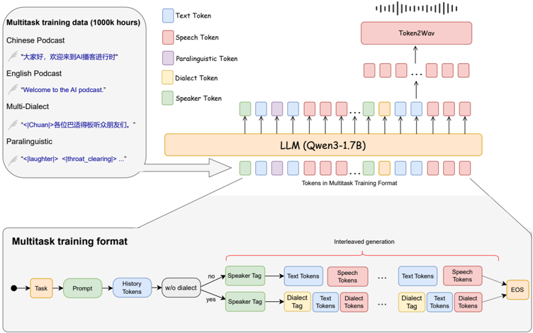
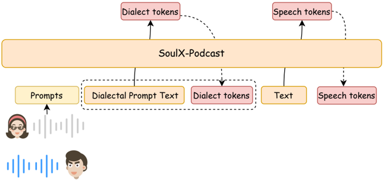

> [!abstract] arXiv · 2025 · Preprint
> **Hanke Xie et al.** (Soul AI Lab) · [→ Paper](https://arxiv.org/abs/2510.23541) · Demo: ? · Code: ?
>
> Introduces a single LLM-driven TTS system that generates long-form, multi-speaker, multi-dialect podcast dialogue with paralinguistic control while remaining competitive on conventional zero-shot monologue synthesis.

## Problem

Most zero-shot TTS systems are built and evaluated for single-speaker synthesis. When these systems are pressed into multi-speaker, multi-turn conversational generation, they tend to lose fluency and natural prosodic variation across turns, and long-form generation (tens of minutes) introduces additional stability and speaker-consistency problems that are absent in short monologue evaluation. Prior dialogue-TTS systems that do target conversational speech (Covomix, MoonCast, MOSS-TTSD, FireRedTTS-2) improve dialogue continuity but offer limited control over paralinguistic cues (laughter, sighs, breathing) and are built almost exclusively around Mandarin and English, leaving major Chinese dialects such as Sichuanese, Henanese, and Cantonese largely unaddressed in podcast-style synthesis.

## Method

SoulX-Podcast follows a two-stage generative pipeline in the style of the CosyVoice series: an autoregressive LLM first predicts a stream of semantic speech tokens conditioned on interleaved text, which are then converted into acoustic features via flow matching and rendered to waveform by a vocoder. The LLM backbone is the pre-trained Qwen3-1.7B model, with its text codebook extended to include speech tokens plus special tokens that encode speaker identity, dialect, and paralinguistic attributes.

To support multi-turn, multi-speaker generation, the model consumes a text-speech interleaved sequence: each utterance begins with a speaker token, followed (optionally) by a dialect token, then text tokens, then the corresponding speech tokens, concatenated in temporal order across speakers. Paralinguistic cues such as laughter or sighs are inserted as textual tokens at their corresponding positions in the sequence.

Training uses a curriculum: the LLM backbone is first trained on a mixture of monologue and dialogue data to acquire base TTS capability, then further trained on multi-speaker dialogue data in Chinese and English with dialectal and paralinguistic elements, followed by dedicated fine-tuning on the (comparatively small) dialect data to specialize a dialect-capable podcast model. To address long-form stability, the authors introduce a context regularization mechanism that progressively drops historical speech tokens during training while retaining their textual context, pushing the model to rely on semantic rather than low-level acoustic memory across long dialogues.

For cross-dialectal zero-shot voice cloning, the paper identifies a specific failure mode: several Chinese dialects share the same orthography as Mandarin, so when the prompt audio is Mandarin and the target text is orthographically similar, the dialect control signal is too weak to shift the output away from the prompt's dialect. To counter this, the paper proposes Dialect-Guided Prompting (DGP): a short, dialect-typical sentence is prepended to the input text before generation, steering the model toward the target dialect's acoustic characteristics even when the voice prompt itself is in Mandarin.

Training data comprises roughly 0.3 million hours of curated in-the-wild multi-speaker dialogue speech (processed through vocal separation, VAD-based segmentation, Sortformer-based diarization, dual-ASR transcription filtering, and WavLM-based speaker-purity refinement) plus roughly 1.0 million hours of monologue data, for a combined 1.3 million hours. Paralinguistic labels were mined via a two-stage pipeline (BEATs/Whisperd coarse detection followed by Gemini-2.5-Pro verification and fine-grained labeling), yielding about 1,000 hours of paralinguistic-annotated speech. Dialect data (roughly 2,000 hours Sichuanese, 1,000 hours Cantonese, 500 hours Henanese) was collected from public recordings and a trained dialect-identification model, then transcribed with a commercial ASR API after the standard pipeline underperformed on dialectal speech.

## Key Results

On the Seed-TTS-eval monologue benchmark, SoulX-Podcast reaches the lowest CER on the Chinese test set (1.10) among the compared systems and is second only to F5-TTS on the English test set (WER 1.91 vs. F5-TTS's 1.83); its speaker similarity trails only Seed-TTS and MaskGCT on both languages *(§3.1, Table 1)*.

On the ZipVoice-Dia multi-turn dialogue benchmark, SoulX-Podcast outperforms all compared dialogue-TTS systems (ZipVoice-Dia, MoonCast, MOSS-TTSD, VibeVoice-1.5B, FireRedTTS-2) on both Chinese and English subsets, achieving the lowest CER/WER (2.20 zh, 2.27 en) and the highest cross-speaker similarity (cpSIM 0.599 zh, 0.484 en), while its UTMOS scores are competitive but not the top score reported *(§3.2, Table 2)*.

On the dedicated paralinguistic control test set (100 GPT-5-generated utterances, 5 event labels), an automated Qwen-2.5-Omni-FT recognizer scores overall accuracy at 0.82, with near-perfect recognition for laughter (1.00) and lower accuracy for the acoustically subtler breathing (0.75) and coughing (0.70) events *(§3.3, Table 3)*.

On the three supported Chinese dialects, speaker similarity is comparable to Mandarin/English performance (SIM 0.68-0.70 monologue, cpSIM 0.63-0.65 dialogue), though CER is markedly higher than the Mandarin/English results, an effect the authors attribute partly to weaknesses in the dialect-specific ASR systems used for scoring rather than to the TTS system itself *(§3.4, Table 4)*.

## Novelty Assessment

The underlying two-stage AR-LLM-plus-flow-matching backbone is not new; it directly follows the CosyVoice paradigm and swaps in a Qwen3-1.7B backbone. The genuine contributions are at the system and inference-procedure level: (1) a text-speech interleaved multi-speaker token organization that unifies speaker, dialect, and paralinguistic control within a single sequence format; (2) a context regularization training mechanism aimed specifically at long-form (90-plus minute) dialogue stability; and (3) the Dialect-Guided Prompting inference strategy, a specific and non-obvious fix for the orthographic-overlap problem that blocks naive cross-dialectal voice cloning between Mandarin and dialects that share its written form. The large-scale, dialect- and paralinguistic-annotated data curation pipeline is also a substantial engineering contribution, though the corpus itself does not appear to be released. Overall this is best read as a focused engineering and inference-methodology advance built on an established architecture, rather than a new architectural paradigm.

## Field Significance

> [!tip] High
> The paper is the first system in this line of work to combine long-form multi-speaker podcast generation, multiple Chinese dialects, and explicit paralinguistic control in a single evaluated system, and it demonstrates state-of-the-art results on a dedicated multi-turn dialogue benchmark (ZipVoice-Dia) while remaining competitive on standard zero-shot monologue TTS.

The Dialect-Guided Prompting technique addresses a specific, previously undocumented failure mode of cross-dialectal voice cloning (orthographic overlap between Mandarin and several Chinese dialects) and demonstrates a concrete inference-time fix that generalizes across three distinct dialects. The context regularization mechanism provides a demonstrated route to multi-turn stability at conversation lengths (90-plus minutes) well beyond what most prior dialogue-TTS evaluations report.

## Claims

- **supports:** An inference-time prompting strategy that prepends a short target-style exemplar to the input text can steer a zero-shot voice-cloning system toward a target speaking style even when the reference audio itself does not exhibit that style.
  > *Evidence:* Dialect-Guided Prompting prepends a short dialect-typical sentence before generation, allowing a Mandarin voice prompt to produce speech in Sichuanese, Henanese, or Cantonese despite the target text sharing near-identical orthography with Mandarin *(§2.2.3)*.
- **supports:** Progressively discarding historical acoustic tokens while retaining their textual context during training improves stability in long-form autoregressive speech generation.
  > *Evidence:* A context regularization mechanism that drops historical speech tokens but keeps their text is introduced specifically to address long-form (90-plus minute) conversational generation, encouraging reliance on semantic rather than low-level acoustic memory *(§2.2.2)*.
- **complicates:** Objective intelligibility scores for dialectal speech synthesis can be confounded by the reliability of the dialect-specific ASR systems used to compute them, not just by TTS quality.
  > *Evidence:* CER for Sichuanese, Henanese, and Cantonese synthesis (3.75-9.77 monologue, 15.42-28.06 dialogue) is substantially higher than for Mandarin/English, which the authors attribute partly to limitations of the dialect ASR systems (Wenetspeech-Chuan-ASR, TeleSpeech, Wenetspeech-Yue-ASR) rather than to the TTS output itself *(§3.4)*.
- **complicates:** Automated event-recognition models used to score paralinguistic control are less reliable for acoustically subtle nonverbal events than for salient ones.
  > *Evidence:* A Qwen-2.5-Omni-FT recognizer scores near-perfect accuracy for laughter (1.00) but noticeably lower accuracy for breathing (0.75) and coughing (0.70), a gap the authors attribute to the events being "more acoustically subtle or ambiguous" and potentially harder for the evaluator model itself to distinguish *(§3.3, Table 3)*.

## Limitations and Open Questions

> [!warning] Dialect evaluation is confounded by third-party ASR quality, and no human listening test is reported for dialogue or dialect generation.
> The paper reports only automated intelligibility and embedding-similarity metrics (CER/WER, SIM, cpSIM, UTMOS) for its multi-speaker and dialect evaluations; there is no MOS or other human-rated listening test reported anywhere in the paper, including for the headline claim of stable 90-plus-minute conversational generation. The dialect CER figures are also explicitly acknowledged by the authors to be partly limited by the accuracy of the third-party dialect ASR systems used for scoring, which makes it difficult to isolate TTS quality from measurement noise for Sichuanese, Henanese, and Cantonese.

Beyond this, the underlying speech tokenizer/codec used by SoulX-Podcast is not named or characterized in the report, model size is reported only for the LLM backbone (flow-matching module and vocoder sizes are not given), and the curated training corpus (1.3M hours, including the dialect and paralinguistic annotations) does not appear to be released, limiting reproducibility.

## Wiki Connections

- [[autoregressive-codec-tts|Autoregressive Codec TTS]] — extends the AR-LLM-predicts-discrete-tokens paradigm to a text-speech interleaved multi-speaker sequence format for dialogue generation.
- [[flow-matching|Flow Matching]] — uses flow matching as the second stage of its two-stage pipeline to convert predicted semantic tokens into acoustic features.
- [[zero-shot-tts|Zero-Shot TTS]] — targets zero-shot voice cloning both in conventional monologue synthesis and, via Dialect-Guided Prompting, across dialects not present in the reference prompt.
- [[multilingual-tts|Multilingual TTS]] — trains a single system across Mandarin, English, and three Chinese dialects (Sichuanese, Henanese, Cantonese) with dedicated dialect-specific data collection and annotation.
- [[2509.02020|FireRedTTS-2: Towards Long Conversational Speech Generation for Podcast and Chatbot]] — a direct competitor targeting the same long-form podcast-dialogue setting, used as a baseline on both the monologue and ZipVoice-Dia benchmarks.
- [[2503.14345|MoonCast: High-Quality Zero-Shot Podcast Generation]] — an earlier zero-shot podcast-generation system used as a baseline on the ZipVoice-Dia dialogue benchmark.
- [[2508.19205|VibeVoice Technical Report]] — another long-form multi-speaker dialogue TTS system compared against on both monologue and dialogue benchmarks.
- [[2412.10117|CosyVoice 2: Scalable Streaming Speech Synthesis with Large Language Models]] — the architectural lineage SoulX-Podcast follows (AR-LLM plus flow matching), and a baseline on the monologue benchmark.
- [[2025.acl-long.313|F5-TTS: A Fairytaler that Fakes Fluent and Faithful Speech with Flow Matching]] — the strongest baseline on English monologue WER, narrowly outperforming SoulX-Podcast.
- [[2406.02430|Seed-TTS: A Family of High-Quality Versatile Speech Generation Models]] — supplies both a top-performing speaker-similarity baseline and the Seed-TTS-eval protocol used for monologue evaluation.
- [[2409.00750|MaskGCT: Zero-Shot Text-to-Speech with Masked Generative Codec Transformer]] — a baseline with stronger speaker similarity than SoulX-Podcast on the monologue benchmark.
- [[2506.13053|ZipVoice: Fast and High-Quality Zero-Shot Text-to-Speech with Flow Matching]] — supplies the ZipVoice-Dia multi-turn dialogue benchmark used to evaluate podcast generation.
