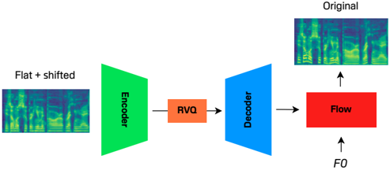

> [!abstract] arXiv · 2025 · Preprint
> **Diego Torres et al.** (IRCAM, CNRS, Sorbonne Universite) · [→ Paper](https://arxiv.org/abs/2510.25566) · Demo: ✗ · Code: ✓
>
> Introduces PitchFlower, a flow-based neural audio codec that achieves explicit, precise pitch controllability through a perturb-and-condition training strategy rather than an adversarial or distillation-based disentanglement mechanism.

## Problem

Pitch control has traditionally relied on source-filter DSP vocoders such as WORLD, which decompose speech into F0, spectral envelope, and aperiodicity and resynthesize after manually editing F0. These manipulations ignore interactions between F0 and other speech attributes, producing audible artifacts. Neural audio codecs (NACs) have since become the standard representation underlying modern generative speech systems, and disentangling controllable attributes within them has become an active question, but this work has focused overwhelmingly on separating linguistic content from speaker identity (e.g., SpeechTokenizer). Pitch disentanglement within a NAC has received much less attention: FACodec's prosody codes are too coarse for precise F0 control, and PeriodCodec, the first NAC with explicit pitch control, inherits the training instability and extra loss terms typical of GAN-based codecs. The paper asks whether a NAC can support precise, explicit pitch control without adversarial training or auxiliary distillation losses.

## Method

PitchFlower follows the standard recipe of recent flow-based audio codecs: an autoencoder, a residual vector-quantization (RVQ) bottleneck, and a flow-matching decoder, with the F0 contour supplied as an explicit conditioning signal to the decoder (§2.1). Disentanglement is enforced through perturbation rather than an adversarial objective: during training, each frame's F0 is flattened to the utterance-level mean plus a random shift sampled from U(-Δ, Δ) using WORLD, and the model must reconstruct the original signal conditioned on the true (unperturbed) F0. The RVQ bottleneck prevents the model from recovering the discarded pitch information from the perturbed latent, while the flow decoder compensates for the perturbation-induced information loss by sampling plausible completions from the learned distribution.

The encoder and decoder use two ConvNeXt blocks (6 layers each) followed by self-attention, with the second block striding by 2; the RVQ module has 8 codebooks of 512 entries (dimension 256); the flow decoder has 4 blocks of 8 layers with hidden dimension 256; the F0 contour is embedded via a 3-layer MLP with separate embeddings for unvoiced and missing frames (§2.2). Training uses conditional flow matching (Lipman et al.) as the sole generative loss plus a commitment loss (weight 0.25), with classifier-free guidance applied by dropping F0 conditioning 10% of the time; inference uses 10 flow steps and a guidance scale of 3.0. The model trains for 800k iterations on a single RTX 4070 GPU on the LibriTTS dataset, and Vocos converts the output mel-spectrograms to waveforms. Unlike prior flow-based codecs where the flow acts as a post-hoc refinement net, PitchFlower is trained end-to-end with flow matching as the only generative objective (§2.1).

The paper also systematically compares PitchFlower's perturbation-plus-bottleneck strategy against alternative disentanglement mechanisms within the same autoencoder-plus-flow backbone: a bottleneck-only baseline (no F0 masking), an adversarial variant (gradient-reversal pitch predictor on the quantized codes, following PeriodCodec and NaturalSpeech 3), and semantic distillation (a HuBERT cosine-similarity loss on the full RVQ output, following SpeechTokenizer) (§4).

## Key Results

Evaluated on LibriTTS dev-clean with pitch shifts from -6 to +6 semitones using WER (Whisper), speaker similarity (ECAPA-TDNN cosine similarity), F0-RMSE (CREPE), and UTMOS, PitchFlower achieves the most accurate pitch control among the four disentanglement variants tested (bottleneck-only, adversarial, adversarial+HuBERT, PitchFlower), with the bottleneck-only baseline placing last; adding HuBERT distillation improves the bottleneck baseline's controllability to roughly match the adversarial variant but degrades WER, speaker similarity, and UTMOS across nearly all variants, and is uniformly detrimental for PitchFlower itself (§4.1).

Against external baselines, PitchFlower achieves consistently lower F0-RMSE than both WORLD and SiFiGAN (a neural pitch-controllable vocoder), confirming stronger controllability, while WORLD lags the three neural methods on audio quality (§5). Subjectively (Table 1), PitchFlower reaches MOS 3.67 ± 0.19 and SMOS 3.47 ± 0.22 on LibriTTS dev-clean, ahead of WORLD (MOS 2.81 ± 0.25) and statistically indistinguishable from SiFiGAN (MOS 3.45 ± 0.19); SiFiGAN clearly leads on speaker similarity (objective and via SMOS 3.46 ± 0.23 vs. PitchFlower's 3.47 ± 0.22, comparable), while PitchFlower's WER is slightly higher than SiFiGAN's but improves over WORLD (§5, Table 1). An ablation without the autoencoder (flow reconstructs mel-spectrograms directly) fails to disentangle pitch at all, confirming perturbation and bottleneck play complementary roles (§6.1). Effective F0 range is limited to roughly 60-700 Hz on LibriTTS, with quality degrading for large downward shifts starting from low F0 (§7).

## Novelty Assessment

The core architectural idea, i.e. using a perturbation applied to the model's own input signal (flattening and randomly shifting F0) combined with a VQ bottleneck as the disentanglement mechanism, is a genuinely different approach from the adversarial (gradient-reversal) or semantic-distillation strategies used by the two closest prior pitch-controllable codecs (PeriodCodec, FACodec/NaturalSpeech 3). It requires no auxiliary loss terms or adversarial training, unlike PeriodCodec, which is a real simplification. However, the underlying components (flow-based codec, RVQ bottleneck, conditional flow matching, ConvNeXt blocks, classifier-free guidance) are all established building blocks assembled here for a new purpose rather than novel primitives themselves; the contribution is best read as a training-recipe innovation layered on a standard flow-codec architecture. The systematic ablation across bottleneck, adversarial, and distillation strategies is a genuine empirical contribution that clarifies trade-offs the field had not previously compared head-to-head within one consistent backbone. Evaluation is limited to a single dataset (LibriTTS) and a single small-scale training run (800k steps, one consumer GPU), and speaker similarity is measurably weaker than the strongest baseline (SiFiGAN), a trade-off the authors attribute to WORLD-induced artifacts from the F0-flattening step itself.

## Field Significance

Moderate — the paper contributes a simpler, non-adversarial recipe for pitch-disentangled neural audio codecs and a useful head-to-head comparison of disentanglement strategies (bottleneck, adversarial, semantic distillation) within a single backbone, addressing a control axis (pitch) that has received far less attention in the codec-disentanglement literature than content-speaker separation. The evaluation is narrow (single dataset, small-scale training, no downstream TTS or singing-synthesis integration demonstrated), so its significance is incremental rather than paradigm-shifting.

## Claims

- **supports:** A simple input-perturbation-plus-bottleneck training strategy can disentangle a target speech attribute from a neural codec's latent representation without requiring an adversarial loss or auxiliary predictor.
  > *Evidence:* Flattening and randomly shifting F0 at the input while conditioning the flow decoder on the true F0, combined with an RVQ bottleneck, yields the lowest F0-RMSE among bottleneck-only, adversarial, and adversarial+HuBERT variants tested on the same backbone. *(§4.1, Figure 2)*
- **complicates:** Disentangling one speech attribute via information bottlenecks or perturbation can degrade other attributes the system is meant to preserve, such as speaker identity.
  > *Evidence:* PitchFlower shows lower speaker similarity than SiFiGAN, attributed to distortions introduced by the WORLD-based F0-flattening transformation used to perturb the training input. *(§5, Table 1)*
- **complicates:** Adding a self-supervised semantic distillation loss to a codec's training objective does not uniformly improve disentanglement quality; its effect depends on which base disentanglement mechanism it is combined with.
  > *Evidence:* Adding HuBERT distillation improved F0 controllability for the bottleneck and adversarial variants but was detrimental across all metrics (WER, speaker similarity, UTMOS, and F0-RMSE) when combined with PitchFlower's perturbation-based mechanism. *(§4.1)*
- **refines:** The controllability of a bottleneck-based disentanglement mechanism depends on the type and capacity of the quantizer, not just its presence.
  > *Evidence:* At matched capacity, RVQ bottlenecks preserve pitch controllability more robustly than FSQ bottlenecks as capacity increases, and controllability degrades for both as bottleneck capacity grows. *(§6.1, Figure 4)*

## Limitations and Open Questions

> [!warning]
> The supported F0 range is bounded by the training data distribution: on LibriTTS the effective range is roughly 60-700 Hz, downward transpositions from low starting F0 saturate near 60 Hz and fail to follow the target contour, and extending the range requires retraining on data with a wider F0 distribution (§7).

Evaluation is confined to a single training run on a single dataset (LibriTTS) with modest compute (one consumer GPU, 800k iterations), and no downstream integration with a TTS or singing-voice-synthesis system is demonstrated despite that being cited as a motivating application. Speaker similarity is consistently the weakest dimension for PitchFlower relative to the strongest baseline (SiFiGAN), a trade-off the authors trace to WORLD-introduced artifacts in the perturbation step rather than to the flow decoder or bottleneck itself. The authors position generalizing the perturbation-plus-bottleneck framework to other attributes (e.g., emotion, timbre) as future work, not something demonstrated in this paper.

## Wiki Connections

- [[neural-codec|Neural Audio Codec]] — proposes a flow-based neural audio codec that adds explicit pitch controllability to the RVQ-bottleneck codec design pattern.
- [[disentanglement|Disentanglement]] — introduces and empirically compares a perturbation-plus-bottleneck disentanglement mechanism against adversarial and semantic-distillation alternatives for separating pitch from a codec's latent code.
- [[prosody-control|Prosody Control]] — provides an explicit, continuous F0 conditioning mechanism that lets pitch be modified independently of the codec's other latent content.
- [[flow-matching|Flow Matching]] — trains its decoder end-to-end with conditional flow matching as the sole generative loss, rather than using flow only as a post-hoc refinement stage.
- [[evaluation-metrics|Evaluation Metrics]] — evaluates pitch controllability, intelligibility, speaker similarity, and audio quality with WER, F0-RMSE, UTMOS, and speaker-similarity metrics across a systematic pitch-shift sweep.
- [[subjective-evaluation|Subjective Evaluation]] — reports MOS and SMOS listening test results comparing the proposed system against WORLD and SiFiGAN.
- [[interspeech-2025-0347|PeriodCodec]] — the closest prior pitch-controllable neural audio codec, which PitchFlower positions itself against by replacing PeriodCodec's adversarial/GAN-based disentanglement with a non-adversarial perturbation-based mechanism.
- [[2403.03100|NaturalSpeech 3]] — its factorized codec's adversarial gradient-reversal pitch predictor is reimplemented as one of the disentanglement strategies PitchFlower compares against.
- [[2308.16692|SpeechTokenizer]] — its HuBERT-distillation approach to disentanglement is reimplemented and extended (to the full RVQ output) as a comparison strategy.
- [[2210.02747|Flow Matching for Generative Modeling]] — supplies the conditional flow-matching training objective used as PitchFlower's sole generative loss.
- [[2306.00814|Vocos]] — used as the vocoder that converts PitchFlower's output mel-spectrograms into waveforms.
- [[1904.02882|LibriTTS]] — the dataset used for both training and evaluation of PitchFlower and all compared variants.
- [[2204.02152|UTMOS]] — used as the automatic perceptual quality metric for the pitch-shift evaluation sweep.
