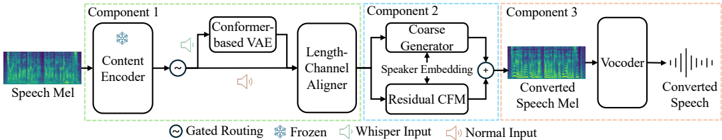
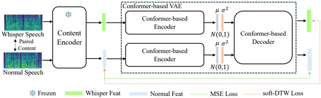

> [!abstract] arXiv · 2025 · Preprint
> **Dong Liu et al.** (Duke Kunshan University) · [→ Paper](https://arxiv.org/abs/2511.01056) · Demo: ✓ · Code: ?
>
> Introduces a three-stage framework that decouples whisper-to-normal domain alignment from acoustic generation, unifying whisper-to-normal (W2N) conversion and conventional voice conversion within a single gated architecture.

## Problem

Whispered speech lacks vocal-fold excitation (no F0), has reduced energy, and shifted formants, making it hard to recover intelligible, natural-sounding voiced speech from it. Whisper-to-normal (W2N) conversion is valuable for people with voice disorders and for quiet, noise-sensitive communication, but paired whisper-normal corpora are scarce. Prior W2N systems mostly use a single-stage acoustic mapping that jointly learns cross-domain alignment, speaker conditioning, and acoustic generation in one model. The paper argues this entangled formulation struggles with the large spectral and temporal mismatch between whisper and normal speech under limited paired data, and that such systems generalize poorly to standard (non-whispered) voice conversion.

## Method

WhisperVC separates the W2N problem into three sequential components trained independently and composed at inference: (1) a whisper-specific domain alignment module, (2) a coarse-to-fine mel generation module operating purely in normal-speech space, and (3) vocoder adaptation. The final mel-spectrogram is formulated as the sum of a coarse prediction and a learned residual, and at inference whispered inputs pass through domain alignment first while normal inputs bypass it via a gated routing mechanism.

Domain alignment (Stage 1) extracts 1280-d content representations from a Whisper-large-V3 encoder fine-tuned on a Mandarin whisper-normal corpus, then feeds paired whisper and normal content features into a Conformer-based continuous VAE with dual encoders and a shared decoder. The VAE is trained with a KL term on both posteriors, an L2 reconstruction term on the normal-speech branch, and a soft-DTW loss that aligns the reconstructed whisper features toward the normal-speech feature space under temporal flexibility, without requiring frame-level parallel supervision.

Acoustic generation (Stage 2) is trained only on normal speech. A Length-Channel Aligner linearly interpolates content features (extracted at 16 kHz) to match 22.05 kHz mel-frame length. A feed-forward Transformer decoder then predicts a deterministic coarse mel-spectrogram conditioned on the length-aligned content features and a 256-d speaker embedding from a SimAM-ResNet34 encoder (pretrained on VoxBlink2, fine-tuned on VoxCeleb2), trained with an L1 loss. A second module models the residual between the ground-truth mel and the coarse prediction using optimal-transport conditional flow matching (OT-CFM): Gaussian noise is transported to the residual along a linear interpolation path, and a flow network learns the conditional velocity field given the interpolated state, timestep, content features, and speaker embedding. A lightweight sigmoid classifier implements the gated dual-path routing: it predicts whether an input is whisper or normal and only routes whisper inputs through the VAE alignment decoder, which is what lets one model serve both W2N and conventional VC.

Vocoder adaptation (Stage 3) fine-tunes a pretrained HiFi-GAN on the model's own predicted mel-spectrograms (rather than ground-truth mels) to reduce train-test distribution mismatch before waveform synthesis. All three stages are trained sequentially but used jointly at inference. Content encoder features run at 16 kHz; mel-spectrogram generation and vocoding run at 22.05 kHz.

## Key Results

On the Mandarin AISHELL6-Whisper benchmark, WhisperVC improves W2N conversion substantially over raw whispered input (DNSMOS ovrl 1.102 → 3.072; CER 22.94% → 16.93%) and over a generic zero-shot VC baseline (Seed-VC) applied directly to whispered input, which collapses to CER 46.42% despite scoring higher on some MOS-predictor metrics. Speaker similarity (WavLM cosine) reaches 0.945 against a ground-truth similarity of 1.0. Ablations show each component matters: removing the VAE domain-alignment module raises CER to 40.16% with sharp MOS-predictor drops; residual OT-CFM refinement outperforms directly modeling the full mel with OT-CFM (CER 18.27% vs. 19.58%); and fine-tuning the vocoder on predicted mels further improves DNSMOS ovrl (2.65 → 3.07) and CER (18.27% → 16.93%).

On standard (normal-to-normal) voice conversion using the same unified model, WhisperVC is competitive with the Seed-VC baseline in perceptual quality and improves content preservation (CER 4.39% → 3.33%); removing the gated routing mechanism degrades CER back to 4.33%, showing the gate contributes to stable multi-task behavior rather than just switching pathways.

On the English wTIMIT benchmark (trained on a disjoint wTIMIT/LibriTTS-clean pipeline with a strict speaker-level train/test split), WhisperVC achieves the best CER among compared systems (11.39%) against whisper-oriented baselines WESPER (30.72%) and DistillW2N (36.03%) and generic VC baselines Seed-VC (16.71%) and FreeVC (26.53%), though its own DNSMOS/UTMOS/speaker-similarity numbers are not uniformly best across the table.

## Novelty Assessment

The individual building blocks (VAE-based representation alignment, soft-DTW loss, optimal-transport conditional flow matching, HiFi-GAN vocoding) are all established techniques from prior speech and generative modeling work; WhisperVC's contribution is the specific decoupled coarse-to-fine composition of them for W2N and the gated dual-path routing that lets one trained model serve both W2N and standard VC without a separate branch or model. This routing-based unification, and the finding that decoupling alignment from generation stabilizes learning under scarce paired data, are the genuinely new elements. The vocoder-adaptation step is comparatively incremental (fine-tuning an existing vocoder on self-generated mels is a known mismatch-reduction trick). Overall the contribution is best read as an architectural composition targeted at a specific low-resource cross-domain problem rather than a new generative modeling primitive.

## Field Significance

moderate — WhisperVC targets a narrow, data-scarce sub-task (whisper-to-normal conversion) rather than mainstream TTS/VC, and reports results on a single new Mandarin corpus plus one English corpus with a separately trained pipeline. Its main contribution to the field is a concrete recipe for decoupling cross-domain alignment from acoustic generation under limited paired data, and a routing mechanism that keeps a whisper-adapted model backward-compatible with standard voice conversion, which is a useful pattern for other low-resource cross-domain speech conversion problems even though the paper itself only demonstrates it for whisper-to-normal.

## Claims

- **supports:** Decoupling cross-domain representation alignment from downstream acoustic generation, rather than learning both jointly in one model, improves conversion stability when paired training data across the two domains is scarce.
  > *Evidence:* Removing the VAE alignment module (OT-CFM Residual w/o VAE) increases CER from 16.93% to 40.16% and causes large drops across all MOS-predictor metrics on the Mandarin W2N test set. *(§3.3, Table 1)*
- **supports:** Modeling a structured residual on top of a deterministic coarse acoustic prediction, rather than generating the full acoustic representation directly, produces more stable generation under cross-domain distribution mismatch.
  > *Evidence:* Residual OT-CFM refinement outperforms full-mel OT-CFM modeling on the same coarse backbone (CER 18.27% vs. 19.58%; DNSMOS ovrl 2.65 vs. 2.55). *(§3.3, Table 1)*
- **complicates:** Generic voice conversion systems trained on same-domain (normal-to-normal) speech transfer poorly to inputs from a severely mismatched acoustic domain such as whispered speech, even when they perform well on standard VC.
  > *Evidence:* Seed-VC applied zero-shot to whispered input on AISHELL6-Whisper yields CER 46.42%, roughly 2.7x higher than the whisper-adapted proposed system (16.93%), despite Seed-VC scoring competitively on several MOS-predictor and speaker-similarity metrics. *(§3.3, Table 1)*
- **supports:** A lightweight gated routing mechanism that conditionally applies a domain-alignment module only to out-of-domain inputs can unify two related conversion tasks (whisper-to-normal and standard voice conversion) in a single model without materially degrading either task.
  > *Evidence:* Removing the gated dual-path routing on the normal-to-normal VC evaluation degrades content preservation (CER 3.33% → 4.33%) while perceptual quality remains similar, showing the gate specifically helps stabilize content, not just quality. *(§3.4, Table 2)*

## Limitations and Open Questions

> [!warning]
> All reported quality and speaker-similarity numbers (DNSMOS, UTMOS, WVMOS, NISQA, SECS, WavLM cosine similarity) are automatic, model-based proxies; the paper reports no human listening test (MOS/SMOS with human raters) to validate perceived naturalness or speaker-identity preservation.

Content preservation remains far from clean-speech TTS/VC levels: CER stays at 16.93% on the Mandarin benchmark and 11.39% on English, both well above typical error rates reported for normal-domain TTS or VC systems, indicating the domain-mismatch problem is only partially solved. The framework also does not train a single multilingual model — the Mandarin and English pipelines use entirely disjoint training corpora and are trained separately, so cross-lingual generalization of the same weights is not demonstrated. The Mandarin paired training corpus (AISHELL6-Whisper) totals roughly 30 hours, and it is not established whether the approach scales to larger, noisier, or spontaneous whispered speech beyond this scripted, relatively small corpus. Finally, since no prior W2N systems had been reported on AISHELL6-Whisper, comparisons rely on a generic VC baseline (Seed-VC) applied out-of-domain rather than a dedicated prior W2N system trained on the same corpus.

## Wiki Connections

- [[voice-conversion|Voice Conversion]] — proposes a unified voice conversion framework that handles both whisper-to-normal conversion and conventional normal-to-normal voice conversion within a single gated model.
- [[flow-matching|Flow Matching]] — uses optimal-transport conditional flow matching to model the residual between a coarse mel prediction and the ground-truth mel-spectrogram, rather than generating the full acoustic representation with flow matching directly.
- [[disentanglement|Disentanglement]] — separates content representation (via a fine-tuned Whisper encoder and cross-domain VAE) from speaker identity (via a dedicated speaker embedding encoder) into distinct pathways for generation.
- [[speaker-adaptation|Speaker Adaptation]] — conditions acoustic generation on a fixed speaker embedding extracted from a pretrained speaker encoder and evaluates generalization to speakers held out at the speaker level in the English test protocol.
- [[2411.09943|Zero-shot Voice Conversion with Diffusion Transformers]] — used as the representative generic VC baseline (Seed-VC) across all three result tables, both applied directly to whispered input and evaluated on standard VC.
- [[2010.05646|HiFi-GAN]] — the neural vocoder backbone that WhisperVC fine-tunes on predicted mel-spectrograms in its vocoder-adaptation stage.
- [[1904.02882|LibriTTS]] — LibriTTS-clean supplies the normal-speech-only training data for the English acoustic generation and vocoder-adaptation stages.
- [[2204.02152|UTMOS]] — one of the automatic naturalness-quality predictors used throughout evaluation.
