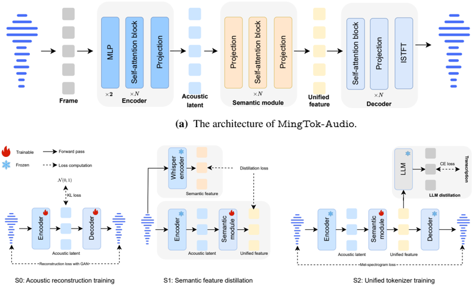
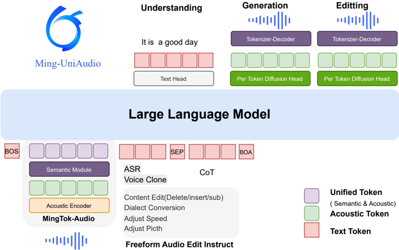

> [!abstract] arXiv · 2025 · Preprint
> **Canxiang Yan et al.** (Ant Group (Inclusion AI)) · [→ Paper](https://arxiv.org/abs/2511.05516) · Demo: ? · Code: ✓
>
> Introduces a continuous VAE-based audio tokenizer that unifies semantic and acoustic representation in a single speech LLM, enabling joint speech understanding, generation, and free-form instruction-guided editing without timestamp conditioning.

## Problem

Speech understanding and speech generation traditionally demand incompatible token representations: understanding benefits from compact, semantics-focused encodings, while generation requires rich acoustic detail. Most unified speech LLMs resolve this either by maintaining two separate representations for the two task families, or by relying on discrete tokens for both. The former breaks down for editing, since interpreting an instruction and synthesizing modified audio requires a single coherent representation spanning both tasks; the latter loses acoustic detail to quantization. Existing instruction-guided speech editing methods (e.g. region-masking approaches, timestamp-conditioned pipelines) also cannot perform truly free-form edits driven solely by natural language, unlike the multi-round editing already demonstrated in the image domain.

## Method

The system centers on MingTok-Audio, a fully transformer-based, convolution-free continuous tokenizer built on a Variational Autoencoder. An encoder projects 16kHz audio frames into a low-dimensional acoustic latent (Z_latent) via a unidirectional transformer and VAE parameterization. A semantic module, initialized from a pretrained Whisper large-v3 encoder with its convolution layers removed, maps this latent into a high-dimensional unified feature (Z_uni) that serves as the single interface fed to the LLM for both understanding and generation. A decoder reconstructs the waveform from Z_uni via a transformer plus a Vocos-style synthesis head predicting the complex spectrogram for iSTFT synthesis.

The tokenizer is trained in three stages: (1) acoustic reconstruction of the encoder/decoder under a hybrid VAE-GAN objective (multi-scale mel reconstruction, adversarial, feature-matching, and KL losses); (2) semantic feature distillation, training only the semantic module to match a frozen Whisper encoder's output via MSE; (3) unified tokenizer training, jointly optimizing semantic alignment (via a frozen guiding LLM) and mel-spectrogram reconstruction to force Z_uni to carry both semantic and acoustic information.

On top of this tokenizer, Ming-UniAudio pretrains a decoder-only LLM backbone (16.8B-parameter Mixture-of-Experts, 2.8B active) that consumes a combined sequence of text tokens and continuous Z_uni tokens. A multi-head design routes different tasks to specialized outputs: a text head autoregressively decodes understanding outputs; a per-token generation head, trained with a flow-matching objective along the optimal-transport path (the paper also refers to it as a "diffusion head"), synthesizes audio conditioned on the LLM's hidden states; and for editing, the model first produces an intermediate chain-of-thought representation before the generation head synthesizes the edited audio.

Pretraining proceeds through a large-scale stage (200k steps, 1:3 understanding:generation step ratio, semantic module frozen), an annealing stage (higher-quality data, smaller learning rate), and a full fine-tuning stage (semantic module unfrozen, generation step ratio increased). Training uses roughly 390,000 hours of Mandarin/English speech (1:1 ratio) drawn from public ASR/TTS corpora and in-house web-crawled and synthetic audio. For free-form instruction-guided editing (Ming-UniAudio-Edit), semantic edits (insertion, deletion, substitution) are formulated as an instruction-conditioned "locate-then-modify" sequence-to-sequence task with an explicit `[MASK]` token marking the edit region in the generated chain-of-thought text, while acoustic edits (denoising, speed/pitch/volume alteration, dialect and emotion conversion) operate globally on the unified representation without producing intermediate text.

## Key Results

On the ContextASR-Bench contextual ASR benchmark, Ming-UniAudio sets new state-of-the-art results on 8 of 12 subtask metrics, and substantially outperforms Qwen2-Audio, Baichuan-Omni-1.5, and Qwen2.5-Omni on WER/NE-WER/NE-FNR across Speech and Dialogue subsets in both English and Mandarin (Table 12). On a proprietary multi-dialect ASR test set it reduces WER sharply relative to Qwen2.5-Omni and Qwen2-Audio (e.g. Shanghai dialect: 14.65% vs. 32.05% and 31.73%), attributed to specialized dialect training (Table 11).

For zero-shot voice cloning on Seed-TTS-Eval, Ming-UniAudio achieves the best Chinese WER among all compared systems (0.95%, versus 1.02% for DiTAR and 1.12% for Seed-TTS) and a competitive English WER (1.85%), but its speaker-similarity scores (SIM 0.70 zh / 0.58 en) trail several baselines such as Seed-TTS (0.80/0.76) and CosyVoice 3 (0.78/0.72) (Table 13). The proposed tokenizer alone outperforms seven other acoustic tokenizers (Mimi, XCodec2.0, BigCodec, GLM4-Voice-Tokenizer, Baichuan-Audio-Tokenizer, XY-Tokenizer, MiMo-Audio-Tokenizer) on reconstruction PESQ/SIM/STOI at a 50Hz frame rate (Table 2), and a downstream TTS system built on the tokenizer clearly outperforms the authors' own prior discrete-token model, Ming-Omni-Lite, under matched training data and scale (Table 3).

For editing, on the proposed Ming-Freeform-Audio-Edit benchmark, the model reaches 79.31%/62.31% edit accuracy for Chinese/English insertion and 76.62%/65.62% for substitution, with corresponding WERs of 3.89%/7.59% and 4.56%/7.64% (Table 14). Acoustic editing (dialect conversion, volume, speed) performs strongly, but pitch alteration shows markedly lower speaker similarity (SIM 0.36 zh / 0.24 en) than the other acoustic edit types. Denoising reaches a DNSMOS OVRL of 3.26, described as competitive with specialized speech-enhancement systems (FullSubNet, Inter-Subnet, CDiffuSE, SGMSE, StoRM, GenSE) evaluated on the DNS Challenge test set.

## Novelty Assessment

The paper's central contribution is architectural: a convolution-free VAE tokenizer that produces a single continuous representation shared by understanding and generation, trained through a staged reconstruction-then-distillation-then-joint-alignment recipe. This differs from prior unified approaches that either keep separate representations (as in some existing speech LLMs) or use interleaved/concatenated discrete-continuous hybrids. The free-form, instruction-only editing capability, without timestamp or region annotation, is also a genuinely new task formulation for speech editing, built directly on top of the unified tokenizer and LLM rather than requiring a separate alignment model. Ming-Freeform-Audio-Edit is a new benchmark contribution filling a gap the authors identify: prior speech-editing evaluation sets are designed for region-based, not free-form, models. The underlying generation mechanism (LLM backbone plus per-token flow-matching head) and the multi-stage training recipe (frozen-then-unfrozen semantic module, diffusion-head initialization from a single-task model) are largely engineering refinements of ideas already explored in prior autoregressive-plus-diffusion TTS work rather than fundamentally new training paradigms.

## Field Significance

> [!tip] High
> High — the work demonstrates that a single continuous tokenizer can support state-of-the-art contextual ASR and competitive zero-shot voice cloning simultaneously, directly addressing the representation-inconsistency problem that has forced most unified speech LLMs into architectural compromises. It also opens a new capability, natural-language-only free-form speech editing, and supplies an accompanying benchmark for future comparative work in this specific area.

## Claims

- **supports:** A single continuous tokenizer can serve as a unified representation for both speech understanding and generation, avoiding the acoustic detail loss that discrete quantization introduces.
  > *Evidence:* MingTok-Audio's continuous representation outperforms seven established acoustic tokenizers, including discrete codecs (Mimi, BigCodec, XCodec2.0) and other continuous tokenizers, on PESQ, speaker similarity, and STOI reconstruction metrics under matched conditions. *(§4.3.1, Table 2)*
- **supports:** Freezing a semantic module derived from a pretrained model during large-scale joint pretraining stabilizes representation learning shared across understanding and generation tasks.
  > *Evidence:* An ablation that unfreezes the semantic module during pretraining raises average understanding WER from 4.35% to 6.86% and average generation WER from 6.53% to 15.30%, with slower convergence, compared to the frozen baseline. *(§5.2, Table 5)*
- **complicates:** Joint training of speech understanding and generation objectives inside one LLM is sensitive to task scheduling and initialization choices because the two task types converge at different rates.
  > *Evidence:* The training recipe uses staged understanding:generation step ratios of 1:3 to 1:6 across pretraining phases, and omitting diffusion-head initialization from a single-task checkpoint degrades average generation WER from 4.43% to 11.33% while leaving understanding WER nearly unchanged. *(§5.2, §5.4, Table 5, Table 6)*
- **supports:** Free-form, instruction-guided speech editing without timestamp or region annotation is achievable by combining an autoregressive locate-then-modify chain-of-thought stage with a shared per-token generation head.
  > *Evidence:* On the proposed Ming-Freeform-Audio-Edit benchmark, the model reaches 79.31% edit accuracy (WER 3.89%) for Chinese insertion and 76.62% accuracy (WER 4.56%) for Chinese substitution using only natural-language instructions and a `[MASK]` token to mark the edit region. *(§6.1, §7.3, Table 14)*
- **complicates:** Pitch-domain acoustic editing is harder to preserve speaker identity through than other acoustic edit types in a unified editing model.
  > *Evidence:* Pitch alteration yields the lowest speaker-similarity scores among the acoustic editing tasks (SIM 0.36 zh / 0.24 en), compared to markedly higher SIM for volume alteration (0.86/0.80) and dialect conversion (0.66), which the authors attribute to target data quality for pitch-shifted audio. *(§7.3, Table 14)*

## Limitations and Open Questions

Speaker similarity on the zero-shot voice-cloning benchmark trails several strong baselines despite leading WER: Ming-UniAudio's SIM (0.70 zh / 0.58 en) is below Seed-TTS (0.80/0.76) and CosyVoice 3 (0.78/0.72), a trade-off the authors themselves flag as an area for further improvement (§7.2). Free-form semantic editing is evaluated almost entirely with automated WER/ACC/SIM metrics; no human listening test (MOS) results are reported for editing quality specifically, though such tests are reported for the underlying TTS generation task via Seed-TTS-Eval's standard protocol references. English-language editing performance consistently lags Chinese across semantic tasks, which the authors attribute to a smaller and lower-quality English training set (§7.3). Because most existing open-source speech LLMs lack a comparable free-form, timestamp-free editing capability, the paper's editing results are validated primarily through internal analysis and the newly introduced benchmark rather than head-to-head comparison against external editing baselines (§7.3).

## Wiki Connections

- [[neural-codec|Neural Audio Codec]] — introduces MingTok-Audio, a continuous VAE-based tokenizer that unifies semantic and acoustic features as an alternative to discrete codec tokens.
- [[autoregressive-codec-tts|Autoregressive Codec TTS]] — generates speech with a decoder-only LLM backbone that consumes continuous unified tokens rather than discrete codebook indices.
- [[flow-matching|Flow Matching]] — trains its per-token generation head with a flow-matching objective along the optimal-transport path to synthesize audio from the LLM's hidden states.
- [[zero-shot-tts|Zero-Shot TTS]] — evaluates Chinese and English voice cloning on the Seed-TTS-Eval benchmark against F5-TTS, CosyVoice, DiTAR, and other zero-shot systems.
- [[instruction-conditioned-tts|Instruction-Conditioned TTS]] — performs free-form acoustic and semantic speech editing (dialect, pitch, speed, volume, denoising, insertion/deletion/substitution) guided solely by natural-language instructions.
- [[2406.02430|Seed-TTS]] — used as the primary zero-shot voice cloning baseline and source of the Seed-TTS-Eval protocol that Ming-UniAudio is benchmarked against.
- [[2025.acl-long.313|F5-TTS]] — compared as a flow-matching zero-shot TTS baseline on the Seed-zh/Seed-en generation benchmark.
- [[2407.05407|CosyVoice]] — compared as a supervised-semantic-token zero-shot TTS baseline on the same generation benchmark.
- [[2502.03930|DiTAR]] — cited as evidence that continuous-latent, per-token diffusion-style generation heads can outperform discrete-token-plus-sentence-level-diffusion pipelines, and used as a generation baseline.
- [[2508.19205|VibeVoice]] — cited alongside DiTAR as supporting evidence for token-level autoregressive generation heads over sentence-level diffusion.
- [[2508.08961|DualSpeechLM]] — discussed in related work as an alternative dual-token strategy for unifying speech understanding and generation, contrasted with Ming-UniAudio's single continuous representation.
- [[2509.02020|FireRedTTS-2]] — compared as a long-form conversational TTS baseline on the Seed-zh/Seed-en generation benchmark.
