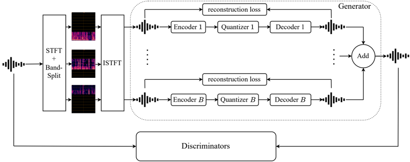

> [!abstract] arXiv · 2025 · Preprint
> **Haoran Wang et al.** · [→ Paper](https://arxiv.org/abs/2511.06150) · Demo: ? · Code: ?
>
> Proposes BSCodec, a neural audio codec that splits the spectral dimension into independent frequency bands, each compressed by its own parallel encoder-quantizer-decoder, to reconcile the conflicting spectral demands of speech, music, and sound within a single universal codec.

## Problem

Existing neural audio codecs are typically tuned for a single content type. Speech-optimized codecs concentrate modeling capacity around the narrow harmonic bands (roughly 80-400 Hz) where speech energy lives, but degrade badly when applied to music or general sound, which require faithful reproduction across a much wider spectrum, especially the higher frequencies that carry timbre and texture. RVQ-based "universal" codecs such as DAC handle multiple domains more gracefully, but the paper argues their residual quantization hierarchy has no explicit acoustic structure: each layer quantizes residuals of the whole spectrum without regard to which frequency region carries which information, forcing the encoder to learn entangled representations across domains with very different energy distributions. Existing attempts to fix this use per-domain mechanisms such as Mixture-of-Experts codebooks or semantic priors, which the authors treat as added complexity rather than a structural fix. The paper asks whether a codec can instead be aligned with the physical spectral structure of audio itself, so that a single architecture generalizes across speech, music, and sound without domain-specific machinery.

## Method

BSCodec follows an encoder-quantizer-decoder architecture with adversarial training, closely modeled on DAC. Its distinguishing step is band-splitting: the input waveform is transformed to a spectrogram via STFT, then split into B non-overlapping frequency bands using binary masks, and each masked band is transformed back to the time domain via inverse STFT, producing B band-limited waveforms. These band-limited signals are processed fully in parallel and independently: each band has its own SEANet encoder (downsampling strides [2, 4, 5, 8], channel dimension doubling from an initial 32, producing 512-dimensional latents at 75 Hz) with no parameters shared across bands, so each encoder can specialize to the spectral characteristics of its own frequency range.

Quantization is single-layer per band using SimVQ (Zhu et al., 2024), which adds a learnable linear transformation on the codebook embeddings before nearest-neighbor lookup; this reparameterization is what lets each band use a large codebook (K = 131,072 in the reported experiments) without the representation collapse that affects standard VQ at that scale. The codebook is trained with a bidirectional commitment loss (encoder-to-codebook and codebook-to-encoder terms, weighted by λ = 0.25) combined with a straight-through gradient estimator. The decoder mirrors the encoder with symmetric upsampling strides ([8, 5, 4, 2]) per band, and the final waveform is obtained by summing all band-specific reconstructions. Training combines a multi-scale mel-spectrogram L1 loss (computed both on the full reconstruction and, additionally, per band against the corresponding ground-truth band) with a multi-period waveform discriminator and a multi-band multi-scale STFT discriminator, following DAC's adversarial training recipe, optimized with AdamW at a global batch size of 72 on 1-second, 24 kHz chunks for 340k iterations.

The authors evaluate three band-partitioning granularities: 5 bands ([0, 0.5], [0.5, 2], [2, 4], [4, 8], [8, 12] kHz), 3 bands ([0, 2], [2, 4], [4, 12] kHz), and 2 bands ([0, 2], [2, 12] kHz), with the partitioning density inspired by Band-Split RNN. Experiments proceed in two stages: Stage 1 validates the approach on music alone (training on Jamendo, MUSDB18, MAESTRO); Stage 2 extends to a domain-balanced mixture of speech (LibriTTS, VCTK, CommonVoice), music (Jamendo, MUSDB18), and sound (AudioSet), sampling roughly 700 hours per domain (about 2,100 hours total). A DAC baseline (8 codebook layers, RVQ, plus codebook-dropout variants at 4.5 and 3 kbps) is trained under identical data and configuration for direct comparison.

## Key Results

On the music-only Stage 1 setting (Table 1), the 5-band configuration at 3.75 kbps outperforms DAC at 6 kbps on vocal-song and instrumental-music VISQOL, Mel Distance, and STFT Distance, and the 3-band (3.83 kbps) and 2-band (2.55 kbps) variants remain competitive at substantially lower bitrate.

In the domain-balanced multi-domain setting (Table 2), the fine-grained 5-band configuration excels on audio and music but is clearly worse than DAC on speech perceptual metrics (PESQ, STOI, UTMOS), even though MCD stays competitive. Coarsening to a 3-band configuration, which keeps a single unified low-frequency band but retains high-frequency splitting, closes most of that gap: it improves speech perceptual metrics across the board relative to the 5-band setup and gives speaker similarity (SPK_SIM = 0.852) that clearly exceeds the DAC 6 kbps baseline (0.751), at 3.83 kbps versus 6 kbps. The 2-band configuration trades some domain performance for a further bitrate reduction to 2.55 kbps. The headline comparison in the paper's own framing is that the 3.83 kbps and 2.55 kbps BSCodec models reach performance comparable to DAC at 6 kbps and 4.5 kbps respectively, i.e. roughly half the bitrate for similar overall quality under matched training conditions.

On downstream tasks (Codec-SUPERB, Table 4), the 3-band BSCodec is the best-performing model overall: it substantially outperforms both DAC variants on automatic speaker verification (EER 2.67 vs. 3.94 and 4.46 for DAC at 6 and 4.5 kbps) and on audio event classification (mAP 87.95 vs. 78.15/74.9), while remaining competitive on ASR WER. The 5-band configuration underperforms on speech-related downstream tasks, which the authors attribute to overly fine partitioning fragmenting speech-relevant information. On the ARCH benchmark (Table 3), which freezes the encoder and trains only a linear probe, all band-split configurations outperform the single-encoder DAC baseline across nearly every subtask, with the 5-band model best on speech and audio subtasks specifically. An ablation (Table 5) that swaps SimVQ for standard VQ in BSCodec, and separately replaces DAC's RVQ with Residual SimVQ, shows neither substitution changes performance meaningfully, isolating band-splitting itself, rather than the SimVQ quantizer, as the source of the observed gains.

## Novelty Assessment

The core idea, decomposing audio into frequency bands and processing each independently, is not new in itself; the paper explicitly builds on Band-Split RNN (music source separation) and Multi-band MelGAN (speech synthesis), and cites a prior RVQ-based multi-band codec built specifically for speech. BSCodec's contribution is applying and systematically tuning this decomposition for a *universal*, multi-domain neural codec, with a simpler design than prior multi-domain approaches that rely on Mixture-of-Experts codebooks or auxiliary semantic priors. The genuinely new empirical finding is the trade-off between band granularity and domain performance (fine bands help wide-spectrum domains but hurt narrow-band speech) and the specific fix of unifying the low-frequency band while keeping high-frequency splitting. The ablation isolating band-splitting from the SimVQ quantizer is a useful piece of evidence that the architecture, not the specific vector quantization scheme, is responsible for the gains. Overall this reads as a focused architectural refinement and careful multi-domain benchmarking study rather than a foundational new paradigm.

## Field Significance

moderate — the paper provides a concrete, ablated architectural mechanism (band-split parallel encoder-quantizer-decoder with per-band quantization) for building a single codec that handles speech, music, and sound with roughly half the bitrate of a matched DAC baseline. It also contributes a systematic study of how band granularity trades off across domains, and demonstrates that band-split representations carry more downstream semantic signal (Codec-SUPERB, ARCH) than a single-encoder RVQ baseline at comparable cost. The idea and its precedents (Band-Split RNN, Multi-band MelGAN, prior speech-only multi-band codecs) are established, so the primary contribution is systematic adaptation and tuning for the universal multi-domain setting rather than a new paradigm.

## Claims

- **supports:** Splitting the spectral dimension into independently-encoded and independently-quantized frequency bands can improve a neural codec's reconstruction quality on wide-spectrum audio domains at lower bitrate than a comparable full-band RVQ codec.
  > *Evidence:* The 5-band configuration at 3.75 kbps exceeds a matched DAC baseline at 6 kbps on VISQOL, Mel Distance, and STFT Distance for both vocal and instrumental music. *(§5.1, Table 1)*
- **complicates:** Frequency-band decomposition that benefits wide-spectrum audio domains can degrade quality in narrow-band domains such as speech, because fine-grained splitting fragments the concentrated low-frequency information speech relies on.
  > *Evidence:* In the multi-domain setting, the 5-band configuration underperforms the DAC baseline on speech PESQ, STOI, and UTMOS despite excelling on audio and music, and downstream speech tasks on Codec-SUPERB show the 5-band model performing worse than coarser configurations. *(§5.2, §5.4, Tables 2 and 4)*
- **supports:** Unifying the low-frequency band while retaining high-frequency band-splitting can reconcile the competing acoustic requirements of speech and non-speech domains within a single multi-domain codec.
  > *Evidence:* The 3-band SimVQ configuration achieves substantially higher speaker similarity than the DAC 6 kbps baseline (0.852 vs. 0.751) at 3.83 kbps, while maintaining near-parity with the 5-band model on audio and music metrics. *(§5.2, Table 2)*
- **supports:** Band-split codec representations can carry stronger downstream semantic content than single-encoder RVQ representations at comparable or lower bitrate.
  > *Evidence:* The 3-band BSCodec substantially outperforms DAC baselines on Codec-SUPERB automatic speaker verification (EER 2.67 vs. 3.94/4.46) and audio event classification (mAP 87.95 vs. 78.15/74.9), and band-split configurations outperform single-encoder DAC on nearly all ARCH linear-probe subtasks. *(§5.4, Tables 3 and 4)*
- **complicates:** In multi-band codec design, the choice of vector quantizer is not the primary source of reconstruction gains; the frequency-band decomposition itself is.
  > *Evidence:* Ablations replacing DAC's RVQ with Residual SimVQ, and replacing the band-based VQ with SimVQ inside BSCodec, produce no significant performance change in either direction, isolating band-splitting rather than SimVQ as the driver of the observed improvements. *(§6, Table 5)*

## Limitations and Open Questions

The paper's own limitations section is narrow in scope: evaluation is confined to audio reconstruction quality and small-scale, frozen-encoder downstream understanding tasks (Codec-SUPERB, ARCH), with no investigation of how BSCodec tokens behave in large-scale generative downstream settings such as codec-language-model-based TTS. This leaves open whether the band-split token structure (multiple parallel per-band codebooks rather than a single sequential residual stack) is compatible with autoregressive or other generative modeling approaches that consume codec tokens as a sequence. The paper also does not report total model parameter counts or inference-time/compute costs of running B parallel encoder-decoder branches relative to a single-encoder baseline, so the practical efficiency trade-off of the approach is not directly assessable from the paper alone. Band boundaries and codebook sizes are also hand-selected per domain-mix rather than learned, and the reported band configurations were tuned specifically for the speech/music/sound mixture studied here.

## Wiki Connections

- [[neural-codec|Neural Audio Codec]] — proposes a band-split alternative to full-band RVQ tokenization for reconstructing speech, music, and sound within a single codec.
- [[gan-vocoder|GAN Vocoder]] — reconstructs band-limited waveforms from quantized latents using multi-period and multi-band multi-scale STFT discriminators in an adversarial training setup adapted from DAC.
- [[evaluation-metrics|Evaluation Metrics]] — evaluates across MCD, PESQ, STOI, SPK_SIM, UTMOS, VISQOL, Mel/STFT distance, and downstream Codec-SUPERB and ARCH benchmarks spanning speech, music, and sound.
- [[2210.13438|High Fidelity Neural Audio Compression]] — cited as one of the established RVQ-based neural codec architectures that BSCodec's band-split design is positioned against.
- [[2506.10274|Discrete Audio Tokens: More Than a Survey!]] — cited as evidence that speech-optimized codecs degrade on music and sound and that RVQ-based universal codecs like DAC retain an advantage for universal audio, motivating BSCodec's problem framing.
- [[2025.acl-long.937|UniCodec]] — one of the domain-specific-codebook approaches (Mixture-of-Experts layers) that BSCodec explicitly contrasts itself against, arguing for a simpler band-split alternative.
- [[2504.10344|ALMTokenizer]] — grouped with other recent universal-codec work using semantic priors and fine-grained supervision that BSCodec positions its simpler band-split design against.
