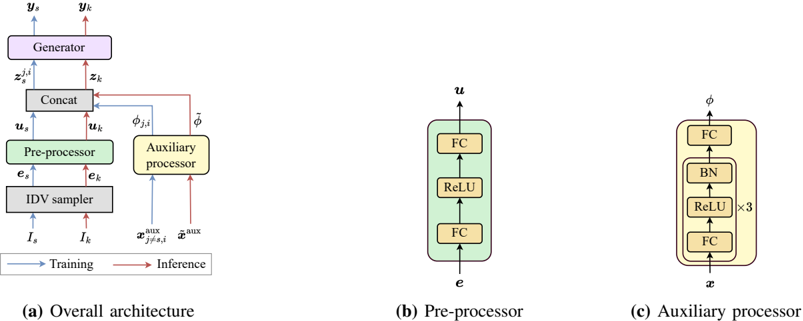

> [!abstract] arXiv · 2025 · Preprint
> **Zeyan Liu et al.** (University of Science and Technology of China) · [→ Paper](https://arxiv.org/abs/2511.06246) · Demo: ✓ · Code: ✓
>
> Proposes IDMap, a feedforward framework that maps a sampled speaker identity index directly to a speaker embedding vector, generating unique pseudo-speakers for voice anonymization with lower computational cost than prior model-based generators.

## Problem

Voice anonymization systems built on attribute-disentangled speech generation replace an utterance's original speaker embedding with a "pseudo-speaker" vector to prevent speaker re-identification. The paper identifies two unresolved weaknesses in existing pseudo-speaker generators. First, uniqueness: reference-pool methods (random selection, cohort averaging), generative methods (Gaussian-mixture sampling, GAN-based generation), and SVD-based transformation do not constrain distinctiveness among generated pseudo-speakers, so different utterances (or even different speakers) can be assigned the same or highly similar pseudo-speaker, making anonymized utterances linkable. The learnable orthogonal Householder (LOH) method addresses uniqueness only at the speaker level, not per-utterance. Second, computational efficiency: model-based generators (pseudo-speaker distribution estimators, GAN-based sampling with rejection) are expensive, and both limitations are amplified in large-scale anonymization scenarios where a very large number of pseudo-speakers must be produced.

## Method

IDMap reframes pseudo-speaker generation as a mapping problem: given a speaker identity index (an integer), the framework learns to produce the corresponding speaker embedding vector in a single feedforward pass, rather than sampling from a random seed and iterating toward a target similarity threshold (as the GAN-based baseline does). Uniqueness is guaranteed by construction: each new pseudo-speaker is assigned an identity index drawn without replacement from previously used indices, so no two generated vectors share an index.

The architecture (Fig. 3) has four components. An identity vector (IDV) sampler uses a permuted congruential generator seeded by the identity index itself to deterministically draw a stochastic identity vector, so the same index always maps to the same vector. A pre-processor (two fully connected layers with ReLU) transforms this identity vector into an intermediate representation carrying speaker-specific identity information. In parallel, an auxiliary processor takes a speaker vector extracted from an utterance of a *different* speaker and passes it through three FC-ReLU-batchnorm blocks; ablation in §VI-I3 shows this auxiliary path is trained to strip away speaker-discriminative information (mean cosine similarity across speaker pairs rises from 0.19 for raw speaker vectors to approximately 0.9997-0.9999 at the auxiliary processor's output), so it functions as a regularizer and data-augmentation signal rather than a source of identity leakage. The intermediate representation and auxiliary output are concatenated and fed to a generator that predicts the target speaker vector.

Two generator realizations are compared. IDMap-MLP uses a simple three-layer MLP generator trained with a loss combining cosine similarity and Euclidean distance to the ground-truth speaker vector (weighted by α = 0.5). IDMap-Diff instead uses a diffusion probabilistic network (a U-Net following the DiffVC architecture), trained with the maximum-likelihood SDE solver (SDE-ML) so that only 5 reverse diffusion steps are needed at inference, keeping generation fast despite the iterative process. At inference, a single fixed auxiliary speaker vector (randomly chosen from the training set) is reused across all pseudo-speaker generations, so the only per-utterance input is the sampled identity index.

For the downstream voice anonymization application, IDMap plugs into an existing content/speaker/prosody-disentangled speech generation pipeline: a wav2vec2.0-based ASR acoustic model with vector quantization extracts bottleneck (VQ-BN) content features, an ECAPA-TDNN speaker encoder (x-ivector pooling) supplies the original speaker vector that IDMap's pseudo-speaker vector replaces, a global-style-token style encoder supplies a style embedding drawn from an emotion-matched reference utterance, and a HiFi-GAN generator synthesizes the anonymized waveform from the three feature streams.

## Key Results

On the VoicePrivacy 2024 (VPC2024) small-scale protocol (LibriSpeech dev/test), IDMap-Diff obtained the highest speaker-verification EERs among all compared methods (average 47.6-48.2% depending on identity-vector sampling distribution), with IDMap-MLP second (average 45.2-45.5%), both exceeding random selection (41.7%), cohort averaging (40.2%), pseudo-speaker distribution (43.9%), and the GAN-based baseline (42.7%) (Table I). ASR (WER) and SER (UAR) results were comparable across all methods, indicating IDMap does not degrade linguistic content or emotion preservation (Table I). On the Gain of Voice Distinctness (Gvd) and de-identification (DeID) tests, IDMap-MLP and IDMap-Diff again outperformed all baselines, with IDMap-Diff reaching a DeID of 99.76-99.96% versus 98.2-99.2% for the baselines (Table II). For computational efficiency, IDMap-MLP and IDMap-Diff had real-time factors of 6.4x10⁻⁴ and 2.4x10⁻³ respectively, an order of magnitude faster than the GAN-based method (0.0419) and the pseudo-speaker distribution method (3.384), though slower than simple cohort averaging (2.1x10⁻⁴) (Table III).

In large-scale evaluation (MLS and Common Voice, scaling from 2,088 to 358,482 utterances / 50 to 10,000 speakers), IDMap-MLP and IDMap-Diff outperformed random selection, averaging, and the GAN-based method across all scales (Fig. 9), and degraded far less as scale increased: EER dropped by a relative 21.1% (IDMap-MLP) and 13.7% (IDMap-Diff) versus 61.8%, 62.9%, and 40.5% for random selection, averaging, and GAN-based methods respectively. A capacity study generating up to 2,000,000 pseudo-speaker vectors showed average pairwise cosine similarity among generated vectors saturating at 0.55 (IDMap-MLP) and 0.51 (IDMap-Diff), with IDMap-Diff retaining somewhat higher distinctiveness (Fig. 11).

## Novelty Assessment

The core novelty is architectural: recasting pseudo-speaker generation as a deterministic, index-conditioned feedforward mapping rather than a sampling-and-rejection process, which sidesteps the uniqueness/efficiency trade-off that afflicts prior generative and model-based approaches. The IDV sampler's use of the identity index itself as a PRNG seed is a simple but effective mechanism for guaranteeing collision-free generation without an external uniqueness check. The diffusion generator variant is an application of an existing fast-sampling SDE solver (from DiffVC) to a new target (speaker vectors rather than mel-spectrograms or waveforms), and the auxiliary-processor regularization strategy is a reasonably contained design contribution validated by a dedicated ablation. The large-scale stability results (relative degradation an order of magnitude smaller than baselines as pseudo-speaker count scales past 300,000 utterances) are the paper's most practically significant finding, since this failure mode is largely invisible at the small evaluation scales typically used in prior anonymization work.

## Field Significance

moderate — This paper contributes a concrete architectural mechanism for a persistent bottleneck in voice anonymization (pseudo-speaker uniqueness at scale) and demonstrates it holds up as the number of generated pseudo-speakers grows into the hundreds of thousands, a regime most prior anonymization evaluations do not test. Its scope is narrow relative to the broader TTS/VC literature, but within voice privacy protection it provides a reusable generator design and a comparison protocol (VPC2024-aligned) that other pseudo-speaker methods can be benchmarked against.

## Claims

- **supports:** Deterministically mapping a discrete identity index to a speaker embedding, instead of sampling from a continuous prior and enforcing distinctiveness only through a similarity threshold, can produce pseudo-speakers with lower mutual similarity than reference-pool, generative, or rejection-sampling generators.
  > *Evidence:* IDMap-MLP and IDMap-Diff achieve higher average ASV EERs (45.2-48.2%) than random selection, cohort averaging, pseudo-speaker distribution, and GAN-based sampling (40.2-43.9%) on pooled LibriSpeech dev/test, and higher Gvd and DeID scores on the same protocol. *(§VI-E1, Table I; §VI-F–G, Table II)*
- **supports:** A single feedforward pass from index to speaker vector can be substantially cheaper at inference than sampling-based or distribution-estimation pseudo-speaker generators, without sacrificing voice-privacy performance.
  > *Evidence:* Real-time factors of 6.4x10⁻⁴ (IDMap-MLP) and 2.4x10⁻³ (IDMap-Diff) are roughly 1-2 orders of magnitude lower than the pseudo-speaker distribution method (3.384) and the GAN-based method (0.0419), measured on 1,000 randomly selected LibriSpeech utterances. *(§VI-H, Table III)*
- **complicates:** The privacy-protection advantage of a pseudo-speaker generator over simpler baselines becomes more pronounced, not less, as the number of pseudo-speakers that must be generated grows, meaning small-scale evaluations can understate a method's real-world degradation.
  > *Evidence:* Scaling from 2,088 to 358,482 utterances (50 to 10,000 speakers) on MLS and Common Voice, EER degraded by a relative 61.8%, 62.9%, and 40.5% for random selection, averaging, and the GAN-based method respectively, versus only 21.1% (IDMap-MLP) and 13.7% (IDMap-Diff). *(§VI-J1, Fig. 9)*
- **complicates:** Guaranteeing collision-free identity-index assignment does not guarantee that generated speaker embeddings remain acoustically distinct as the number of generated pseudo-speakers grows very large; distinctiveness can still saturate.
  > *Evidence:* Average pairwise cosine similarity among IDMap-generated speaker vectors rose with the number of generated vectors and saturated at 0.55 (IDMap-MLP) and 0.51 (IDMap-Diff) once generation reached roughly 2,000,000 vectors. *(§VI-J3, Fig. 11)*

## Limitations and Open Questions

The evaluation is built entirely on one underlying speech generation pipeline (a VQ-BN + ECAPA-TDNN + GST + HiFi-GAN system derived from prior work), so it is untested whether IDMap's uniqueness and efficiency advantages transfer to speaker embeddings produced by different encoders (e.g., d-vectors or other x-vector variants) or to end-to-end zero-shot TTS/VC systems that do not rely on this disentangled cascade. The capacity study shows cosine similarity among generated pseudo-speakers saturating around 0.5-0.55 as the number of generated vectors grows toward 2,000,000, meaning uniqueness degrades gracefully rather than being preserved indefinitely; the paper does not characterize the practical anonymization impact once similarity reaches this saturation point. The auxiliary speaker vector used at inference is fixed and randomly chosen once from the training set, and the paper's justification for this choice rests on a single regularization experiment rather than a systematic study of sensitivity to that choice.

## Wiki Connections

- [[voice-conversion|Voice Conversion]] — applies a voice-conversion-style speaker-embedding substitution pipeline to the specific problem of voice anonymization, replacing the original speaker vector with a generated pseudo-speaker vector rather than converting toward another real speaker's identity.
- [[speaker-adaptation|Speaker Adaptation]] — proposes a mechanism for generating novel, index-addressable speaker embedding vectors that condition a downstream generation system, inverting the usual speaker-adaptation goal of fitting a real target identity.
- [[self-supervised-speech|Self-Supervised Speech]] — the underlying anonymization pipeline's content extractor is a wav2vec2.0-based ASR acoustic model, pretrained self-supervised on Libri-Light, Common Voice, Switchboard, and Fisher before fine-tuning, supplying the bottleneck features that IDMap's pseudo-speaker vector is combined with at synthesis time.
- [[2010.05646|HiFi-GAN]] — used unmodified as the waveform generator in the anonymization pipeline, synthesizing anonymized speech from content, style, and IDMap's pseudo-speaker vector.
- [[2005.07143|ECAPA-TDNN]] — used as the speaker encoder architecture whose output vector space IDMap is trained to map speaker identity indices into.

