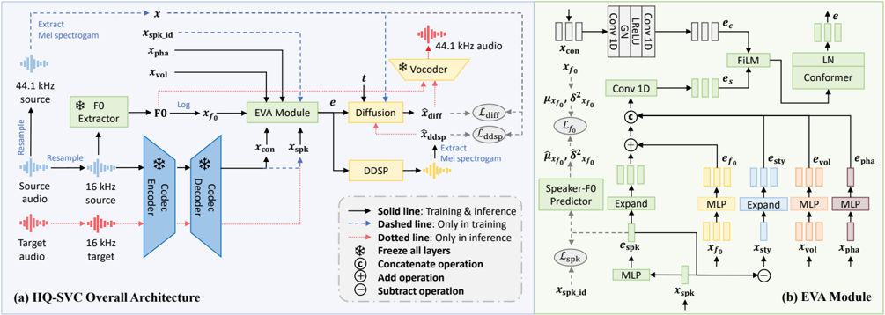

> [!abstract] arXiv · 2025 · Preprint
> **Bingsong Bai et al.** (Beijing University of Posts and Telecommunications) · [→ Paper](https://arxiv.org/abs/2511.08496) · Demo: ? · Code: ?
>
> Achieves high-quality zero-shot singing voice conversion by fusing a frozen factorized codec's content and speaker features with explicit pitch, energy, and phase cues, using less than 80 hours of data and a single consumer-grade GPU to outperform a state-of-the-art baseline trained on 1,700 hours over multiple A100-days.

## Problem

Zero-shot singing voice conversion (SVC) must transform a source singer's timbre to an unseen target speaker's voice while preserving melody and content, without any fine-tuning on the target speaker. Existing zero-shot SVC systems typically rely on separate content and speaker encoders (e.g., HuBERT-style content extractors paired with independent speaker verification embeddings), which loses acoustic information at the fusion boundary and degrades synthesis quality. High-quality zero-shot systems that do preserve fidelity (VITS-based or two-stage latent-diffusion pipelines) instead demand large-scale singing datasets and heavy adversarial or multi-stage training, making them impractical when only limited singing data and GPU budget are available. Singing further compounds the difficulty relative to speech VC because of higher sampling rates, wider F0 ranges, and a tighter coupling between pitch and timbre.

## Method

HQ-SVC is built on a frozen, pretrained decoupled audio codec (FACodec, from NaturalSpeech 3) that jointly extracts disentangled content and speaker features from the decoder's intermediate layers, avoiding the information loss of training separate content and speaker encoders. On top of this frozen backbone, the paper introduces the Enhanced Voice Adaptation (EVA) module for multi-feature fusion: an RMVPE-based F0 encoder supplies pitch features, and energy and phase features required by the downstream DDSP synthesizer are extracted and mapped through small MLPs into a shared embedding space. The codec's speaker features are further split via a residual computation into a speaker embedding and a "style" component, and the speaker and F0 embeddings are combined into a unified representation before all style-side embeddings are concatenated and compressed to match the content embedding's dimensionality. Content and style representations are fused with FiLM conditioning followed by a Conformer block with 8-head self-attention.

Two auxiliary training signals support this fusion: an InfoNCE-based speaker loss that pulls together same-speaker embeddings and pushes apart different-speaker embeddings within a batch, and a Speaker-F0 Predictor (SFP), an MLP that predicts the mean and variance of a speaker's log-scaled F0 distribution directly from the speaker embedding, addressing the fact that target-speaker pitch statistics are unavailable at zero-shot inference time.

The fused embedding is passed through a Differentiable Digital Signal Processing (DDSP) synthesizer (harmonic plus noise synthesizers) to produce an initial Mel spectrogram, which is then refined by a diffusion model (a FastSpeech2-style WaveNet denoiser) that fills in acoustic detail the DDSP stage misses. Training minimizes a combined objective of DDSP reconstruction loss, diffusion loss, the InfoNCE speaker loss, and the SFP's L1 loss on F0 mean/variance. At inference, DPM-Solver++ performs accelerated sampling (10 steps, chunk-wise processing), and NSF-HiFiGAN converts the resulting Mel spectrogram (with F0) to a 44.1 kHz waveform. Because feature extraction operates on 16 kHz audio while the model is optimized against 44.1 kHz ground-truth Mel spectrograms, the same pipeline natively performs zero-shot voice super-resolution without any architectural change.

The full model trains in about 11 hours on a single NVIDIA RTX 3090 GPU (under 6 GB of GPU memory, 250k steps, batch size 64), using under 80 hours of Mandarin singing data (OpenSinger and M4Singer).

## Key Results

On zero-shot SVC evaluated on unseen OpenSinger singers, HQ-SVC outperforms a FACodec-SVC ablation baseline (frozen FACodec, fine-tuned to produce Mel spectrograms directly, without EVA/DDSP/diffusion) across every reported metric, and also outperforms SaMoye-SVC, a VITS-based zero-shot SVC model pretrained on 1,700 hours of singing audio on an A100 for 7 days, despite HQ-SVC using under 80 hours of data and 11 hours of RTX 3090 training. HQ-SVC reports STOI 0.799 vs. SaMoye's 0.724, F0-RMSE 8.681 vs. 17.418, FPC 0.891 vs. 0.617, NISQA 3.841 vs. 3.528, NMOS 4.215±0.124 vs. 3.958±0.154, and SMOS 3.578±0.192 vs. 3.569±0.147 (§Table 1). SaMoye retains a higher SECS score (0.647 vs. HQ-SVC's 0.627), which the authors attribute to SECS's speaker embeddings implicitly encoding pitch statistics in a way that diverges from human perceptual sensitivity to pitch changes (§Experimental Results and Analysis).

On voice super-resolution, evaluated against AudioSR (a latent-diffusion model trained on over 7,000 hours of sound effects, speech, and music) across OpenSinger, NHSS-Song, LibriTTS-P, and NHSS-Speech, HQ-SVC achieves better LSD (1.842 vs. 2.087) and NISQA (4.193 vs. 4.094) but worse STOI (0.841 vs. 0.986) and FPC (0.868 vs. 0.998) (§Table 2). Subjectively, HQ-SVC beats AudioSR on both NMOS (4.332±0.088 vs. 4.188±0.103) and SMOS (4.479±0.087 vs. 4.235±0.096) despite using two orders of magnitude less training data (§Table 3).

Ablations (§Table 5, §Ablation Studies) show removing the diffusion stage improves intelligibility but sharply degrades SECS (0.627 to 0.42) and NISQA (3.841 to 3.175); removing DDSP improves several objective scores but the diffusion-only pipeline stays anchored too close to the source Mel spectrogram, degrading actual conversion. Replacing the unified FACodec front end with separate CAM++ (speaker) and ContentVec (content) encoders (HQ-SVC-SE) improves SECS (timbre matching) but degrades STOI, F0-RMSE, and NISQA relative to the unified-codec design, indicating a genuine trade-off between joint and separate feature extraction. Removing either the speaker loss or the SFP's F0 loss degrades F0-RMSE, SECS, and NISQA, while producing a slight SMOS improvement that the authors attribute to the same pitch/SMOS interaction observed against SaMoye.

## Novelty Assessment

The core building blocks (FACodec, DDSP, diffusion, FiLM, Conformer, InfoNCE, NSF-HiFiGAN) are all pre-existing components. The paper's genuine contribution is the EVA module: a specific fusion design that splits the frozen codec's speaker feature into a speaker embedding and residual style component, folds in pitch and volume/phase cues through learned embeddings, and adds a speaker loss plus a Speaker-F0 Predictor to compensate for missing target-speaker pitch statistics at zero-shot inference time. This is an engineering-integration effort in its use of established components, but the specific EVA fusion mechanism and the SFP module represent a targeted architectural addition rather than a simple recombination. The more distinctive empirical claim is resource efficiency: matching or exceeding a large-scale VITS-based baseline's quality using roughly 20x less singing data and a single consumer GPU rather than a multi-GPU, multi-day training run. The zero-shot voice super-resolution capability is presented as a side effect of the model's low-to-high sampling-rate feature alignment rather than a separately engineered capability.

## Field Significance

moderate — This paper provides a concrete low-resource recipe for zero-shot singing voice conversion, demonstrating that a frozen factorized codec combined with a lightweight fusion module and DDSP-plus-diffusion refinement can match a large-scale adversarially-trained baseline at a fraction of the data and compute budget. Its ablations also surface a genuine trade-off between unified and separate content/speaker encoders that complicates the assumption that joint feature extraction from a factorized codec is strictly better than dedicated per-attribute encoders. The zero-shot voice super-resolution result is a useful secondary data point showing that SVC-style feature disentanglement can transfer to a related audio restoration task without architectural modification.

## Claims

- **supports:** Combining a frozen, pre-disentangled codec's content and speaker features with explicit pitch and energy conditioning can match or exceed the quality of large-scale adversarially-trained zero-shot singing voice conversion systems while using substantially less training data and compute.
  > *Evidence:* HQ-SVC, trained on under 80 hours of Mandarin singing data for 11 hours on a single RTX 3090, outperforms SaMoye-SVC (pretrained on 1,700 hours on an A100 for 7 days) on STOI, F0-RMSE, FPC, NISQA, and NMOS. *(§Experimental Results and Analysis, Table 1)*
- **complicates:** Whether a unified codec-derived representation or separate dedicated content/speaker encoders produce better zero-shot voice conversion depends on which quality dimension is prioritized, not a uniform ranking.
  > *Evidence:* The HQ-SVC-SE ablation, which replaces the shared FACodec front end with separate CAM++ (speaker) and ContentVec (content) encoders, improves SECS (timbre similarity) from 0.627 to 0.668 but degrades STOI, F0-RMSE, and NISQA relative to the unified-encoder design. *(§Ablation Studies, Table 5)*
- **complicates:** Automatic speaker-similarity metrics derived from speaker-verification embeddings can diverge from human speaker-similarity judgments when pitch consistency is altered.
  > *Evidence:* SaMoye-SVC scores higher SECS than HQ-SVC (0.647 vs. 0.627) despite HQ-SVC scoring higher on subjective SMOS in the main comparison, and removing the speaker or F0 losses in ablation improves SMOS slightly while degrading SECS, which the authors attribute to CAM++ embeddings implicitly encoding pitch information that diverges from human perceptual sensitivity to pitch shifts. *(§Experimental Results and Analysis)*
- **supports:** Predicting a target speaker's pitch statistics from their speaker embedding, rather than requiring reference pitch data, is a viable way to condition pitch generation in zero-shot voice conversion.
  > *Evidence:* The Speaker-F0 Predictor, trained with an L1 loss on predicted vs. actual F0 mean/variance from the speaker embedding alone, improves F0-RMSE, SECS, and NISQA relative to an ablation without this loss. *(§Enhanced Voice Adaption Module, Table 5)*
- **supports:** Feature representations designed for zero-shot singing voice conversion can transfer to audio super-resolution without architectural modification when training and inference sampling rates are deliberately mismatched.
  > *Evidence:* Because HQ-SVC extracts features at 16 kHz but optimizes against 44.1 kHz ground-truth Mel spectrograms, the same trained model performs zero-shot voice super-resolution, outperforming AudioSR (trained on over 7,000 hours) on NMOS and SMOS despite using under 80 hours of training data. *(§Model Evaluation on Voice Super-resolution, Table 3)*

## Limitations and Open Questions

> [!warning] The zero-shot SVC subjective evaluation used only 12 raters scoring 8 randomly selected samples per condition (96 ratings total), a small panel relative to typical listening-test standards, which limits the statistical confidence of the reported NMOS/SMOS margins over SaMoye-SVC (§Experimental Setups).

The paper's own ablation acknowledges that HQ-SVC's unified-encoder design still lags a separate-encoder variant (HQ-SVC-SE) on timbre-similarity (SECS), explicitly stating that "we need to get better at separating out the speaker's identity" (§Ablation Studies). The comparison against SaMoye-SVC also resamples both systems' outputs to a common 32 kHz for evaluation, which is a reasonable fairness adjustment but means neither system's native output rate is directly evaluated. Voice super-resolution results are aggregated across four heterogeneous datasets (two singing, two speech, Mandarin and English) without a per-dataset breakdown, making it hard to assess whether performance is uniform across language and domain. Future work is limited to singing voice style conversion, per the authors' own stated direction (§Conclusions).

## Wiki Connections

- [[singing|Singing Voice Synthesis and Conversion]] — proposes a low-resource zero-shot singing voice conversion pipeline built on a frozen factorized codec and demonstrates it doubles as a singing/speech super-resolution method.
- [[voice-conversion|Voice Conversion]] — targets the core zero-shot voice conversion problem of transferring timbre to an unseen speaker while preserving content, applied here to the singing domain.
- [[speaker-adaptation|Speaker Adaptation]] — adapts to unseen target speakers at inference without fine-tuning, using a speaker embedding derived from a reference audio prompt plus a Speaker-F0 Predictor to infer speaker-specific pitch statistics.
- [[neural-codec|Neural Audio Codec]] — depends entirely on a frozen, pretrained factorized neural codec (FACodec) for disentangled content and speaker feature extraction rather than training its own encoder.
- [[subjective-evaluation|Subjective Evaluation]] — reports naturalness (NMOS) and speaker-similarity (SMOS) ratings from human listeners across both the singing voice conversion and voice super-resolution evaluations.
- [[2403.03100|NaturalSpeech 3]] — HQ-SVC freezes and directly builds on NaturalSpeech 3's FACodec as its content/speaker disentangling backbone.
- [[2010.05646|HiFi-GAN]] — HQ-SVC's final vocoder, NSF-HiFiGAN, is a Neural Source-Filter-augmented derivative of HiFi-GAN.
- [[2006.04558|FastSpeech 2]] — the diffusion denoiser used in HQ-SVC's refinement stage adopts the WaveNet configuration from FastSpeech 2.
