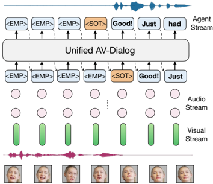

> [!abstract] arXiv · 2025 · Preprint
> **Tuochao Chen et al.** (University of Washington / Meta AI) · [→ Paper](https://arxiv.org/abs/2511.11124) · Demo: ✓ · Code: ?
>
> Introduces the first streaming spoken dialogue framework that fuses audio and video of the target speaker to track who is talking, detect turn-taking, and generate coherent responses under noisy, multi-speaker interference.

## Problem

Full-duplex spoken dialogue models such as Moshi and SyncLLM rely solely on the acoustic signal, typically encoded with speaker-invariant semantic tokenizers. In clean, single-speaker recordings this is adequate, but in real-world "cocktail party" conditions, background noise, overlapping talk, and competing speakers, these models lose track of the target speaker, misjudge when to take a turn, and produce responses grounded in the wrong voice. Prior audio-visual speech recognition (AVSR) systems address speaker robustness with lip-reading cues, but they are built for offline transcription, not for generative, streaming, full-duplex dialogue with turn-taking. No existing system combines audio-visual understanding with generative dialogue and explicit turn-taking control in a streaming setting.

## Method

AV-Dialog fine-tunes a pretrained text LLM (LLaMA3-8B) to jointly consume streaming audio and visual input from the target user and to output a time-aligned transcription stream and a turn-taking event stream. At each 40ms timestep, the model embeds 16 Descript Audio Codec (DAC) token streams and a continuous AV-HuBERT visual feature stream (derived from dlib-detected, lip-centric first-person video), sums them with the previous timestep's text and turn-event embeddings, and predicts, via two linear heads, the next text token and the next turn-taking token. Turn events follow PairwiseTurnGPT's taxonomy: normal turns, overlapping turns, and backchannels, marked with `<SOT>` and `<SOB>` special tokens interleaved with the transcription and silence (`<EMP>`) tokens.

The paper explores two system architectures. In the **dual** architecture, the audio-visual understanding module streams its transcription and turn-event tokens into a separate text-LLM backbone (also LLaMA3-8B, either prompted with in-context dialogue examples or instruction-tuned on real conversational data) that generates the response once a turn-taking token fires; the response text is converted to speech with Moshi's streaming Mimi TTS module. In the **unified** architecture, a single model removes the intermediate transcription stream and instead interleaves turn-taking tokens directly with time-aligned response tokens, generating full-duplex dialogue end to end without a separate backbone.

![Token sequence and dual-model design. A. We use a DAC tokenizer to encode audio into 16 audio token streams and use AV-HuBERT to convert video to continuous visual features. We use turn-level annotation and word-level alignment to generate the target output text stream. B. shows our dual-model pipeline for AV-dialog. The AV dialogue understanding module recognizes user speech and detects potential turn-taking events, while the text backbone generates high-quality responses once turn-taking is triggered.](assets/2511.11124/figure-2.png)

Training uses a two-stage, multi-task recipe on a base LLaMA3-8B checkpoint. Stage 1 aligns text, audio, and visual modalities via text continuation, ASR (LibriLight, MLS, VP400k), audio captioning (AudioSet), and AVSR alignment (VoxCeleb2). Stage 2 fine-tunes on real dyadic conversational data, audio-only Fisher and audio-visual InterAct, for streaming AVSR and turn-taking prediction jointly. Throughout, synthetic mixing augmentation samples clean audio (20%), audio mixed with MUSAN background noise (40%), or audio mixed with 1-4 interfering speakers (40%) at SNRs between -8dB and 8dB, to teach robustness to noisy, multi-speaker conditions.

## Key Results

On streaming AVSR, AV-Dialog's audio-visual variant reaches 17.4% WER on VoxCeleb2 (clean) versus 26.8% for the state-of-the-art streaming AVSR baseline Auto-AVSR, and its advantage widens under noise: 35.6% versus 48.2% (background noise) and 38.8% versus 71.8% (interfering speakers). On the InterAct test set, the audio-visual model reaches 16.3% (clean) to 30.8% WER (interference), far below the audio-only variant (28.6% to 92.2%).

For turn-taking, measured as Response Ratio (fraction of floor-transfer offsets within the human-typical -2s to 3s range), AV-Dialog's audio-visual dual model reaches 74.5% (clean), 78.3% (background noise), and 78.8% (interference), compared to 54.0%, 53.8%, and 52.5% for the Moshi baseline across the same conditions, and 55.9-56.0% for a speech-enhancement-plus-Moshi cascade. Adding the visual modality over an audio-only version of AV-Dialog itself improves response ratio by 1.3-13 points depending on condition.

Human evaluation (N=18, ITU-T P.808 protocol) rates the dual model with in-context learning at 4.14 naturalness MOS and 4.09 helpfulness MOS, versus 2.39 and 2.10 for the speech-enhancement-plus-Moshi baseline, and above ground-truth human responses on this metric (3.92 N-MOS, 3.62 H-MOS). The unified model trails the dual model in both human evaluation (3.54/3.02) and an LLM-judge pickup-ratio metric, though it achieves the lowest floor-transfer-offset error among all variants.

## Novelty Assessment

The individual components, a LLaMA text backbone, DAC acoustic tokenization, an AV-HuBERT visual encoder, and a Mimi TTS module, are all pre-existing. What is new is the system design that couples them: a multi-stream token embedding that fuses audio, video, prior text, and prior turn-event state at every 40ms step; an explicit, jointly-supervised turn-taking token stream trained alongside transcription; and the systematic comparison of a cascaded dual-model design against a single unified model for full-duplex audio-visual dialogue. The paper is explicit that this is the first spoken dialogue model to condition on audio-visual input for turn-taking and response generation, as distinct from prior offline AVSR work and prior audio-only full-duplex dialogue systems. The ablations isolating the acoustic-versus-semantic tokenizer choice and the effect of explicit turn-event supervision are a genuine empirical contribution beyond the architecture itself, not just a repackaging of known parts.

## Field Significance

> [!tip]
> High.

The paper opens audio-visual input as a design axis for full-duplex spoken dialogue systems, a space previously restricted to audio-only semantic-token models such as Moshi and SyncLLM. It demonstrates, with a controlled ablation against a strong audio-only baseline, that visual cues and acoustic (rather than semantic) tokenization jointly and substantially improve robustness to interfering speakers, a failure mode that audio-only dialogue systems have not resolved. Its dual-versus-unified comparison also provides direct evidence, external to the speech-to-speech-translation literature, that cascading a pretrained text LLM for response generation can outperform a single end-to-end model on response quality in the full-duplex dialogue setting.

## Claims

- **supports:** Fusing visual cues (e.g. lip movement) with acoustic input substantially improves the robustness of streaming spoken dialogue systems to interfering speakers and background noise, compared to relying on audio alone.
  > *Evidence:* Turn-taking Response Ratio under interference rises from 54.0% (Moshi, audio-only baseline) to 78.8% (AV-Dialog, audio-visual); streaming AVSR WER under interference drops from 76.3% (AV-Dialog, audio-only) to 38.8% (AV-Dialog, audio-visual) on the same test set. *(§4.1, Table 1; §4.2, Table 3)*
- **supports:** General-purpose acoustic tokenizers that retain raw acoustic detail, rather than speaker-invariant semantic tokenizers, give spoken dialogue models better speaker differentiation and robustness in multi-speaker or noisy conditions.
  > *Evidence:* Replacing DAC acoustic tokens with DinoSR semantic tokens raises streaming AVSR WER under interference from 30.8% to 67.0% (audio-visual) and lowers the turn-taking response ratio from 78.8% to 47.8% under the same condition. *(§4.5, Table 6)*
- **complicates:** Joint models that predict turn-taking and generate responses from a single stream require explicit supervision on discrete turn-event tokens; without it, both turn-detection accuracy and downstream response quality degrade.
  > *Evidence:* Removing explicit `<SOT>` turn-change supervision in the unified model drops response ratio from 75.6% to 35.1% (background noise) and from 75.9% to 38.0% (interference), and the LLM-evaluator pickup ratio falls in parallel. *(§4.5, Table 8)*
- **complicates:** When a spoken dialogue system separates understanding from generation via a text intermediary, cascading a separately pretrained, instruction-tuned or in-context-prompted text LLM for response generation yields higher response quality by both automatic and human judgment than a single unified model generating turn-taking decisions and response text jointly from the raw multimodal stream, at the cost of running a second model.
  > *Evidence:* The dual model with in-context learning scores 4.14 naturalness MOS and 4.09 helpfulness MOS in human evaluation with 18 participants, versus 3.54 and 3.02 for the unified model; the LLM-judge pickup ratio also favors the dual in-context-learning variant over the unified model across clean, background-noise, and interference conditions. *(§4.4, Table 5; §4.3, Table 4)*

## Limitations and Open Questions

> [!warning]
> Visual robustness depends on face and lip visibility: the paper's own limitations section notes that poor lighting, occlusions (e.g. a hand covering the mouth), and extreme head poses impair lip-movement extraction, degrading speaker tracking and speech understanding exactly in the conditions the system is meant to help with.

The system does not model non-verbal auditory cues (laughter, sighs) or non-lip visual cues (facial expressions, gestures) beyond lip movement, which the authors note could make interactions more human-like if incorporated. The dual architecture runs two 8B-parameter models in parallel, adding memory and latency overhead relative to a single-model system, and the visual encoder's lookahead window increases algorithmic latency to about 120ms versus roughly 80ms for the audio-only Moshi baseline. Evaluation is confined to English dyadic conversational datasets (Fisher, InterAct) and a single controlled human study with 18 participants rating 15 sampled dialogues; generalization to other languages, group conversations with more than two participants, or larger-scale human evaluation is not established.

## Wiki Connections

- [[spoken-language-model|Spoken Language Model]] — adapts a pretrained text LLM (LLaMA3-8B) to consume streaming external audio and visual speech signals from the target user for real-time dialogue understanding and response generation.
- [[speech-to-speech|Speech-to-Speech]] — implements a full-duplex spoken dialogue agent, in both dual and unified variants, that receives spoken (and visual) input and produces spoken responses via a downstream TTS module.
- [[self-supervised-speech|Self-Supervised Speech]] — uses a pretrained AV-HuBERT encoder, trained via masked multimodal cluster prediction, to extract lip-centric visual features as a core input stream to the dialogue model.
- [[neural-codec|Neural Audio Codec]] — tokenizes speech into 16 Descript Audio Codec (DAC) codebooks per 40ms chunk instead of relying on a speaker-invariant semantic speech tokenizer.
- [[subjective-evaluation|Subjective Evaluation]] — validates dialogue naturalness and helpfulness with an 18-participant Mean Opinion Score study following the ITU-T P.808 protocol.
- [[2410.00037|Moshi]] — used as the primary state-of-the-art audio-only full-duplex dialogue baseline, compared directly on turn-taking accuracy, response quality, and human-rated naturalness under noise and interference.
- [[2402.05755|Spirit LM]] — cited as a related multimodal dialogue model that accepts speech or text input but does not model turn-taking, contrasted with AV-Dialog's explicit turn-event supervision.
- [[2505.15670|SALM-Duplex]] — cited as consistent external evidence that cascaded response generation can outperform unified duplex models, aligning with AV-Dialog's own dual-versus-unified comparison.
