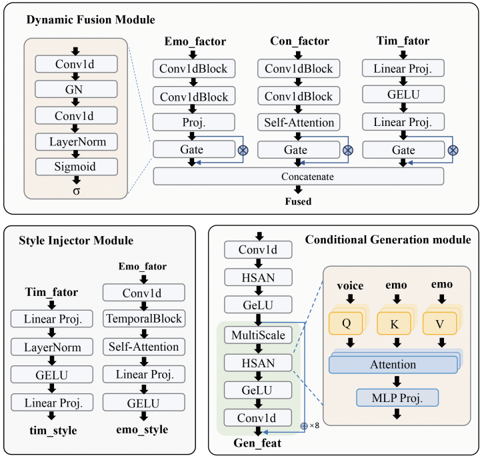

> [!abstract] arXiv · 2025 · Preprint
> **Xinyue Yu et al.** (University of Science and Technology of China) · [→ Paper](https://arxiv.org/abs/2511.12074) · Demo: ? · Code: ?
>
> Introduces a factor-purifying encoder and a dynamically-gated, hierarchically style-modulated generator that together decompose speech into independent content, timbre, and emotion streams and recombine them from arbitrary source utterances for fine-grained, compositional voice conversion.

## Problem

Voice conversion systems that manipulate content, timbre, and emotion together face two compounding problems. First, because there is no strong supervisory signal forcing these factors apart, existing disentanglement strategies act as coarse filters: timbre leaks into content and emotion representations, emotion leaks into timbre, and the resulting factor representations are fragile and hard to reuse across tasks. Second, even when reasonably pure factors are obtained, existing conditioning mechanisms (static concatenation, implicit global modulation, or single-shot dynamic fusion) inject them too coarsely into the generator, forcing a trade-off between content fidelity and style similarity rather than allowing both to be controlled independently. The paper argues that no prior system systematically combines dynamic, time-varying factor weighting with hierarchical style injection, and that this gap is most exposed by the harder task of multi-factor *compositional* generation, where content, timbre, and emotion are drawn from different source utterances rather than reconstructed from a single one.

## Method

MF-Speech consists of two components trained in a three-stage pipeline: MF-SpeechEncoder, a factor purifier, and MF-SpeechGenerator, a factor conductor.

MF-SpeechEncoder uses a three-stream architecture. The content stream initializes from a pre-trained Wav2Vec2 backbone, then refines representations with a lightweight sub-network trained via sentence-level content contrastive learning to suppress residual timbre and emotion information. The emotion stream is built around the premise that emotional expression is carried largely by prosody: lightweight predictors first generate explicit F0 and energy representations from an intermediate layer under direct supervision, and the final emotion representation is derived from these prosody predictions, sharpened with an emotion contrastive loss. The timbre stream uses a SeaNet encoder followed by multi-head attention to aggregate a global timbre representation, purified by a timbre-specific contrastive loss. All three streams are discretized independently with a Residual Vector Quantizer. On top of these per-factor objectives, a separate mutual-information estimation network (combining CLUB and MINE) penalizes residual redundancy between the discretized factor representations, applied only during training via a warm-up schedule, so this constraint targets cross-factor leakage that the individual contrastive losses do not directly address.

MF-SpeechGenerator takes the discrete factor representations and re-synthesizes a waveform through four collaborating modules. A dynamic fusion module applies a gating mechanism that produces time-varying weights for each factor, letting the model adjust each factor's influence at every time step rather than fusing them with a single static weight. A style injection module derives multi-level style parameters from the timbre and emotion representations. These parameters drive Hierarchical Style Adaptive Normalization (HSAN): timbre and emotion are first fused via cross-attention, then projected into affine parameters (γ, β) and a residual modulation term (α), which are applied at multiple layers of the conditional generation backbone (stacked residual blocks with multi-scale convolutions) as `y = IN(x)(1 + tanh(γ)) + β + λ·tanh(α)⊙x`. A SeaNet decoder, initially frozen and then fine-tuned via phased unfreezing, converts the resulting acoustic representation sequence into the output waveform.

MF-SpeechGenerator is trained adversarially with a multi-scale discriminator (hinge loss), combined with feature-matching, timbre, and F0-consistency losses, and a phased unfreezing schedule for the pre-trained SeaNet decoder. Both stages train on the ESD (Emotional Speech Dataset), split into training, seen-test, and unseen-test partitions, on a single NVIDIA RTX 4090 GPU (encoder stage: 27,500 iterations, batch size 12; generator stage: 91,800 iterations, batch size 72). Model parameter count is not reported.

## Key Results

On speech reconstruction (content, timbre, and emotion all drawn from the same source utterance), MF-Speech achieves the best timbre similarity among all systems tested (SECS = 0.7401) and the lowest word error rate (WER = 2.83%), with F0 correlation (0.94) and F0 reconstruction error (Log RMSE = 0.08) close to the best-performing baseline, DDDM-VC. Subjective naturalness (nMOS = 3.53) and style similarity (sMOS_t = 3.54, sMOS_e = 3.50) are comparable to StyleVC and slightly behind DDDM-VC (Table 1).

On the harder multi-factor compositional generation task (content, timbre, and emotion drawn from different source utterances), MF-Speech leads on all metrics except UTMOS: SECS = 0.5685 versus the next-best baseline DDDM-VC at 0.3723, WER = 4.67% versus DDDM-VC's 11.67%, F0 correlation 0.68 versus 0.62, and the highest subjective scores (nMOS = 3.96, sMOS_t = 3.86, sMOS_e = 3.78) among all four baselines (StyleVC, NS2VC, DDDM-VC, FaCodec) (Table 1). UTMOS is slightly below StyleVC, which the authors attribute to StyleVC's noticeably faster (and, per their subjective scores, less natural) speaking rate.

On disentanglement quality specifically, MF-SpeechEncoder achieves target-task accuracy of 0.9979 (timbre), 0.9296 (emotion), and 0.9593 (content) while keeping non-target (leakage) task accuracy low across all six factor pairs (e.g., Acc_te = 0.2618, Acc_tc = 0.0054), outperforming StyleVC, DDDM-VC, and FaCodec on nearly every leakage metric, with mutual-information scores comparable to the baselines (Table 2). t-SNE visualizations show tighter, better-separated clusters for MF-SpeechEncoder's factor representations than for the baselines.

Component ablations isolate each generator module's contribution to the compositional task: removing dynamic fusion (w/o DyGate) reduces SECS from 0.5685 to 0.5551 and raises WER from 4.76% to 5.17%, while removing HSAN (w/o HSAN) causes a much larger drop in SECS (to 0.1576) and Corr (to 0.64), though WER improves slightly because the model no longer has to balance content generation against style injection. On the encoder side, ablating the MI constraint, contrastive learning, or prosody priors each visibly degrades t-SNE cluster separability for timbre and/or emotion, with contrastive learning removal causing the most severe entanglement.

## Novelty Assessment

The contribution is primarily architectural: a three-stream, multi-objective factor-purification encoder (contrastive losses per factor plus a shared post-discretization MI-minimization constraint) paired with a generator-side dynamic gating and hierarchical style-adaptive normalization mechanism (HSAN). Individually, contrastive disentanglement, MI minimization, RVQ discretization, and FiLM-style adaptive normalization are all established techniques in the voice conversion literature the paper itself surveys; the novelty lies in combining explicit prosody-derived emotion modeling with per-factor contrastive objectives and a shared MI constraint on the encoder side, and in applying dynamic per-timestep factor weighting together with multi-level style injection on the generator side, specifically to make cross-source compositional control (rather than same-source reconstruction) tractable. The ablations are a genuine strength: both encoder-side (MI, contrastive, prosody) and generator-side (dynamic fusion, HSAN) components are individually removed and evaluated, with the paper honestly reporting that removing HSAN improves WER even as it collapses style control, rather than only reporting favorable ablation outcomes. A notable gap is that StableVC, the paper's most extensively discussed related method (explicitly credited with dynamic feature fusion via conditional flow matching and attention), is analyzed at length in Related Work but never included as an experimental baseline in Table 1 or Table 2, leaving the strongest recent comparison point untested empirically.

## Field Significance

moderate — This paper provides architecturally grounded evidence that combining explicit per-factor contrastive objectives with a post-discretization mutual-information constraint reduces cross-factor leakage more effectively than four established VC disentanglement baselines, and that dynamic, per-timestep factor weighting combined with hierarchical style-adaptive normalization measurably improves compositional (cross-source) controllability over static or single-shot fusion. Its evaluation is confined to a single dataset (ESD) trained on one GPU, and it does not benchmark against StableVC, the flow-matching-based system it identifies as most comparable, so the paper's own evidence does not establish how the approach compares against the current best dynamic-fusion alternative.

## Claims

- **supports:** Combining factor-specific contrastive losses with a shared post-discretization mutual-information minimization constraint reduces cross-factor leakage more effectively than disentanglement strategies relying on adversarial training or implicit bottlenecks alone.
  > *Evidence:* MF-SpeechEncoder achieves higher target-task accuracy (0.998/0.930/0.959 for timbre/emotion/content) and lower non-target leakage accuracy (e.g., Acc_te = 0.262 vs. 0.54-0.59 for StyleVC/DDDM-VC/FaCodec) than three prior VC disentanglement systems, while mutual-information scores remain comparable across systems *(§Experimental Results on MF-SpeechEncoder, Table 2)*.
- **supports:** Dynamic, per-timestep gating of independently-controlled attribute streams combined with hierarchical, multi-layer style-adaptive normalization improves controllability in cross-source compositional speech generation over static fusion or single-point style injection.
  > *Evidence:* Removing HSAN drops SECS from 0.5685 to 0.1576 and Corr from 0.68 to 0.64 in the compositional generation task, while removing dynamic fusion raises WER from 4.76% to 5.17% and lowers SECS to 0.5551, with each ablation isolating a distinct, measurable degradation *(§Ablation Study, Figure 5)*.
- **complicates:** Explicit prosody-based supervision for a dedicated emotion representation does not fully decouple emotion modeling from timbre modeling during training, even when the two factors are extracted by architecturally separate modules.
  > *Evidence:* Removing the prosody-prior loss (ablation M3) degrades not only emotion t-SNE clustering but also timbre clustering, indicating the prosody signal contributes to timbre representation quality beyond its intended emotion-modeling role *(§Ablation Study, Figure 4(h),(l))*.
- **refines:** Reconstruction-task performance of a disentangled multi-factor speech generation system is not a reliable proxy for its performance on true compositional (cross-source) control, since the two settings can diverge substantially even for the same model.
  > *Evidence:* MF-Speech's own speaker similarity drops from SECS = 0.7401 (reconstruction, same-source factors) to SECS = 0.5685 (compositional generation, cross-source factors), and WER rises from 2.83% to 4.67% under the same model *(§Experimental Results on MF-Speech, Table 1)*.

## Limitations and Open Questions

> [!warning] StableVC, the system the paper identifies in Related Work as the closest prior approach (also using dynamic fusion and attention-based conditioning), is never included as an experimental baseline in Table 1 or Table 2. All quantitative comparisons are against StyleVC, NS2VC, DDDM-VC, and FaCodec, so the paper does not provide direct evidence of how MF-Speech compares against the most architecturally similar recent system.

Training and evaluation are confined to a single dataset (ESD) on a single consumer GPU (RTX 4090), with no cross-corpus or cross-lingual evaluation reported, so generalization beyond ESD's speaker and emotion inventory is untested. Model parameter count is not reported, and code and demo availability are not stated in the paper, limiting reproducibility assessment. The subjective evaluation uses 20 participants, and UTMOS for MF-Speech trails StyleVC on the compositional task, a result the authors attribute to StyleVC's faster, less natural speaking rate rather than to a genuine quality shortfall, but this explanation is not independently verified with a targeted follow-up experiment.

## Wiki Connections

- [[voice-conversion|Voice Conversion]] — MF-Speech is explicitly framed and benchmarked as a voice conversion system, decomposing and recombining content, timbre, and emotion factors from source speech rather than from text input.
- [[disentanglement|Disentanglement]] — the encoder's multi-objective training combines per-factor contrastive losses with a post-discretization mutual-information minimization constraint, validated with target/non-target accuracy metrics and ablations that causally isolate each mechanism's contribution to factor separation.
- [[emotion-synthesis|Emotion Synthesis]] — a dedicated emotion factor module, derived explicitly from F0 and energy prosody predictions and sharpened with an emotion contrastive loss, is trained to be independently controllable and recombinable with content and timbre from other utterances.
- [[neural-codec|Neural Audio Codec]] — each factor stream is discretized with a Residual Vector Quantizer over a SeaNet encoder/decoder backbone, following the RVQ scheme introduced by HiFi-Codec.
- [[self-supervised-speech|Self-Supervised Speech]] — the content stream's initial representations are extracted with a pre-trained Wav2Vec2 model before being refined by task-specific contrastive learning.
- [[2403.03100|NaturalSpeech 3 / FACodec]] — used as the FACodec baseline in both the compositional generation and disentanglement-quality comparisons, representing the explicit-factorized-codec paradigm this paper contrasts itself against.
- [[2412.04724|StableVC]] — extensively discussed in Related Work as the closest prior system using dynamic fusion and conditional flow matching, though notably absent from the paper's own experimental baselines.
- [[2304.09116|NaturalSpeech 2]] — the underlying latent-diffusion system behind the NS2VC baseline used throughout the reconstruction and compositional generation comparisons.
- [[2305.02765|HiFi-Codec]] — the source of the group-residual vector quantization scheme MF-SpeechEncoder adapts for discretizing each factor stream.
