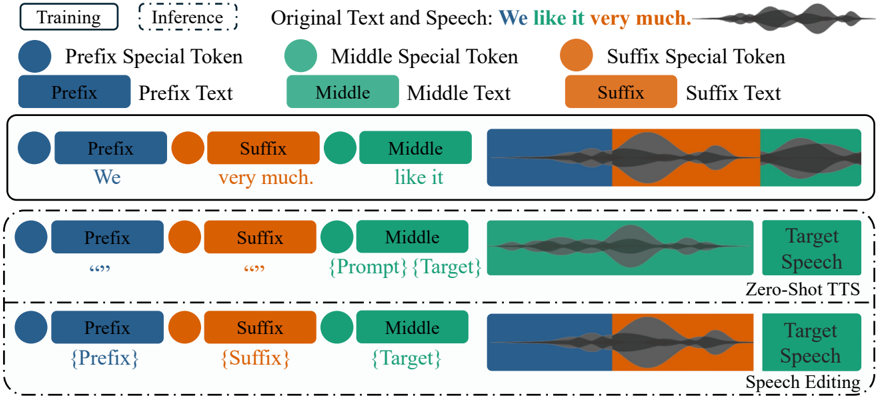

> [!abstract] EMNLP · 2025 · Conference
> **Zhisheng Zheng et al.** (University of Texas at Austin / Amazon) · [→ Paper](https://arxiv.org/abs/2511.12347) · Demo: ✓ · Code: ✓
>
> VoiceCraft-X is an autoregressive neural codec language model that unifies zero-shot TTS and speech editing across 11 languages by leveraging the Qwen3 LLM backbone with a novel text-speech token reordering mechanism, eliminating the need for per-language phoneme lexicons.

## Problem

Most high-quality neural TTS systems are either monolingual or cover only a handful of high-resource languages, and those that do support multiple languages typically treat speech editing as a separate task requiring a different model. The original VoiceCraft required phoneme pronunciation lexicons for each language, making multilingual extension cumbersome. Models achieving state-of-the-art zero-shot quality (e.g., Seed-TTS, CosyVoice 2) demand 30K–130K hours of training data, making broad language coverage impractical. The challenge of a single open-source autoregressive model that can both edit existing speech and synthesize new speech across diverse languages — including lower-resource ones — remained unaddressed.

## Method

VoiceCraft-X builds on the VoiceCraft architecture (an autoregressive codec language model) and extends it in three key ways.

**Text processing.** The model replaces VoiceCraft's phoneme-based pipeline with the Qwen3-0.6B-Base LLM, which natively supports 119 languages and dialects. This provides a shared text tokenizer across all 11 target languages (English, Mandarin, Korean, Japanese, Spanish, French, German, Dutch, Italian, Portuguese, Polish) without curating per-language G2P lexicons.

**Speech tokenization.** A modified EnCodec tokenizer is trained from scratch on the multilingual corpus, operating at 50 Hz with 4 RVQ codebooks (vocabulary size 2048 each). Audio is sampled at 16 kHz.

**Token reordering.** The core innovation is an enhanced "prefix-suffix-middle" sequence layout in which both text tokens and speech tokens are time-aligned and reordered together. This mirrors the VoiceCraft editing scenario — a user replaces a middle span of words — but extends the alignment to text as well as audio. During training, a random segmentation into prefix/middle/suffix is applied, the tokens are rearranged, and two learnable `<MASK>` tokens mark the boundaries. The MusicGen delay pattern (one-timestep cumulative delay per RVQ layer) is applied to model the 4 parallel codec streams autoregressively. The training loss is a weighted cross-entropy: codebook weights decrease from 1.0 (CB1) to 0.4 (CB4), and middle (target) segment tokens are weighted 3× relative to prefix/suffix.

For zero-shot TTS, the prompt text and prompt audio are placed at the start of the middle segment, while prefix and suffix are empty; a speaker embedding extracted by a WavLM-based voiceprint model (following CosyVoice) is projected linearly into the Qwen3 input dimension. For speech editing, prefix/suffix text and audio from the original recording flank the replacement text, and the model infills the corresponding audio.

The total model is 613M parameters (457M excluding embedding tables). Training used 16 × A100-40GB GPUs for approximately one week on ~32,578 hours of multilingual speech.

Inference uses nucleus sampling (TopK=20, TopP=1.0, temperature=1.0). The ablation study demonstrates that the reordering mechanism is critical: without it, English WER on Seed-TTS jumps from 11.60 to 104.02 even in a low-resource training scenario.

## Key Results

**English zero-shot TTS (Seed-TTS test-en, Table 1):** VoiceCraft-X achieves WER 4.20 and SIM-o 0.54, improving over the original VoiceCraft (WER 5.28, SIM-o 0.51). Its CMOS of 0.63 is the highest among all compared models (FireRedTTS, MaskGCT, F5-TTS, CosyVoice, CosyVoice 2), indicating the best perceived naturalness relative to ground truth — despite being trained on 14.5K hours versus 30K–110K for competitors.

**Chinese zero-shot TTS (Seed-TTS test-zh):** CER 3.29, SIM-o 0.68. With only 5K training hours, CER is higher than models using 50K–130K hours, and CMOS (−0.39) is below CosyVoice variants. The data disadvantage is the principal limitation.

**Multilingual (9 languages vs. XTTS-v1/v2):** VoiceCraft-X consistently outperforms both XTTS versions in SIM-o across languages, and achieves competitive or better WER/CER in German (WER 8.19 vs. XTTS-v2's 16.50), Korean (CER 31.11 vs. 40.89), Spanish (WER 4.67 vs. 8.11), and Italian (WER 15.46 vs. 15.52). XTTS-v2 beats it in Dutch, Japanese, Portuguese, and Polish — languages where VoiceCraft-X had significantly less training data.

**Subjective SMOS (Table 8):** VoiceCraft-X beats both XTTS versions in French (3.58 vs. 2.23), Italian (3.30 vs. 2.75), and Spanish (3.58 vs. 3.22). Portuguese is below ground truth (2.87).

**English speech editing (Table 3):** WER 5.62 vs. VoiceCraft 5.99. Naturalness (NMOS 3.68) and intelligibility (IMOS 3.79) are comparable to VoiceCraft and close to the original recordings.

**Cross-lingual transfer (Table 2):** Pre-training substantially outperforms training from scratch for low-resource languages (Italian WER: 15.46 multilingual vs. 142.30 from scratch; Polish: 24.80 vs. 163.08). Fine-tuning from the multilingual checkpoint improves SIM-o over all other initializations.

## Novelty Assessment

The primary contribution is architectural/engineering integration rather than a fundamentally new model family. The novelty lies in: (1) extending the VoiceCraft token reordering idea to jointly reorder both text and speech tokens, enabling phoneme-free cross-lingual generation within a single AR sequence; and (2) replacing the per-language phoneme pipeline with a large multilingual LLM backbone (Qwen3), which directly enables broad language coverage without lexicon engineering. The ablation confirms the reordering mechanism is decisive for intelligibility. The paper is notable for demonstrating that ~32K hours — far below what SOTA models use — can achieve competitive naturalness across 11 languages in a unified framework, though intelligibility still lags for low-resource languages. The speech editing contribution is incremental: VoiceCraft-X is essentially the multilingual generalization of VoiceCraft's editing capability.

## Field Significance

Moderate — VoiceCraft-X demonstrates that a unified autoregressive framework can cover both speech editing and zero-shot TTS across 11 languages without per-language phoneme lexicons, achieved at roughly a quarter of the training data budget used by competing systems. The time-aligned text-speech token reordering mechanism is a practical architectural contribution that may inform future multilingual codec LM designs, though it is an extension of an existing approach rather than a paradigm shift.

## Claims

- Jointly reordering text and speech tokens into a prefix-suffix-middle layout is essential for intelligible autoregressive multilingual TTS, with or without this mechanism representing the difference between near-random and functional output in low-resource training scenarios. *(§3.4, §D.1, Table 9)*
- Replacing per-language phoneme lexicons with a pretrained multilingual LLM backbone enables a single autoregressive codec model to cover 11 languages with a shared tokenizer, substantially reducing engineering overhead for multilingual TTS. *(§3.1)*
- Multilingual joint training provides substantially better cross-lingual transfer than training from scratch, with pre-training reducing WER by 5–10x for low-resource languages. *(§4.3, Table 2)*
- Speaker similarity scores in zero-shot multilingual TTS are more consistent across languages than intelligibility metrics, suggesting that speaker identity capture generalizes better across languages than pronunciation accuracy. *(§4.2, Table 1)*
- Competitive subjective naturalness in English zero-shot TTS is achievable with 14K hours of training data when architecture and token layout are well-designed, even when larger systems trained on 30K–130K hours achieve lower objective error rates. *(§4.2, Table 1)*

## Limitations and Open Questions

The model is trained on significantly less data than state-of-the-art systems, limiting intelligibility for lower-resource languages (Portuguese, Polish, Dutch). Language coverage stops at 11 — vastly short of global linguistic diversity — and expanding further would require substantial new data curation. Model size was fixed at the Qwen3-0.6B scale; the paper does not explore whether scaling to larger backbone variants improves performance proportionally. Code-switching is an out-of-distribution capability and degrades when the prompt language differs from the target text's initial language. The subjective evaluation for non-Western languages (Korean, Japanese, Dutch, German) was not collected due to crowdworker availability, making cross-language comparisons incomplete.

## Wiki Connections

VoiceCraft-X is centrally relevant to [[autoregressive-codec-tts]] — it extends the VALL-E/VoiceCraft line with multilingual and unified editing capabilities. It belongs to [[multilingual-tts]] as one of the few open-source models covering 11 languages within a single AR framework. Its voice-cloning from a short prompt connects to [[zero-shot-tts]]. The modified EnCodec tokenizer and RVQ delay pattern are discussed under [[neural-codec]]. Cross-lingual transfer results inform [[speaker-adaptation]]. Subjective evaluation methods (CMOS, SMOS, NMOS, IMOS) are documented under [[subjective-evaluation]].

In-corpus cited papers: [[2301.02111|VALL-E]] (the foundational codec LM); [[2406.02430|Seed-TTS]] (evaluation benchmark and baseline); [[2407.05407|CosyVoice]] (speaker embedding approach adopted); [[2412.10117|CosyVoice 2]] (baseline); [[2025.acl-long.313|F5-TTS]] (baseline); [[2504.10352]] (Pseudo-AR codec LM, recent AR variant).
