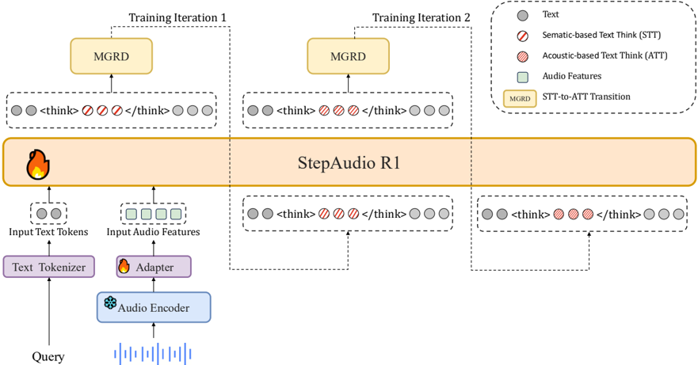

> [!abstract] arXiv · 2025 · Preprint
> **Tian et al.** (StepFun) · [→ Paper](https://arxiv.org/abs/2511.15848) · Demo: ✓ · Code: ?
>
> Step-Audio-R1 introduces Modality-Grounded Reasoning Distillation (MGRD), an iterative self-distillation framework that shifts audio language model reasoning from textual surrogates to genuine acoustic analysis, making extended chain-of-thought deliberation beneficial rather than harmful for audio understanding.

## Problem

Audio language models exhibit a counterintuitive failure mode: performance degrades as reasoning chain length increases, directly contradicting the test-time compute scaling behaviour observed in text and vision. Prior work attributed this to a fundamental incompatibility between deliberate reasoning and auditory intelligence. The actual cause is a modality mismatch: when trained on chain-of-thought data derived from text-based models, audio LMs inherit linguistic grounding mechanisms and reason about transcripts and captions rather than acoustic properties. Enforcing consistency between reasoning chains and final answers (via LM judges) treats the symptom without addressing the underlying mismatch.

## Method

Step-Audio-R1 builds on the Step-Audio 2 architecture: a frozen Qwen2 audio encoder (25 Hz output, downsampled to 12.5 Hz via an adaptor) feeding into a Qwen2.5 32B LLM decoder that generates textual output. The key contribution is the training procedure, not the architecture itself.

Training proceeds in two broad stages. The foundation stage establishes text-domain reasoning capabilities through supervised fine-tuning on chain-of-thought demonstrations (mathematical, code, and conversational) combined with direct-answer audio data using empty `<think>` markers to preserve audio understanding without injecting textual reasoning chains. This is followed by Reinforcement Learning with Verified Rewards (RLVR) on task-oriented problems, using binary outcome rewards and PPO without KL penalty.

The novel MGRD stage then iteratively refines reasoning grounding. At each iteration, the model generates reasoning chains for audio questions selected to require perceptual analysis (timbral qualities, pitch contours, rhythmic patterns) rather than semantic inference. Candidate responses are filtered for acoustic grounding (explicit reference to perceptual features), logical coherence, and answer correctness. The surviving acoustically-grounded reasoning chains form a curated dataset for the next SFT round, jointly trained with text data to prevent forgetting. A multimodal RL phase follows, weighting audio reward as 80% answer accuracy plus 20% presence of reasoning, explicitly preventing the model from degenerating to direct responses. This cycle repeats for T iterations, with each pass shifting the reasoning substrate progressively from linguistic to acoustic.

A complementary pipeline corrects self-cognition errors (the model claiming it cannot process audio due to its text-heavy pretraining). Iterative self-distillation filters responses exhibiting incorrect self-cognition, and a final DPO pass with 8,000 preference pairs reduces the error rate from 6.76% to 0.02%.

## Key Results

On speech-to-text benchmarks (Table 1), Step-Audio-R1 achieves an average score of 83.6% across Big Bench Audio, SpokenMQA, MMSU, MMAU, and Wild Speech, surpassing Gemini 2.5 Pro (81.5%) and falling just below Gemini 3 Pro (85.1%). On individual tasks, Step-Audio-R1 leads on Big Bench Audio (98.7% vs. Gemini 2.5 Pro's 96.1%) and SpokenMQA (95.2% vs. 94.8%), while Gemini 3 Pro leads on MMSU and Wild Speech.

The speech-to-speech variant (Step-Audio-R1 Realtime) scores 96.1% on the Big Bench Audio speech-to-speech benchmark (Table 2), outperforming GPT Realtime 0825 (83%) and Gemini 2.5 Flash Native Audio Dialog (92%), with a first-packet latency of 0.92 seconds.

Ablation studies confirm that the format reward component (incentivising reasoning presence) is essential: without it, reasoning chains collapse from ~3000 tokens to below 1500 tokens during RL training, and MMAU accuracy drops from 77.7 to 76.5. Data selection matters more than data volume: training on moderately difficult problems (3-6 correct out of 8 samples) substantially outperforms training on consistently-failed problems, and scaling to 200K unfiltered examples provides no benefit over the curated 3,000-sample set.

## Novelty Assessment

The central insight, that audio LMs fail at reasoning because they reason about text rather than sound, is well-motivated and supported by qualitative analysis. MGRD is a genuine methodological contribution: the acoustic grounding filter (selecting reasoning chains that reference perceptual features rather than semantic surrogates) is a principled intervention that prior RL-on-audio work (which used LM consistency judges) had not attempted. The PPO reward design, weighting answer accuracy 80% and reasoning presence 20%, is practical engineering rather than theoretical novelty.

The architecture itself is a direct extension of Step-Audio 2 with a larger LLM backbone (Qwen2.5 32B); no new structural components are introduced. The self-cognition correction pipeline (iterative filtering plus DPO) addresses a well-known problem in multimodal models trained on text-heavy corpora. The evaluation is competitive (Gemini-class comparisons) but relies on benchmarks where closed-source systems are also reported; fairness of comparisons across training regimes and data budgets cannot be fully verified.

## Field Significance

> [!tip]
> High — Step-Audio-R1 provides the first demonstrated solution to the audio reasoning degradation problem, showing that the failure mode is correctable through modality-grounded training rather than being fundamental to audio processing. The MGRD framework offers a reusable recipe for any audio LM that initialises reasoning from text-based supervision, and the result that data quality dominates data quantity in audio RL is a useful empirical finding for the field.

## Claims

- Degraded reasoning performance in audio language models stems from textual surrogate reasoning (grounding in transcripts rather than acoustic features) rather than from fundamental incompatibility between extended deliberation and audio processing. *(§1, §4.2)*
- Iterative self-distillation with acoustic grounding filters can progressively shift an audio LM's reasoning basis from linguistic to perceptual grounding, enabling test-time compute scaling to benefit audio tasks. *(§4.2)*
- In reinforcement learning for audio reasoning, a composite reward combining answer accuracy with a reasoning-presence incentive is necessary to prevent the model from collapsing to direct responses and losing extended deliberation capability. *(§6.1)*
- Data quality and difficulty calibration matter more than dataset size in audio RL: training on moderately difficult problems substantially outperforms training on consistently-failed problems, and scaling to 10x more unfiltered data provides no benefit. *(§6.2)*
- Self-cognition errors (models claiming inability to process audio inputs) are learned biases from text-heavy pretraining, correctable through targeted preference optimisation on a modest number of contrastive pairs. *(§6.3, Table 3)*

## Limitations and Open Questions

> [!warning]
> The evaluation compares against closed-source Gemini systems under conditions that cannot be fully reproduced. Training data sizes, pretraining corpora, and inference settings differ across systems; the reported gains over Gemini 2.5 Pro and near-parity with Gemini 3 Pro should be interpreted as competitive signals rather than controlled benchmarks.

The MGRD framework requires an existing audio LM with emergent (if weak) chain-of-thought capability; it is not a cold-start method for models without any reasoning initialisation. The acoustic grounding filter uses heuristic criteria (explicit mention of perceptual features) that may incorrectly penalise valid implicit acoustic reasoning. The number of MGRD iterations T and the RL data curation threshold (pass@8 in [3,6]) are hyperparameters not fully ablated. The paper focuses on audio understanding tasks (question answering over speech, music, environment); it does not address speech generation or voice conversion, limiting applicability to the SCA and audio comprehension domains.

## Wiki Connections

- [[spoken-language-model]] — Step-Audio-R1 demonstrates that audio language models can benefit from extended chain-of-thought reasoning when grounding mechanisms are explicitly anchored to acoustic rather than textual features.
- [[rlhf-speech]] — the MGRD framework applies a composite PPO reward (accuracy plus reasoning-presence incentive) that prevents reasoning collapse in audio RL, extending RLHF techniques to the acoustic modality.
- [[speech-to-speech]] — the realtime variant adapts the reasoning model for live spoken dialogue, achieving sub-second first-packet latency alongside strong audio reasoning performance.
- [[2507.16632]] (Step-Audio 2) — Step-Audio-R1 directly extends the Step-Audio 2 architecture, inheriting its encoder-adaptor-LLM design and applying MGRD post-training on top.
- [[2509.17765]] (Qwen3-Omni) — cited as a baseline exhibiting the textual surrogate reasoning failure mode that MGRD is designed to correct.
- [[2510.05150]] (Chronological Thinking) — informs the listen-while-thinking architecture adapted for the Step-Audio-R1 Realtime variant.
- [[2510.09592]] (Mind-Paced Speaking) — informs the think-while-speaking architecture used in the realtime adaptation.
- [[2501.12948]] (DeepSeek-R1) — the RLVR training objective and PPO-without-KL approach in MGRD draws directly from DeepSeek-R1's reinforcement learning methodology.
- [[2303.08774]] (GPT-4) — serves as a baseline in evaluation comparisons and represents the text-domain reasoning transfer that MGRD must overcome.
- [[2507.06261]] (Gemini 2.5) — the primary competitive benchmark; Step-Audio-R1 surpasses Gemini 2.5 Pro on average across the speech-to-text evaluation suite.
- [[2407.10759]] (Qwen2-Audio) — the Qwen2 audio encoder is reused as a frozen backbone in Step-Audio-R1's architecture.
- [[2407.10671]] (Qwen2) — Qwen2.5 32B, the LLM decoder backbone, is an extension of the Qwen2 family.
