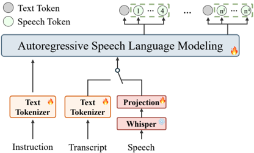

> [!abstract] arXiv · 2025 · Preprint
> **Zhisheng Zheng et al.** (University of Texas at Austin / Amazon) · [→ Paper](https://arxiv.org/abs/2511.20974) · Demo: ? · Code: ?
>
> Trains a direct speech-to-speech translation model exclusively on monolingual speech-text data, using machine-translation-synthesized pseudo-parallel targets to eliminate the need for any parallel speech-to-speech corpus.

## Problem

Direct, end-to-end speech-to-speech translation (S2ST) avoids the error propagation and prosody loss of cascaded ASR→MT→TTS pipelines, but training such models has traditionally required massive parallel S2ST corpora: the same utterance spoken by the same person in both source and target languages. These corpora are prohibitively expensive to collect and exist for only a handful of high-resource language pairs. Prior unsupervised approaches attempt to work around this with multi-stage pseudo-labeling pipelines or specialized architectures (e.g., back-translation with unsupervised embedding mapping, composite frameworks combining separately pretrained S2TT and TTS models), but these remain complex to train and difficult to scale across many languages. RosettaSpeech targets the common "text-rich, speech-poor" scenario: languages with usable text translation resources but no parallel speech data.

## Method

RosettaSpeech decouples speech supervision from translation supervision. Instead of requiring paired source-target speech, it constructs pseudo-parallel training triplets from monolingual speech-text corpora: for a source-language corpus with (speech, text) pairs, an off-the-shelf neural machine translation (NMT) model translates the transcript into the target language to synthesize a pseudo-target text; the reverse direction is applied symmetrically for target-language monolingual data. Each synthesized translation pair is scored with the COMET metric and filtered against a quality threshold (e.g., 0.80 for EN↔DE) before being used for training, which is intended to prevent the model from learning from inaccurate pseudo-labels.

The architecture processes input speech with the encoder from Whisper-medium, producing continuous hidden-state vectors at 50 Hz, and represents target speech as discrete semantic tokens from the CosyVoice2 speech tokenizer (a single-layer, 6561-entry codebook at 25 Hz). A Qwen3-0.6B LLM serves as the shared backbone, with its final hidden states passed to a multi-head projection: one head predicts target text tokens, and a set of heads predicts the target speech's discrete codebook tokens, allowing the model to generate both modalities autoregressively from a shared latent representation.

Training alternates between two tasks per batch: Speech-to-Text Translation (S2TT), where the model is fed source speech and supervised against the NMT-synthesized pseudo-target text (any generated speech is discarded), and Text-to-Speech Translation (T2ST), where the model is fed NMT-synthesized pseudo-source text and supervised against the ground-truth target text and target speech. Both branches use standard cross-entropy loss, summed into a joint training objective. Critically, the model never sees a matched (source speech, target speech) pair during training. At inference, the model takes only source speech as input and autoregressively generates translated text and translated speech tokens in a single forward pass; an off-the-shelf conditional flow matching (CFM) model from CosyVoice2 converts the speech tokens to mel-spectrograms while conditioning on a speech prompt to control speaker identity and paralinguistic characteristics, and a HiFi-GAN vocoder produces the final waveform.

## Key Results

On the CVSS-C benchmark (FR/ES/DE→EN), RosettaSpeech's zero-shot ("unparalleled") model establishes a new state of the art among zero-shot S2ST systems, achieving ASR-BLEU of 27.86 (FR→EN), 29.86 (ES→EN, +14% relative over the strongest baseline), and 25.17 (DE→EN, +27% relative), outperforming ComSpeech, the strongest prior zero-shot baseline, and several non-zero-shot systems trained with parallel speech data (Translatotron 2, S2UT, UnitY, DASpeech, StreamSpeech). It also leads on reference-free neural metrics (COMET, BLASER 2.0). On speaker fidelity, prior S2ST baselines (ComSpeech, StreamSpeech) achieve near-zero speaker similarity (SIM < 0.05) on CVSS-C, while RosettaSpeech reaches SIM ≈ 0.36, exceeding even the CVSS-C reference targets' own SIM scores, alongside the best naturalness MOS scores on nearly all language pairs. Fine-tuning the pretrained model on limited parallel speech data (CVSS-T) further improves ASR-BLEU across all pairs (e.g., DE→EN from 25.17 to 29.90). Compared to a cascaded Whisper-medium + MADLAD-400-3B + CosyVoice2 pipeline (4.3B parameters, RTF 1.04), RosettaSpeech's 0.9B end-to-end model achieves roughly 2x faster inference (RTF 0.53).

## Novelty Assessment

The architectural components are all pre-existing: a Whisper encoder, a Qwen3 LLM backbone, a multi-head text/speech projection design adapted from prior omni-language-model work, a CosyVoice2 tokenizer and flow-matching resynthesis stage, and a HiFi-GAN vocoder. The genuine contribution is a training strategy: using NMT to bridge the gap between abundant monolingual speech-text data and the parallel speech-to-speech supervision that direct S2ST models have traditionally required, combined with a joint S2TT/T2ST multi-task objective that the paper's own ablations show is necessary to avoid catastrophic forgetting between the two data streams. This is a training-recipe and data-curation innovation layered on an engineering integration of existing components, rather than a new architecture in itself, but it is what enables a previously undemonstrated capability: direct, speaker-preserving S2ST trained with zero parallel speech data at a quality that surpasses several supervised, parallel-data-trained systems.

## Field Significance

> [!tip] High
> This paper demonstrates that direct S2ST quality competitive with, or exceeding, parallel-speech-trained systems is achievable using only monolingual speech-text data augmented by off-the-shelf NMT, removing what has been the central data bottleneck for end-to-end S2ST. This reframes the practical path to extending high-quality, speaker-preserving S2ST to languages that have text translation resources but lack parallel speech corpora, and its joint-training ablation gives a concrete, reusable account of why naive sequential multi-task training fails for this setting.

## Claims

- **supports:** Text can serve as a semantic bridge to synthesize pseudo-parallel speech-to-speech translation training targets from monolingual speech-text corpora, enabling zero-shot end-to-end S2ST without any parallel speech-to-speech data.
  > *Evidence:* NMT-generated pseudo-parallel triplets, filtered by a COMET quality threshold and used to jointly train a shared text/speech LLM, achieve zero-shot ASR-BLEU of 25.17 (DE→EN, +27% relative) and 29.86 (ES→EN, +14% relative) on CVSS-C, surpassing the strongest zero-shot baseline (ComSpeech). *(§3.1, §4.4, Table 1)*
- **complicates:** Joint multi-task training across text-generation and speech-generation objectives is necessary to prevent catastrophic forgetting when a single shared model must learn both from disjoint monolingual data streams.
  > *Evidence:* Sequential training ablations collapse: training S2TT then T2ST drops S2ST ASR-BLEU to 0.18, and training T2ST then S2TT drops it to 0.49, versus 27.86 for joint training on the same French-to-English setup. *(§4.5, Table 5)*
- **supports:** A prompt-conditioned flow-matching resynthesis stage can preserve source speaker identity in direct S2ST even when the upstream translation model itself never observes paired source-target speech during training.
  > *Evidence:* RosettaSpeech reaches speaker-similarity scores of approximately 0.36 across all three language pairs on CVSS-C, exceeding both prior S2ST baselines (SIM < 0.05 for ComSpeech and StreamSpeech) and the CVSS-C dataset's own reference targets (SIM 0.01-0.05). *(§4.4, Table 3)*
- **complicates:** Training a single many-to-one speech-to-speech translation model across multiple source languages trades off per-language quality relative to individually specialized models, with the trade-off growing with linguistic distance from the other source languages.
  > *Evidence:* A unified FR/ES/DE→EN model improves French translation (+0.6 ASR-BLEU) but degrades Spanish and, more substantially, German relative to per-pair fine-tuned models on a 0.6B backbone, attributed to capacity dilution and negative transfer, most pronounced for German given its greater linguistic distance from the Romance source languages. *(§4.5)*
- **refines:** Direct end-to-end speech-to-speech translation on a compact LLM backbone can reduce both parameter count and inference latency relative to cascaded ASR→MT→TTS pipelines while matching or exceeding their translation quality.
  > *Evidence:* The 0.9B end-to-end model reduces parameter count by roughly 80% and achieves a real-time factor of 0.53, about 2x faster than a cascaded Whisper-medium + MADLAD-400-3B + CosyVoice2 pipeline (4.3B parameters, RTF 1.04). *(§4.4, Table 4)*

## Limitations and Open Questions

> [!warning] Dependent on source-language NMT quality
> The pseudo-parallel training strategy inherits whatever errors exist in the NMT model used to synthesize translation targets; for genuinely low-resource languages that lack even a usable text translation system, the authors note the generated pseudo-labels may contain hallucinations or semantic errors that would degrade final S2ST quality. This means the method's stated goal of serving "text-rich, speech-poor" languages requires that "text-rich" threshold to already be met by an available NMT system, which is not established as guaranteed at any particular quality floor.

Experiments are confined to three high-resource European source languages (French, German, Spanish) translating into English; broader applicability to more diverse or lower-resource languages is untested. The system supports only one-directional, many-to-one translation into English, not bidirectional or any-to-any translation. The scaling analysis varies only training data volume, not model size, so the effect of scaling the 0.6B backbone itself is unexplored.

## Wiki Connections

- [[speech-to-speech|Speech-to-Speech]] — presents a direct S2ST training strategy that removes the parallel-speech-corpus requirement by substituting NMT-synthesized pseudo-parallel text supervision.
- [[autoregressive-codec-tts|Autoregressive Codec TTS]] — generates target speech as discrete CosyVoice2 codec tokens autoregressively from a shared LLM backbone, resynthesized via flow matching and a vocoder.
- [[multilingual-tts|Multilingual TTS]] — trains and evaluates a single many-to-one model across French, Spanish, and German source languages into English.
- [[neural-codec|Neural Audio Codec]] — relies on the CosyVoice2 discrete speech tokenizer as its target speech representation for autoregressive generation.
- [[spoken-language-model|Spoken Language Model]] — adapts a pretrained text LLM (Qwen3-0.6B) with a speech encoder to consume external source speech and jointly produce text and speech outputs.
- [[2412.10117|CosyVoice 2]] — supplies both the discrete speech tokenizer used as the generation target and the off-the-shelf flow-matching model used unmodified at inference to convert speech tokens to mel-spectrograms.
- [[2505.09388|Qwen3 Technical Report]] — provides the Qwen3-0.6B LLM backbone that RosettaSpeech adapts with multi-head text/speech projections.
- [[2010.05646|HiFi-GAN]] — supplies the vocoder used to synthesize the final waveform from mel-spectrograms.
- [[2308.11596|SeamlessM4T]] — provides the BLASER 2.0 reference-free evaluation metric used to score translation quality, and represents the class of prior massively multilingual S2ST systems RosettaSpeech positions itself against.
